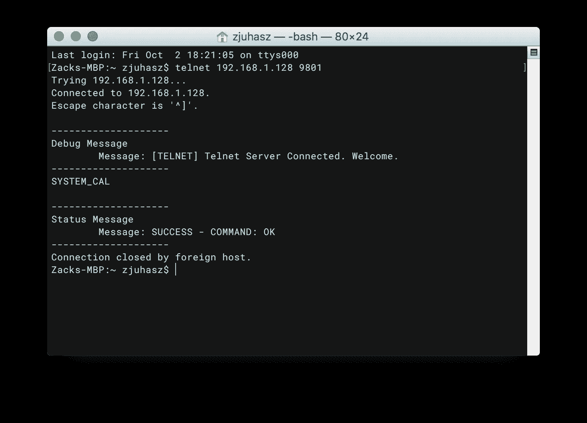

# 如何安全地连接到您的服务器？

> 原文：<https://medium.com/geekculture/ssh-securely-connect-to-your-servers-8895faab7083?source=collection_archive---------10----------------------->

## 学习使用 SSH 通过互联网安全地连接到您的服务器


Photo by [Tracy Adams](https://unsplash.com/@tracycodes?utm_source=medium&utm_medium=referral) on [Unsplash](https://unsplash.com?utm_source=medium&utm_medium=referral)

您是否正在为互联网上的用户设置 web 服务来访问您的服务。或者您正在为即将推出的产品开发嵌入式设备。您必须与外部设备进行远程通信。为了安全地做到这一点，您必须使用 SSH。

以下是如何使用 SSH 通过互联网安全地连接您的服务器。

本指南将假设你在你的服务器上使用 Debian，因为它是初学者最流行的衍生服务器操作系统。请记住，在其他发行版中发生变化的概念是文件的安装位置、初始化系统和包管理。

## 宋承宪的历史



stackoverflow.com

在有 SSH 之前，有 telnet。 [Telnet 是 20 世纪 60 年代末开发的。](https://en.wikipedia.org/wiki/Telnet)那时，组织有一种叫做大型机的东西。但有一个问题是，如何让两台大型机在办公室之间相互通信。Telnet 可以用来解决这个问题，它提供了一种协议，应用程序和用户可以利用这种协议在那些大型机上执行功能。

快进到今天，大多数人都在使用个人电脑。对于要供应的服务，您需要创建一个虚拟服务器，该服务器可以跨州托管在数据中心内。问题是你在开放互联网上的交流可能会被拦截。因此 SSH 被开发来加密机器之间的远距离通信。现在它是人们用来连接两台机器的标准。

[在这里注册我的电子邮件列表。](/subscribe/@drechang)

## 如何在你的服务器上安装并启用 SSH？

配置服务器后的第一步是更新您的存储库，并确保您的软件包是最新的。

```
sudo apt-get update
sudo apt-get upgrade
```

当您的包和存储库更新后，您需要安装 SSH 守护进程。可以看我的博文，[什么是守护进程？](/geekculture/what-is-a-daemon-849a00f543c3)了解 Linux 和其他 Unix 衍生操作系统上的服务是如何工作的。TLD:SSH 守护进程是一种处理来自客户端的 SSH 连接的服务。运行以下命令安装 SSHD。

```
sudo apt-get install sshd
```

在那里，您必须在您的 Linux 上启用该服务，并让它在启动时启动。运行以下命令启动 SSHD。

```
sudo systemctl enable sshd
sudo systemctl start sshd
```

运行以下命令以确保您的 SSHD 服务继续正常工作并且没有崩溃。

```
sudo systemctl status sshd
```

安装您选择的编辑器。对于本教程的范围，我将使用 neovim 来编辑文件。使用以下命令安装 neovim。

```
sudo apt-get install neovim
```

在这里注册我的电子邮件列表。

## 您需要创建一个单独的非管理员用户

您不希望将 root 用户暴露给公众，以防止黑客获得您系统的 root 权限。要解决这个问题，您需要创建另一个用户。运行以下命令。

```
sudo useradd [name_of_users]
```

按照提示设置您的非管理员用户。您可能需要在 sudoer 文件中添加用户来请求管理员权限。

[](https://www.linuxfordevices.com/tutorials/linux/adding-users-to-sudoers) [## 在 Linux 中向 Sudoers 添加用户——一步一步的教程

### 在 Linux 中向 Sudoers 文件添加用户非常容易。您可以通过手动编辑文件或使用…

www.linuxfordevices.com](https://www.linuxfordevices.com/tutorials/linux/adding-users-to-sudoers) 

在这里注册我的电子邮件列表。

## 如何设置 SSH 私有密钥？

按照提示设置您的非管理员用户。您可能需要在 sudoer 文件中添加用户来请求管理员权限。

```
sudo ssh-keygen
```

请确保将其保存到单独的文件中，以便可以使用它向 SSHD 服务进行身份验证。从那里，您需要将私钥添加到服务器，因为您将使用公钥来访问服务器。运行以下命令。

```
sudo ssh-copy-id -i [public_key] [username]@[ip_address/domain_name]
```

系统会提示您输入密码。

[在这里注册我的电子邮件列表。](/subscribe/@drechang)

## 如何安全地配置配置文件？

从那里，您需要进入以下目录来访问您的配置文件。

```
nvim /etc/sshd/sshd_config
```

遵循以下指南来保护配置文件中的 SSHD 服务。

[](https://etapien.com/guides/how-to-secure-sshd/) [## 如何保护 SSHd - Tech Howtos

### 保留 SSH 的默认设置并不是一个好主意，这里有一些你应该考虑的步骤来改善…

etapien.com](https://etapien.com/guides/how-to-secure-sshd/) 

[在这里注册我的电子邮件列表。](/subscribe/@drechang)

## 如何给你的 SSH 连接起别名？

现在您的连接已经安全了，您需要为您的客户机找到一种方便的方式来访问服务器上的 ssh 服务。您需要做的是在客户机上创建一个 ssh 配置文件。

```
nvim ~/.ssh/config
```

您可以为您的连接起别名，所以不要使用

```
sudo ssh -i [private_key_file] [username]@[ip_address/domain_name]
```

你可以跑

```
sudo ssh [alias]
```

这是你需要使用的格式指南。

```
Host [alias]
  HostName [ip_address/domain_name]
  ForwardX11 [yes/no]
  Compression [yes/no]
  Ciphers [cipher_type]
  User [username]
  IdentityFile [private_key_file]
  PreferredAuthentication publickey
```

**下面是一些选项的作用？**

*   FowardX11，基本上允许你转发 GUI
*   压缩，对来回发送文本没什么用。然而，它对于 GUI 流非常有用
*   密码是加密的方式

在这里注册我的电子邮件列表。

## 设置防火墙

在基于 Debian 的系统上设置防火墙相当容易。你需要使用的是通用防火墙或 UFW。您可以使用以下命令安装它。

```
sudo apt-get install ufw
```

您可以使用防火墙阻挡所有其他端口，让 SSH 端口保持开放，以减少潜在的攻击面。或者限制可以访问服务器的 IP 地址范围。只要遵循下面的指导方针。

[](https://linuxhint.com/ufw-firewall-allow-ssh/) [## Ufw 防火墙允许 SSH

### 几乎每个用户都知道防火墙是我们笔记本电脑或台式电脑的第一道保护层…

linuxhint.com](https://linuxhint.com/ufw-firewall-allow-ssh/) 

在这里注册我的电子邮件列表。

## 如何使用 SSH 传输文件？

既然您可以通过别名轻松安全地登录到您的服务，您可能希望安全地将文件从客户端传输到服务器。

SCP 实用程序附带了一个 ssh 包。该实用程序允许您使用 SSH 将文件从一台机器连接到另一台机器。

您可以使用将文件从您的机器传输到另一台机器

```
sudo scp [your_machine_path] [alias]:/[transfer_location] 
```

或者，您可以使用将文件从另一台机器传输到您的机器

```
sudo scp [alias]:/[file_path] [save_to_path]
```

您甚至可以使用将您的机器作为代理从一台机器传输到另一台机器

```
sudo scp -3 [machine_a]:/[file_path] [machine_b]:/[save_to_path]
```

[在这里注册我的电子邮件列表。](/subscribe/@drechang)

**相关内容:**

*   JavaScript:隐私和安全的噩梦
*   去粘的完整指南
*   [停止为网飞和 Spotify 付费](/@drechang/how-to-build-your-own-illegal-streaming-service-ff353ef70cd0)