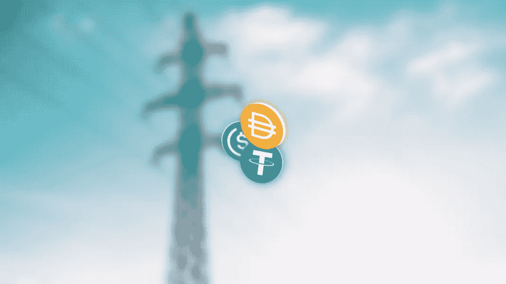

# 稳定增长——新一代稳定增长与可再生能源挂钩

> 原文：<https://medium.com/geekculture/stablecoin-development-a-key-to-stabilize-the-volatility-of-crypto-assets-44420d387db3?source=collection_archive---------18----------------------->

**A New Generation of P2P Stablecoin Pegged to Renewable Energy**

劳伦斯·利弗莫尔国家实验室的开发者们正在研究通过区块链的电子稳定中心 T2 T3 T4 传输家庭用电。多令人兴奋啊。

稳定硬币是由基础资产价值支持的分散代币。这些资产可以是法定货币、黄金、白银、石油、股票或任何真正有价值的资产(数量有限)。这些资产使稳定硬币更加可靠和安全。稳定的货币发展提供了丰富的

*   流动性
*   透明度
*   几乎零波动
*   最后但同样重要的是，一个稳定的值。

我们的稳定硬币开发服务包括将稳定硬币与

# 法定抵押

*   这些是最常见的稳定硬币，挂钩比率为 1:1。
*   当 Stablecoin 的经理扣除法定金额并将其转移到硬币持有者的钱包中，并烧掉 Stablecoin 以使其不再流通时，stable coin 的交易就开始了。

# 商品抵押

*   商品抵押是指像黄金、石油、房地产和贵金属这样容易移动的资产。
*   这些资产的价值实际上暴露给了商品支持的稳定债券的持有者。
*   这些硬币的价值会根据这些商品的实时价值而上涨或下跌，从而改变贸易激励。

# 加密担保品

*   这些稳定的梯度与其他加密货币挂钩，导致更加分散。
*   这些硬币通常被过度抵押以抑制价格波动，降低波动性。

说到 Stablecoin 开发，无限块技术是重中之重。Infinite Block Tech 是区块链地区的一家 Stablecoin 开发公司，提供基于区块链的基础设施，允许创建 stable coin。我们在提供最高质量的稳定货币开发服务方面拥有丰富的专业知识。经验丰富的开发人员和专家团队将按时完成项目。