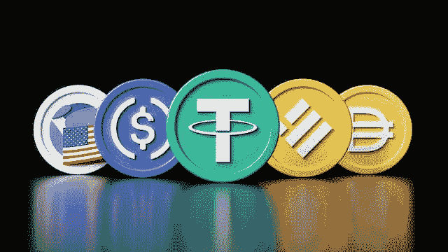
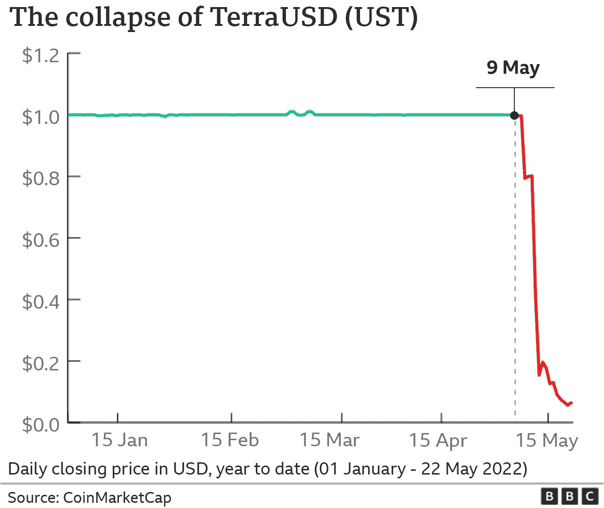
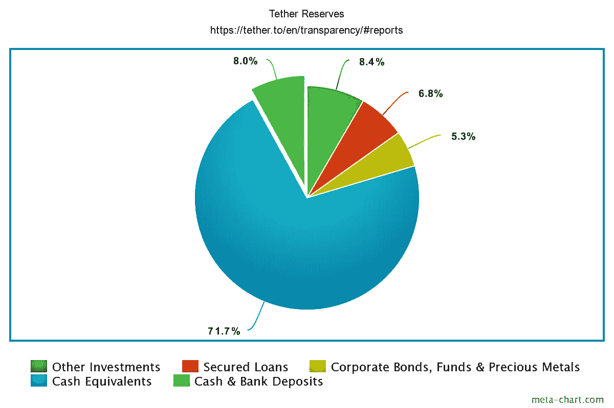

# 不像看起来那么结实？

> 原文：<https://medium.com/geekculture/stablecoins-not-as-sturdy-as-they-seem-1dd726c43e34?source=collection_archive---------21----------------------->

[Shutterstock/David Sandron](https://www.shutterstock.com/image-illustration/top-five-cryptocurrency-stablecoin-tokens-by-2139614619)

如果说我们从当前的经济环境中学到了什么，那就是多元化投资组合的重要性。然而，股票和债券 60/40 的传统分割已经失宠，让投资者寻找替代的多样化资产。一种这样的资产是 stablecoins，由于人们认为这种资产风险很小甚至没有风险，加上收益率有望超过市场，因此吸引了许多散户投资者的兴趣。然而，更深入的评估揭示了重要的警告信号，你应该在投资前考虑。

稳定币是一种加密货币，其价值与另一种资产的价格相匹配或“挂钩”。大多数反映了美元等传统“法定”货币的价格。然而，它们可能同样容易与黄金或石油等大宗商品的价格挂钩。Tether (USDT)是最受欢迎的稳定币，其市值超过 670 亿美元，在过去两年中增长了近 400%。Stablecoins 通过向 cyrpto 投资平台出借硬币来提供产生收益的潜力，cyr PTO 投资平台通常提供丰厚的利率。稳定和有吸引力的收益相结合，很容易理解为什么稳定的债券在当前的经济不确定时期变得受欢迎。

然而，这种稳定性并不能保证，因为之前的事件，如 Terra Luna 的崩溃，对任何潜在的投资者都是一个警告。TerraUSD 是一种稳定的货币，和 Tether 一样，与美元挂钩。联系汇率制是通过一种双重令牌系统来维持的，这种系统使用一种计算机算法来管理供求平衡。涉及的两个令牌是 Terra 和 Luna。如果 Terra 的价值超过了一美元，那是因为对这种硬币的需求超过了供给。当这种情况发生时，用户受到激励去铸造(购买)更多的 Terra，烧掉(出售)Luna，直到稳定的币回到其挂钩的价值。另一方面，如果 Terra 的价格低于挂钩价格，那是因为供大于求，用户受到激励去焚烧 Terra 和铸造 Luna，再次使 Terra 的价值回到挂钩价格。

像 Tether 这样的 TerraUSD 被视为一种“无风险”的收益投资，是散户投资者享受被动收入的安全选择。然而，2022 年 5 月 9 日，泰拉脱离了盯住美元的政策，在几天内从一美元跌至几美分，在此过程中抹去了数十亿美元的价值。这种“无风险”投资导致了灾难，因为散户投资者眼睁睁地看着他们一生的积蓄蒸发。

[https://www.bbc.co.uk/news/technology-61552030](https://www.bbc.co.uk/news/technology-61552030)

如果这种情况发生在 Terra Luna 这样的市场领导者身上，那么是什么阻止了类似的命运降临到其他受欢迎的 stablecoins 上呢？Stablecoin 的支持者将声称，Terra Luna 的垮台是因为它依赖于计算机算法，而事实证明计算机算法在保持稳定性方面是无效的，这是 Tether 等硬币通过“资产支持”而避免的问题。

资产支持的稳定债券有储备支持，可以保值。Tether 声称，他们的代币与相应的法定货币 1 比 1 挂钩，并由 Tether 的储备 100%支持。这里的含义是，每铸造一个系绳，就有一个与之匹配的法定货币作为储备。因此，系绳可能总是以一美元的价格收回。

Tether 声称自己是完全抵押的，然而，如果你希望在他们的资产负债表上找到 670 亿美元的现金，你将会有一个不愉快的惊喜。该公司的最新审计显示，实际上每个现有系绳只有 0.08 美元的现金储备。

大部分外汇储备由“现金等价物”组成，这是一个误导性的术语，指的是美国国债和商业票据等资产。短期国库券和商业票据都是短期贷款的形式，用于在不久的将来为项目提供资金。两者的主要区别在于，前者由美国政府发行，而后者可能由任何具有良好信用评级的机构发行。通过这些“现金等价物”将储备借出，以换取到期时的利息支付。Tether 美国国债的平均到期日约为 60 天，而其商业票据的到期日不到一个月。

问题是，与现金不同，Tether 称为“现金等价物”的资产不能立即提供给那些想要赎回代币的人。除了构成外汇储备其余部分的担保贷款和公司债券之外，被模糊命名的“其他投资”也存在这个问题。如果 Tether 遇到巨大的抛售压力，他们可能没有可用的流动性来支付所有希望赎回其代币的人，因此价格可能会暴跌。这种“挤兑”效应将导致 Tether 被迫拖欠付款，在价值灾难性崩溃中损失数十亿美元，这将对加密行业的其他行业产生重大影响，更不用说那些受影响者的生活了。

这种情况发生的可能性很小，需要在短时间内大量出售系绳。然而，它们也不是不可能的，因此在投资时意识到风险是很重要的。没有所谓的“无风险”投资，重要的是要明白，稳定的 coins 不能免受影响加密市场其余部分的剧烈波动的影响。