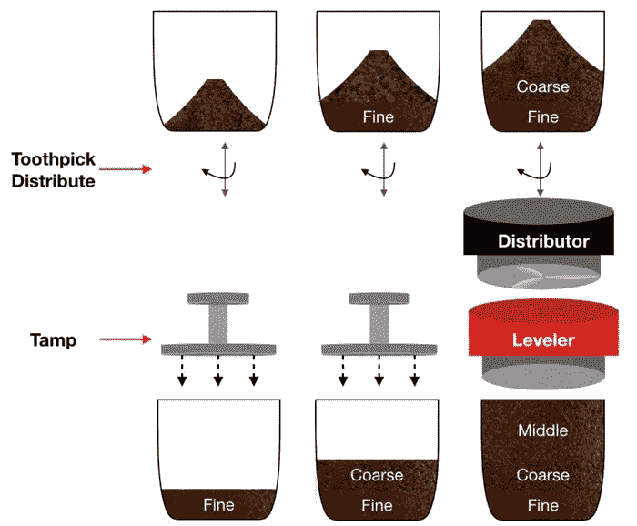
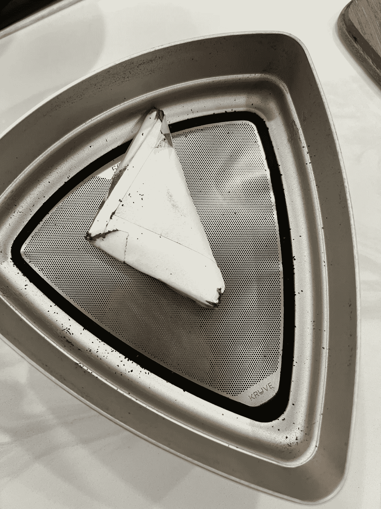
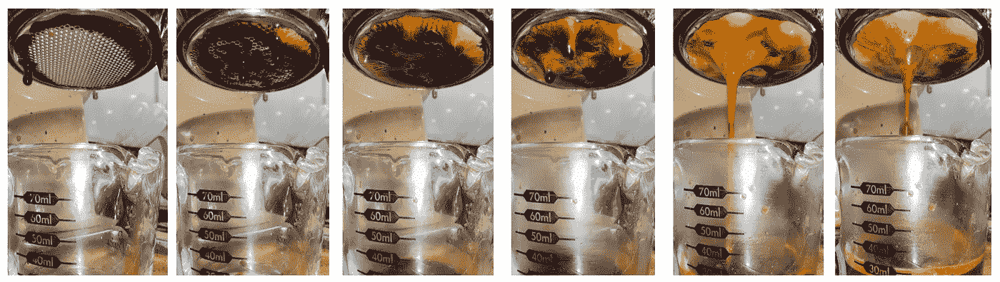

# 断续浓缩咖啡制作技巧

> 原文：<https://medium.com/geekculture/staccato-espresso-preparation-tips-44e386c9d8b9?source=collection_archive---------9----------------------->

## 咖啡数据科学

## 帮助我分层浓缩咖啡的一系列技巧

大约三年前，当不连续浓缩咖啡问世时，还没有任何先验知识。没有太多信息告诉如何筛选，如何调试，以及如何优化分层拍摄。我花了几年时间进行实验，以获得更深入的理解。我提出这些建议，希望你能更好地拉断奏。

All images by author

# 筛

断奏的目的是你应该拨入一个节拍进行常规击球，然后用这个节拍进行断奏击球。

## 什么时候知道你的咖啡是完全筛选

这绝对是筛选最重要的部分。如果你的咖啡没有完全或大部分过筛，你会遇到其他问题。你的底层不能充分减缓水流，而你的顶层会疏导过多。

要知道咖啡是否筛得满满的，一次筛 1 分钟，称下托盘的重量。当重量停止增加时，它被充分筛分。通常，对于 Kruve 筛选机中的 300 微米/400 微米筛网，我需要 5 分钟的时间用两个筛网顶部的搅拌器完全筛选 20g 咖啡。如果没有搅拌器，大约需要 8 分钟。

## 筛

诀窍是选择正确的筛子。如果你使用网格交错屏幕，你必须意识到，广场必须通过他们的对角线来衡量，否则你可能会大大偏离。

如果你使用 [Kruve 筛](https://towardsdatascience.com/comparing-kruve-coffee-sifters-new-and-old-677e8b16ec62)，它会给你在屏幕之间更精细的控制。

## 层数

更多的层是有潜力的，但是超过 3 层的大部分是未被研究的。我喜欢两到三层，以下是我的建议。

**2 层**准备应使用将研磨物对半切开的筛子。通常，我用 300 微米的筛子在壁龛上设置 13。这完全取决于你的拨号和你的咖啡烘焙。

Kruve 的原始 kickstarter 中的筛子有一个不同之处，就其功能而言，原始的 400 微米筛子与新的 300 微米筛子非常相似。因此，试验和尝试不同的筛子。

**3 层**制备应使用一个获得近一半(通常为 300um 或 400um)的筛网，然后使用另一个筛网将剩余部分分成两半(通常为 400um 或 500um)。有时粗糙的一层几乎没有。

**高端研磨机**:很多高端研磨机的研磨分布更紧密。这意味着 2 层可能比 3 层更实用，或者你可以用他们的研磨机来制作 [sudo-staccato](https://towardsdatascience.com/comparing-kruve-coffee-sifters-new-and-old-677e8b16ec62) 而不用筛层。

## 搅拌器

我建议在筛子上加一个搅拌器。对于大于 500 微米的颗粒，不需要搅拌器。对于大于 200 微米的颗粒，搅拌器可以将筛分时间缩短一半。对于 200 微米，至少对于克鲁夫筛来说，你需要一把勺子或刮刀来推动粉末通过。

我试过金属盘和纸。金属盘声音很大。纸有声音小的优点，但是随着时间的推移会磨损。纸似乎有助于咖啡粉末的分离。

我建议使用一个纸搅拌器，从一整张纸放几个硬币(重量)在一个折叠的三角形里。

# 剂量

断续镜头占用的体积更小，因为每层的粒子大小更均匀。因此，我通常必须增加 1 或 2 克的剂量，以获得类似的顶部空间。

> 一个小的顶部空间是拍摄糖浆的关键。

# 冰球准备

[**分配**](/swlh/simplifying-coffee-distribution-for-espresso-e58ac4351ba) 工具还没做断奏，不过没关系。用一块扁平的塑料或金属或者牙签来移动所有东西，以确保床是平的。

**捣固**应小心进行。底层应轻轻夯实。我通常把篮子放在秤上，称到 300 克。

对于 3 层来说，中间的夯实只是为了压平所有的东西(只是接触地面)。

对于顶层，再次，轻夯应使用。我通常使用自动调平夯。

# 预灌注

我已经用了一个更长的[预灌注](https://towardsdatascience.com/pre-infusion-for-espresso-visual-cues-for-better-espresso-c23b2542152e) (PI)进行拍摄，接近 30 秒。这对于断奏来说尤其重要。我使用两个指标来确定何时结束预输注:

**覆盖过滤器的时间(TCF):** 这是开始拍摄时过滤器被咖啡覆盖的时间。我之前已经展示过这是一个在 3*TCF 下何时结束预输注的良好预测。因此，如果 TCF 是 5 秒，15 秒是一个很好的预输注时间。

**时间到 10ml (T10):** 有些时候，镜头跑得很快，所以 3*TCF 不实用。我还看了看我的小酒杯，上面有 10 毫升的标记。你也可以使用一个标尺，寻找达到 10g 输出的时间。这个时候是阻止圆周率的好时机。

> 一次好的拍摄会有大约 10 秒的 TCF 和大约 25 到 30 秒的 T10。

# 灌输

输液的主要关键是在注射开始时结束注射。您需要比正常情况下更早地结束它，因为断奏镜头以更快的单位体积速率提取。通常情况下，1:1(输出到输入)的断奏与 2:1 的常规断奏具有相似的咖啡萃取率。所以如果你拉一个 2:1 的断奏，你就有过度提取的风险。

**产量**:我建议从 1.5:1 开始。所以 20 克进，30 克出。然后根据口味和口感进行调整。

**压力**:我会推荐较低的压力，如 6 巴或压力曲线，控制恒定流量。最终，我[压力脉冲](https://towardsdatascience.com/pressure-pulsing-for-better-espresso-62f09362211d)，因为我有一个杠杆机器，但如果你不能做到这一点，尝试一些低于 9 巴的压力。

# 静止的

我喜欢让一杯酒休息几分钟(通常是 4 分钟)，让饮料冷却到 47 摄氏度左右。我发现尝起来更容易。

在我看来，断奏的镜头在味道、提取和质感方面是最先进的。我已经尽了最大努力从筛选过的、分层的(断奏)浓缩咖啡中吸取经验，但是仍然有差距。我希望这些建议能帮助你更好地进行断奏，或者这些建议中的一些也能帮助你进行常规的浓缩咖啡。

如果你愿意，可以在 [Twitter](https://mobile.twitter.com/espressofun?source=post_page---------------------------) 、 [YouTube](https://m.youtube.com/channel/UClgcmAtBMTmVVGANjtntXTw?source=post_page---------------------------) 和 [Instagram](https://www.instagram.com/espressofun/) 上关注我，我会在那里发布不同机器上的浓缩咖啡照片和浓缩咖啡相关的视频。也可以在 [LinkedIn](https://www.linkedin.com/in/dr-robert-mckeon-aloe-01581595) 上找到我。也可以在[中](https://towardsdatascience.com/@rmckeon/follow)关注我，在[订阅](https://rmckeon.medium.com/subscribe)。

# [我的进一步阅读](https://rmckeon.medium.com/story-collection-splash-page-e15025710347):

[我的书](https://www.indiegogo.com/projects/engineering-better-espresso-data-driven-coffee)

[浓缩咖啡系列文章](https://rmckeon.medium.com/a-collection-of-espresso-articles-de8a3abf9917?postPublishedType=repub)

[工作和学校故事集](https://rmckeon.medium.com/a-collection-of-work-and-school-stories-6b7ca5a58318?source=your_stories_page-------------------------------------)

[个人故事和关注点](https://rmckeon.medium.com/personal-stories-and-concerns-51bd8b3e63e6?source=your_stories_page-------------------------------------)

[乐高故事首页](https://rmckeon.medium.com/lego-story-splash-page-b91ba4f56bc7?source=your_stories_page-------------------------------------)

[摄影启动页面](https://rmckeon.medium.com/photography-splash-page-fe93297abc06?source=your_stories_page-------------------------------------)

[使用图像处理测量咖啡研磨颗粒分布](https://link.medium.com/9Az9gAfWXdb)

[改善浓缩咖啡](https://rmckeon.medium.com/improving-espresso-splash-page-576c70e64d0d?source=your_stories_page-------------------------------------)

[断奏生活方式概述](https://rmckeon.medium.com/a-summary-of-the-staccato-lifestyle-dd1dc6d4b861?source=your_stories_page-------------------------------------)

[测量咖啡磨粒分布](https://rmckeon.medium.com/measuring-coffee-grind-distribution-d37a39ffc215?source=your_stories_page-------------------------------------)

[咖啡萃取](https://rmckeon.medium.com/coffee-extraction-splash-page-3e568df003ac?source=your_stories_page-------------------------------------)

[咖啡烘焙](https://rmckeon.medium.com/coffee-roasting-splash-page-780b0c3242ea?source=your_stories_page-------------------------------------)

[咖啡豆](https://rmckeon.medium.com/coffee-beans-splash-page-e52e1993274f?source=your_stories_page-------------------------------------)

[浓缩咖啡滤纸](https://rmckeon.medium.com/paper-filters-for-espresso-splash-page-f55fc553e98?source=your_stories_page-------------------------------------)

[浓缩咖啡篮及相关主题](https://rmckeon.medium.com/espresso-baskets-and-related-topics-splash-page-ff10f690a738?source=your_stories_page-------------------------------------)

[意式咖啡观点](https://rmckeon.medium.com/espresso-opinions-splash-page-5a89856d74da?source=your_stories_page-------------------------------------)

[透明 Portafilter 实验](https://rmckeon.medium.com/transparent-portafilter-experiments-splash-page-8fd3ae3a286d?source=your_stories_page-------------------------------------)

[杠杆机维修](https://rmckeon.medium.com/lever-machine-maintenance-splash-page-72c1e3102ff?source=your_stories_page-------------------------------------)

[咖啡评论和想法](https://rmckeon.medium.com/coffee-reviews-and-thoughts-splash-page-ca6840eb04f7?source=your_stories_page-------------------------------------)

[咖啡实验](https://rmckeon.medium.com/coffee-experiments-splash-page-671a77ba4d42?source=your_stories_page-------------------------------------)