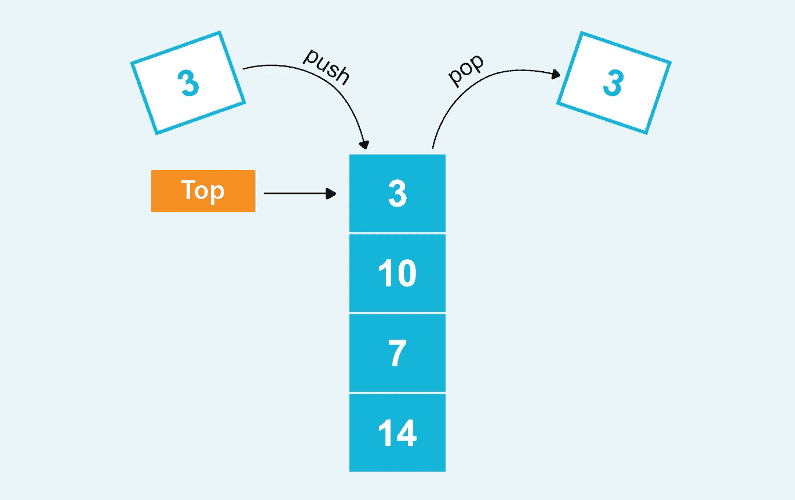

# 关于 Python 中的堆栈，你需要知道的一切

> 原文：<https://medium.com/geekculture/stack-in-python-33617350b6d2?source=collection_archive---------7----------------------->

## 何时使用堆栈以及深入了解堆栈的最佳实现。

Stack Diagram | Created by author

数据结构和算法是软件工程的基础。剥去任何软件或应用程序的核心，你会发现一个庞大的数据结构和算法网络精心缝合在一起。