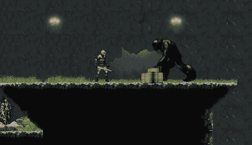

# 在命中+错误修正上动摇敌人

> 原文：<https://medium.com/geekculture/staggering-the-enemy-on-hit-bug-fixing-ca651ce37475?source=collection_archive---------16----------------------->

**目标**:对被玩家一击命中的敌人实施**交错**特征

这个快速教程将展示我如何在一个游戏中实现一个简单而基本的功能:当我们击中一个敌人时阻止它，这个**惊人的** 。

到目前为止，敌人拥有的只是**巡逻**行为，这种行为已经有了一个停止的方法，当它在巡逻常规的限制上变得空闲时。我是…