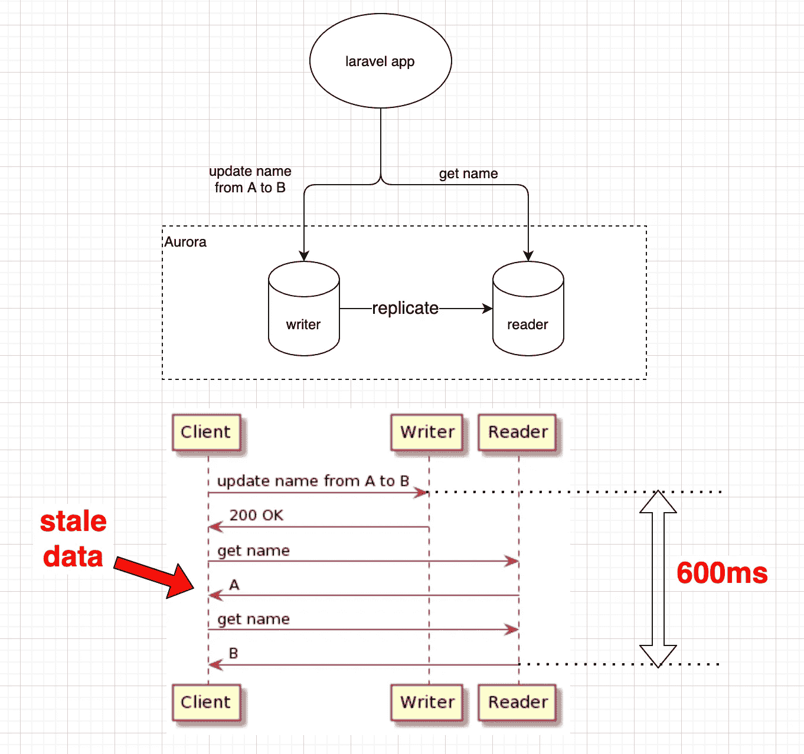
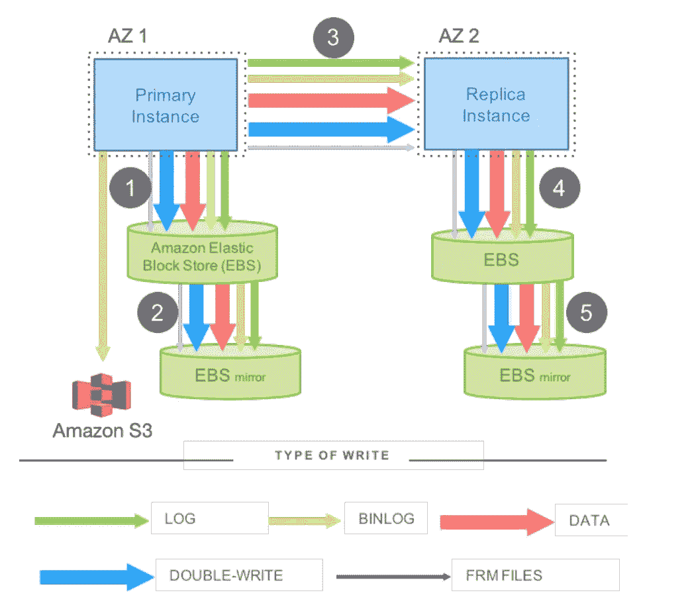
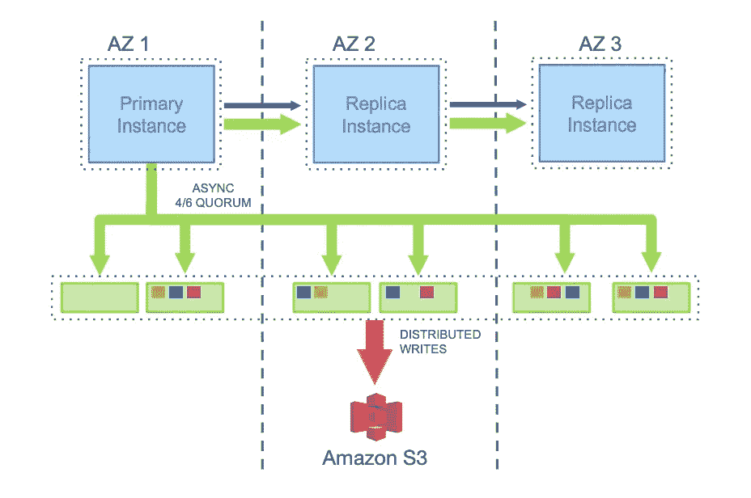
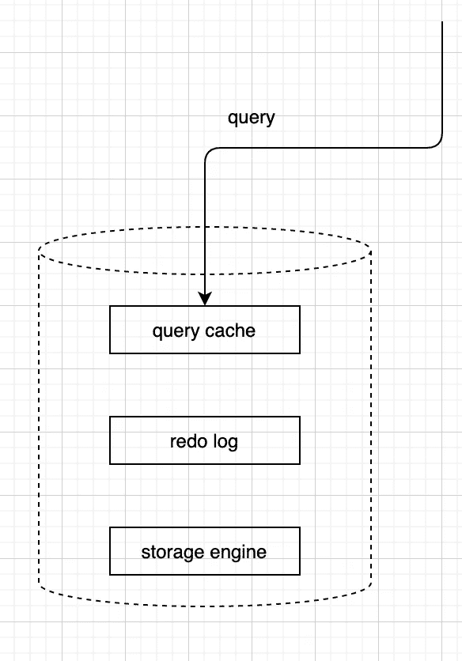

# Aurora 版本 2.07.3 上的过时读取

> 原文：<https://medium.com/geekculture/stale-read-on-aurora-version-2-07-3-f69a38c7cce1?source=collection_archive---------15----------------------->

TL；从 2.07.3 到 2.10.0 的灾难恢复升级解决了这个问题

有时，你需要使用最新版本来解决问题。这就是我在处理 Aurora 副本陈旧读取问题时遇到的情况。

# **问题**

分离读写流量是提高数据库性能和高可用性的最佳实践。我决定为我正在参与的 Laravel 项目做同样的事情。

由于 Laravel 支持分离，所以只需要改变 Laravel 中的一些配置，我们就完成了。但事实证明没那么简单。在更改配置以将 DB 读写流量与 Laravel 分开后，我们发现了一个延迟问题:

我们发现，从 A 更新到 B 后，reader 大约需要 600 毫秒才能返回更新后的数据。少于该值，将返回过时数据。

这是一场灾难！读者和作者之间的这种程度的滞后对于任何 DB 的正确使用都是不可能的，更不用说全能 AWS 的 Aurora 了。

顺便说一下，Laravel 有 [*sticky* 选项](https://laravel.com/docs/8.x/database#the-sticky-option)，允许后续查询在一个请求周期内坚持使用同一个 DB 实例。这可能会解决其他问题，但不会解决我们的问题:读取请求不同于更新请求。

# 调查

Aurora 以其新颖的架构和一切为傲，所以副本延迟应该不是原因，我使用副本延迟度量确认了这一点。我想我应该更深入地了解极光:极光如何复制数据

Normal MySQL style

Aurora style

*图源* [*此处*](https://assets.amazon.science/dc/2b/4ef2b89649f9a393d37d3e042f4e/amazon-aurora-design-considerations-for-high-throughput-cloud-native-relational-databases.pdf)

在极光中， ***日志就是数据库。*** 跨副本复制的是重做日志，而不是数据本身。

由于存储引擎由多个实例共享，并由编写器实例更新，因此除了存储引擎之外，日志也成为数据。这是 Aurora 和传统 mySQL 最大的区别。

这就是复制的工作原理。由于我没有办法确认复制工作正常，所以我不得不假设它工作正常。但是如果复制是正常的，那一定是别的什么地方出了问题。

查询首先命中的是**查询缓存**。如果缓存失效，读取也失效。进一步阅读[文档](https://assets.amazon.science/dc/2b/4ef2b89649f9a393d37d3e042f4e/amazon-aurora-design-considerations-for-high-throughput-cloud-native-relational-databases.pdf)可以发现，Aurora 还通过某种机制确保缓存拥有最新的数据。与重做日志不同，有一种方法可以检查缓存:禁用查询缓存并再次查询。如果它修复了问题，就意味着缓存是问题所在

令我惊讶的是，禁用查询缓存后，延迟确实下降了:从 600 毫秒下降到大约 100 毫秒或更少。所以缓存是罪魁祸首。

但是它带来了另一个问题:为什么当重做日志在副本之间复制时，缓存没有更新？为了解决这个问题，我需要更好地理解缓存更新机制

尽管花了几个小时在谷歌上搜索，我还是找不到任何可行的解释。我本打算放弃，转而向 AWS 寻求支持。

但是在问 AWS 之前，我需要再尝试 1 件事:升级 DB 版本！也许这是一个已知的错误，以前已经被修复了。谁知道呢！

当前版本:2.07.3

升级版本:2.10.0 ( [变更日志](https://docs.aws.amazon.com/AmazonRDS/latest/AuroraUserGuide/AuroraMySQL.Updates.2100.html))

升级后，潜伏期神奇地消失了。瞧啊。

# 解决方案

极光升级到 2.10.0 替我解决了问题。[更改日志](https://docs.aws.amazon.com/AmazonRDS/latest/AuroraUserGuide/AuroraMySQL.Updates.2100.html)显示

> 修复了查询缓存可能会在读取器实例上返回过时结果的问题

显然有一个与副本上的缓存和过时读取相关的错误。我应该在做进一步调查之前尝试升级。吸取教训！