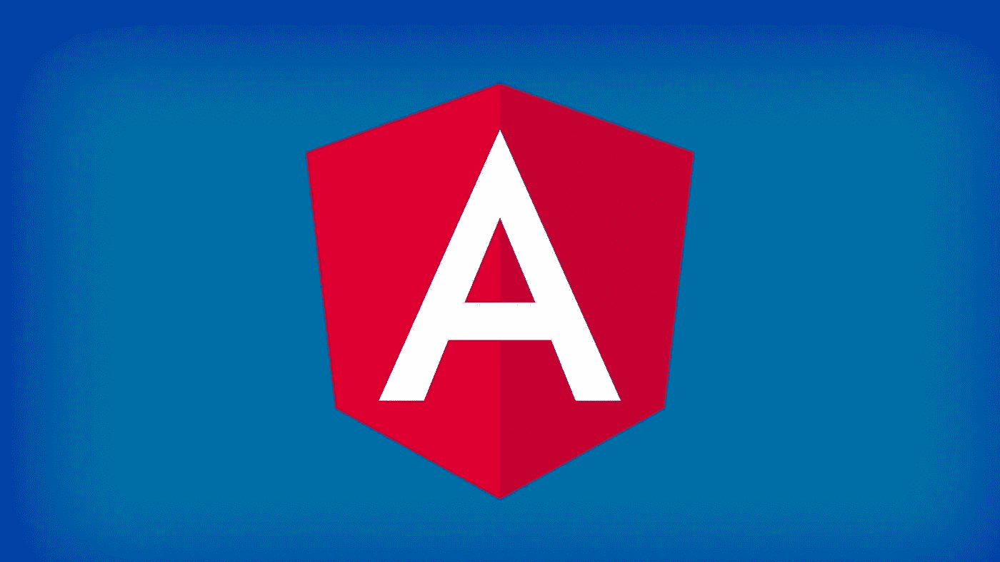
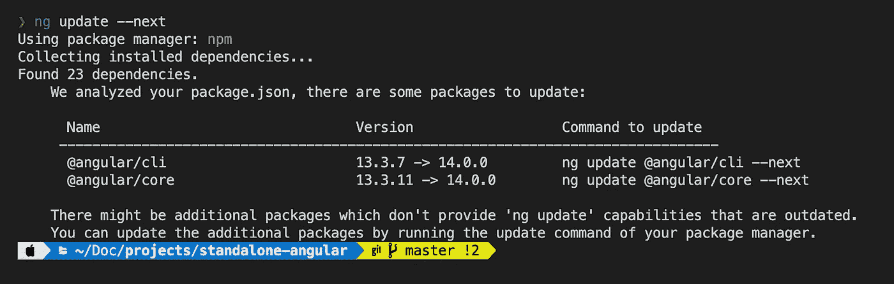
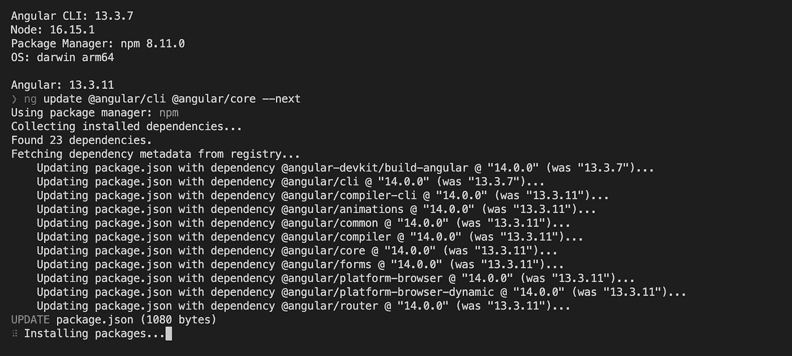
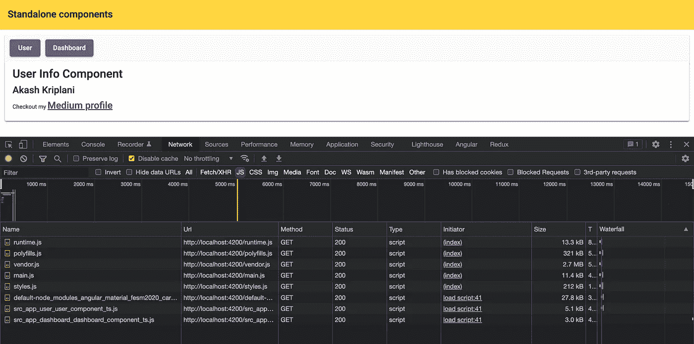
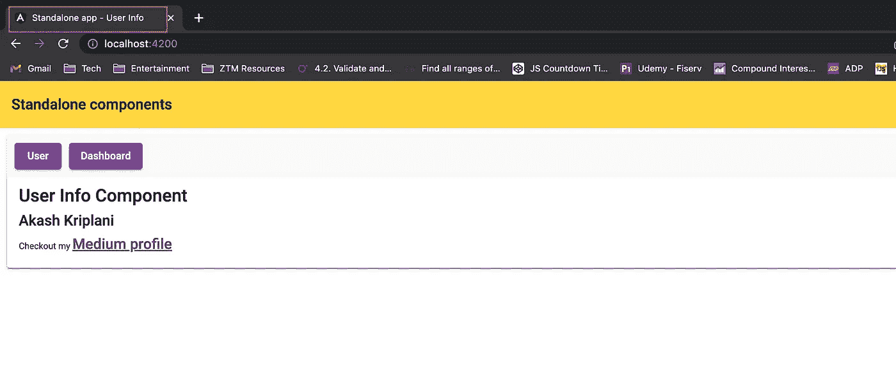

# Angular 14 中具有自定义标题策略的独立组件

> 原文：<https://medium.com/geekculture/standalone-components-with-custom-title-strategy-in-angular-14-aec71a23bcd8?source=collection_archive---------4----------------------->

Angular 14 is here!

# 介绍

直到 Angular 13，Angular 应用程序中最小的可重用代码块是`NgModule`

然后，出现了一个 [RFC](https://en.wikipedia.org/wiki/Request_for_Comments) ( [RFC #43784](https://github.com/angular/angular/discussions/43784) )使 NgModules 成为可选的。背后的想法是减少开始使用 Angular 应用程序的样板代码，并去掉`*.module.ts`文件。根据 Angular 的最新版本(版本 14)，NgModules 已成为可选的。到目前为止，它是一个“开发者预览”功能，因为用于使 NgModules 可选的 API 还不稳定，并且将来可能会根据社区反馈进行更改。

从版本 14 开始，由于独立组件(也包括独立指令和独立管道)的概念，组件已经成为最小的可重用代码块，就像我们在 React.js 和 Vue.js 等其他前端框架中所拥有的一样。

# 独立组件

[角度独立组件](https://angular.io/guide/standalone-components)是那些不需要在 NgModule decorators 中声明，只需要在`@Component` decorator 中提供`standalone: true`属性就可以使用的组件。它允许您将导入直接添加到`@Component`装饰器中，而不必在`@NgModule`中声明它

独立组件，在引擎盖下，使用虚拟模块，这与 [SCAM](https://dev.to/this-is-angular/emulating-tree-shakable-components-using-single-component-angular-modules-13do) module(单个组件角度模块)的模式非常相似——每个单个角度组件都有一个专用模块。这是一对一的关系。

# 设置 Angular 14 独立应用程序

好了，理论到此为止，让我们编码吧！让我们创建一个没有`*.module.ts or @NgModule()`的完全独立的角度应用

在撰写本文时，我的系统上安装了 Angular CLI v13.3.7。我将创建一个角度 13 应用程序，然后将其升级到角度 14。

通过`ng new <app name>`创建一个新的 Angular app。我把它命名为“angular-14-starter”。它将创建一个包含模块文件和路由文件的样板代码(如果您在生成新应用程序时添加了路由)。

使用`ng update --next`将你的应用升级到 Angular 14。你的屏幕应该显示如下。

Upgrading Angular 13 app to Angular 14 — Part 1

运行以下命令将其升级到角度 14:

`ng update @angular/cli @angular/core --next`

屏幕应该显示如下所示。

Upgrading Angular 13 app to Angular 14 — Part 2

现在我们已经将我们的应用程序升级到 Angular 14，您的 package.json 文件应该如下所示:

我已经添加了[角状材料](https://material.angular.io/)作为这个演示的一部分。你也可以使用`ng add @angular/material`将它添加到你的项目中

独立组件的基本结构如下所示:

默认情况下，`UserComponent`类在`@Component`装饰器中包含一个`standalone: true`属性，并导入`CommonModule`。可以使用下面的 Angular CLI 命令— `ng generate component user --standalone`创建上述组件。`UserComponent`包含用户信息，因此让我们使用角材卡模块，并在 mat-card 上显示用户信息。

类似地，创建另一个独立的组件(例如，dashboard ),如`ng generate component dashboard --standalone`

让我们在路由配置中插入这些组件。`app-routing.module.ts`应该如下图所示:

在 v14 中，有一个新的属性`loadComponent`可以用来延迟加载组件，类似于我们之前使用`loadChildren`属性对模块所做的。此外，还有一个`title`属性，它接受页面标题的名称，当路线改变时，它也会改变。

现在，让我们稍微重构一下应用程序，去掉所有的`*.module.ts`文件。

删除`app.module.ts`文件并重构`app.component.ts`文件，如下所示:

如下所示修改`main.ts`文件:

`main.ts`文件包含来自`@angular/platform-browser`的`bootstrapApplication()`，它接收`AppComponent`并引导独立的角度应用程序。需要使用`@angular/core`中的另一个内置方法`importProvidersFrom`将路线注入到`providers`数组中

使用`npm run start`运行您的应用程序，您应该会看到 Angular 独立组件在工作。如果你打开网络选项卡，你会看到应用程序也延迟加载`UserComponent`和`DashboardComponent`

Chunk sizes of Angular 14 application shown in Network tab in Chrome

# 自定义标题策略

我们也可以通过扩展`@angular/router`提供的`TitleStrategy`来定制应用程序路径的标题。或者，您也可以使用`resolver`方法来获取页面的标题。

我已经实现了下面 GitHub 要点中显示的两个策略。

修改您的`app-routing.module.ts`文件，如下所示:

并更新`main.ts`文件中的`providers`数组，如下所示:

当您在路由配置中没有提供`title`属性时，`UserComponent`应该获得标题为`Standalone app — User Info`，因为它是`CustomTitleStrategy`中提供的默认标题。

User Info page with Standalone app — User Info title

同样，`DashboardComponent`得到标题`Standalone app — My dashboard`，因为标题被`DashboardTitleResolver`解析，然后`CustomTitleStrategy`开始将`/dashboard`路线的标题设置为`Standalone app — My dashboard`

Dashboard page with Standalone app — My dashboard title

如果你在编码的过程中遇到了困难，下面是 GitHub repo 的公开链接:

 [## GitHub-akashkriplani/Angular-14-starter:带有自定义标题的 Angular 14 独立组件…

### 此项目是使用 Angular CLI 版本 13.3.5 生成的。为开发服务器运行 ng serve。导航到…

github.com](https://github.com/akashkriplani/angular-14-starter) 

# 结论

现在我们有了。我希望这篇文章对你有用。感谢您的阅读。请随时提供您的意见、建议和任何其他可能有帮助的反馈。