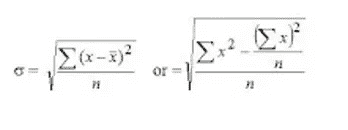
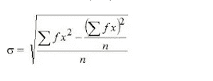
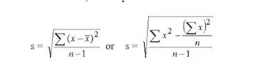
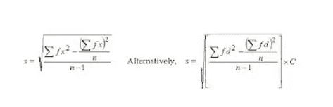
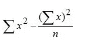
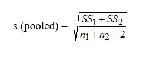

# 统计学中的标准偏差

> 原文：<https://medium.com/geekculture/standard-deviation-in-statistics-c4165e67fdf1?source=collection_archive---------14----------------------->

标准差(或σ)是数据偏离平均值的度量。

低标准偏差意味着数据围绕平均值聚集，高标准偏差意味着数据更加分散。

标准偏差接近零表示数据点接近平均值，而高或低标准偏差分别表示数据点高于或低于平均值。

在图 1 中，顶部曲线更加分散，因此具有较高的标准偏差，而底部曲线更靠近平均值，因此具有较低的标准偏差。

*【图 1:高低标准差曲线。来源:北卡罗来纳大学，2012 年。]*

忽略偏差的符号在数学上是不正确的。我们可以平方偏差，使负值为正值。在计算平均平方偏差后，可以通过求其平方根以原始单位表示。这种测量变异的方法被称为标准差。

标准偏差被定义为单个值与其平均值的平方偏差的平均值的平方根。象征性地，

标准偏差或

这被称为标准差，因为它表明了一种围绕平均值的群体标准值分布。

对于分组数据，它以标准偏差(S.D .)给出，或者

样本标准差应该是总体标准差的无偏估计，因为我们使用样本标准差来估计总体标准差。为此，我们用 n-1 代替公式中的 n。因此，样本标准偏差写为

对于分组数据，它由下式给出

在哪里，

*C* =上课间隔

*d*=(*x*—*A*)/*C*根据均值给出。

标准差的平方称为方差。在方差分析技术中，术语

称为平方和，方差称为均方。对于样本，标准偏差用 s 表示，对于总体，用 s 表示。

标准差是最广泛使用的离差度量。它把所有的项目都考虑进去了。与其他措施相比，它更加稳定。然而，它会被极端的项目所夸大。

**标准差有一些额外的特殊特征。**

标准偏差可以合并。如果具有 n1 个观测值的第一分布的平方和是 SS1，并且具有 n2 个观测值的第二分布的平方和是 SS2，则合并的标准偏差由下式给出:

它不受每个观测值加或减一个常数值的影响。

它受每个观测值乘以或除以一个常数的影响。当观察值乘以一个常数时，得到的标准偏差将等于实际标准偏差与该常数的乘积。

(注意，所有观测值除以常数 C 相当于乘以它的倒数 1/C。减去常数 C 相当于加上常数-C。)

**标准差提示**

假设有一个成千上万的学生参加的标准化考试。
如果测试的问题设计得好，学生的分数应该大致呈正态分布。
假设测试的平均分数为 100 分，标准差为 10 分。上面提到的规则意味着大约 2/3 的学生的分数应该在 90 到 110 之间，95%的学生应该在 80 到 120 之间，几乎所有的学生——99.7%——的分数应该在平均值的三个标准偏差之内。