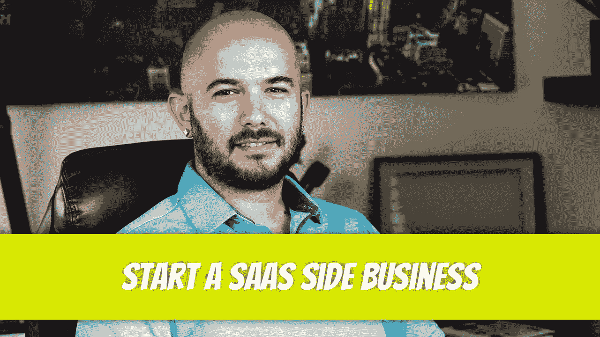

# 当每个人都在担心经济的时候，在 SaaS 开始一个副业

> 原文：<https://medium.com/geekculture/start-a-saas-side-business-while-everyone-is-worried-about-the-economy-38756ab9b0d8?source=collection_archive---------5----------------------->

你创办的任何企业都会经历一个负收益期:你的支出会远远超过收入。我在 2012 年创办了一家名为 First Choice Wheels and Tires(Cyber Rims Inc .)的企业。第一个月收入高达 274 美元:我们卖出了一辆车。第二个月赚了 5000 美元。第三个月 10000 美元。