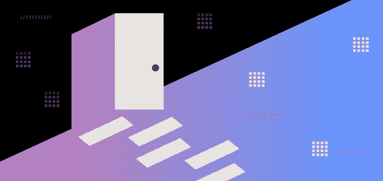

# 使用 RudderStack Cloud Free 开始免费构建更好的 CDP

> 原文：<https://medium.com/geekculture/start-building-a-better-cdp-for-free-with-rudderstack-cloud-free-cff636466534?source=collection_archive---------20----------------------->

今天，我们发布了免费的舵栈云，一个没有时间限制，不需要信用卡，完全免费的舵栈云。这背后的驱动力很简单:我们希望你尝试 RudderStack，RudderStack Cloud Free 使这比以往任何时候都更容易。您将获得与 RudderStack Cloud Pro 相同的出色体验，唯一的限制是每月 500，000 次活动(对于大多数网站和应用程序来说，这大约是每月 10，000 名活跃用户)。我们相信，如果您尝试 RudderStack，您会发现它的价值并爱上它。

# RudderStack 的仓库优先方法优于其他 CDP

您的客户数据平台(CDP)的全部目的是消除客户数据孤岛，这些数据孤岛总是由您的公司使用各种常见、流行的营销、销售和产品技术而产生。每个 CDP *都声称*可以做到这一点，而现代 CDP，比如 Segment，实际上做得很好，但是它们的方法都有一个明显的缺陷。他们创建了另一个客户数据仓库，因为他们存储您的数据。这意味着，除了您自己的数据仓库之外，您还有一个用于存储客户数据的第三方数据仓库，其中存储了您所有的历史数据，包括您客户数据的另一个副本。

> RudderStack 的仓库优先方法修复了这个缺陷。

RudderStack 不会保存任何客户数据。RudderStack 在您的数据仓库上构建您的 CDP，支持云数据仓库，如 [Amazon Redshift](https://aws.amazon.com/redshift/) 、 [Google BigQuery](https://cloud.google.com/bigquery) 和 [Snowflake](https://www.snowflake.com) 。不再需要向 CDP 供应商支付额外费用来存储您的数据。再也不用担心您的 CDP 供应商是否在保护您的客户数据的隐私和安全。不要再祈祷你已经使用并喜爱的 BI、ML 或 AI 工具能与你的 CDP 一起工作。身份拼接等复杂功能不再依赖 CDPs 黑盒子。

# RudderStack 是为开发者打造的

拥有您的数据仓库和数据基础设施的团队也应该拥有您的客户数据堆栈。几乎每个公司的团队都主要由开发人员组成。因此，我们构建了易于开发人员使用的 RudderStack。

RudderStack 的特性是 API 优先构建的，因此它们可以很容易地适应您现有的开发过程。它提供了 [11 个 SDK](https://docs.rudderstack.com/rudderstack-sdk-integration-guides)以及与流行的基于云的客户工具的[源集成](https://docs.rudderstack.com/sources)，包括 [Looker](https://looker.com) 和 [Customer.io](https://customer.io) ，因此您可以从您的所有数字接触点检测并开始接收客户数据。RudderStack 还提供了与超过 60 个目的地的连接，因此您可以将您的客户数据路由到所有需要它的系统，包括流行的事件流平台，如 Apache Kafka，数据仓库，如 Snowflake，云工具，如 Amplitude，AppsFlyer 等等。

RudderStack 也与 Segment 的 API 完全兼容。因此，如果您已经用 Segment 装备了您的数字接触点，您就不必再费力地用 RudderStack 重新装备了。只需更新您的 Segment SDKs 上的配置，就大功告成了。

RudderStack 也是开源的(访问 GitHub 上的[rudder stack](https://github.com/rudderlabs))。因此，如果你需要增加或修改你的方向舵堆栈，你可以，然后，希望，你会有助于该项目，所以其他人也受益于你的工作。

# 今天试试方向舵堆栈

开始构建更智能的客户数据管道。使用你所有的客户数据。回答更难的问题。向您的整个客户数据堆栈发送见解。今天就报名参加[舵栈云免费](https://app.rudderlabs.com/signup?type=freetrial)。

加入我们的 [Slack](https://resources.rudderstack.com/join-rudderstack-slack) 与我们的团队聊天，查看我们在 [GitHub](https://github.com/rudderlabs) 上的开源报告，订阅[我们的博客](https://rudderstack.com/blog/)，在社交上关注我们: [Twitter](https://twitter.com/RudderStack) 、 [LinkedIn](https://www.linkedin.com/company/rudderlabs/) 、 [dev.to](https://dev.to/rudderstack) 、 [Medium](https://rudderstack.medium.com/) 、 [YouTube](https://www.youtube.com/channel/UCgV-B77bV_-LOmKYHw8jvBw) 。不要错过任何更新。[立即订阅](https://rudderstack.com/blog/)我们的博客！

*原载于 https://rudderstack.com***。**