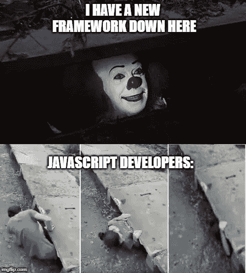
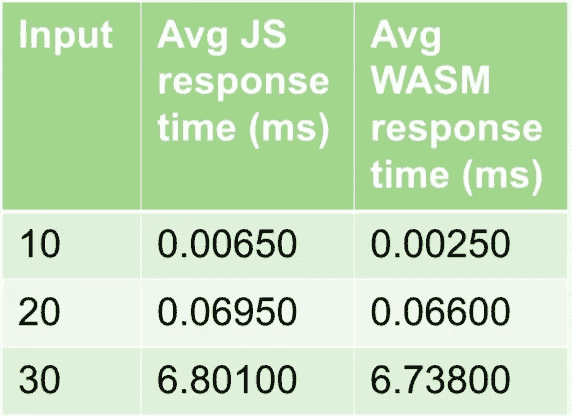
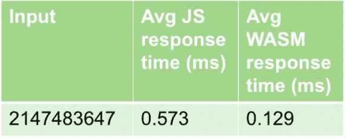

# 今天就开始你的 WASM 之旅

> 原文：<https://medium.com/geekculture/start-you-wasm-journey-today-32b36ac9a817?source=collection_archive---------46----------------------->

互联网上流传着一种模因，可以说明开发者对新技术的态度。

虽然有趣，但我发现这是真的，事实上，我对这张照片唯一想改变的是，我们可能会头先着地。

新的开发技术就像最新的流行趋势，前一分钟每个人都在谈论这个新的框架，下一分钟另一个框架就会出现，人们蜂拥而至。

Photo by [Michael Lee](https://unsplash.com/@guoshiwushuang?utm_source=medium&utm_medium=referral) on [Unsplash](https://unsplash.com?utm_source=medium&utm_medium=referral)

但是就像大多数时尚趋势一样，这些“新的和令人兴奋的”技术一会儿在这里，一会儿又不受支持。

然而，在我为这篇文章所做的研究中，我发现了一种技术，我认为这不是一种趋势，但在可预见的未来，这种技术将会出现。

这个技术就是 Web 组装。

在本文中，我将讨论它是什么，它有哪些不同的使用案例，对它有哪些误解，最后是这项技术的下一步。

# **什么是 WebAssembly？**

由 W3C 联盟设计和开发，W3C 联盟是一个负责开发万维网标准的组织。创建 WASM 的目的是为开发人员提供一种可以在浏览器或服务器中执行的低级语言，从而提高应用程序的性能

许多主要语言都支持 WASM，这意味着开发人员可以使用他们选择的语言编写代码，如(C、C++、Go、Rust ),使用 wasm-pack 或 Emscripten 等编译工具来生成可以直接在浏览器中执行的 Web 汇编文件。

据 w3.org 2019 年 12 月 5 日报道，W3C 已经正式承认 WebAssembly 为主流浏览器支持的第四种语言。在此之前，浏览器支持的三种语言是( **HTML、CSS 和 JS** )。

# **网络组装有什么好处？**

作为编译目标，开发者可以选择性能语言来编写他们的逻辑并编译到 WASM。这一发展的影响是巨大的。开发人员能够用诸如( **C、Rust、Go 等等**)的语言编写代码，然后将其编译成二进制代码，以便在浏览器上执行。这使得最终用户现在甚至可以使用原本用于桌面的应用，并直接在 web 浏览器中使用它们，无需安装或环境依赖，速度快得惊人，就像在桌面上使用一样。仅举几个例子，Tensorflow、Unity、AutoCAD、Google Earth 等项目已经实现了 web 组装，将它们的代码移植到 web 平台上，并取得了可喜的成果。

# **可以用 WebAssembly 做什么？**

Josh Hanaford 在 IBM Developer 的博客上写了一篇名为“为什么同时使用 WebAssembly 和 Rust 可以提高 Node.js 的性能”的文章，他指出了 web assembly 可以应用的几个用例，例如 AR/VR 应用程序、计算机辅助绘图(CAD)甚至人工智能。

例如，在我的研究过程中，我偶然发现 OpenCV 网站和他们的演示将 WebAssembly 的性能与 JavaScript (asm.js)进行了比较。在下面的第一张图中，我使用 JavaScript 测试了 OpenCV 人脸检测，并注意到它的人脸检测 API 性能不佳，因为它难以保持每秒 18 帧。然而，当使用 OpenCV 的人脸检测的 WebAssembly 实现时，该应用程序轻松地保持了 53 fps 的帧速率。这几乎是 JS 实现的 3 倍。

除了测试已经写好的演示，我还想亲自测试一下实现。为此，我选择了两个基准测试。第一个演示了 WASM 与使用*递归*的 JS 相比表现如何，第二个演示了它与使用 for 循环的 JS 相比表现如何。

对于第一个测试，我使用了斐波那契算法来测试递归。正如您在下面的第一个测试中看到的，使用 Web Assembly 有相当大的性能提升，但是随着输入的增加，两者之间的性能差异可以忽略不计。

Chrome fibonacci Test

for 循环呢，在这种情况下它的表现如何？

为了这个测试，我编写了一个函数，使用迭代 For 循环方法来检测一个数是否是质数。正如您在右边的表格中看到的，WASM 的平均表现是传统 JS 的 7 倍！

Chrome detect prime number test

这里有一些我用 rust 写的函数的代码片段，然后使用一个名为( **wasm-pack** )的 Rust 库编译成 Web 汇编。在这些代码片段中需要注意的一点是，为了让我在浏览器中使用这些函数，我必须使用 **wasm-bindgen** 来注释我的函数。在未来的博客中会有更多的介绍。

Writing fibonacci algorithm using Rust

Detecting if input is prime number in Rust

# **误解**

像 Web Assembly 这样有影响力的语言自然会在开发人员社区中产生一些误解。比如:

随着像 WebAssembly 这样的语言在开发人员社区中逐渐流行，一些问题和误解也随之产生，比如:如果我选择使用 WebAssembly，我是否必须用它重写整个应用程序？还是说 WebAssembly 将来会取代 JavaScript？

这两个问题的答案都是否定的。WebAssembly 的创造者们对这种语言的想法是与 JavaScript 一起工作，允许开发人员快速地用 JavaScript 编写他们的代码，但抵消了 Web Assembly 的沉重负担。

# **结论**

我希望这篇文章能让你看到 WebAssembly 在未来能够实现的可能性。从 JavaScript 的性能提升到大量的用例，现在诸如(C、C++和 Rust)等源语言可以编译成 WebAssembly 并直接在浏览器中执行。对于我来说，我对这项技术感到兴奋，我迫不及待地想把它应用到我的工作项目中。