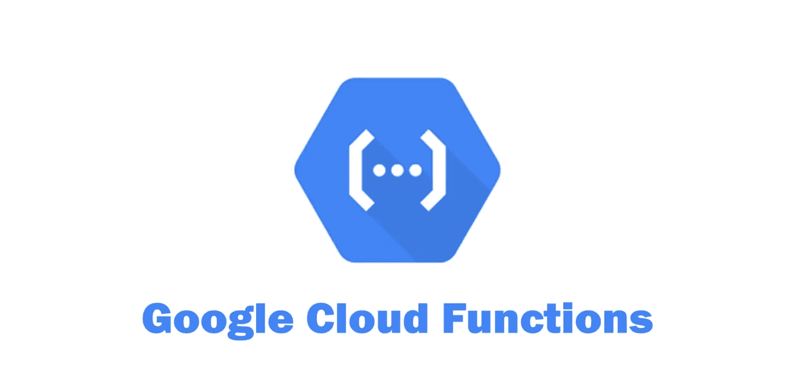
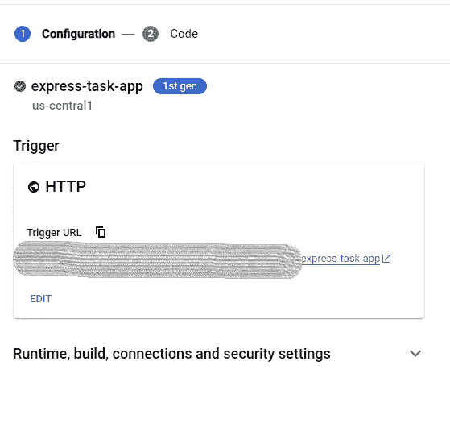

# 用云功能+ Datastore 启动 Google Cloud

> 原文：<https://medium.com/geekculture/starting-google-cloud-with-cloud-function-datastore-c6248849efdd?source=collection_archive---------13----------------------->

你会发现很多关于谷歌云的教程、实践作业和概念验证，这是我的一个新发现。我是谷歌云平台(GCP)的新手，因此试图探索一些应用程序级的服务。因此，我从云功能和数据存储开始。

我使用云功能作为后端，数据存储作为数据库服务。下面我简单给大家介绍一下这两项服务。cloud function 是一款来自 GCP 的完全托管的无服务器产品，你只需要在 function 中用你喜欢的语言编写代码。这个函数可以由不同的触发点触发，我选择了 HTTP 请求作为触发点。我在 GCP 使用的另一个服务是 Datastore。数据存储是一个完全受管的 NoSQL 数据库，对于大中型应用程序来说，它是可扩展的和可靠的。我们不需要深入了解什么是 NoSQL，但是这种数据库是基于键值对范式工作的。

我特别从这两项服务开始，因为这两项服务都是完全托管的服务。您不需要知道依赖于此的任何其他服务。由于这些是托管服务，您甚至不需要进行任何特殊的调配。

我在云函数中使用了 express JS，这使得在 NodeJS 中创建服务器变得很容易。应用程序对“任务”执行简单的 CRUD 操作。您可以创建一个任务，开始处理一个任务，并完成一个任务，所有这些都有这些 API 的帮助。

这是 GIT 存储库，您可以在其中找到云函数的代码。[https://github . com/pritampanhale/GCP-pocs/tree/main/GCP-react-node-datastore-POC/node-datastore-back end](https://github.com/pritampanhale/gcp-pocs/tree/main/gcp-react-node-datastore-poc/node-datastore-backend)

创建云函数时，请注意上面截图中突出显示的部分。将 expressApp.js 的内容复制到 index.js，将 package.json 复制到 package.json，从 GIT 仓库复制到云函数的文件。

创建函数，需要几分钟时间。然后你会得到下面的触发 URL。您可以使用这个 URL 来调用您的 API

> 例如，要获得所有任务—

获取<url>[/快递-任务-app/任务](https://us-central1-logical-seat-340007.cloudfunctions.net/express-task-app/task)</url>

> 去创造一个任务—

POST<url>[/express-tas-app/tas](https://us-central1-logical-seat-340007.cloudfunctions.net/express-task-app/tas)k</url>

身体—

*{*

*“任务名”:“第四个任务”*

*}*

> 要更新任务—

放<url>[/快递-任务-app/任务](https://us-central1-logical-seat-340007.cloudfunctions.net/express-task-app/task)</url>

身体-

*{*

*" taskId ":" 3a 2924 E0–9550–11ec-B6 a5-d7f 657 f 08723 "，*

*【已完成】:“，*

*《开始了》:“，*

*"任务名":"第一个任务已更新"*

*}*

只要确保您的云功能可以通过互联网访问即可。一旦您为任务创建了一些条目，请检查数据存储，它应该是在那里创建的，如果您在调用 API 时有任何问题，请检查“日志记录”服务中的日志，您可能会得到所缺少的内容。

我还在 ReactJS 中创建了一个简单的 web 应用程序(用于学习 React JS ),它将从一个 UI 处理这些 API。请务必检查—[https://github . com/pritampanhale/GCP-pocs/tree/main/GCP-react-node-datastore-POC/node-datastore-app](https://github.com/pritampanhale/gcp-pocs/tree/main/gcp-react-node-datastore-poc/node-datastore-app)

如果你在设置这个云功能时遇到任何问题，请在评论中告诉我。