# 使用 Metaflow 开始您的数据科学项目？MNIST 用例。

> 原文：<https://medium.com/geekculture/starting-your-data-science-project-with-metaflow-the-mnist-use-case-44e3b3ad6ec3?source=collection_archive---------13----------------------->

数据科学家的优先事项仅仅在于挑选正确的功能，构建和部署他们的模型，他们不喜欢特别担心其他方面，如模型版本控制、作业调度、流程架构、计算资源管理，这些都是成功实施数据科学所必需的。


这就是元流的用武之地

Metaflow 是网飞开发的用于管理数据科学工作流的开源工具。它旨在通过让数据科学家专注于实际的数据科学工作并促进其交付成果的更快生产来提高他们的生产力。

如果你熟悉气流或 Luigi，那么你会理解元流的功能。它允许您分步运行数据科学流程，因此每一步都是流程中的一个节点，节点之间的连接就像下图所示。

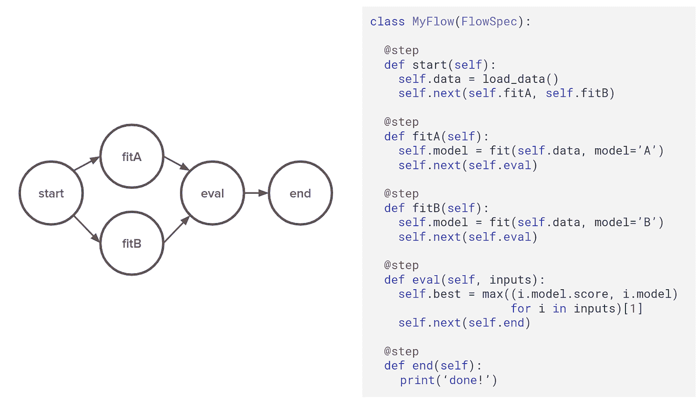

这个系统被称为有向无环图。在这个假设的例子中，流程并行训练两个版本的模型，并输出最高的准确度分数。

Metaflow 的另一个有趣的属性是它附带了一个轻量级的服务,它提供了一个集中的地方来检查和跟踪所有的流执行。Metaflow 将使用一个本地目录来跟踪笔记本电脑上执行的所有元数据。这种元数据被称为数据工件。

您可以使用一个本地 Jupyter 笔记本来与您以前执行的以及当前运行的数据工件进行交互。但是，如果您希望与同行共享结果并跟踪您的工作而不用担心丢失任何状态，那么将 Metaflow 服务与 Amazon S3 一起部署作为数据存储会很有帮助。

*随着我们的继续，我们将会看到一个使用 Metaflow 执行流并检查数据工件的例子。*

## **元流的基本组件**

元流 Dag 本质上由流、步骤和过渡组成。

*   流:管理管道所有代码的实例。在本例中，它是一个 Python 对象*类 MyFlow(Flowspec)*
*   步骤:步骤是最小的可恢复计算单元，由 decorator *@step* 分隔，它们是 MyFlow 对象中的 python 函数，在本例中是 *def start，fitA，fitB，eval，end* 。
*   转换:步骤之间的链接可以是不同的类型(线性、分支和 for each)；关于[文档](https://docs.metaflow.org/)有更多细节。

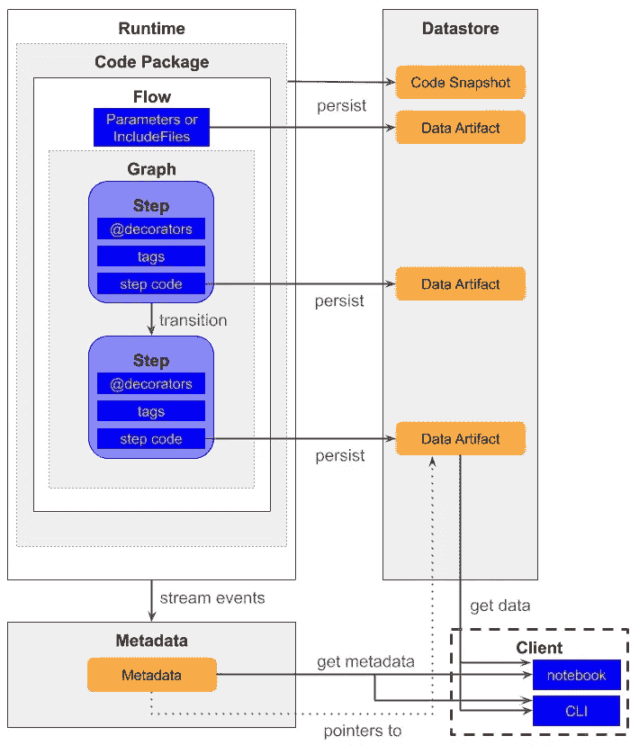

该流程有 3 个组成部分:

*   数据存储是存储流程中生成的所有数据(数据工件)的地方
*   元数据是存储流程执行信息的地方
*   客户端是访问数据存储中的数据并从元数据中获取流信息的连接组件

围绕流程的这些组件允许数据科学家恢复运行、检查运行元数据、进行混合运行和协作。

## **设置元流**

像 AWS 这样的本地和远程服务器都可以使用元流

在本地和远程服务器上，只需简单地

```
pip install metaflow
```

或者升级已经安装的元流

```
pip install - upgrade metaflow
```

现在，考虑到所需数据和资源的规模，人们可以选择远程选项，或者需要快速交互但资源有限的本地选项。

还有一种混合方法，通过在两个服务器之间轻松切换来获得本地和远程两个世界的优势。Metaflow 会自动对云中的所有数据和代码进行快照。这意味着您可以[检查](https://docs.metaflow.org/metaflow/client)，[恢复](https://docs.metaflow.org/metaflow/debugging#how-to-use-the-resume-command)，并恢复任何先前的元流执行，而不必担心您辛勤工作的成果会丢失。

## **开始你的数据科学/机器学习项目——MNIST**

在这篇文章中，我们将建立一个数据科学工作流，使用 **MNIST 数据集训练机器学习模型。**

[MNIST 数据集](https://www.kaggle.com/oddrationale/mnist-in-csv)最初是一个手写数字图像的数据库，但是对于这个项目，图像数据已经使用其通道(RGB)转换为 CSV 格式，作为数据集中的特征，即矢量化。

`data`文件包含 60，000 个例子和标签。每行包含 785 个值:第一个值是标签(从 0 到 9 的数字)，其余 784 个值是像素值(从 0 到 255 的数字)。


这将涉及数据提取、数据准备、数据分割、模型拟合和预测以及模型评估。

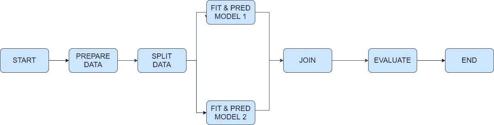

上面的图表可以用下面的代码来表示

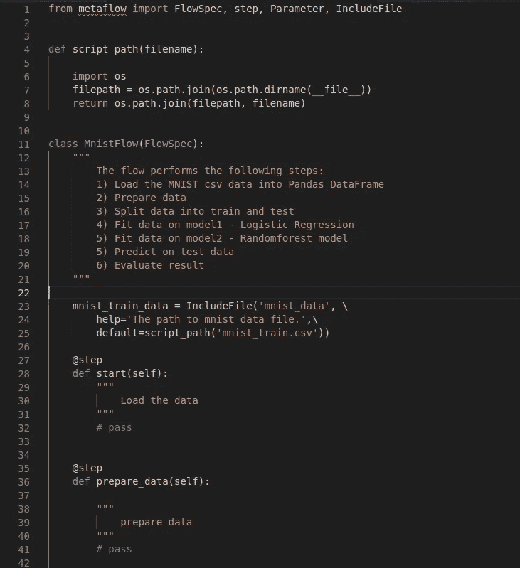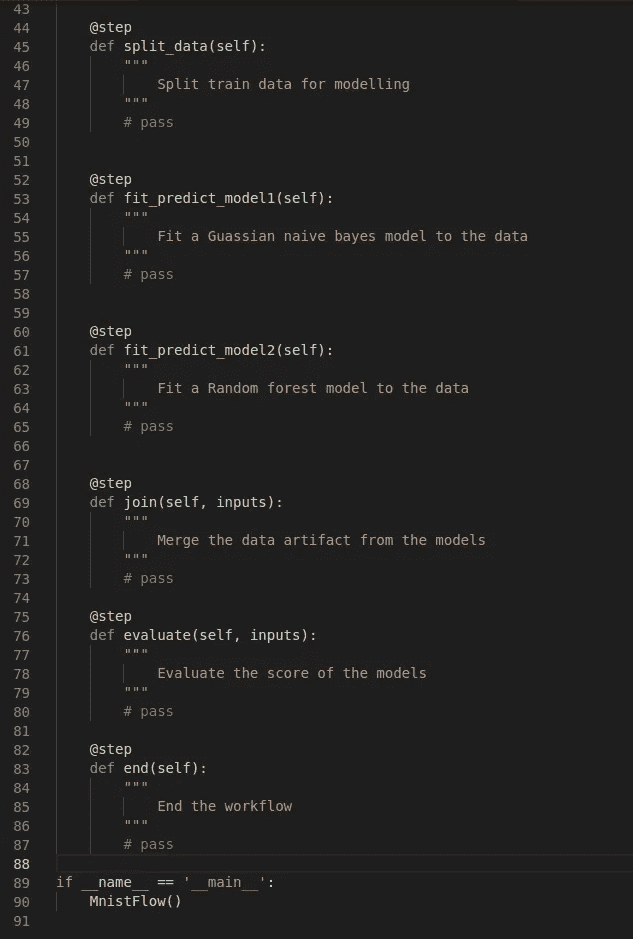

**遍历图中的每一步**

第一步是设置 MNIST 数据文件的路径，并将数据集加载到熊猫数据框中

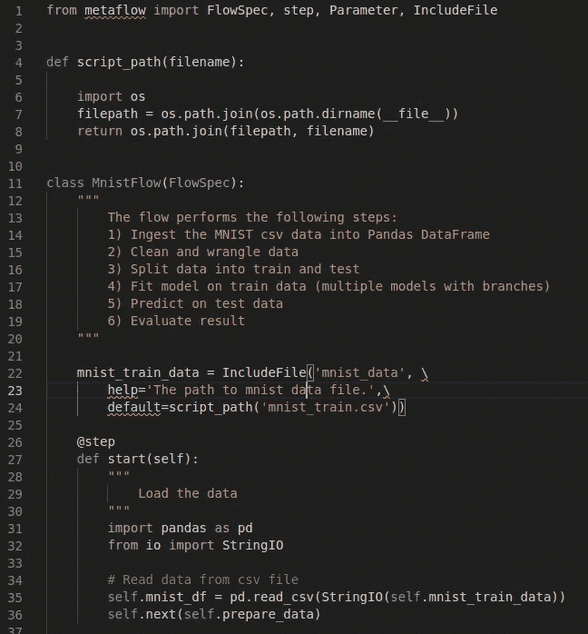

第二步是通过从整个数据集中提取特征和标注来准备数据集

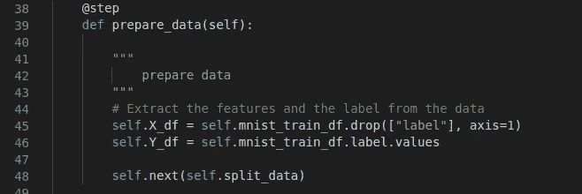

下一步是以 50:50 的比例将数据分为训练集和测试集

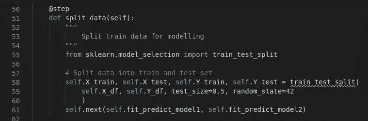

然后我们对高斯朴素贝叶斯模型的数据进行拟合预测

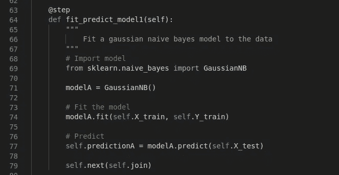

接下来，我们对随机森林模型的数据进行拟合预测

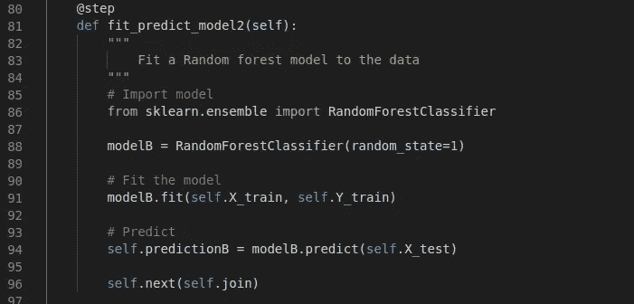

这里，我们将运行分类模型的两个分支连接起来。我们合并了来自两个分支的数据工件。

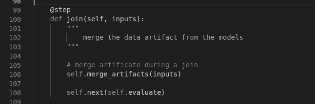

然后我们评估了这个模型

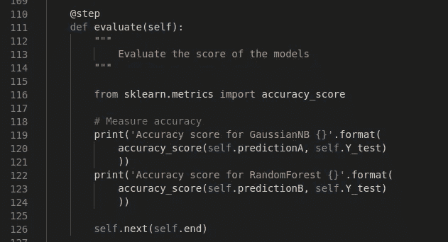

结束了这场赛跑

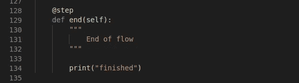

参见下面的完整代码库

查看流程运行的结果

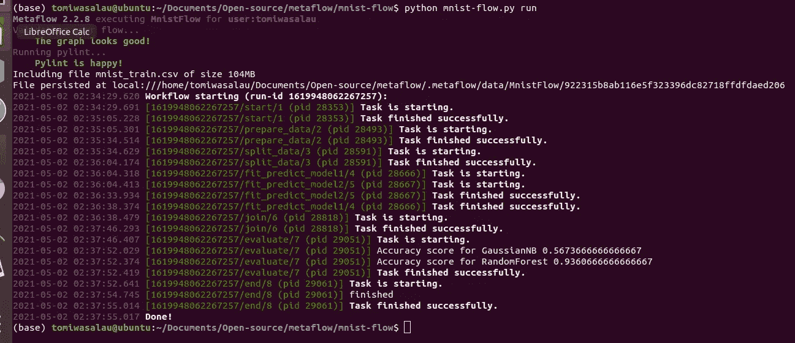

我们可以看到，随机森林模型比高斯朴素贝叶斯模型表现更好，得分为 93.6%，比 56.7%。

使用 Metaflow，我们还可以检查我们的流程，即检查流程列表、运行次数、最近运行、步骤列表和每个步骤的数据工件。这在调试您的流时特别有用。

错误通常以这种形式出现

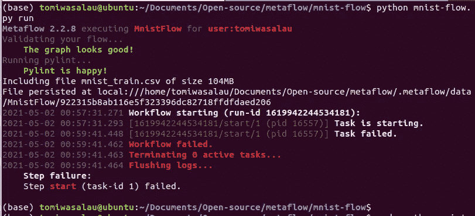

下面，你可以用这种方式检查你的流程，这可以通过 Jupyter 笔记本或你的 CLI 来完成。我们在这个项目中使用 Jupyter 笔记本。

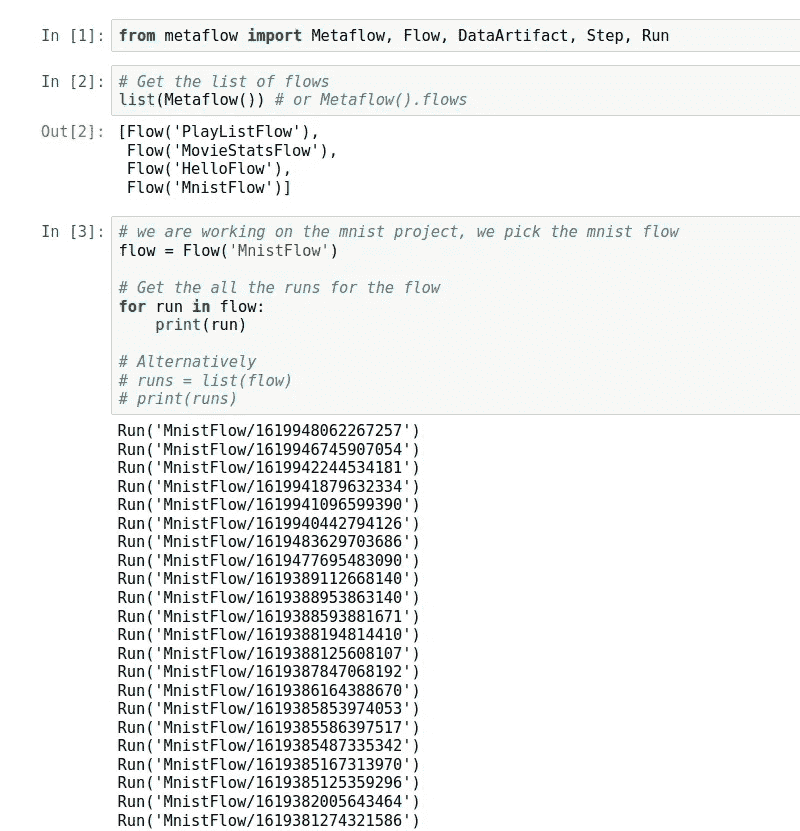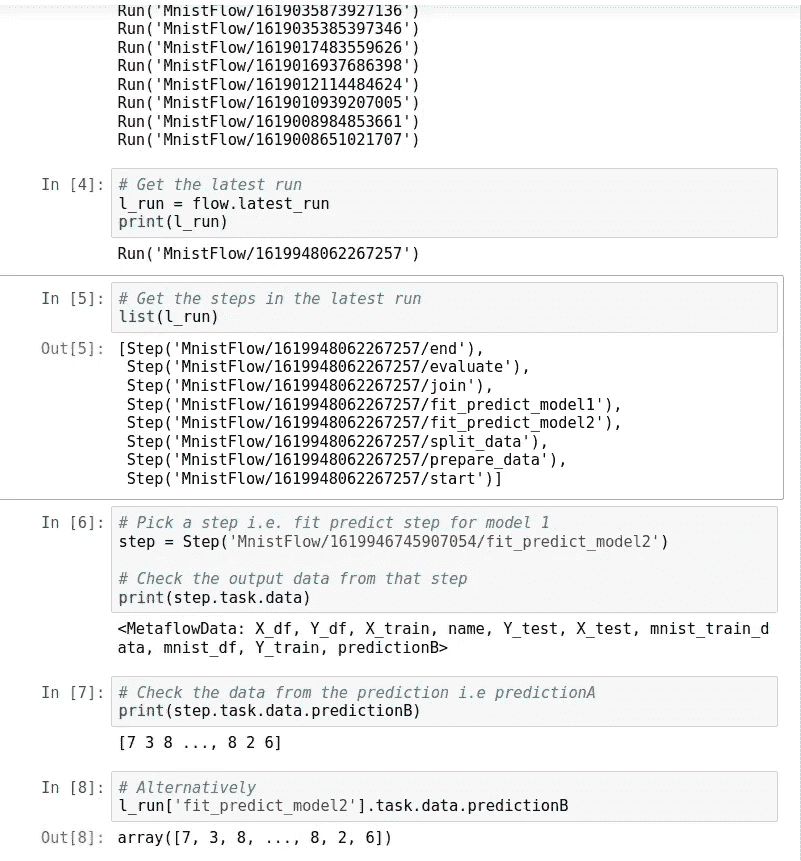

因此，我们介绍了对元流的理解，它的基本组件，一个使用 MNIST 数据集和检查数据流的流执行示例

希望这是有益的。一定要分享。

干杯