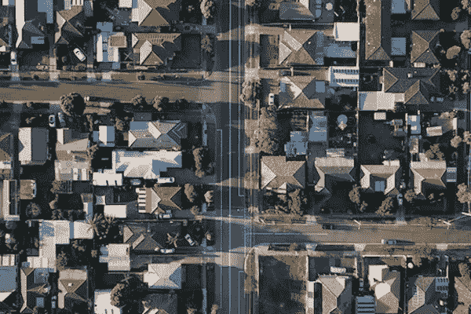

# 创业公司 Divvy Homes 获得 20 亿美元估值

> 原文：<https://medium.com/geekculture/startup-divvy-homes-gets-2-billion-valuation-c80a7a37ee7b?source=collection_archive---------28----------------------->

Photo by [Tom Rumble](https://unsplash.com/@tomrumble?utm_source=unsplash&utm_medium=referral&utm_content=creditCopyText) on [Unsplash](https://unsplash.com/s/photos/neighborhood?utm_source=unsplash&utm_medium=referral&utm_content=creditCopyText)

对于许多千禧一代和美国中产阶级来说，拥有住房已经成为一个遥远的梦想。面对飙升的房地产市场、巨额学生贷款和信用卡债务，住房拥有率已经从 2004 年 70%的峰值下降。全球金融危机后，住房拥有率下降，2016 年达到 63%的低点。住房自有率再次缓慢攀升，但仍徘徊在 65%左右。Divvy Homes 想要解决这个问题。

这家总部位于旧金山的初创公司试图让数百万美国人更容易拥有住房。Divvy 的商业模式包括允许客户选择他们渴望最终拥有的房子，然后在几年内将房子租回给他们。与此同时，客户能够建立资产净值。

## 拥有住房的障碍

对于渴望购买自己住房的美国人来说，有很多进入门槛。一个障碍是获得 30 年期固定抵押贷款的要求大同小异。获得抵押贷款通常需要有良好的信用记录和稳定的收入。数百万美国人无法达到传统抵押贷款承销的标准。

## 租金收入分成

Divvy 通过收取租金收入来创收。在 2020 年期间，Divvy 扩展到 16 个市场。它购买的房屋平均价格在 20 万美元左右。Divvy 的商业模式利用了一个巨大的潜在机会。Divvy 的首席执行官 Adena Hefets 表示:“越来越多的人脱离了传统的抵押贷款框架，越来越多的人努力购买房屋。”

Image credit: [Piqsels](https://www.piqsels.com/en/public-domain-photo-jjaxw)

联合创始人兼首席执行官 Adena Hefets 强调，典型的客户是美国中产阶级，他们被当前市场的传统抵押贷款系统拒之门外。“我们的客户平均在银行有大约 4000 美元的存款，大约有 6 万到 8 万美元的收入，并且通常有大约 635 的 FICO 分数。通常是一对夫妇安定下来，他们有了孩子……他们正在经历这样的生活事件。”

## 从租赁到拥有的艰难历程

Divvy 的模式为客户提供了一条从租房到买房的途径，吸引了投资者的关注。Divvy Homes 最近筹集了 1.1 亿美元的 C 轮融资，由 Tiger Global Management 领投。这家初创公司上次融资 4300 万美元是在 2019 年。

早期，Divvy Homes 吸引了硅谷著名风险投资公司 Andreessen Horowitz 的注意。这家风投公司的合伙人亚历克斯·拉姆佩尔(Alex Rampell)在 2018 年领导了 Divvy Homes 的 1000 万美元 A 轮融资。安德森·霍洛维茨早期投资了一些公司，这些公司后来发展到了令人瞩目的高度，如脸书、比特币基地、Airbnb 和 Twitter。

联合创始人兼首席执行官 Adena Hefets 表示:“对我们来说，服务于那些我认为从获得房屋所有权中受益最多的人和那些最挣扎的人是非常重要的。

## Divvy 开始在三个城市开展业务

Divvy Homes 最初在三个市场推出——孟菲斯、亚特兰大和克利夫兰。他们让这些城市的个人或家庭选择他们最终想要拥有的房子。Divvy 将帮助这些个人或家庭实现他们的目标，有一天拥有他们选择的家园。个人或家庭必须至少支付房屋总价值的 2%作为首期付款。Divvy 然后每月收取一笔金额，包括市场租金和股权支付。该公司的模式是这样设计的，在三年或更短的时间内，Divvy 将能够出售和转让财产给他们。

## Divvy 仔细检查房屋

为了防止未来客户的高额不可预见成本，Divvy 与检查员合作，检查房屋不会有大笔维修费用。检查员寻找潜在的结构和基础问题，虫害控制问题，恶化的屋顶条件，过时的电气系统，以及其他可能给最终房主造成经济负担的问题。

## 评估购买能力的算法

该公司使用[算法](https://theconversation.com/what-is-an-algorithm-how-computers-know-what-to-do-with-data-146665)来确保给定的房产对房屋的最终购买者具有经济意义。如果拖欠租金，Divvy 将评估情况，看看是否可以制定出解决方案。“如果拖欠租金，我们会跟进，看看我们如何能帮助，”联合创始人布莱恩马说。“大多数情况下，它可以立即治愈或在几天内治愈。如果已经超过一周，并且我们认为租户正在经历一些困难，我们将尽最大努力提供替代方案，包括允许他们通过放弃股权付款来降低每月付款，从而纯粹出租房产。如果我们找不到解决问题的方法，我们将经历驱逐程序。”

尽管疫情期间利率下降，但抵押贷款机构收紧了承销审批标准。因此，许多美国人达不到这些严格的标准，无法利用低利率环境购买自己的房子。