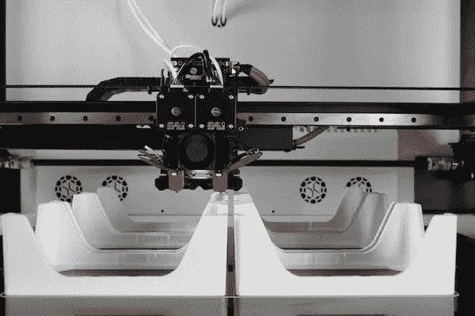
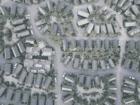

# 建造 3D 打印房屋的初创公司瞄准大规模成功

> 原文：<https://medium.com/geekculture/startups-building-3d-printed-homes-aim-for-large-scale-success-5ac27b7aea00?source=collection_archive---------15----------------------->

Photo by [eMotion Tech](https://unsplash.com/@medias_emotiontech?utm_source=unsplash&utm_medium=referral&utm_content=creditCopyText) on [Unsplash](https://unsplash.com/s/photos/3d-printed?utm_source=unsplash&utm_medium=referral&utm_content=creditCopyText)

德克萨斯州奥斯汀的一个新房地产开发项目计划成为美国最大的 3D 打印房屋开发项目。该社区将拥有 100 栋单层 3D 打印房屋。建设预计在 2022 年完成。

这个雄心勃勃的住宅开发项目由初创公司 Lennar 和 ICON 引领。杰森·巴拉德是 ICON 的联合创始人兼首席执行官。他将奥斯汀项目描述为“社区规模发展历史上的分水岭时刻。”

使用基于混凝土的建筑材料，3D 打印的房屋将在现场“打印”出来。建设将使用先进的机器人方法。3D 打印的房屋将以覆盖太阳能电池的屋顶为特色。根据 Lennar 和 ICON 的说法，每个 3000 平方英尺的房屋大约需要一周的时间来建造。

每个初创公司在 3D 打印房屋合作中都有一个独立的角色。ICON 将构建 3D 打印房屋的主要基础和核心元素。同时，Lennar 将安装屋顶、窗户、门和饰面。

## **3D 打印房屋的好处**

这些房屋的建造效率相对较高。此外，它们的可持续特性和在施工过程中减少浪费的能力极具吸引力。马丁·沃克尔是 T4 比亚克·英格尔斯集团的合伙人。他指出，包括太阳能屋顶等功能的 3D 打印房屋是“减少建筑过程中的浪费，以及使我们的房屋更具弹性、可持续和能源自给自足的重要一步。”

3D 打印房屋的另一个好处是劳动力成本的降低。这些房子结合了减少整体建设时间和相对依赖技术。这意味着 3D 打印房屋建筑不太容易受到劳动力短缺的影响。

Photo by [Patrick Schreiber](https://unsplash.com/@patschrei?utm_source=unsplash&utm_medium=referral&utm_content=creditCopyText) on [Unsplash](https://unsplash.com/s/photos/neighborhood?utm_source=unsplash&utm_medium=referral&utm_content=creditCopyText)

环保倡导者指出，3D 打印机减少了温室气体排放。新加坡的一项研究调查了建筑业的相对二氧化碳排放量。它比较了使用 3D 打印方法和传统建造方法建造浴室单元。该研究发现，3D 打印产生的二氧化碳排放量比传统方法减少了近 86%。此外，3D 打印浴室的建造成本降低了 25%。一个促成因素是 3D 打印机可以在没有模板的情况下建造建筑物。模板是工人注入水泥的混凝土模具。

尽管有好处，一些人对 3D 打印房屋技术持更加谨慎的态度。一些人认为，没有足够的证据表明 3D 打印混凝土房屋在结构上与传统建筑房屋一样安全稳定。

## 美国住房危机的潜在解决方案

3D 打印房屋的大规模成功可以为美国的住房供应短缺提供长期解决方案。“我认为 2022 年将会是我们重新重视创新的一年，”全国住宅建筑商协会首席经济学家罗伯特·迪茨说。"任何生产率的提高，任何创新，都将有助于增加额外的供给."

ICON 首席执行官杰森·巴拉德(Jason Ballard)表示:“建筑规模的 3D 打印不仅可以更快、更经济地交付更高质量的房屋，而且打印机舰队可以改变整个社区的建设方式。“美国面临大约 500 万套新房的缺口，因此迫切需要在不损害质量、美观或可持续性的情况下迅速增加供应，这正是我们技术的优势所在。”

## **超越奥斯丁**

除了广受关注的奥斯汀住宅开发项目，ICON 还有其他项目在进行中。自 2018 年以来，ICON 一直在墨西哥和德克萨斯州使用 3D 打印建造补贴住房。该公司还与美国宇航局合作，从月球尘埃中 3D 打印材料。他们的长期目标是为美国宇航局建造一个月球基地。

两家初创公司都没有公开披露奥斯汀项目的总成本或附近住宅的价格。然而，美国其他地区 3D 打印房屋的价格已经相对可以承受。例如，加州棕榈泉附近的一个 3D 打印房屋开发项目列出了起价约为 59.5 万美元的三居室房屋。3D 打印房屋建筑的速度和可负担性可能对低收入家庭或救灾情况特别有帮助。

下一个测试将是确定像 ICON 和 Lennar 这样的 3D 打印房屋初创公司是否可以在其他社区复制他们的成功。如果这些努力可以大规模复制，3D 打印房屋可能会证明对社会和环境非常有益。