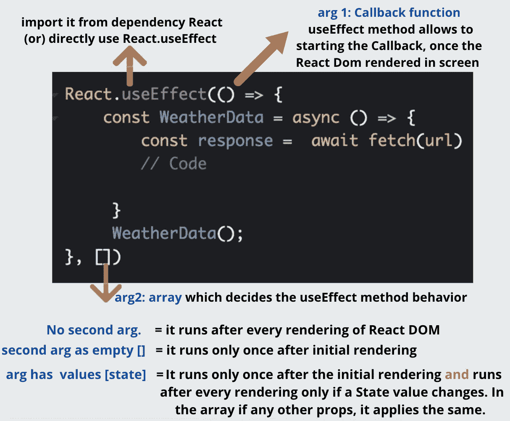
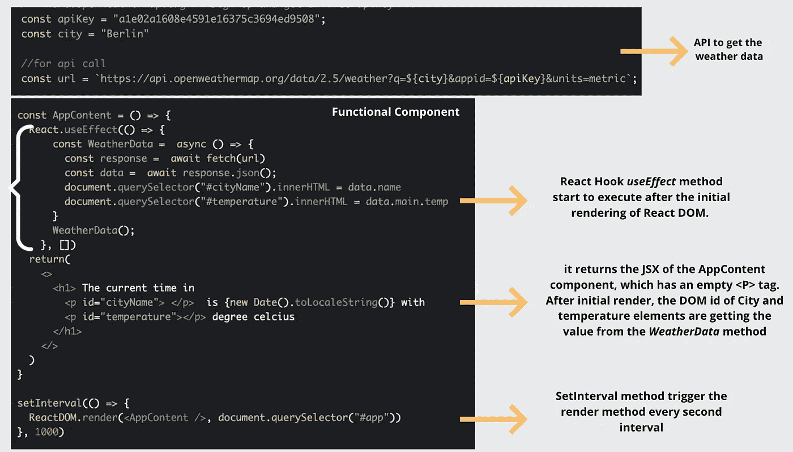
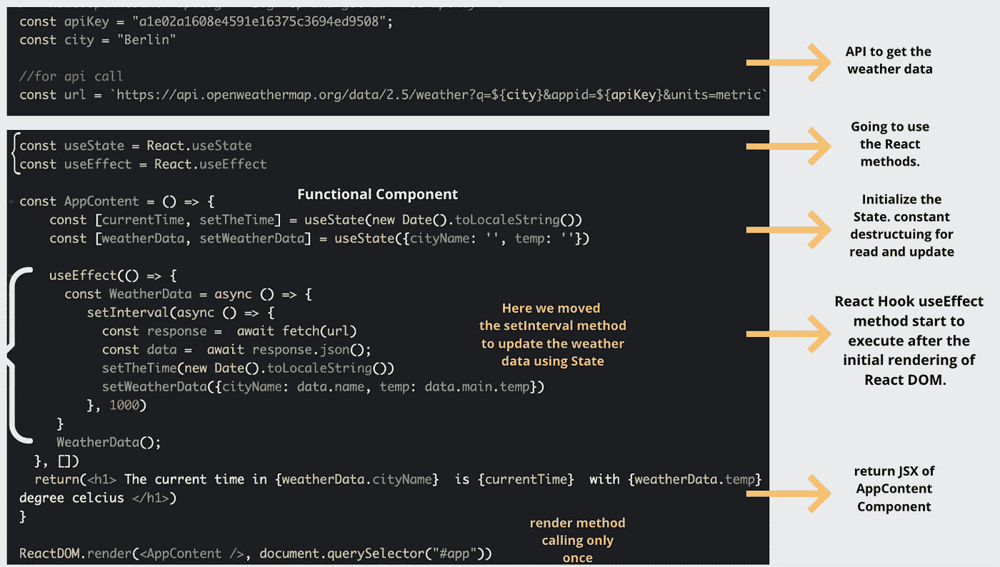

# 反应中的状态

> 原文：<https://medium.com/geekculture/state-in-react-b228c8c47a7d?source=collection_archive---------17----------------------->

**Table of Contents**

状态是您存储属于组件的属性值的地方。更改状态将自动调用 React DOM 的 render 方法，并**重新呈现**组件。状态相当于道具，道具可以跨组件使用，但它具体到组件。

下图显示了状态初始化以及如何读取和更新状态值。

**Syntax of useState**

## **什么时候需要反应钩**？

让我们来看一下 ***useEffect*** 函数，因为在我们的例子中我们不打算使用类组件，我们将使用一个无状态的功能组件，为了使它有状态，使用 React hook 方法 ***useEffect*** 。该方法在内部调用 React 生命周期方法***componentDIDMount***使其有状态。

在我们后面的故事中，我们将经历 React 生命周期方法，然后使用类组件转换同一个示例。

**Syntax of useEffect**

该图像提供了关于方法 ***使用效果*** 的信息。阅读提到的 **arg1** 和 **arg2** 细节。

现在看看这里的例子，我们知道 ***useEffect*** 方法只有在 React DOM 的初始渲染之后才开始执行，这意味着组件的基本 JSX 被渲染。

在 ***useEffect*** 中，一个异步方法作为 ***WeatherData*** 调用一个 API 来获取当前天气，然后它将数据放在已经渲染的 React DOM 中需要的地方。让我们看一个使用和不使用状态的例子。

## **无使用状态** [**码笔**](https://codepen.io/071eE211/pen/zYNbZEM)

问题陈述是以城市名称的形式提供输入，以获得城市的当前时间和温度。

**API 信息** [注册](http://home.openweathermap.org)，从[这里](https://home.openweathermap.org/api_keys)获得你的免费 API 密匙

在下面的示例中，render 方法在一秒钟的时间间隔内被调用，以呈现 ***AppContent*** 组件。一旦开始渲染，React Hook 的 ***useEffect*** 方法被调用，React Hook 又调用 ***WeatherData*** 回调来触发天气 API 以获取实时数据。最后，数据提供了城市名称，温度应该放在 React DOM 中。

**Without Using State**

## 使用状态[码笔](https://codepen.io/071eE211/pen/dyvoZRQ)

在前面的例子中，我们看到 render 方法以一秒的时间间隔被调用。让我们看看这里使用状态来避免这种调用。

在下面的例子中，render 方法只被调用一次来呈现 ***AppContent*** 组件，在此期间，与状态相关的信息以默认数据呈现。

**Using State**

一旦开始渲染，React Hook 的 ***useEffect*** 方法被调用，该方法又调用 ***WeatherData*** 回调来触发天气 API 以获取实时数据。此外，我们将 setInterval 时间移到了***weather data****方法*中，该方法每隔一秒触发一次 API 调用，用 API 响应数据更新状态。正如我们已经知道的，只要状态改变，组件就会被重新呈现。

**Output**

希望它能给出 React 中 ***状态的基本视图&使用 React 钩子*** 中的 Effect 方法。如有疑问或修改，请写下您的问题。

让我们在下一个故事中讨论 ReactJS 的下一个特性。
下一个话题**:**[**React 组件的生命周期**](/geekculture/lifecycle-of-react-component-cc5a3033635d)