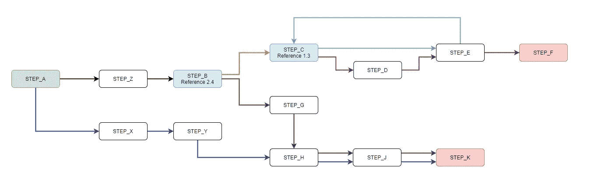
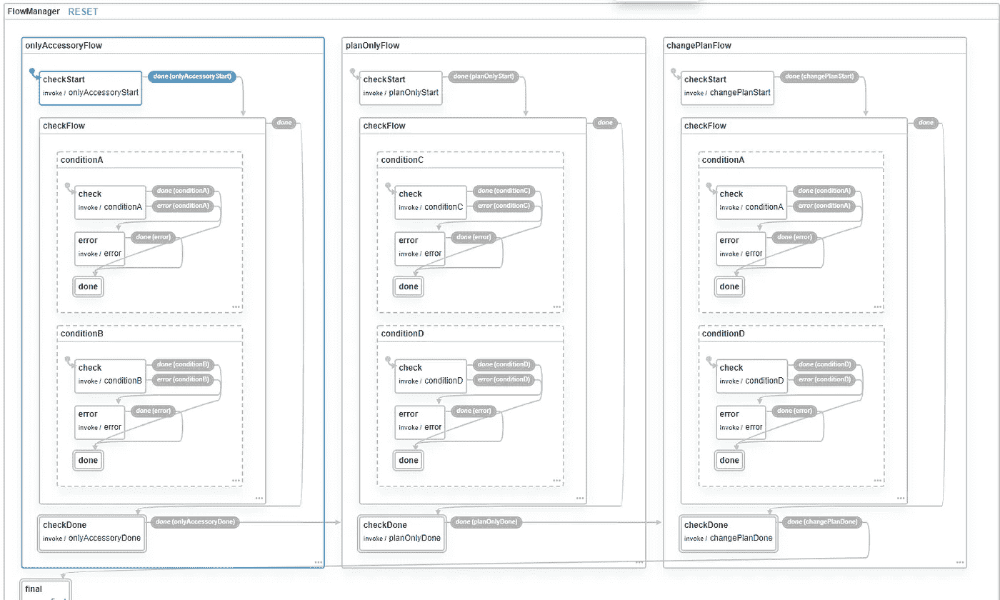
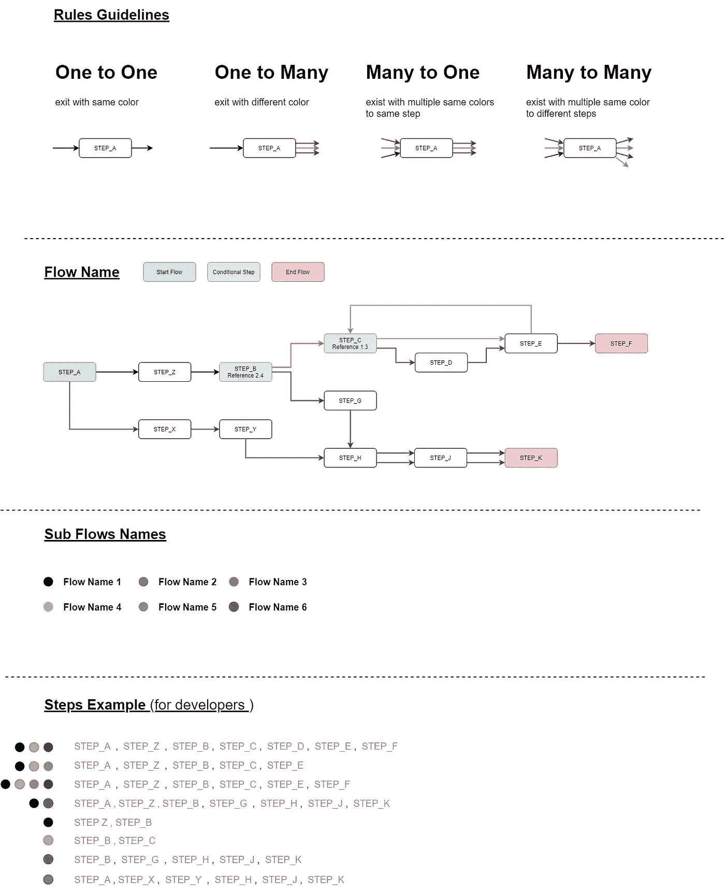

# 作为 Redux 中间件的状态机

> 原文：<https://medium.com/geekculture/state-machine-as-redux-middleware-8dda979b7944?source=collection_archive---------10----------------------->

如今，Web 应用程序变得越来越复杂，客户对创建复杂流程的需求不断增加，以改善他们的业务和客户的用户体验。

当产品负责人设计一个流程时，他可能会从一个简单的图表开始，这个图表会有一个起点和终点，他会说明当从步骤 A 转到步骤 b 时什么条件适用。

当开发人员实现流程时，他需要考虑将正确的逻辑放在哪里以满足需求，当客户端单击按钮 A 时，他将从页面 A 重定向到页面 B，或者从场景 A 重定向到场景 B——这对于一个简单的流程来说是很好的，但今天不是这样。

今天的流程很复杂，一个流程可以发展成许多流程，用户不知道也不关心流程是如何管理的，但对于开发人员来说这很重要，因为作为开发人员，我们需要知道如何以我们能够维护它的方式处理流程，例如，产品负责人请求更改流程中的步骤或更改现有流程的业务逻辑，速度有多快？或者我们能有多容易满足这样的要求？

在这篇文章中，你将会看到在你的应用程序中管理你的流程的最佳方式，如何在产品所有者、客户和开发者之间创造和谐，并迫使他们使用同一种语言。

## 基础

在介绍中，我们谈到了从步骤 A 到步骤 B，事实上每一个流程都有起点和终点，这让你想起了什么？如果不是，我会提醒你，这听起来像在谈论国家机器。

> 一个**有限状态机** ( **FSM** )或**有限状态自动机** ( **FSA** ，复数:*自动机*)，**有限自动机**，或简称为**状态机**，是计算的数学[模型。它是一个](https://en.wikipedia.org/wiki/Model_of_computation)[抽象机器](https://en.wikipedia.org/wiki/Abstract_machine)，在任何给定的时间，它可以处于有限个 [*状态*](https://en.wikipedia.org/wiki/State_(computer_science)) 中的一个状态。
> 
> [https://en.wikipedia.org/wiki/Finite-state_machine](https://en.wikipedia.org/wiki/Finite-state_machine)

当考虑一个我们可以用来处理 UI 上复杂流程的模型时，这是第一件事。

当我们计划我们的 Web 应用程序时，我们需要为我们的最终用户考虑所有可能的场景，我们不想要一个死胡同，事实上，我们需要每一步都根据我们的业务逻辑将用户带到下一步。

我们的解决方案基于一个管理状态机的开源库，x state——你可以在这里阅读更多:[https://github.com/davidkpiano/xstate](https://github.com/davidkpiano/xstate)

## 我们有一个管理状态机的库，现在呢？

由于我们正在使用现代技术来开发我们的 web 应用程序，我们需要通过增强它来创建这个库之间的集成层，并将其连接到我们的技术，在这篇文章中，我将谈论我们开发的将这个库连接到我们基于 Redux 的应用程序的开源，一般来说，这个状态机将在我们的 Redux Store 中管理，你认为呢？开始把事情联系起来？我们继续。

# Redux 流量管理器

我们的开源处理管理复杂(或简单)的流程，它将我们的流程、我们的步骤及其条件转换为状态机，通过这种方法，我们将能够知道每一步，下一步是什么，用户所在的业务场景是什么，以及流程是什么——这将使开发人员能够只关注业务逻辑，而不处理转换或显示或不显示什么，我应该在哪里为用户放置重定向，在哪里不放置重定向。

 [## 冗余流管理器

### 流程管理器帮助您管理流程信息细节和步骤(例如显示流程中的下一步)，用于…

www.npmjs.com](https://www.npmjs.com/package/redux-flow-manager) 

你应该如何使用它？

**步骤 1:** 向您的项目添加流管理器缩减器。

**步骤 2:** 创建步骤配置文件——步骤配置定义每个子流程类型的步骤集合。

步骤配置为每个流和子流定义用户需要在应用程序中完成的一组步骤。

步骤对象属性:

*   `key: flowType`(例如:`COP` ) -该键代表`flowType`
*   `key: subFlowType`(例如:`planOnlyFlow`)——代表`subFlowType`
*   `steps: array` -该`flowType`和`subFlowType`的一组步骤

对象中子流对象的顺序很重要，因为计算将按该顺序运行。例如:如果在`planOnlyFlow,changePlanFlow`之前定义`planOnlyFlow`，那么`planOnlyFlow`将总是在`planOnlyFlow,changePlanFlow`之前设置。

**步骤 3:** 创建流配置文件——流配置文件定义子流类型名称和使子流有效应满足的条件。

Flows Config 是一个对象数组，每个对象定义了可能存在于整个应用程序中的子流。每个流对象都有条件数组，每个条件都用回调函数定义。回调可以检查任何与条件相关的东西，如果你检查的条件被满足，那么它将返回 resolve，如果条件失败，那么它将返回 reject。

如果一个子流的所有条件都通过，那么这个子流被添加到 subFlowTypes 数组中。

流动对象属性:

*   `flowName: string`-**接头**流量类型的唯一名称
*   `runInFlowTypes: array<string>` -定义这组条件将运行的主要流类型列表
*   `conditions: array<condition>` -条件对象数组
*   `conditionName: string` -条件的名称
*   `onCheck: function` -一个`promise`函数，当条件成功时返回`resolve`，如果条件失败则返回`reject`
*   `mandatory: boolean` -可选属性。定义如果该条件失败，是否从数组中删除子流。默认情况下为 true。

每个条件函数得到以下道具:

*   `state` -商店中的当前状态。
*   `context` -状态机中的当前上下文。
*   `event` -调用该条件状态机事件

**注意**流对象在数组中的顺序很重要。计算将按该顺序运行。

**步骤 4:** 调用`CreateFlowManagerAPI`你的商店，减速器切片名称，流程配置和步骤配置。

**步骤 5:** `CreateFlowManagerAPI`返回流管理器的实例，其功能将帮助您管理应用程序中的流。

你能想到下一步会是什么吗？欢迎在评论中回答。

Photo by [Tatiana Rodriguez](https://unsplash.com/@tata186?utm_source=medium&utm_medium=referral) on [Unsplash](https://unsplash.com?utm_source=medium&utm_medium=referral)

## 模拟状态机

使用 XState，您可以检查您的配置，模拟条件以查看流程是否完全按照您的计划定义。

通过调用流管理器实例的 getMachineFlowConfig()，它将返回一个可以在 XState visualizer 中设置的 XState 配置，以查看由您的配置创建的状态机。

你可以在这里自己试试:[https://xstate.js.org/viz/](https://xstate.js.org/viz/)

Photo by [Leon](https://unsplash.com/@myleon?utm_source=medium&utm_medium=referral) on [Unsplash](https://unsplash.com?utm_source=medium&utm_medium=referral)

## 说着同样的语言

在产品所有者、开发人员和客户之间创建一种语言的想法是为了减少请求变更(客户)、计划变更(产品所有者)和实施变更(开发人员)的工作量。

让我们看看我们应该如何定义一个具有演进流程的系统，我们如何定义步骤，以及我们如何定义条件。通过设计如下的系统，它将确保实现将只关注于业务逻辑。

## 重新使用

您可能已经注意到，流程之间共享步骤，这同样适用于条件，例如，isUserLoggedIn 可以是一个将在多个地方使用的条件，因此一旦我们更改此条件，它将影响所有其他条件，同样，我们希望减少工作量，我们希望节省时间，这将使我们能够快速进入市场。

想了解如何在您的项目中利用这一特性吗？随时联系。

# 包扎

本文将向您介绍管理 web 应用程序复杂或简单流程的正确方法，从而为您的应用程序提供最佳架构。

# 我是谁？

我是阿提亚的**，一名网页开发者，专注于设计和建筑。**目前**在 Amdocs 担任软件架构师。**

# 贡献的

特别感谢我的同事 [Refael Oknin](https://www.linkedin.com/in/refael-oknin-a43773143/) ，在过去的两年里，Refael 和我一起开发开源库。

Redux Flow Manager 特性是我们开发的 harmony-boilerplate 的一部分。

想了解更多关于和声的知识？阅读下面的[文章](https://ofirattia.medium.com/master-your-next-web-application-3df95dde2976)。