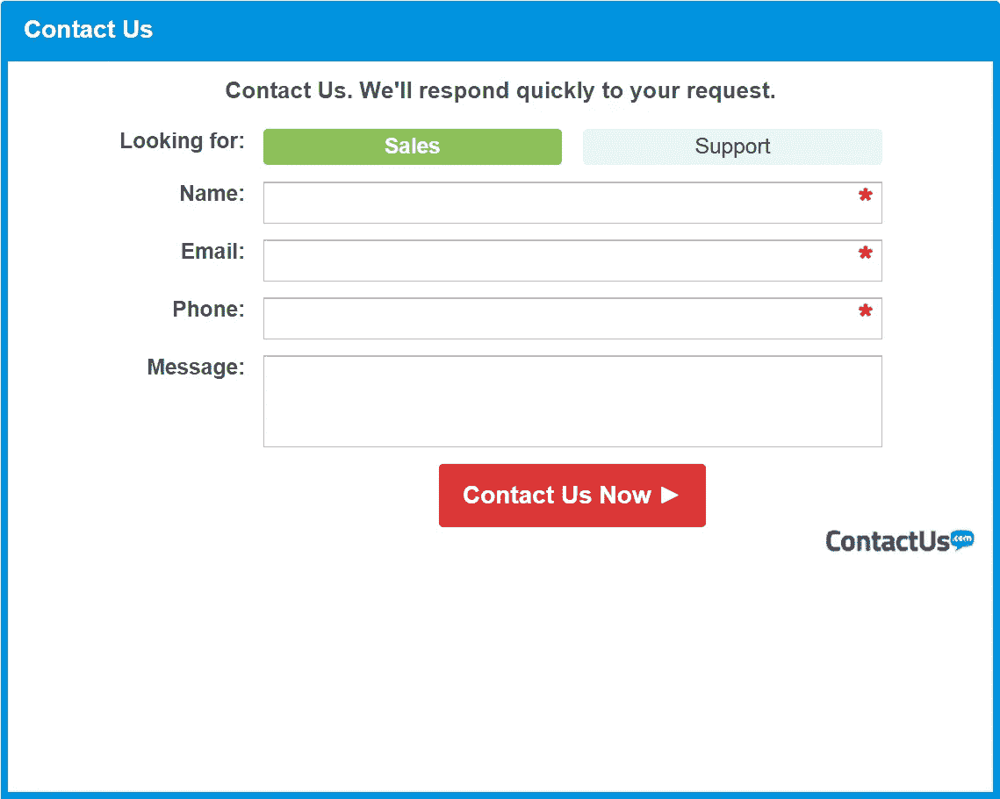

# 静态 HTML 表单—如何获取数据？

> 原文：<https://medium.com/geekculture/static-html-form-how-can-i-get-data-b5c6e4c9590f?source=collection_archive---------55----------------------->



我被要求构建一个简单的 HTML 联系表单，构建一个表单是一件容易的事情。有很多可用的模板，我想，好吧，我可以做到这一点。

我们每天在网上填写那么多不同的表格，却很少去思考它是如何运作的。作为一名开发人员，我需要考虑数据，表单中的数据如何到达网站所有者那里。

通常，表单会将数据存储在数据库中，然后网站所有者可以访问和操作存储的数据。在这种情况下，没有网站，HTML 表单将是该站点的唯一页面，至少目前是这样。所以我开始考虑向网站所有者发送数据的选项。

## Mailto 选项

我遇到的第一个选项是使用`mailto`作为表单动作，它将获得表单数据，但它并不真正发送电子邮件。相反，它会打开用户计算机上的默认电子邮件客户端，并提示用户向指定的电子邮件地址发送电子邮件。

```
<form action="mailto:contact@site.com"
method="POST"
name="ContactForm">
```

虽然这个选项可以很好地工作，但它不仅不能真正发送电子邮件，还会显示用户的电子邮件地址，使用户容易受到恶意活动的攻击。此外，这个选项并不是 100%兼容所有的浏览器。

## 选项 2 — PHP

在 Bootcamp 的时候，我学习了 HTML，我从以前的工作中学到了一些 PHP 知识，尽管我没有正式地学习它。我决定考虑这个选择。

我的页面将不得不从 HTML 改为 PHP，表单动作将明显改变。

```
<form action="contact.php"
method="POST"
name="ContactForm">
```

`contact.php`将是发送的部分，使用类似下面的代码。

```
<?php
if($_POST["Message"]) {
mail("contact@site.com", "Contact Form",
$_POST["Contact Information"]. "From: user@myemail.com");
}
?>
```

但问题是，它需要一个后端。PHP 邮件程序使用简单邮件传输协议(SMTP)发送邮件。这意味着网站需要设置服务器和配置 SMTP。所以，我将转到我找到的下一个选项。

## 谢谢你，谷歌

在我做研究的时候，我发现了一个非常详细的分步指南，告诉我如何使用 Gmail 账户、Google Sheets 和一个简单的 HTML 表单来发送电子邮件。这个方法我就不描述了，因为这里解释的很详细——[https://github . com/dwyl/learn-to-send-email-via-Google-script-html-no-server/blob/master/readme . MD](https://github.com/dwyl/learn-to-send-email-via-google-script-html-no-server/blob/master/README.md)。

但它的美妙之处在于，您不仅可以在收件箱中获得表单提交结果，还可以获得存储在 Google Sheet 中的所有数据，因此您可以随时轻松访问这些数据。

感谢这个精彩教程的创作者！

请在以下社交网络上查看我，我很乐意收到您的来信！——[*LinkedIn*](https://www.linkedin.com/in/nick-solonyy/)*，* [*GitHub*](https://github.com/nicksolony) ， [*脸书*](https://www.facebook.com/nick.solony) *。*