# 统计学是发掘现代数据科学的古老工具

> 原文：<https://medium.com/geekculture/statistics-an-ancient-tool-to-unearth-the-present-day-data-science-9468fe658402?source=collection_archive---------63----------------------->


***Image by “***[***Freepik***](https://www.freepik.com/free-vector/excavation-tools-set-cartoon-illustration_7058910.htm#page=2&query=archaeology&position=17)***”***

我们正在见证一个融合的时代，计算机系统正在广泛可用的数据之上接受教育。统计是帮助这些系统发现洞察力的一个领域。

这是乔治·爱德华·博克斯引用的一句话:

> "统计学是关于科学方法本身的催化作用."

这意味着，对于任何科学领域来说，统计学都是至关重要的。这个博客致力于挖掘和解释数据科学中主要使用的一些统计技术的潜在细节。

此外，将从头实现它们，并将自己编写的函数的结果与其他开源库(如 MatplotLib、Seaborn 等)进行比较。

# 顶层视图

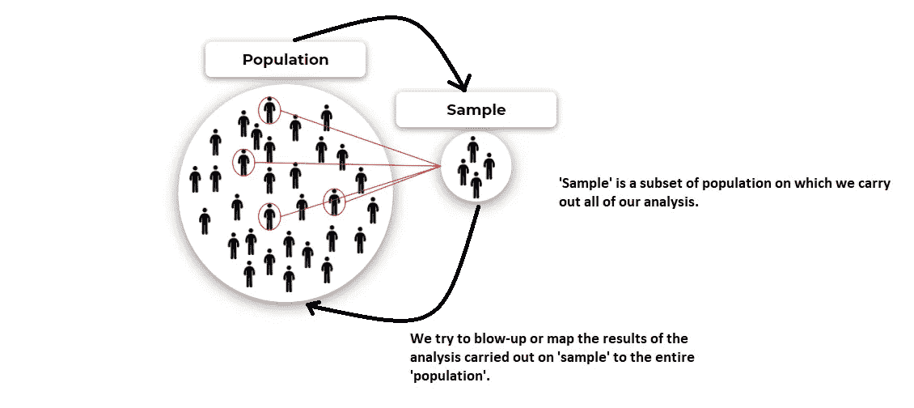

**2-Way relationship b/w Population and Sample**

**人口**:这个术语代表感兴趣的人群。

例如，假设你是一家饮料公司的产品制造商负责人，想知道印度有多少人喜欢“果冻胜过蛋糕”来增加利润。**在这里，你感兴趣的人群是整个印度的人口**，也表示为‘N’。

**样本**:这个术语代表被认为是真实形象的人群子集。

让我们继续上面的例子，而不是你从人群中随机选择的 n 个人(比如 1000 人)。所以，这里的 k 代表样本，这里的‘n’<< ‘N’.

## Here, a question arises why we use Sample?

*   To speed up the analysis
*   Cost-effective
*   Speed up the decision making

Imagine if you been asked to reach out to every person in India to ask whether he/she like jelly or cake then such a survey would take a huge effort and time to get completed. **我们需要确定的一点是，样本必须是真实的图像或代表总体。**

与上面的例子相比，假设在样本中，你主要调查了老年人，那么这样的样本不会是人口的真实图像，并且对这样的子集进行的分析不会提供准确或接近准确的结果。理想情况下，样本应该由所有年龄组、性别、种族等的人组成。

## 什么是“总体参数”和“样本统计”？

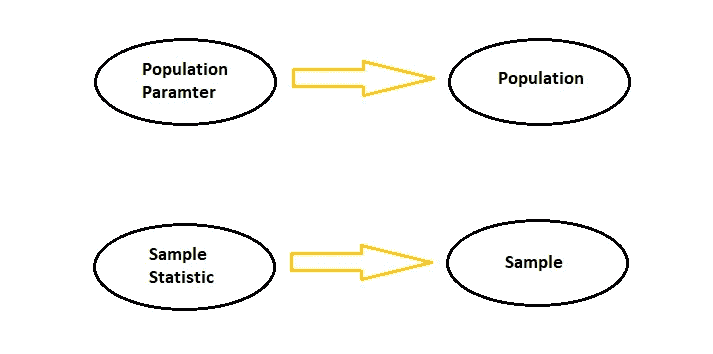

**Numerical Descriptor terms of Population & Sample**

**人口参数**:人口特征的数值描述。

例如，世界上所有女性的平均身高是 5 英尺 5 英寸。这里，人口特征是“所有女性的身高”，数字描述符是平均身高，即 5 英尺 5 英寸。

**样本统计**:表示样本特征的数值描述。

例如，100 名逛附近商店的女性中，45%不喜欢巧克力蛋糕。这里，样本特征是“不喜欢巧克力蛋糕”，数值描述符是 45%。

# 统计学的分支

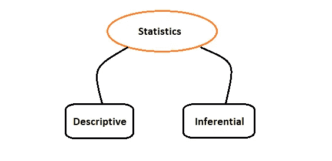

**描述性统计**负责下述要点:

*   涉及汇总或描述数据的过程。
*   进行统计分析，例如发现数据中的中心趋势。
*   涉及广泛的数据探索，可视化技术，以找到隐藏的趋势和模式。

**负责下述要点的推断统计**:

*   使用描述性统计，我们绘制对样本进行的统计分析，以得出总体参数的最佳估计。
*   进行各种测试，以对照既定标准验证样本统计数据。

# 如何生成频率直方图、相对频率直方图、累积频率直方图和概率密度？

假设我们有一个下面的分数列表，由 50 名学生中的 14 名学生打分:

[11,11,12,13,14,11,16,17,18,20,30,40,45,50]

现在，在描述性统计中，我们可能试图找到以下问题的答案:

Q1。有多少学生考了 11 分？

Q2。有多少学生的分数低于最低及格分数，比如 20 分？

Q3。有多少百分比的学生得分超过 20 分？

Q4。有多少百分比的学生得了 20 分、30 分或 40 分？

Q5。我们如何可视化学生的整体成绩？

在上面的小数据中，很容易手动找到答案，但如果我们有一个大的数据集，那么我们绘制一个条形图，直方图，或相对频率直方图，或累积频率直方图将使我们的生活非常容易。所以，让我们一步一步来解决这个问题:

**第一步:根据数据生成频数分布表**

频率分布表包含数据集值在指定的封闭范围(称为类)内出现的频率或次数。

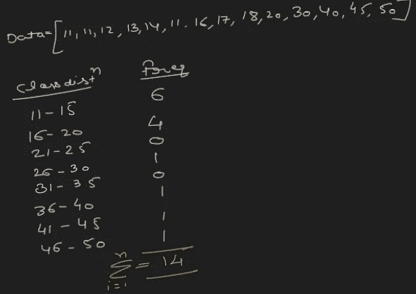

**Frequency distribution table**

这里，将数据集随机划分为固定的类宽度，即 5，因此我们最终得到 8 个类。例如，11-15 岁为 1 级，16-20 岁为 2 级，以此类推，直到 46-50 岁为 8 级。

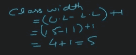

**Class width Formula**

并且，类宽=(上限值—下限值)+ 1。例如，在类别 1 中，上限值是 15，下限值是 11。

**步骤 2:计算类边界**

绘制直方图需要类别边界，直方图使用以下公式计算:

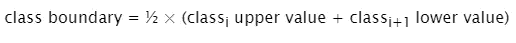

**How class boundary is calculated?**

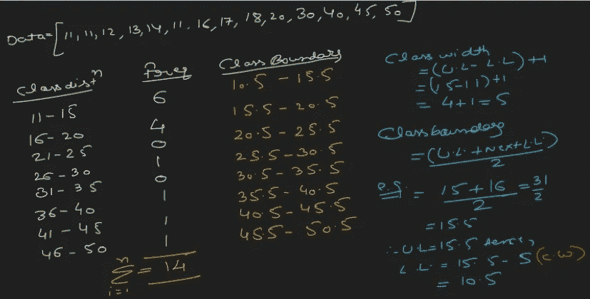

**Frequency distribution table with class boundaries**

**Function reporting class, relative freq’s, and prob density in a distribution table**

上面 plot_hist()函数的输出:

```
hist_data_results, bins_intervals, bins_prob_density = plot_hist(hist_data,number_of_bins=10)hist_data_results
```

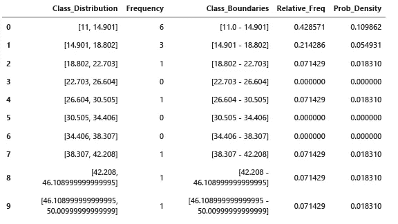

**Class frequency distribution table**

在这里，您可以看到数据集分为固定宽度(通常是相同的，但也可能因类而异)的类。每个类都具有位于该特定类中的值的计数。

例如，在[11–15]之间，我们有 11，11，12，13，14，11，因此“类[11–14.901]”的“频率”是 6。

在上面的函数中，我们还计算了每个类别的**相对频率**和**概率密度**，我们现在将尝试计算它们。

**步骤 3:计算相对频率**

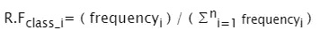

**Relative Frequency formula**

因此，对于 class-1[11–14.901]是 6/(6+3+1+0+1+0+1+1)= 0.428

**步骤 4:计算概率密度**

对于概率密度，我们需要两样东西:

*   **仓或区间数**(表示为 **n_h**

有各种方法可以找到 n_h:

1.  sqrt(n)
2.  对数 2(n)
3.  2n^(1/3)

这里，n 是数据集中的记录数。

*   **仓宽**(用 **h** 表示)

h =(最大值-最小值)/ n_h

例如，在上面使用的数据集中，最小值和最大值是(11，50)并且 n_h = 10。因此，h =(50–11)/10 = 3.9

现在，

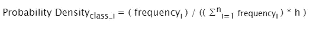

**How Probability Density gets calculated?**

因此，对于 1 级概率密度是(6 / ((14) * 3.9) = 0.1986

下面是一些逐图比较:

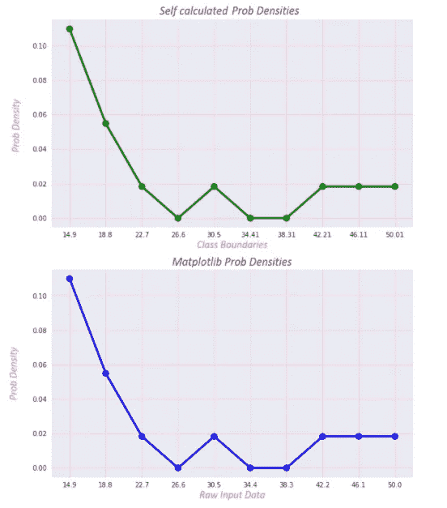

**Comparison b/w self-written function and MatplotLib generated prob densities**

**累计频率**

*   它是一个类的频率的总和&所有以前的类。

```
def cum_sum(inp_data):
    """
    Description: This function calculates the cumulative sum.
    """
    cum_sum = []
    cum_sum.append(inp_data[0])
    for i in range(1,len(inp_data)):
        cum_sum.append(cum_sum[i-1]+inp_data[i])
    return cum_sum## Self calculated cumulative relative frequencies
hist_data_results['Cum_Rel_Freq'] = cum_sum(hist_data_results['Relative_Freq'])hist_data_results['Cum_Rel_Freq']
```

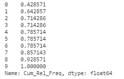

**Class wise Cumulative Frequencies**

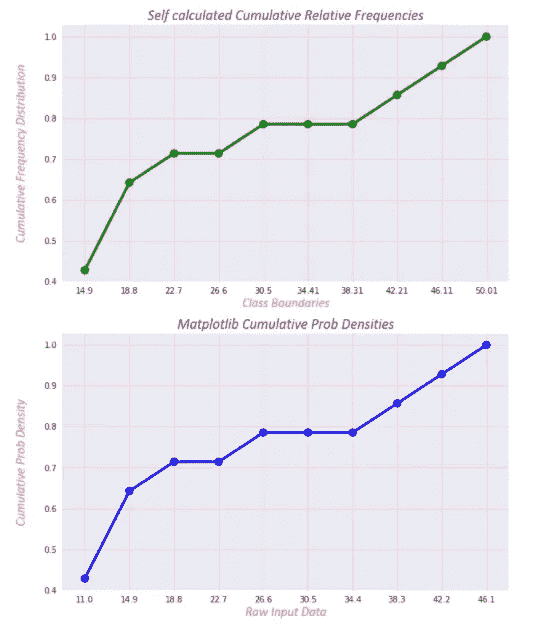

**Comparison b/w self-written function and MatplotLib generated cumulative relative freqs**

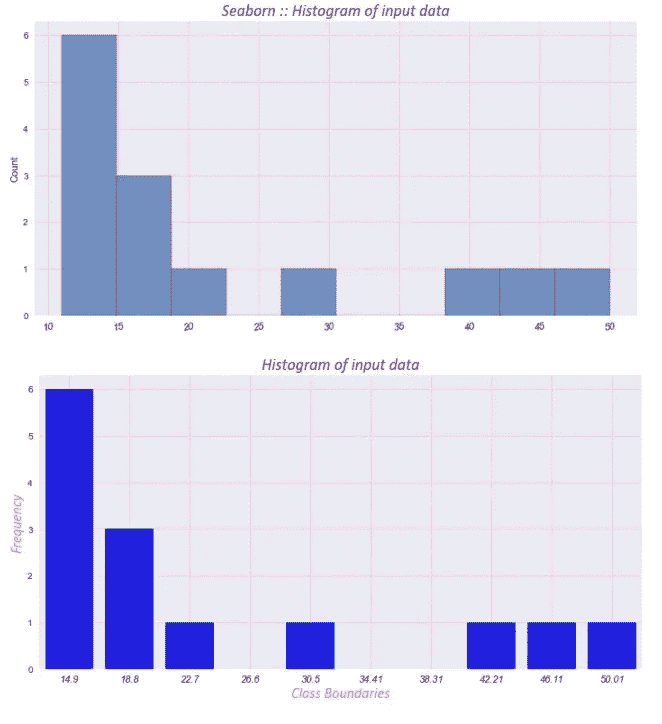

**Seaborn and self-generated plots**

这里唯一的区别是，我在 plot_hist()中使用了 bar_plot()来比较图形。

**如何使用核密度估计器(KDE)生成概率分布函数？**

我们可以平滑直方图以创建概率分布，实现的方法之一是 KDE。在 KDE，为每个数据点创建一个高斯核，将重叠的核组合在一起或相加以创建整体 PDF。

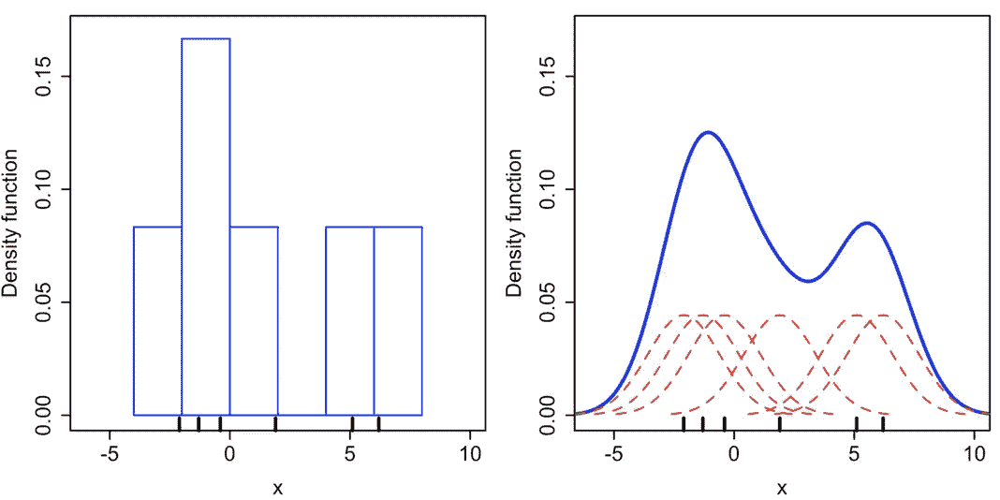

**Courtesy:** [**Wikipedia**](https://en.wikipedia.org/wiki/Kernel_density_estimation)

上图显示了使用相同数据构建的直方图(左)和核密度估计(右)的比较。六个单独的高斯核是红色虚线，核密度估计蓝色曲线。数据点是水平轴上的地毯图。

让我们试着实现它:

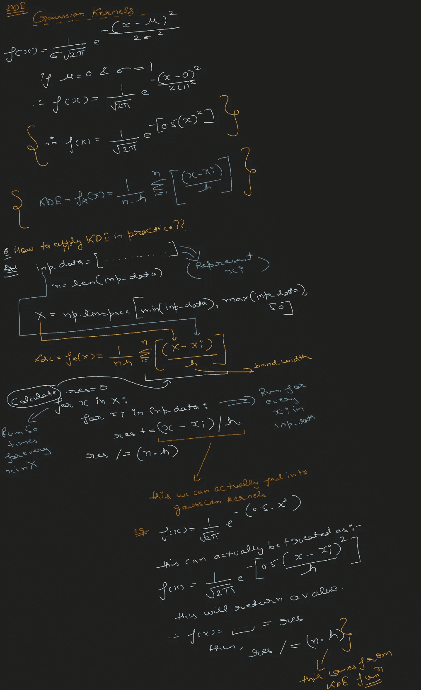

**KDE with Gaussian Kernels**

## **离散变量:概率质量函数**

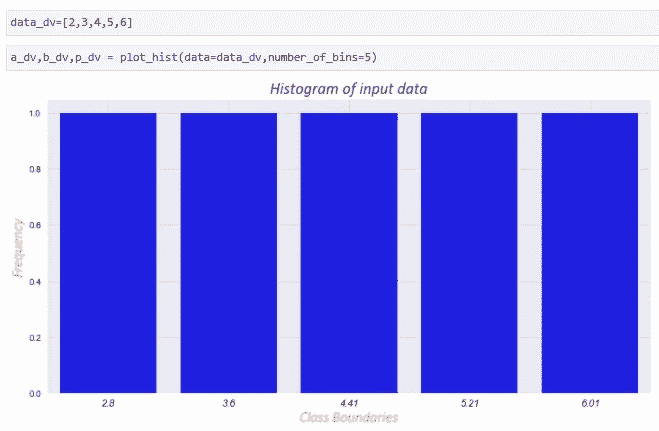

**Discrete variable plot**

**PMF 比较**

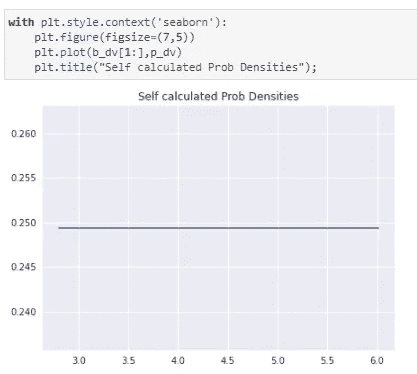

**Self-written function results**

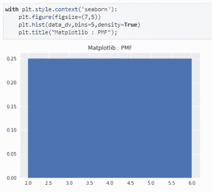

**MatplotLib generated PMF**

这里，我们得到了等概率图。

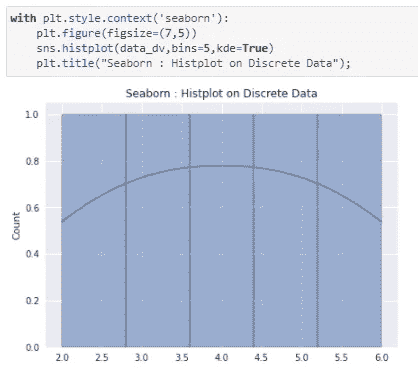

**Seaborn generated KDE plot**

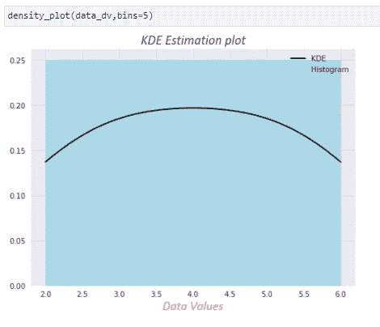

**Self-generated KDE plot**

## 连续随机变量(高斯):PDF

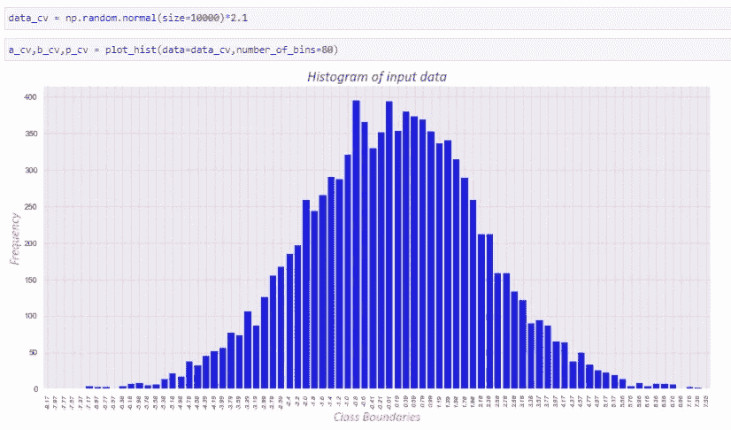

**Histogram of continuous variable**

**PDF 比较**

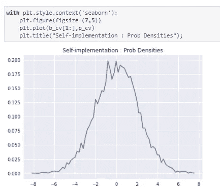

**Probability Densities: Self-implementation**

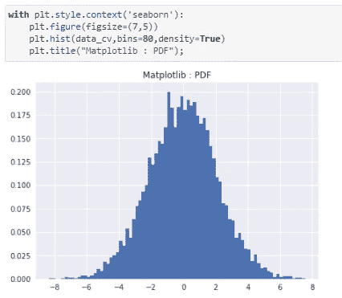

**MatplotLib generated PDF**

**KDE 比较**

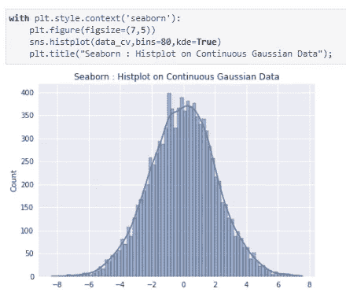

**Seaborn generated KDE**

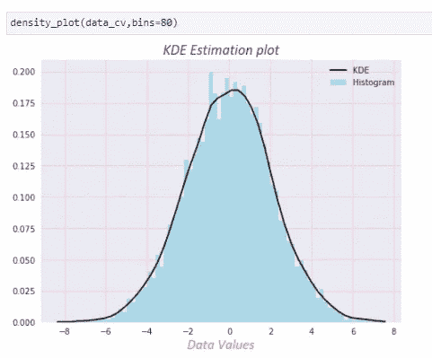

**KDE: Self-implementation**

上面的图显示了正常的钟形曲线。

## 较低或较高的带宽值对 KDE 的影响？

案例一:h 值较小的 KDE

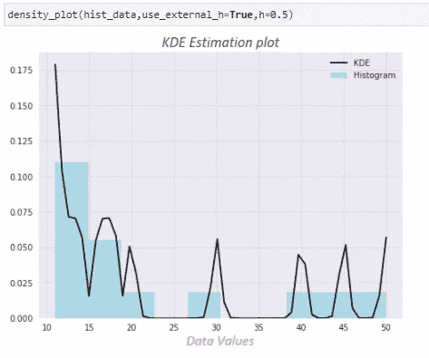

**Squiggly KDE plot with h=0.5**

案例二:h 值较高的 KDE

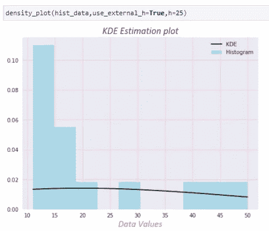

**Falt KDE plot with h=25**

较大的 h 值给出平坦的 KDE 图。

万岁，你已经到了这篇博客的结尾，我希望你会喜欢它。别忘了拍几下。

