# 统计—描述性统计简介

> 原文：<https://medium.com/geekculture/statistics-descriptive-statistics-introduction-16f083b362a1?source=collection_archive---------16----------------------->

# 数据类型

有两种类型的数据:—

1.  分类数据
2.  数据

*分类数据:——*

*   它代表组或类别。
*   例如:汽车品牌，是/否问题的答案。

*数值数据:——*

*   数字数据代表数字。
*   它分为两组:离散的和连续的。
*   离散的数据通常可以在有限的物质中计数，而连续的是无限的，不可能计数。
*   离散的例子:你想要的孩子的数量。
*   连续的例子:体重，身高。

# 测量级别

测量级别分为两种类型:—

1.  测量的定性水平。
2.  定量测量水平。

*测量的定性水平:——*

*   有两个定性的层次:名义的和序数的。
*   名词性层次代表不能按任何顺序排列的类别，而序数层次代表可以排序的类别。
*   名词性的例子:四季(冬、春、夏、秋)。
*   序数的例子:评价你的饭菜(恶心、倒胃口、中性、可口、美味)。

*定量测量水平:——*

*   有两个量化的层次:区间和比率。
*   它们都代表“数字”，然而，比率有一个真正的零，而区间没有。
*   区间的例子:摄氏度和华氏温度。
*   比率的例子:开尔文，长度。

# 表示分类变量的图形和表格

*   *频率分布表:——*显示类别及其对应的绝对频率。

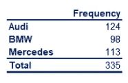

*   *条形图:——*条形图很常见。每个条形代表一个类别。在 y 轴上，我们有绝对频率。

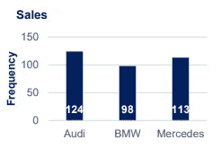

*   *饼状图:——*当我们想要查看某个项目占总项目的份额时，可以使用饼状图。市场份额几乎总是用饼图来表示。

*   *帕累托图:—* 这是一种特殊类型的条形图，其中类别按频率降序显示，单独的曲线显示累计频率。

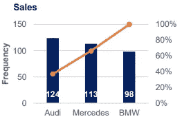

# 数字变量

*频率分布表:——*

数字变量的频率分布表不同于分类变量的频率分布表。通常，如果长度相等或不等，它们被划分为区间。该表显示了间隔、绝对频率，有时包括相对和累积频率也是有用的。

使用以下公式计算间隔宽度:—

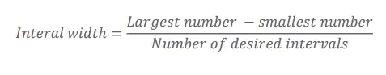

*直方图:——*

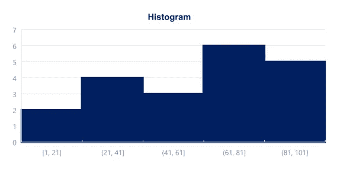

直方图是表示数字数据的最常见方式之一。每个条形的宽度等于间隔的宽度。当音程之间有延续时，这些小节相互接触:一个结束->另一个开始。

# 变量之间关系的图表

*交叉表:——*交叉表(或列联表)用于表示分类变量。一组类别标记行，另一组标记列。然后，我们在表格中填入适用的数据。计算总数是个好主意。有时，这些表格是用如下表所示的*相对频率*构建的。

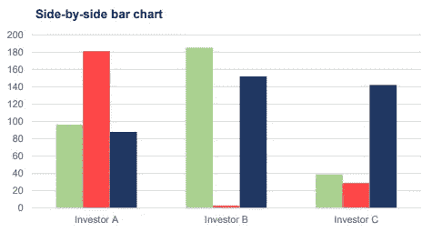

*散点图:——*当我们想在同一个图上表示两个数值变量时，我们通常使用散点图。散点图在后面讨论回归分析时特别有用，因为它们有助于我们检测模式(线性、均方误差)。散点图通常代表大量的数据。通常，我们对单次观察不感兴趣，而是对数据集的结构感兴趣。

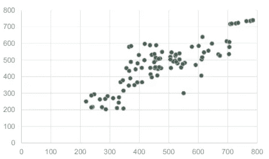

# 平均值、中间值和众数

*的意思是:——*

*   平均值是最广泛使用的集中趋势的量度。它是数据集的简单平均值。
*   注意—容易受到异常值的影响。
*   计算平均值的公式是:—

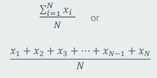

*中位数:——*

*   中位数是有序数据集的中点。它不像均值那样受欢迎，但经常在学术界和数据科学中使用。
*   注意-不受异常值的影响。
*   在有序数据集中，中位数是位置数的 n+1 / 2。
*   如果此位置不是整数，则中值是最接近计算值的位置的两个数字的简单平均值。

*模式:——*

*   众数是最常出现的值。一个数据集可以有 0 个模式、1 个模式或多个模式。
*   只需找到频率最高的值，即可计算出模式。

# 歪斜

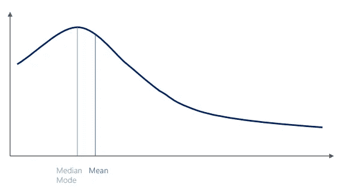

*   偏斜度是不对称的一种度量，表示数据集中的观察值是否集中在一侧。
*   右(正)偏度看起来像图表中的那个。这意味着异常值在右边(长尾在右边)。
*   左(负)偏度意味着异常值在左边。
*   通常，你会用软件来计算偏斜度。
*   计算偏斜度的公式:—

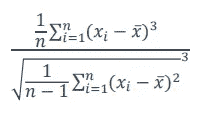

# 方差和标准差

方差和标准差衡量一组数据点围绕其平均值的离差。

总体和样本方差和标准差有不同的公式。这是因为样本公式是总体公式的无偏估计量。

*样本方差公式:——*

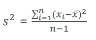

*人口方差公式:——*

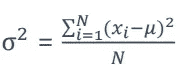

*样本标准差公式:——*

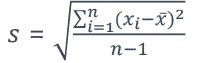

*总体标准差公式:——*

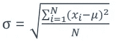

# 协方差和相关性

***协方差:****——*是对两个变量联合变异性的度量。

*   正协方差意味着两个变量一起移动。
*   协方差为零，0，意味着两个变量是独立的。
*   负协方差意味着两个变量的运动方向相反。
*   协方差的值可以从-无穷大到+无穷大。这是一个问题，因为很难正确看待这些数字。

*样本协方差公式:——*

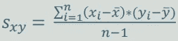

*人口协方差公式:——*

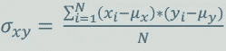

***相关性:*** *—* 是对两个变量联合变异性的度量。与协方差不同，相关性可以被认为是一种标准化的度量。它取值在-1 和 1 之间，因此我们很容易解释结果。

*   相关性为 1，称为完全正相关，意味着一个变量可以被另一个变量完全解释。
*   相关性为 0 意味着变量是独立的。
*   相关性为-1，被称为完美负相关，意味着一个变量完美地解释了另一个变量，但它们的运动方向相反。

*样本相关公式:——*

*人口相关公式:——*

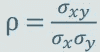