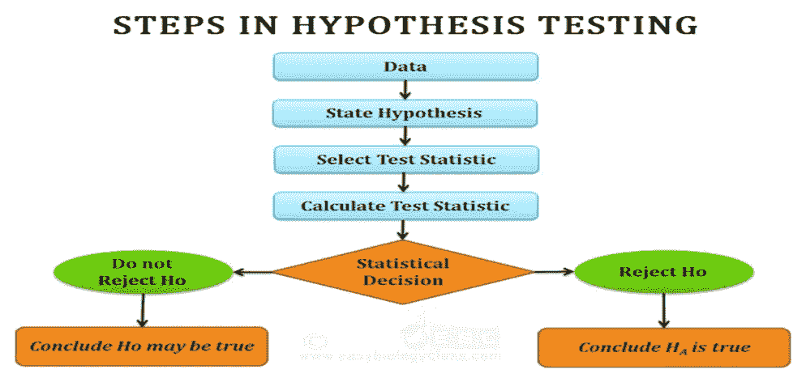
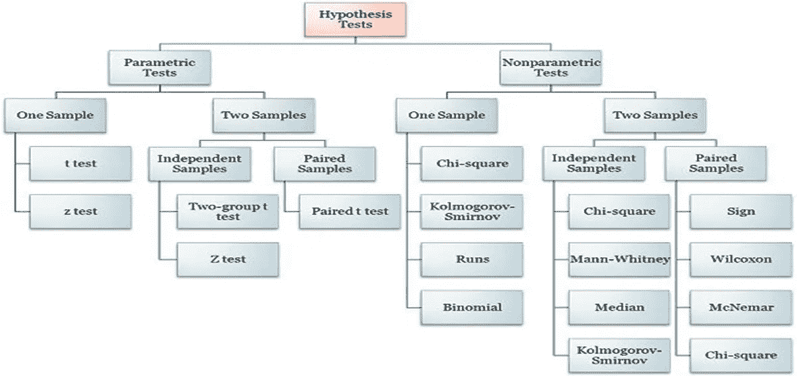

# 数据科学统计学

> 原文：<https://medium.com/geekculture/statistics-for-data-science-76988541b2e1?source=collection_archive---------15----------------------->

S 统计学？那是什么？我为什么要学？

你可能会有各种类似的问题，你也会找到各种关于“数据科学的统计学”的文章。
但是，我想从头开始……这甚至是《统计学基础》的基础。

那么，什么是统计学呢？

“对数据的收集、分析、解释、展示和组织的研究”是统计学的定义。这基本上是数据科学的定义，这个术语是由普渡大学的统计学家 William S. Cleveland 在 2001 年他的论文“数据科学:扩展统计领域技术领域的行动计划”的标题中创造的。

所以，让我们从基本概念开始——在这个博客中，我将包括一些基本主题，如

**集中趋势的测量
推断统计—估计参数和假设检验。
参数—一个样本测试**

其他概念将在下一篇博客中讨论。

**集中趋势的度量**

平均值、中值和众数是数值分布中集中趋势的量度。平均值通常被称为平均值。中位数是病例值分布的中间点，高于和低于中位数的病例数相等。众数是分布中最常出现的值。

**表示**

均值，也称为平均值，是用于测量数值数据集中心的最常用的统计数据。平均值是数据集中所有值的总和除以数据集中值的数量。整个总体的均值称为总体均值，一个样本的均值称为样本均值。

何时不使用 mean

*   平均值有一个主要缺点:它特别容易受到异常值的影响。

例如，考虑一家工厂员工的工资

这十名员工的平均工资为 30.7 万美元。但是，检查原始数据表明，这一平均值可能不是准确反映员工典型工资的最佳方式，因为大多数员工的工资在 12，000 美元到 18，000 美元之间。平均数被两份高薪扭曲了。因此，在这种情况下，我们希望有一个更好的集中趋势的措施。我们将选择该数据集的中位数，该数据集的中位数将为 15.5 万美元。

**中位数**

当连续数据呈正态分布时，平均值、中值和众数相等。在这种情况下，我们倾向于使用平均值，因为它包含了计算中的所有数据。然而，如果你有一个偏态分布，中间值通常是集中趋势的最佳衡量标准。

**模式**

众数是数据集中出现频率最高的值。在检查分类数据(如汽车型号或汽水口味)时，Mode 作为集中趋势的度量最有用，因为无法计算基于排序的数学平均中值。

因此，人们可以得出这样的结论，

如果数据是对称的，则使用平均值，如果数据是偏斜的，则使用中位数来衡量集中趋势。

**假设检验**

什么是假设，什么是假设检验——我们为什么要使用它？

你一定用了“假设情况”这个词，意思是有一个假设。

在这里，如果我们有一个目标并验证该目标，我们应用各种统计测试来检查基于假设的目标是否正确。

[假设检验](https://corporatefinanceinstitute.com/resources/knowledge/other/hypothesis-testing/)是检验关于现象或人口参数的假设的统计过程。它是科学方法的重要组成部分，科学方法是一种通过观察评估理论并确定陈述是真还是假的概率的系统方法。

好的理论是能够做出准确预测的理论。对于一个做预测的分析师来说，假设检验是一种用统计分析来支持他的预测的严格方法。它还有助于确定是否有足够的统计证据支持关于总体参数的某个假设。

可以用无效假设和替代假设进行假设检验。

*   **零假设是一种基于证据的理论，需要进一步测试来证明观察到的数据是真是假**。例如，零假设陈述可以是“植物的生长速度不受阳光的影响。”可以通过测量植物在有阳光的情况下的生长，并将其与没有阳光的情况下的生长进行比较来测试。

*   **替代假设**是零假设的逆。替代假设和无效假设是互斥的，这意味着两个假设中只有一个是真的。

**我们将在这里讨论参数—单样本测试**

**T —测试**

t 检验是一种[统计检验](https://www.scribbr.com/statistics/statistical-tests/)，用于比较两组的[均值](https://www.scribbr.com/statistics/mean/)。意义——确定两个群体是否彼此不同。它通常用于[假设检验](https://www.scribbr.com/statistics/hypothesis-testing/)中，以确定某个过程或治疗是否会影响相关人群。

选择 t 检验时，你需要考虑两件事:被比较的群体是来自单一群体还是来自两个不同的群体，以及你是否想检验某一特定方向的差异。

**单样本、双样本还是配对 t 检验？**

如果各组来自同一个人群(例如，在实验治疗前后进行测量)，执行**配对 t 检验**。

如果有一组与标准值进行比较(例如，将液体的酸度与中性 pH 值 7 进行比较)，执行**单样本 t 检验**。

*   如果这些群体来自两个不同的人群(例如，两个不同的物种，或者来自两个不同城市的人)，执行**双样本 t 检验**(也称为**独立 t 检验**)。

**Z —测试**

z 检验是一种统计检验，用于确定方差已知且样本量较大时两个总体均值是否不同。

它可用于检验 z 检验遵循正态分布的假设。

Z-检验与 t-检验密切相关，但 t-检验最好在实验样本量很小时进行。

此外，t 检验假设标准差未知，而 z 检验假设标准差已知。例如，如果有人说他们发现了一种治疗癌症的新药，你会想确定这可能是真的。假设检验会告诉你这可能是真的，也可能不是真的。

*   样本 z 检验允许您比较两个比例，以查看它们是否相同。我们可能想比较男女大学生吃比萨饼的数量。我们随机挑选了一些学生，其中有些是男生，有些是女生。虽然我们只有一个样本。我们也把它想象成两个独立的样本，只是碰巧同时被选中。

请继续关注统计中使用的其他测试的内容…