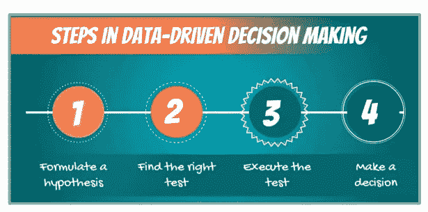
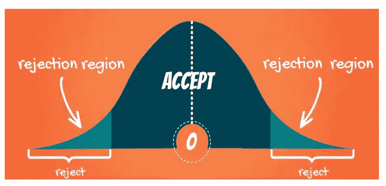
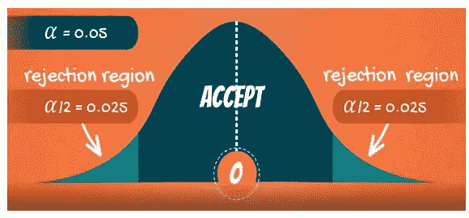
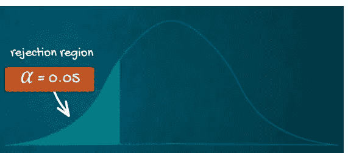
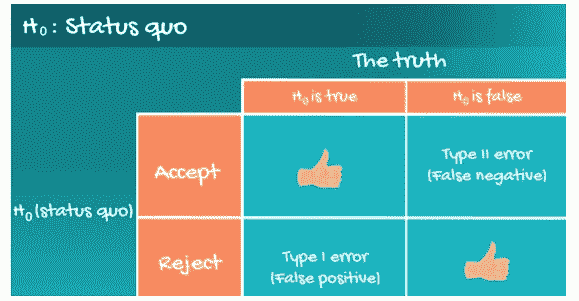
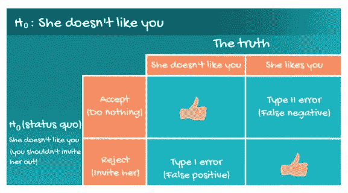
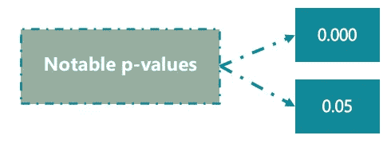
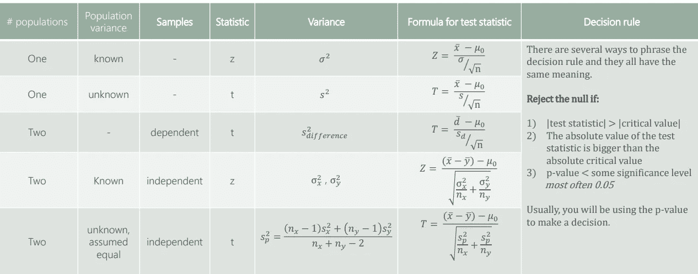

# 统计—假设检验

> 原文：<https://medium.com/geekculture/statistics-hypothesis-testing-2e0bcebf5dfe?source=collection_archive---------24----------------------->

# 科学方法

“科学方法”是 17 世纪以来自然科学的特征。它包括系统的观察、测量、实验，以及假设的形成、检验和修正。

从那时起，我们已经进化到了这样一个程度，大多数人，尤其是专业人士，意识到纯粹的观察可能是骗人的。因此，商业决策越来越多地由数据驱动。这也是数据科学的目的。

要做出数据驱动的决策，您需要遵循几个步骤。

# 假设

*定义(非正式)——*假设是“一个可以被检验的想法”。

*定义(正式)——*是在有限证据的基础上做出的假设或建议性解释，作为进一步调查的起点。

*零假设:——*

*   零假设是要检验的假设。
*   这就是现状。
*   无效的概念类似于:在被证明有罪之前是无辜的。在我们有足够的证据证明嫌疑犯有罪之前，我们假定自己是无辜的。

*替代假设:——*

*   另一种假设是挑战现状的变革或创新。
*   通常，另一种选择是我们自己的意见。
*   这个想法是这样的:如果零是现状(也就是普遍认为的)，那么进行测试的行为表明我们对零的真实性有怀疑。研究者的观点往往包含在另一个假设中。

*假设的例子:——*

我的妻子 Sakshi 告诉我，Cupertino 的数据科学家的平均工资是 185，000 美元，因此零假设是:平均工资是 185，000 美元。

我认为她可能是错的，所以我们正在验证这一点。因此，另一个假设是:平均工资< $185,000.

# DECISIONS YOU CAN TAKE

When testing, there are two decisions that can be made: to **接受**的零假设或者**拒绝**的零假设。

*   接受零意味着没有足够的数据来支持替代方案带来的变化或创新。
*   拒绝零意味着有足够的统计证据表明现状不代表事实。

给定一个双尾检验:-

*   从图形上看，分布的尾部显示了我们拒绝零假设的时间(“拒绝区域”)。
*   留在中间的一切都是“接受区域”。
*   基本原理是:如果观察到的统计值离 0 太远(取决于显著性水平)，我们拒绝空值。否则，我们接受。

*报告结果的不同方式:——*

接受 —在 x%的显著性下，我们接受零假设。

拒绝 —在 x%的显著性下，我们拒绝零假设。

# 显著性水平和测试类型

*显著性水平(* α *) —* 拒绝为真的零假设的概率；犯这个错误的概率。

常见的显著性水平为 0.1、0.05、0.01。

*双边(双尾)检验:*

当 null 包含等号(=)或不等号(≦)时使用。

*单边(单尾)检验:*

当零假设不包含等式(=)或不等式符号(>，

# STATISTICAL ERRORS

In general, there are two types of errors we can make while testing: —

1.  Type I error (False Positive).
2.  Type II error (False Negative).

Statisticians summarize the errors in the following table: —

The probability of committing a Type I error (False Positive) is equal to the significance level (α).

The probability of committing a Type II error (False Negative) is equal to the beta (β).

# P-VALUE

The p-value is the smallest level of significance at which we can still reject the null hypothesis, given the observed sample statistic.

When we are testing a hypothesis, we always strive for those ‘three zeros after the dot’. This indicates that we reject the null at all significance levels.

0.05 is often the ‘cut-off line’. If our p-value is higher that 0.05 we would normally accept the null hypothesis (equivalent to testing at 5% significance level). If the p-value is lower than 0.05 we would reject the null.

*时使用 p 值在哪里使用以及如何使用？*

*   大多数统计软件会计算每次测试的 p 值。
*   研究者可以事后决定显著性水平。
*   p 值通常在点(x.xxx)后有 3 个数字。
*   p 值越接近 0.000 越好。

# 假设检验的公式

