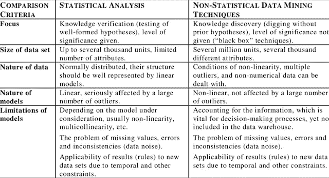
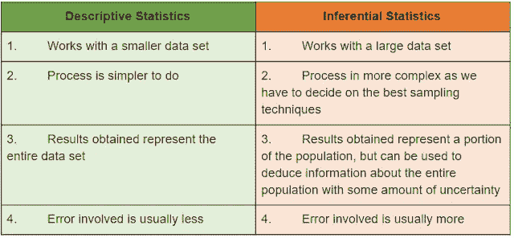
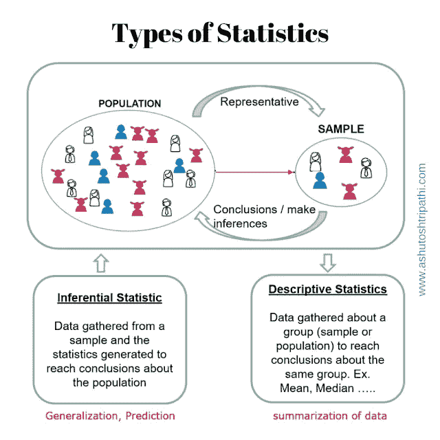
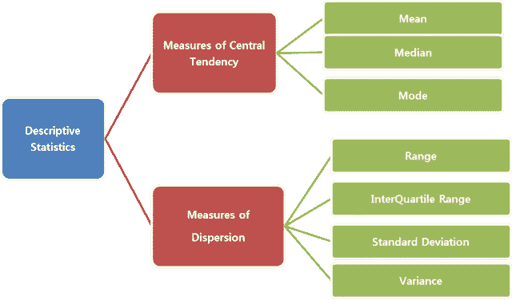
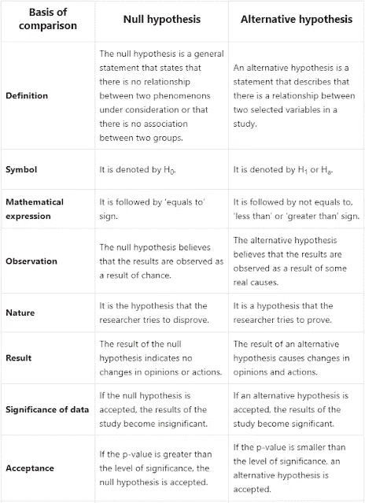
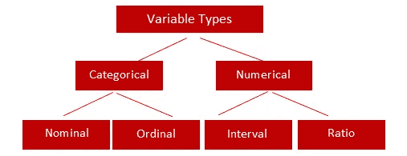

# 数据科学统计学

> 原文：<https://medium.com/geekculture/statistics-in-data-science-277c1f9745bc?source=collection_archive---------39----------------------->

统计学是一门被广泛认可的学科，尤其侧重于记录收集、记录组织、记录分析、记录解释和记录可视化。早些时候，事实通过统计学家、经济学家、企业主来计算和构成他们领域的适用记录。如今，facts 已经在不同的领域占据了举足轻重的地位，如记录技术、系统学习、记录分析师职位、企业智能分析师职位、pc 技术职位等等。

Photo by [Luke Chesser](https://unsplash.com/@lukechesser?utm_source=medium&utm_medium=referral) on [Unsplash](https://unsplash.com?utm_source=medium&utm_medium=referral)

统计是一种数学分析，使用量化的模型和表示来分析一组实验数据或现实世界的研究。统计的根本好处是信息以一种易于理解的方式提供。

# 统计和非统计分析

统计分析用于通过分析样本数据来更好地了解更广泛的人群。统计分析使得关于目标市场、消费者群体和一般人群的推断能够通过适当扩展数据来建立，以基于少数预测多数的行为和属性。数据被用于统计分析，因为它可以从多个来源组合起来，以帮助统计分析过程。

非统计抽样是指根据审查员的判断而不是正式的统计程序来选择一个测试组。例如，审查员可以使用他或她自己的判断来确定以下一个或多个:

*   样本数量
*   为测试组选择项目
*   如何评估结果？

统计分析是收集、探索和呈现大量数据以识别模式和趋势的科学。

非统计分析提供信息，包括文本、声音、静止图像和运动图像。

Statistical vs Non-Statistical Analysis

统计分析也称为定量分析，而非统计分析称为定性分析。

# 统计的类别

在推理过程之前，描述性统计是至关重要的。

有两种类型的统计数据:

## **描述性统计:**

*   使用中心度量、扩散度量、分布形状和异常值中讨论的度量来呈现、组织、总结和描述收集的数据。
*   我们也可以使用我们的数据图来获得更好的理解。
*   帮助我们组织数据并关注数据的主要特征。
*   以数字或图形方式提供数据摘要。

Descriptive vs Inferential Statistics

Types of Statistics

## **推断统计:**

*   这是你运行不同的测试，并得出关于你的样本的结论，我们可以估算到一个更大的人口。
*   要很好地进行推断统计，需要我们选取一个能准确代表我们感兴趣的总体的样本。
*   它概括了更大的数据集，并应用概率论得出结论。
*   它允许我们根据样本统计推断人口参数，并在数据中建立关系模型。
*   *注:建模允许我们开发描述两个或多个变量之间相互关系的数学方程。*

# 统计术语

许多部门都使用了统计数据:

*   保险
*   股票市场
*   遗传学
*   医学研究
*   购物
*   天气预报

在处理统计数据时，人们应该了解各种各样的统计术语。其中一些是:

1.  **群体:**将被收集数据的群体。
2.  **样本:**样本是总体的一个子集。
3.  **变量:**变量是群体中任何一个成员在数量/质量上与另一个成员不同的特征。
4.  **数量变量:**数量不同的变量。例如:一个人的重量、一辆汽车中的人数等。
5.  **定性变量:**质量不同的变量。例如:汽车的颜色、事故中汽车的损坏程度等
6.  **离散变量:**离散变量是指在两个给定变量之间不能假设任何值的变量。例子:一个家庭的孩子数量
7.  **连续变量:**连续变量是指在两个给定变量之间可以假设任意值的变量。例子:100 米赛跑所用的时间。

# 统计测量的类型

有四种类型的统计方法用于描述数据:

## **频率的度量:**

*   数据的频率表示任何特定数据值在给定数据集中出现的次数。
*   频率的度量是数字和百分比。

## **集中趋势的度量:**

*   集中趋势表示数据值是在分布的中间还是接近末尾累积。
*   集中趋势的度量是平均值、中间值和众数。

## **价差的衡量:**

*   分布描述了某一特定变量的一组观察值的相似程度或变化程度。
*   传播的衡量标准是标准差、方差和四分位数。
*   扩散的度量也称为离差的度量。

## **位置的测量:**

*   位置标识特定数据值在给定数据集中的确切位置。
*   位置的度量是百分位数、四分位数和标准分数。

在处理统计数据时，人们应该了解各种各样的统计术语。其中一些是:

Descriptive Statistics

# 假设检验

假设检验是一种推断统计技术，用于确定数据样本中是否有足够的证据来推断某个条件适用于整个总体。

**步骤:**

1.  随机抽取样本。
2.  分析样本的属性。
3.  测试确定的结论是否正确代表总体。
4.  生成关于总体参数的假设。

两种类型的假设:

## **零假设(H0):**

*   除非有相反的有力证据，否则假设无效。
*   变量之间不存在差异。
*   一家制药公司在市场上推出了一种治疗特定疾病的药物，人们已经使用了相当长一段时间，通常认为这种药物是安全的。
*   如果药物被证明是安全的，那么它被称为无效假设。

## **另类假设(H1):**

*   当零假设被证明为假时，假设替代假设为真。
*   例:在上面的例子中，我们应该证明药物是不安全的，以拒绝零假设。如果无效假设被拒绝，则使用替代假设。

Null vs Alternate Hypothesis

# 变量类型

根据变量的性质，变量分为四种类型:

## **名义变量:**

*   这有两个或更多的类别，对这些值进行排序是很重要的。
*   例如:性别和血型

## **序数变量:**

*   这是按逻辑顺序排列的值。然而，两个数据值之间的相对距离并不清楚。
*   例如:咖啡杯的大小(平方米/升)，产品的等级(好/平均/差)

## **区间变量:**

*   对于区间标度，标度值之间的相等差异不具有相等的数量意义。
*   区间标度比顺序标度提供更多的定量信息。音程刻度没有真正的零点。
*   示例:华氏温标用于测量温度，即火车两个车厢之间的距离。

## **比率变量:**

*   比率标度类似于区间标度，因为标度值之间的相等差异具有相等的数量意义。
*   它有一个真正的零点。
*   例子:英制和普通尺子一起使用。

Types of Variable

# 假设检验程序

有两种假设检验程序:

## **参数测试:**

*   t 检验或 ANOVA 等传统检验称为参数检验。除了一组自由参数之外，它们依赖于概率分布的规范。
*   如果总体信息完全由它的参数所知，那么它就是一个参数检验。

## **非参数测试:**

*   如果总体或参数信息未知，但仍需要检验总体的假设，则这是非参数检验。
*   它们不需要任何严格的分布假设。

**其他参数测试:**

*   t 检验
*   方差分析
*   卡方检验
*   线性回归

*来源:*[【https://www.simplilearn.com/】T21](https://www.simplilearn.com/)

*原载于 2021 年 8 月 16 日*[*【https://muskaanpirani.blogspot.com】*](https://muskaanpirani.blogspot.com/2021/08/statistics-in-data-science.html)*。*

***关于作者:***

*Muskaan Pirani |*[*LinkedIn*](https://www.linkedin.com/in/muskaanpirani/)

[GirlScript Foundation](https://medium.com/u/828dde08b9d3?source=post_page-----277c1f9745bc--------------------------------) |数据科学专题的开源贡献者