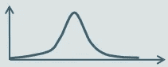
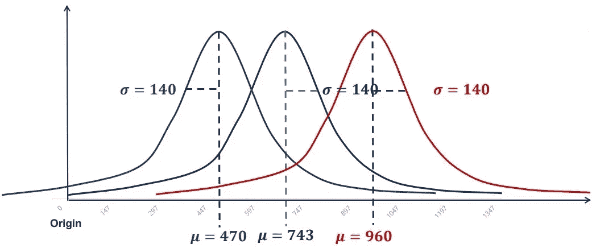
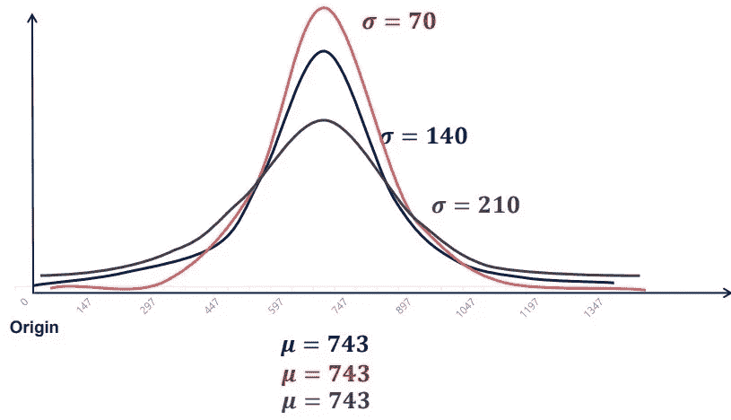
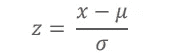
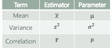
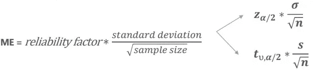
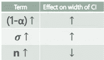
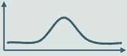
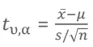
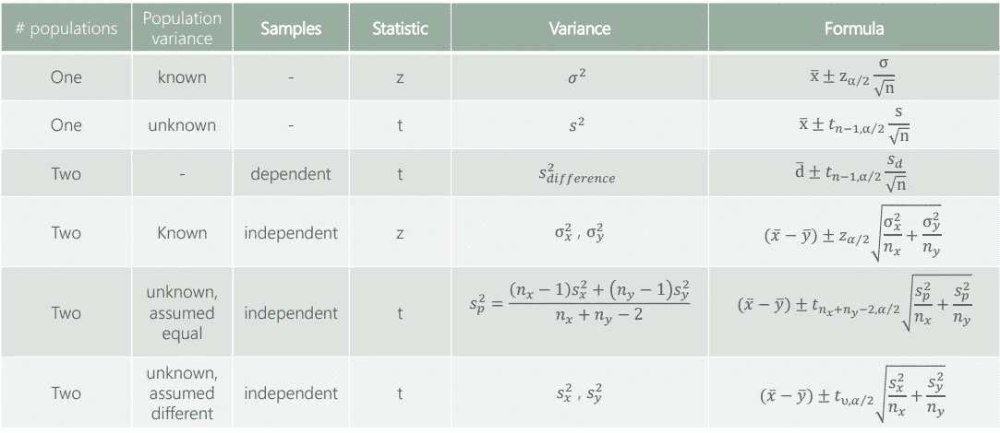

# 统计学—推断统计学简介

> 原文：<https://medium.com/geekculture/statistics-inferential-statistics-introduction-9982ee85b0ca?source=collection_archive---------33----------------------->

# 分布

*定义:——*

在统计学中，当我们谈到分布时，我们通常指的是概率分布。

定义(非正式):分布是一个函数，它显示了一个变量的可能值以及它们出现的频率。

定义(形式):在概率论和统计学中，概率分布是一个数学函数，用简单的术语来说，可以认为是实验中可能的结果。

例子:正态分布，学生的 T 分布，泊松分布，均匀分布等。

*图形表示:——*

认为分布就是图形是一个常见的错误。事实上，分布是*‘规则’*，它决定了值之间的相对位置。

很多时候，我们用图表来形象化数据。因为不同的分布有特定的图形表示，统计学家喜欢绘制它们。

示例:

Uniform Distribution

Binomial Distribution

# 正态分布

正态分布也称为高斯分布或钟形曲线。由于以下原因，它是最常见的发行版之一:—

*   它近似于各种各样的随机变量。
*   样本量足够大时，样本均值的分布可以近似为正态分布。
*   所有可计算的统计都是优雅的。
*   大量用于回归分析。
*   良好的记录。

Normal (Gaussian) Distribution

*N~(μ，σ )*

N 代表正常；

~代表分配；

μ代表均值；

σ代表方差。

*示例:——*

*   生物学——大部分生物学测量值呈正态分布，如:身高、臂长、腿长、指甲；血压；树皮的厚度等。
*   智商测试。
*   股票市场信息。

*标准差控制:——*

Keeping the STD constant

保持标准偏差不变，正态分布图:

*   一个更小的平均值看起来也是如此，但是位于左边。(灰色)
*   一个更大的平均值看起来也是这样，但是位于右边。(红色)

*控制均值:——*

Keeping the mean constant

保持平均值不变，正态分布:

*   较小的标准差将位于相同的点，但具有较高的峰值和较细的尾部。(红色)
*   较大的标准差将位于相同的点，但具有较低的峰值和较宽的尾部。(灰色)

# 标准正态分布

标准正态分布是正态分布的一个特例。它的平均值为 0，标准差为 1。

每个正态分布都可以使用标准化公式进行“标准化”:

遵循标准正态分布的变量用字母 z 表示。

*标准化公式的基本原理:*

我们要把一个随机变量从 *N~(μ，σ)* 转化为 *N~(0，1)。*从所有观察值中减去平均值将导致从 *N~(μ，σ )* 到 *N~(0，σ )* 的转换，将图形移动到原点。随后，将所有观察值除以标准偏差将导致从 *N~(μ，σ )* 到 *N~(0，1)* 的转换，标准化图形的峰值和尾部。

*为什么标准化很重要？*

标准化使我们能够:—

*   比较不同的正态分布数据集。
*   检测正常。
*   检测异常值。
*   创建置信区间。
*   测试假设。
*   执行回归分析。

# 中心极限定理

中心极限定理(CLT)是最伟大的统计见解之一。它指出，无论数据集的基本分布如何，均值的抽样分布都将接近正态分布。此外，抽样分布的平均值将等于原始分布的平均值，方差将小 n 倍，其中 n 是样本的大小。每当我们有许多变量的总和或平均值时，CLT 就适用(例如，掷骰子时掷出的数字的总和)。

*为什么有用？*

CLT 允许我们假设许多不同变量的正态性。这对置信区间、假设检验和回归分析非常有用。事实上，正态分布在我们周围如此普遍，是因为遵循 CLT，许多变量收敛于正态。

*在哪里可以看到？*

因为，许多概念和事件是不同效应的总和或平均值，CLT 适用，我们一直观察常态。例如，在回归分析中，因变量通过误差项的和来解释。

# 评估者和估计

*估计器:——*

广义地说，估计量是一个数学函数，它仅依赖于样本信息来逼近总体参数。

估计值和相应参数的示例:

估计量有两个重要的性质:

*   偏倚-无偏估计量的期望值是总体参数。这种情况下的偏差为 0。如果估计量的期望值是(参数+ b)，那么偏差是 b。
*   效率——最有效率的评估者是方差最小的评估者。

估计:——

估计是您从估计器(当您应用公式时)获得的输出。有两种类型的估计:

*   点估计-单一值；例如(1，5，188.990)
*   置信区间-一个区间；例如{(1，5)，(342，988)}

置信区间比点估计精确得多。这就是为什么他们在做推论时更受青睐。

# 置信区间和误差幅度

*定义:——*

置信区间是我们确信(以一定的置信百分比)总体参数将下降的区间。

我们围绕点估计建立置信区间。

(1-α)是置信度。我们(1-α)*100%确信总体参数将落在指定的区间内。常见的阿尔法有:0.1，0.05，0.01。

*一般公式:——*

[μ-ME，μ+ME]，其中 ME 为误差幅度。

# 学生 T 分布

当样本量很小时，学生的 t 分布主要用于创建置信区间和检验具有正态分布总体的假设。当我们没有足够的信息或者获取信息的成本太高时，这种方法特别有用。

在其他条件相同的情况下，学生的 t 分布比正态分布有更厚的尾部和更低的峰值。这反映了由小样本量引起的较高水平的不确定性。

我们可以使用以下公式获得具有正态分布总体的变量的学生 t 分布:

# 置信区间的公式

