# 《庄子》统计学

> 原文：<https://medium.com/geekculture/statistics-with-zhuangzi-b75910c72e50?source=collection_archive---------24----------------------->

梦见自己是自变量的我是因变量，还是梦见自己是因变量的自变量？

作为对推特上绝对最低限度的[流行需求](https://twitter.com/XianyangCB/status/1436981389350498305)的回应，这里有一条统计原则线索，源自 [*【庄子】*](https://ctext.org/zhuangzi/what-comes-from-without) 的“无中生有”一章。

让我们开始吧。

> 从外面来的东西无法预先决定。就这样，龙凤被杀了；毕甘自焚；嵇装疯，吴来死，桀、周皆亡。统治者都希望他们的部长是忠诚的，但这种忠诚可能不会确保他们的信心；于是吴渊流落江边，长虹死在蜀中，人把他的血保存了三年，变成了绿玉。父母都希望他们的儿子孝顺，但孝顺的责任不一定能保证他们的爱；因此，孝治不得不忍受他的悲伤，曾参不得不忍受他的悲伤。

如果你不知道最重要的主题与统计误差有关，主要涉及过度/不足拟合或过度/不足规范，这一章感觉有点不稳定。我们从本章的关键教训开始:原因和结果并不总是线性的。一个额外单位的忠诚度不一定会导致相应单位的奖励。然而，仅仅因为关系不是线性的，并不意味着它们是不可预测的。他们只需要多做一点工作。

更没用的是，他随后用一个非常困难的多变量优化问题+隐藏陷阱将我们抛入了深渊:

> 当木头与木头摩擦时，木头开始燃烧；金属遇火时会熔化和流动。阴阳颠倒，天地大乱；在其上有雷轰，从云中有火，烧灭大槐树。(男人的情况)更糟。他们陷入了两个陷阱之中，无法逃脱。像蛹一样，他们什么也做不成。他们的思想仿佛悬在天地之间。一会儿安慰，一会儿怜悯，他们陷入了困境。利益和伤害的观念相互摩擦，并在其中产生巨大的火焰。(心灵的)和谐在人类大众中消失了。他们月亮般的智慧无法战胜(内在的)火。于是，他们越走越远，而他们所追求的道路也完全丧失了。

你试图最大化实际收益的总效用，同时最小化危险(或者更确切地说，安全的边际效用，这不太吸引人，但在数学和结构有效性方面更有意义)。

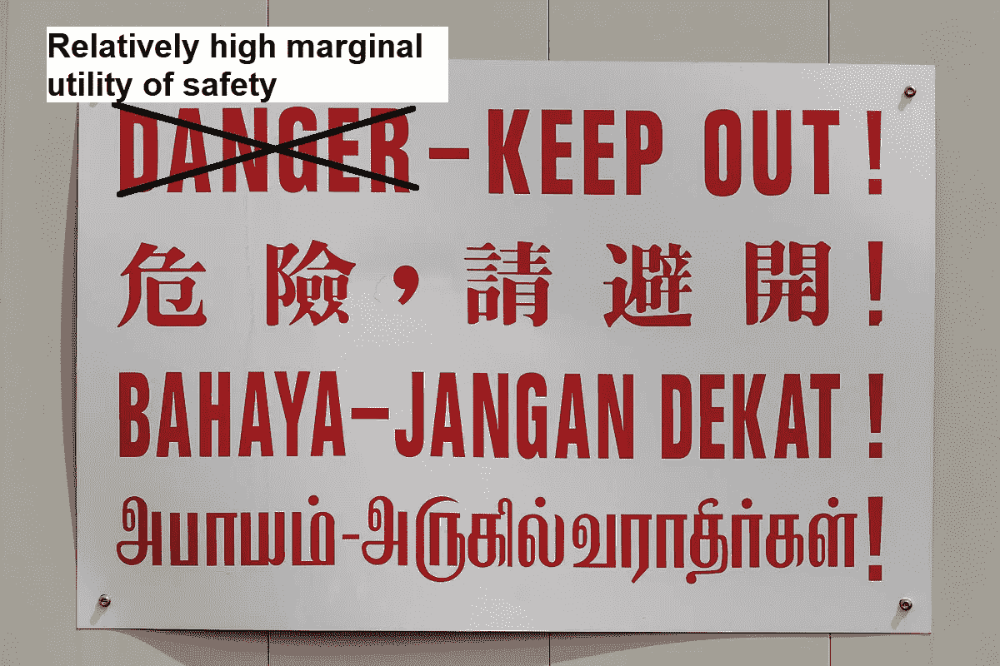

然而，这最终将你置于一个鞍点。从技术上来说，你已经优化了你的总效用，但你并没有得到两者的最大化。你不是亿万富翁，也不是刀枪不入。

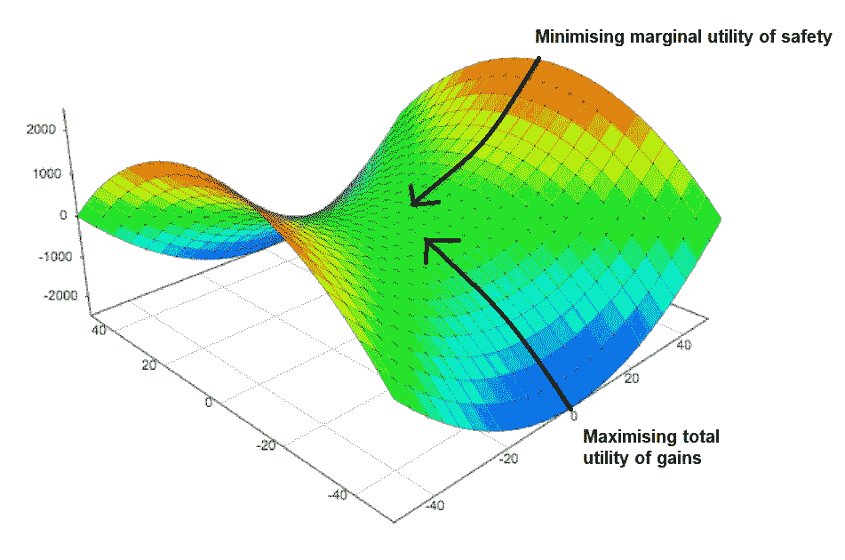

然而，这也有二阶效应，因为这基本上是一个心理问题，而不是经济问题。这不是我们这里的两个变量——危险和收益——的最大值或最小值，但它最大化了第三个变量，这是不可见的——心理劳动。某个致力于高风险/高回报生活方式或低风险/低回报生活方式的人认为某个变量对他来说并不重要，并将其剔除。每当处于鞍点的人面临新的决定时，他都必须担心他的选择对他的收益/危险坐标的影响。一个选择将自己置于其中一个极端的人已经做出了他的选择，他在心理上很放松，尽管处于持续的身体危险或经济贫困之中。诀窍是不要介意它会痛。

目前有一个很好的现实世界的例子。我的公司在印度尼西亚有办事处，在中国有供应商。后者有一些地球上最极端的 Covid 限制，前者几乎没有任何限制。在过去的两年里，两者都或多或少地正常运转，而欧洲和美国则处于混乱之中:每一个决定都是一场新的戏剧，没有人对任何结果感到满意。换句话说，试图在严厉的封锁和告诉人们坐下来祈祷之间找到一条中间道路，只会产生最坏的结果，而不是最好的结果。努力或者回家，但是不要两者都做。

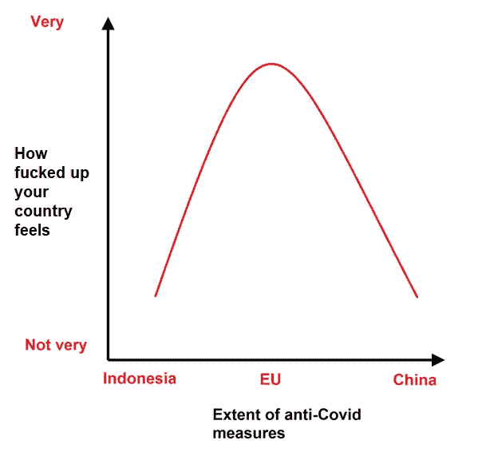

(根据评论，月亮这个词应该是隐喻性的，但对我来说，它只是意味着附近的蜡烛看起来比远处的月亮更亮——也就是说，视角也有影响——从系统内部来看，几乎不可能区分局部和全局最小值。这仍然是机器学习中的一个难题。)

这段摘录与我在 Twitter 上最初的[庄子统计帖子中提到的另一个相关:](https://twitter.com/XianyangCB/status/1436981370463555585)

> 这位伟人的教导就像影子离开物质，回声回应声音。当被询问时，他回答，用尽(从他自己的商店)在(询问者的)头脑中的所有，好像与天下所有的人面对面。他的安息之所不发出声音；他的活动范围不受地点的限制，他引导每个人向他的正确目标前进，然后像通过他自己的运动一样把他带回来。他的动作没有痕迹；他出去和他的再进入没有偏差；他的历程就像没有开始(或结束)的太阳。如果你赞美或谈论他的人格，他与伟大的存在共同体是统一的。他属于那个伟大的团体，没有个人的自我。没有个体的自我，他怎么会有可以称之为他的东西呢？如果你看看那些拥有他们称之为自己的东西的人，他们是从前的优越的人；如果你看着没有这种东西的人，他就是天地之友。

这是指过度依赖平均值。永远不要忘记:

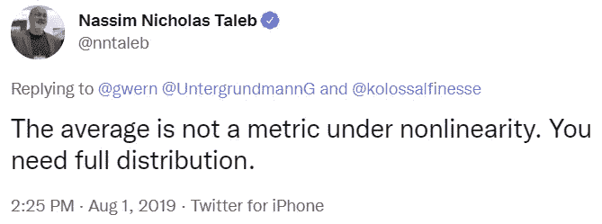

那条推特有点抽象，有很多不同的理由不信任平均值，所以让我们举一个政治上的例子来反映庄子在这里的关注。

更多的人会投票给与他们观点相同的候选人。因此，政治家被吸引到中间，然而，总的结果不是使他们更容易当选，而是让每个潜在支持者的子集模糊地不满意，同时也有二阶效应，使他们看起来像无原则的迎合者。(我在看你，马克龙。)此外，当任何新事物出现时，如果他们不知道大多数人认可的处理方式是什么，他们就会迷失。虽然人们说他们希望有人同意他们的立场，但事实上，他们希望有人能够提出新的立场，足以令人信服，让他们同意他的观点。

除此之外，重要的是评估情绪的程度，而不仅仅是它的方向。拥有 1000 个强烈同意你的观点并会为此采取行动的人，通常比拥有 100000 个有点同意你的观点但不会采取行动的人更有价值。我们在 2016 年美国大选中看到了这一点，希拉里的立场可能获得了更多的普遍支持，但支持来自缺乏投票动机的人。结果:特朗普——他的立场获得的主流支持较少，但能够激发他的基础——赢了。

有一种方法可以解决这个问题，它将在本章的最后出现，创造一些漂亮的对称。

谢天谢地，下一个例子更容易分析。

> 庄周家里很穷，就去找河州侯借米，河州侯说:“好的，我很快就会从人民那里得到(税)钱，然后我会借给你三百两银子——可以吗？”庄周气得满脸通红，说:“昨天我在路上，当我来到这里，我听到有人喊。我环顾四周，看见一条虾虎鱼在马车的车辙里，就对它说:“虾虎鱼，什么风把你吹来了？”虾虎鱼说:“我是东海的波浪部长。先生，你有一加仑或一品脱的水让我活着吗？”我说:“是啊，我要南下见吴越王，然后从西江引一条小溪来见你——行吗？”虾虎鱼气得满脸通红，说:“我已经失去了我应有的素质，在这里我什么也做不了。但是如果我能得到一加仑或一品脱的水，我就能活下去。比做你提议的，你最好尽快在一个干鱼的摊位上找我。”'

有害的非线性。庄周对金钱的需求在一段时间内将大致保持不变，然后在他饿死时崩溃，它不会以线性方式增长。

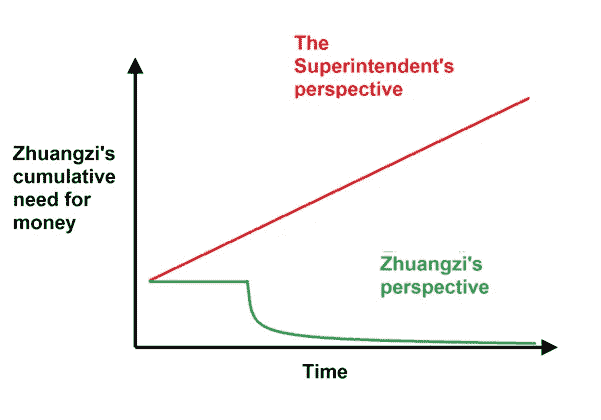

换句话说，管理者认为庄子对货币的边际效用函数是线性的。庄子知道它是弯曲的。

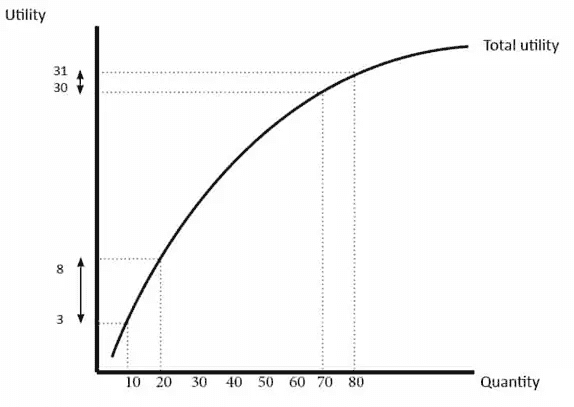

我经常打交道的政府商业促进机构极其喜欢管理者式的金钱观。他们提供的支持通常需要接受方投入大量资金，这些资金将在 6-12 个月内收回。显然，没有小企业能负担得起，但是德意志银行和脸书得到了一个几乎免费升级他们电脑的好机会。(我很苛刻，假设这是偶然的；这可能仅仅是腐败。)也相关:

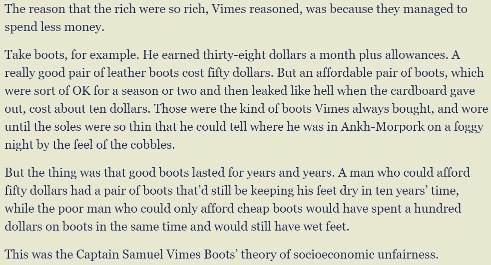

适当地，下一节涵盖有益的非线性:

> 任公的一个儿子，准备了一个大鱼钩，一根结实的黑线和五十头牛作为鱼饵，蹲在龟背上，把线扔进了东海。每天早上他都这样钓，整整一年什么也没钓到。就在那时，一条大鱼吞下了鱼饵，拖着大鱼钩潜了下去。然后它慌慌张张地浮上水面，拍打着它的鳍，直到白色的波浪像小山一样升起，海水被搅得狂暴起来。那声音如鬼魅，震得千里之外。王子得到了这样一条鱼，把它切成片并晒干。从东面的芷江，到北面的苍梧，没有一个人不吃这种鱼。
> 
> 在随后的几代人当中，能力有限的说书人都惊讶地重复着这个故事。(但是)如果王子带着他的竿，用一根细钓丝，去池塘和沟渠，并注意鲦鱼和虾虎鱼，他将很难得到一条大鱼。那些美化他们的小故事以获得法官的青睐的人远不是理解的人；因此，一个没有听说过这个任后裔的故事的人是不适合参加世界政府的任何一部分——他远远不是这样。

如果他用正常大小的鱼生产同样数量的食物，没有人会觉得这有什么了不起，尽管他们会得到完全相同的卡路里。

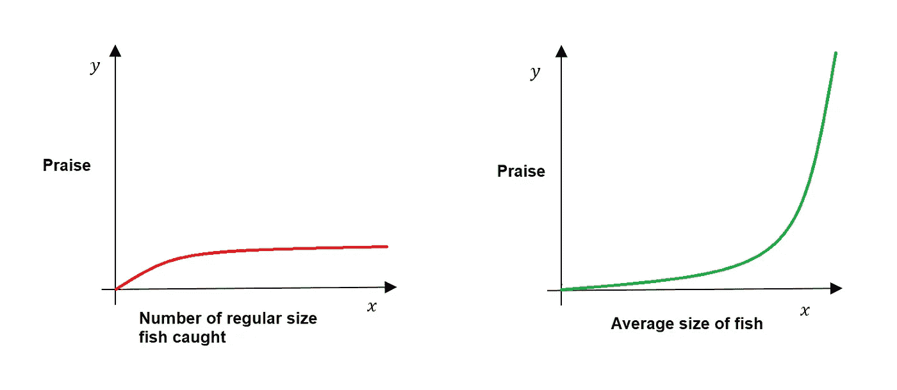

然而，值得注意的是，作为一个王子，他大概有足够的钱来支付一年的徒劳无功的努力，不像庄周现在需要大米。他有足够稳定的收入来等待一个让他成名的尾部事件(这是迟早要发生的)。

后半部分有点晦涩，但它似乎是指那些从未遇到过尾部事件的人，因此他们对自己的存在没有概念。他们的模型对于他们拥有的数据点是正确的，但是他们没有考虑到他们可能没有所有相关数据的事实。

拥有这些数据的人:

可能会做出一个与拥有这些数据的人完全不同的模型:

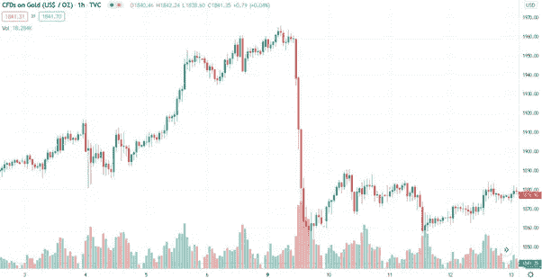

他们相当于 2007 年圣诞节大肆挥霍的雷曼兄弟交易员，因为他们对自己所有的 AAA 级 CDO 感到兴奋。他们并不危险，因为他们对小小的胜利沾沾自喜——谁不是呢？—而是因为他们销售的模型缺少关键信息。

下一部分是关于孔子和他的追随者的著名扣篮，但也是关于过度配合:

> 一些文人，研究颂诗和仪式的人，正在打开坟墓上的一个土堆。他们中的上级对其他人说:‘东方破晓了；“事情进行得怎么样了？”年轻一些的人回答说:“我们还没有揭开他的上衣和裙子，但是他嘴里有一颗珍珠。”。正如颂歌中所说，
> 那颗明亮的绿色谷粒
> 生长在土堆的两侧。
> 活着的时候，他什么也没给；为什么，当他死的时候，他的嘴里应该含着一颗珍珠？于是他们抓住胡须，拉着胡须，而上级把一根细钢放进下巴，逐渐分开下巴，以免伤害嘴里的珍珠。

孔子说，一个好人会一丝不苟地遵守哪怕是微不足道的规则。在这个故事中，庄子认为，对个体规则的执着会有损于整体美德，而不是产生整体美德，因为你会使你的善的模型过度适应个体规则，并发现自己忽视了大局。你会发现自己遵循了法律的条文，牺牲了它的精神——因为席子不直而拒绝坐下，而不是牺牲礼仪来满足主人的要求。

下一部分是对孔子的又一次不必要的抨击，但也是对在没有线性关系的地方看到严格的线性关系的危险的警告。你不仅会持续失望/沮丧，你也不知道为什么。

> 老莱子的一个门徒外出拾柴时，遇见了仲尼。回来的时候，他告诉(他的主人)，说:“那里有一个人，他的上半身很长，下半身很短。他有点驼背，耳朵很靠后。当你看着他时，他似乎被四海之内所有人的关心所占据；我不知道他是谁的儿子。老莱子道:“是秋叫他来的。”且说到了，对他说:“邱，不要骄傲，不要装腔作势，要做一个真正的君子。”仲尼鞠了一躬，正要退下，突然他改变了态度，问道，“我所追求的目标会因此而实现吗？”老莱子回答说:“你不能忍受这一个时代的痛苦，却顽固地无视无数个时代的罪恶:难道你故意使自己如此不快乐吗？还是你没有能力理解这个案子？你顽固的目的是让人们分享你的快乐，这是你一生的耻辱，是一个平庸的人的做法。你会用你的名声来领导人们；你会用你的秘密艺术把他们绑在你身上。比起赞美姚和谴责桀，你最好把他们都忘掉，停止你的赞美倾向。如果你反思它，它除了伤害什么都不做；你的行为是完全错误的。圣人做任何事情都充满焦虑和犹豫不决，所以他总是成功。但是我该怎么评价你的行为呢？到头来都是装模作样，”

在这个故事中，老子认为孔子的世界模型，即每一个额外积累的美德单位都会得到相应的社会认可单位，显然不适用于他们生活的时代。

此外，这会导致一种诱惑，即指责别人没有按照你的模式生活。因此，在 2007 年崩盘后的几年里，雷曼兄弟因其贪婪而被人唾弃，但实际上，他们所做的只是尽最大努力回应社会给予他们的激励。如果我们希望他们的行为不那么不负责任，我们应该敦促政府调整他们的激励措施。他们完全按照我们的要求做了。如果我们不想要这种结果，我们应该预料到它，并为其他事情付出代价。

下一部分:

> 宋太守袁，夜半梦见一个蓬头垢面的人，从侧门窥看他说:“我是从在禄渊来的，奉清江之命，到何公那里去。但是渔夫余切抓住了我。袁醒了，教人占卜，说:“这是个怪龟。”太上皇问渔民中是否有一个叫余且的人，他的随从告诉他，有一个叫余且的人，他下令将他传到法庭上。于是，第二天，这个人出现在法庭上，统治者说，“你(最近)在捕鱼中抓到了什么？”"我在网里抓到了一只白色的乌龟，像蜘蛛一样，直径五肘。"“把神童带到这儿来，”统治者说；当它来的时候，他一次又一次地希望杀死它，一次又一次地希望让它活着。他犹豫不决，于是求助于占卜，得到了答案:“杀死乌龟用于占卜将是幸运的。”因此他们切开了这个生物，在它的壳上打了七十二个洞，没有一个占卜失误。
> 
> ”说:“神龟可以在梦里出现在袁面前，但它却不能避开虞洽之网。它的智慧可以在七十二个穿孔中做出反应而没有一次占卜失败，然而它无法避免肠子都被挖出来的痛苦。从这一点我们看到，智慧不是没有危险的，精灵般的智慧并不是无所不能的。一个人可能有最大的智慧，但有无数的人阴谋反对他。鱼不怕网，尽管它们害怕鹈鹕。收起你的小智慧，你的大智慧才会明亮；抛弃你的技巧，你会变得自然熟练。一个孩子出生时不需要伟大的主人，但他会说话，生活在会说话的人中间。

从表面上看，这看起来像是道学 _ 助产士 _meme.jpg 的标准问题:

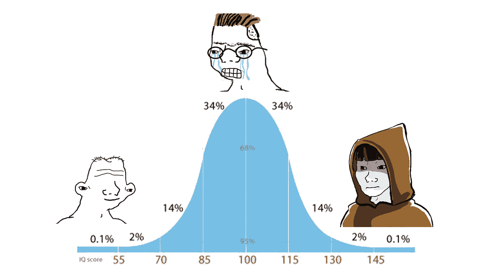

是的，但是还有其他的事情在发生。

作为一个普通的智力爱好者，这是我真正感兴趣的事情，但不幸的是，智力是一个受《怪异效应》一书中每一种怪异效应影响的统计数据，详细涵盖所有这些因素会让这篇文章太长。纳西姆·塔勒布在这里总结了其中的关键[。这里的主要目标似乎是由于研究中的结构定义不明确而导致的不明确——一个领域的智能不一定能很好地转化为另一个领域的智能，因此这些应该被视为两个独立的变量。这也可能意味着获得更多特定领域的知识会降低适应性。(过度拟合又忽略了尾部效应。)](/incerto/iq-is-largely-a-pseudoscientific-swindle-f131c101ba39)

> 蕙子对庄子说:“先生，你说的是无用的东西。”"当一个人知道什么是无用的，你就可以开始告诉他什么是有用的。"例如，地球当然是广阔而伟大的；但是一个人使用它仅仅是为了他的脚足够的地面。但是，如果在他的脚边出租，一直出租到黄泉，这个人还能利用它吗？蕙子说，“他不能使用它，”庄子回答说，“那么无用的有用性是显而易见的。”

或者，正如沃伦·巴菲特所说，“为了成功，你必须首先生存。”正如上面的鱼的故事所显示的，如果你玩得足够久，你迟早会大获全胜。如果你死了或者破产了，游戏就结束了。这就是为什么，举例来说，如果你有无限的储备，一个[鞅策略](https://en.wikipedia.org/wiki/Martingale_(betting_system))才是一个伟大的系统。

(行为经济学家从不承担任何风险，每月收入丰厚，而且从源头上扣除了税款，因此他们不理解这一点，并将损失厌恶称为一种认知偏差。别理他们。)

我不喜欢下一个的翻译，所以我自己做了。以下是官方版本:

> 庄子说，“如果一个人有权力享受自己(在任何追求中)，他能被阻止这样做吗？如果他没有权力，他能如此享受吗？有些人的目的是隐藏自己，有些人决心不让他们的行为留下任何痕迹。唉！他们都逃避完美的知识和伟大的美德的义务。他们堕落了，而且不能复原；他们像火一样奔忙，而不觉悟。虽然人们可以以统治者和大臣的关系站在一起，但那只是暂时的。在一个变化了的时代，他们中的一个不会看不起另一个。所以人们说，“完美的人不会留下他行为的痕迹。”尊重古代，轻视现在是学习者的特点；但即使是契诃夫的弟子也要看看现在的时代；谁能避免被它的路线带走呢？只有完美的人才能在这个世界上享受自己，而不偏离正道，让自己适应他人而不迷失自我。他不吸取他们的教训；他只考虑他们的想法，不会因为与自己的想法不同而抛弃他们。

这是我的:

> 庄主说:“一个人如果能做自己喜欢的事，有什么能阻止他这样做呢？如果一个人不能做他喜欢的事，什么能让他这样做？有决心随波逐流的，也有决定反抗，追求自己道路的。啊，他们永远也不会达到一个完全理解优秀品质的人的位置。他们下沉，无法上升，也无法狂怒而不顾后果地向前飞奔。主宰或屈服，只是一时的。在不同的时代，他们之间不会有鄙视的理由。所以我说:完成了的人并没有在他的道路上。甚至尊崇古代而轻视现在也只是学者们的随大流。连追随魏的人都要放眼现代，又怎能不随波逐流呢？只有达到圆满的人才能在这个世界上随心所欲而不与他人争锋相对，或者追随他人而不被冲昏头脑。不要研究他们的教义；接受他们的想法，但不要让自己被他们同化。

据我所知，这是对上述优化问题的另一种理解，这两个问题应该被看作是姊妹篇。最初的版本是个人单独行动，而在这个版本中，他是在帕累托最优的情况下与其他行动者打交道。他获得的每一个额外的个人满足单位都必须从群体中扣除，获得它的压力等于拥有它的快乐。在这种情况下，即使是最佳解决方案也有点糟糕——无论你是选择为自己的个性激烈斗争，还是完全顺从集体，或者寻找一条中间道路，你都不会得到比失去更多的东西。

本质上，这是一个 [Edgeworth box](https://en.wikipedia.org/wiki/Edgeworth_box) ，其中 O 代表你，A 代表世界其他地方，ωy 代表个人成就，ωx 代表放松。

虽然庄子将此表述为个人实现问题，但从经济角度来看，权衡可能更容易想象。想象你是一个史前牧羊人；每天晚上狼都会来抢走你的另一只羊。你可以每晚熬夜与狼战斗，或者你可以屈服，听任自己失去羊群。两者都不是一个吸引人的生存策略。要解决这个问题，你需要跳出游戏规则。如果你从每顿饭中拿出 10%留给狼，会怎么样？他们得到的羊肉越来越少，但他们得到的是可靠的，没有附带订购弩矢。原来可靠性是直到现在才被考虑的第三个因素。为了更大的可靠性，人类和狼都愿意接受更少的收获/更多的努力。几代人之后:

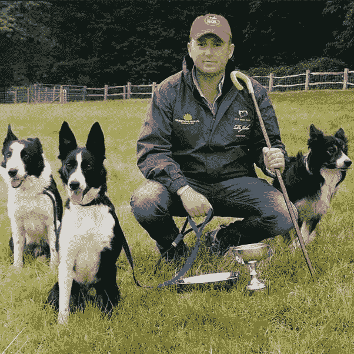

换句话说，这是一个不符合规范的问题。唯一的解决方法就是增加第三维度。现在不是收益和放松之间的权衡，而是收益、放松和结果可靠性之间的权衡。

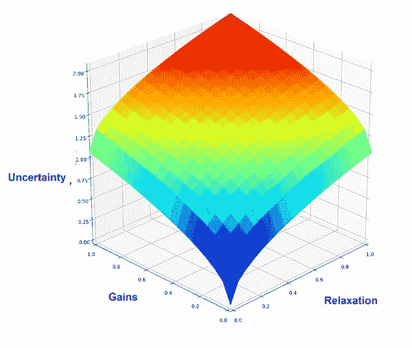

这有点难以想象(尤其是因为传统的无差异曲线图实际上是二维表示的 3D 现象)，但这给出了一个想法。想象一下多架飞机。

重要的是，在二维空间不相交的曲线在三维空间也可能相交。如果是这样，你和狼现在可以以一种互利的方式进行交易:

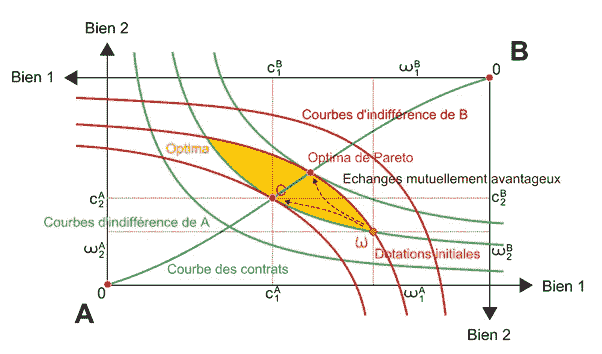

(这也与结构效度的问题有关——你是否认为合适的变量是“绵羊/死亡”、“快乐/痛苦”、“个人满足/放松”或其他什么，但那是一个完全不同的兔子洞。后半部分在某种程度上触及了这一点，认为那些认为自己是激烈的个人主义者的人往往只是一种不同的循规蹈矩者，而那些声称自己处于主流地位的人实际上是将自己定位于与不断变化的时代精神相对立。能够看到每一方实际上得到的和失去的有助于澄清交易，并找出如何规避二分法。)

在原始问题中，一个看不见的第三个变量把一个最优解变成了一个坏解。在这种情况下，它把一个无法解决的问题变成了一个可以解决的问题。

最近在 Twitter 上出现的这种方法的一个很好的真实例子是公元前三世纪的都江堰灌溉工程。如果秦朝的工程师顺其自然，他们就不会把四川变成帝国的粮仓。另一方面，如果他们不顾一切地将自己的愿望强加于它，并建造具有复杂管道布置、混凝土衬砌水库和基于人工智能的压差跟踪器的现代灌溉系统，那么阻力造成的摩擦将意味着它需要在 50 年内更换。因为他们找到了他们的无差异曲线和河流重叠的点——而不是把问题变成一场零和争夺统治地位的战争——它现在仍然有效，如果你不知道，你不会猜到任何事情已经改变了。最初的工程师很久以前就去世了，但对生态系统和当前人口来说，最佳的做法是保持现状。

顺便说一下，这是最难的部分，它甚至没有关闭。我很确定，当我试图想象火车上的 4D·埃奇沃斯盒子时，我有过某种萨满体验。

继续前进。

> 敏锐的眼睛带来清晰的视觉，敏锐的耳朵带来灵敏的听觉，敏锐的鼻子带来对气味的辨别，熟练的嘴巴带来对味道的享受，活跃的头脑获得知识，深远的知识构成美德。在任何情况下，与外界的联系都不会受到阻碍；阻碍产生停止；停止，没有间歇地继续，停止所有的进步；随着这一切有害的影响涌现。所有生物的知识都依赖于它们的呼吸。但是如果他们的呼吸不充足，那不是天的错，天试图用它穿透他们，不分昼夜；但是男人尽管关闭他们的毛孔。子宫包围了一个大而空的空间；心有它自发的和愉快的运动。如果他们的公寓不够宽敞，妻子和婆婆就会争吵；如果心没有自发和愉快的运动，六种感知能力就会相互冲突。伟大的森林，高地和丘陵，是令人愉快的，因为他们的精神无法克服(那些分心的影响)。

医疗/气功的东西是我不懂的。我觉得解释这一点所必需的背景知识已经完全丢失了，任何声称理解这些章节的人都是骗子。

下一个。

> 美德溢出到名声(的爱)；(对)名声的热爱泛滥成暴力；计划起源于(环境的)紧迫性；智慧来自竞争；(冲突的)燃料产生于(对自己观点的)顽固坚持；办事处的业务应按照所有人的批准进行分摊。春天，当雨水和阳光及时到来时，植物生长茂盛，镰刀和锄头开始准备。掉下来的东西有一半以上变直了，我们不知道是怎么变直的。

也就是说，小心不要混淆被测量事物的测量单位(如智商和智力)，以及——与此相关的——任务蠕变:聪明的孩子考试成绩好，因此我们应该训练孩子通过考试，这将使他们变得聪明。它还将这些与上面提到的混淆因果关系的概念联系起来——春天导致植物生长，而不是相反。如果你相当聪明，你可能会在智商测试中得分超过 100，但得分超过 100 并不意味着你聪明。

下一个也相对直观:

> 静止和沉默对生病的人有帮助；揉眼角对老年人有帮助；休息有助于平静焦虑；但他们是辛苦和困扰谁求助于这些东西。那些安逸的人，没有过这样的经历，不在乎去问他们。有灵性的人不知道圣人如何让世界敬畏，所以他不去询问；智者没有体验过有能力和美德的人如何敬畏他的年龄，所以他不去询问；有能力和美德的人没有经历过优越的人如何保持敬畏，所以他不询问它。大人物没有经历过小人物如何与他的时代保持一致，他应该询问这个问题。

您的职位将决定您可以访问的数据样本。这将使你能够创造一个合理的方法来处理你自己的情况，但它不一定适用于其他人的情况。仅仅因为你有揉自己眼睛的冲动，并不一定意味着火车上坐在你旁边的人会感谢你为他提供服务。

这也与你关注的范围有关，因为——如上所述——足够大的数量差异会变成质量差异。这就是为什么我们区分微观和宏观经济学，或者牛顿和量子物理学。一个人可能很擅长经营一家炸鸡店，但他不能将他的模式用于管理国家。相反，一个人的模型是为治理国家而开发的，如果他把它转移到炸鸡行业，他就会失败。此外，他们都不能取代理论物理学家，他也不能代替他们。考虑一下这个:

所有这些图像都是一样的，只是缩放比例不同。你从每一个推断出的信息将会不同。

下一部分回到严格意义上的非线性*:*

> *守闫门之人，死于其父之手，极能削瘦其身，得“官模”之职。他的邻居中有一半人(结果)消瘦到死去的地步。当姚想把皇位让给时，后者逃跑了。当汤向光武伸出橄榄枝时，光武生气了。吉它听了，便带着门徒退到关河边，诸侯来吊唁，过了三年，申屠棣投水自尽。*

*正式服丧的时候减肥是好的(直到你死)。第二部分就不那么清楚了——看起来它的目的是一种平行关系(表明这些人中的一些或所有人只是出于个人正直感而假装拒绝权力)，但如果没有更详细的传记，这很难说。他们通常被视为典范，但庄子和他的追随者喜欢戳破这种声誉。*

*最后，我们回到最初的 [Twitter 主题](https://twitter.com/XianyangCB/status/1436981331116761093):*

> *渔桩是用来捕鱼的；但是当鱼到手的时候，人们忘记了赌注。陷阱是用来抓野兔的，但当野兔被抓到时，人们却忘记了陷阱。词语被用来传达思想；但是当思想被理解时，人们就会忘记语言。我真想和这样一个忘词的人说话！*

*您使用您拥有的数据点来构建模型，如果模型足够好，那么您将不再需要这些数据点。*

*附注:我应该给出标准的免责声明，所有这些故事都有多种解释，这只是一套。如果这个帖子有一个信息，那就是每个结果都是一个分布，而不是一个点。*