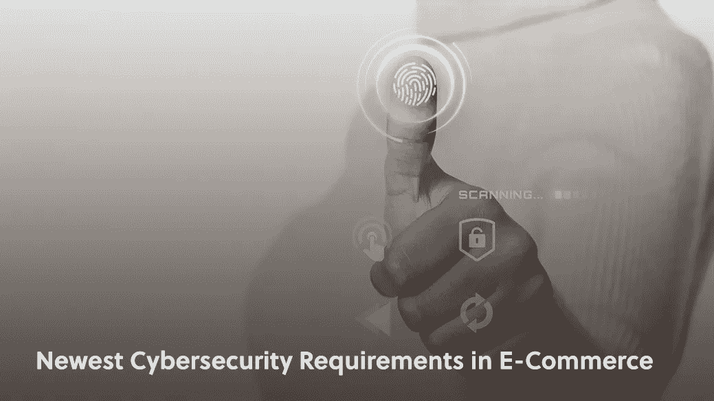
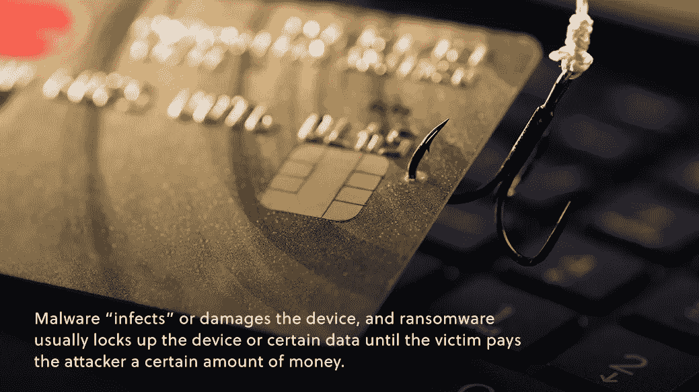
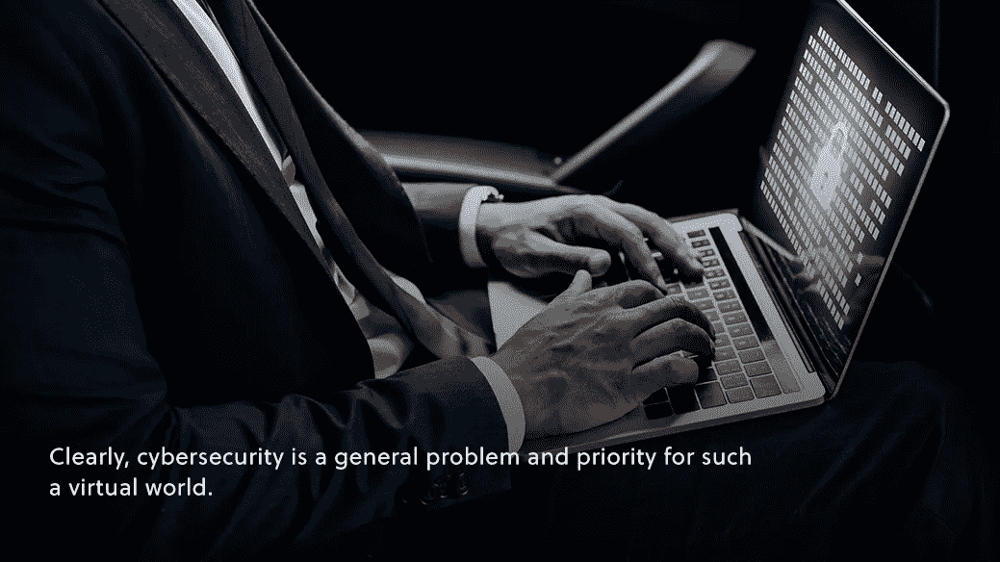

# 电子商务中最新的网络安全要求

> 原文：<https://medium.com/geekculture/staying-safe-in-a-virtual-commerce-world-9aff84cd6a0b?source=collection_archive---------19----------------------->

## **电子商务网络安全**

安全性一直是业务不可或缺的一部分。无论是捍卫公司信息、保护商店，还是确保客户安全，重要的安全措施只是一个运营良好的品牌的另一部分。随着品牌不断虚拟化，安全性的本质也随之改变。

电子商务行业令人印象深刻的增长是[在这里停留](https://www.amberengine.com/blog-content/trends-in-online-sales-temporary-or-here-to-stay?utm_source=blog&utm_medium=referral&utm_campaign=medium-blogs)，远远超过疫情。虚拟商务的大幅增长也意味着虚拟流量的大幅增长。

消费者在更多的虚拟渠道和平台上花费了更多的时间和金钱。就业务而言，我们已经看到这对销售、公司文化以及给小品牌带来[竞争优势是多么大的好事。](https://www.amberengine.com/blog-content/ecom-resources-for-startup-brands?utm_source=blog&utm_medium=referral&utm_campaign=medium-blogs)另一方面，这也带来了新的安全风险。

# 网络安全

媒体的转变和安全需求的转变是齐头并进的。对许多人来说，商业中的(传统)安全措施听起来像是确保商店的安全。随着网络安全的发展，保护品牌安全和保护客户安全一样重要。

从我们拿到信用卡或借记卡的那一刻起，我们就被告知在任何情况下都不能与任何人分享这些数字。现在，我们很高兴地把这些数字输入任何一个承诺给我们华而不实的产品和快速发货的网站。怎么回事？

一方面，客户*确实*需要对他们的信息去向进行挑剔。然而，另一方面，网络安全已经取得了长足的进步，并有责任保护我们宝贵的个人信息。然而，随着越来越多的客户涌向在线渠道和供应商，网络犯罪分子紧随其后。

如果一家企业成为网络攻击的受害者，这可能意味着失去大量客户的个人信息，这对客户和品牌声誉都是可怕的。这意味着严格的安全性需要成为任何严肃的电子商务品牌的首要关注点。

# 威胁的类型

放弃实体模式的品牌不必太担心有人想从收银台偷东西，但还有其他威胁需要警惕。

攻击者可能会利用不安全的网站，放置指向**恶意软件**或**勒索软件**的链接或入口，来欺骗客户和访客。通过使这些按钮看起来像是属于网站的，攻击者欺骗客户将有害软件下载到他们自己的设备上。

恶意软件会“感染”或损坏设备，勒索软件通常会锁定设备或某些数据，直到受害者向攻击者支付一定金额的钱。

**网络钓鱼**是另一种针对客户的攻击。通常，发送网络钓鱼攻击的攻击者会发出伪装成您的品牌的消息，要求提供个人信息。如果你最喜欢的品牌给你发了一个极具折扣的个性化广告，你可能会立刻付钱给他们——当然，除非这不是你最喜欢的品牌向你要钱。

另一种针对品牌表现的恶意攻击是 **DDoS** **(分布式拒绝服务)攻击。如果你曾经试图购买一场演唱会的门票，门票在最初几分钟内就销售一空，或者任何知名度如此之高的东西，你可能会经历过由于异常高的流量而导致网站关闭或变得无响应的情况。**

这种相同的流量可能是“伪造的”，攻击者可以从不同的 IP 地址发送大量请求来模拟这种巨大的流量峰值，并使某个品牌的网站崩溃。这种攻击不会窃取客户的信息，但它确实会使销售无法进行，无论网站恢复需要多长时间。尤其是在假日季节，顾客可能会错过某些交易和销售，品牌肯定会损失利润。

还有更多种类的现代网络攻击不在此列。

# 服从

显然，网络安全是这样一个虚拟世界的普遍问题和优先事项。这就是为什么不同的政府需要特定的网络安全措施来开展虚拟业务。

品牌必须跟上这些要求，这一点很重要。首先，它们是专业公认的安全措施，将保护企业和客户。另一方面，这是法律规定的！

例如，管理任何金额的信用卡支付的任何企业都必须遵守[支付卡行业数据安全标准](https://www.pcisecuritystandards.org/) (PCI-DSS)的要求。这些要求为信用卡用户提供了更高的安全性，违反这些要求会受到信用卡公司的处罚。当然不是任何品牌想要树立的敌人。

其他法规，如[通用数据保护法规](https://gdpr.eu/what-is-gdpr/#:~:text=The%20General%20Data%20Protection%20Regulation,to%20people%20in%20the%20EU.) (GDPR)是关于保护个人信息和隐私的。作为电子商务模式的一部分，您必须收集客户的私人信息。你如何做到这一点在法律上很重要。GDPR 是一个很好的例子，因为它是欧盟的一项政策，仍然适用于世界各地的品牌。

电子商务的飞速发展所带来的一个结果是一个无国界的行业——顾客在他们舒适的起居室里就可以在世界各地购物。这并不意味着边界实际上不复存在。与来自另一个国家的个人做生意，如果不遵守那个国家的要求，即使是偶然的，也会付出很高的代价。

# 进一步的安全性

合规对于避免网络安全威胁和法律问题非常重要，但这也是安全方面最起码的要求。品牌可以也应该采取其他重要措施来确保每个人都能安全无忧地购物。

**密码**是安全的起点和终点。网络犯罪分子总是会采用越来越复杂和狡猾的方法来危及您网站的安全，但是破门而入的最简单方法总是打开一扇门。

确保密码特别难以破解，无论是在业务方面还是在客户方面，都使得这种破解方法更加难以实现。例如，要求数字和特殊字符是使暴力攻击更加不可靠的简单方法。

同样，在不安全的设备**上拥有相对安全的数据库**也是一个危险信号。网络犯罪分子可能无法通过您的网站直接访问有价值的数据，但如果他们能够轻松访问重要的互联设备，这可能是另一条通往灾难的道路。确保所有连接的设备免受前面提到的恶意软件和勒索软件以及其他风险的影响。

最后，黑客和网络罪犯拥有的最强大的工具是**社交黑客/工程。**通过适当的**加密、HTTPS、**和适当的**更新系统**，攻击者通常无法直接发起成功的攻击。说服某些人放弃易受攻击的信息通常更可行(有时也不太难)。

客户和员工都需要能够识别社会工程企图，这可能看起来像上述的网络钓鱼攻击，或者只是任何其他对敏感信息的不规则请求。

安全是一个敏感的话题，它的发展速度与互联网和技术一样快。在一天结束时，最先进的家庭安全系统是唯一的安全，因为你的能力，不离开从欢迎垫下偷看钥匙！