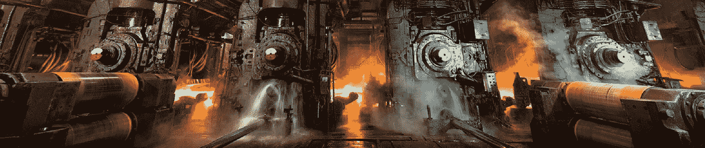
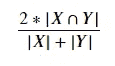
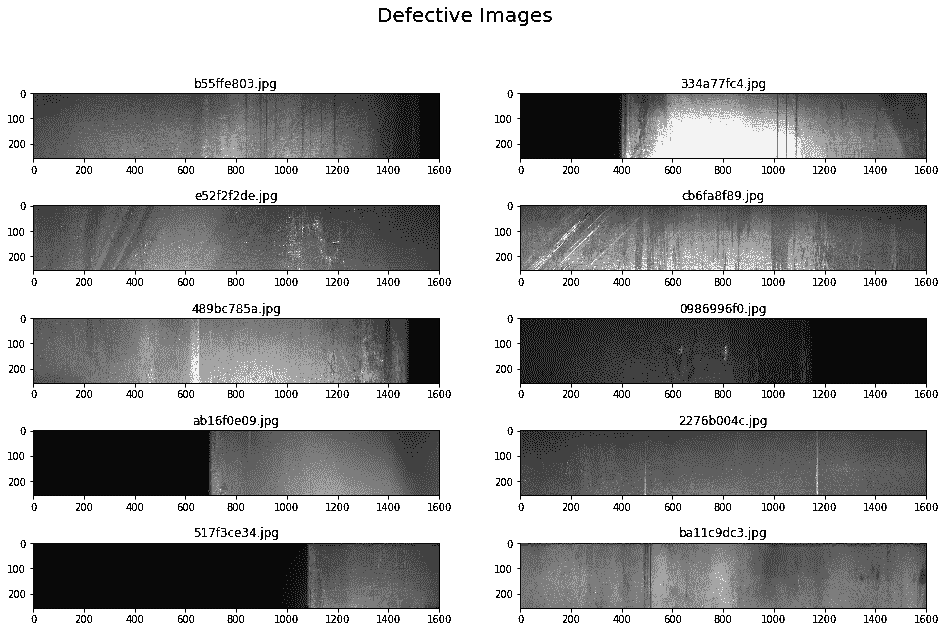
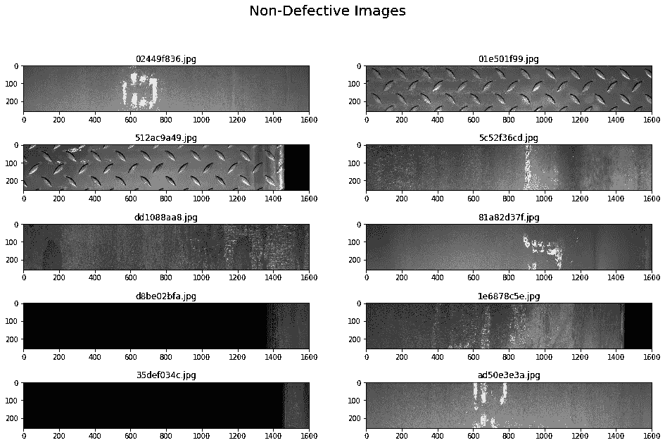
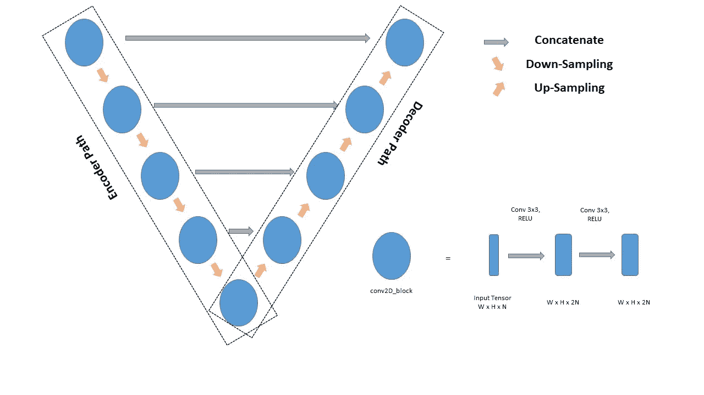
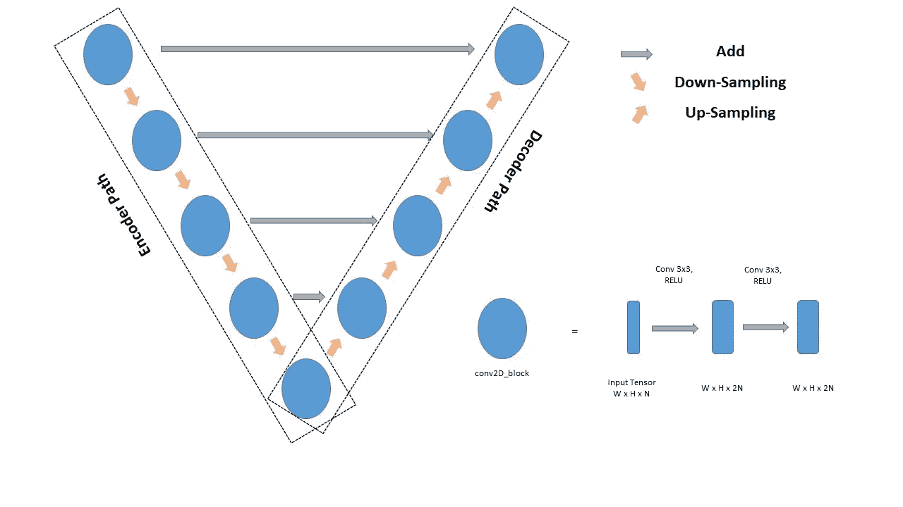
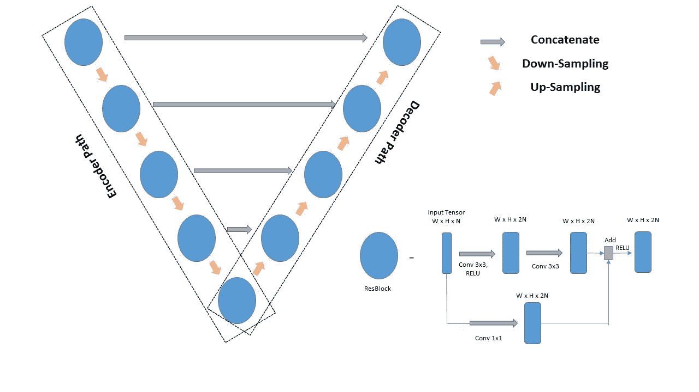
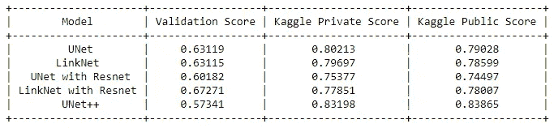

# 钢铁缺陷检测——张量流图像分割

> 原文：<https://medium.com/geekculture/steel-defect-detection-image-segmentation-using-tensorflow-74e66c4279ca?source=collection_archive---------9----------------------->



[Severstal: Steel Defect Detection](https://www.kaggle.com/c/severstal-steel-defect-detection)

# 商业问题

> [钢铁缺陷检测](https://www.kaggle.com/c/severstal-steel-defect-detection)是由最大的钢铁制造公司之一[谢韦尔钢铁公司](https://www.severstal.com/eng/)在 Kaggle 举办的竞赛。因为平板钢板的生产过程包括许多子过程，在这些子过程中，平板钢板在准备装运之前必须接触几台机器。因此，谢韦尔钢铁公司正在使用来自高频摄像头的图像来驱动缺陷检测算法。通过这次比赛，谢韦尔钢铁公司希望参赛者通过对钢板表面缺陷进行定位和分类来改进算法。
> 
> 本次比赛的目的是使用提供的图像预测钢铁制造中发现的缺陷的位置和类型。

# 数据集详细信息

```
-Data
  |- sample_submission.csv
  |- train.csv
  |- test_images/
        |- 5506 nos. of .jpg files
  |- train_images/
        |- 12568 nos. of .jpg files
```

> 为 18074 张(12568 张训练图像和 5506 张测试图像)图像提供唯一的图像 ID。每个图像可以没有缺陷、单一种类的缺陷或多种类的缺陷。有四类缺陷。
> 
> 除了 train 和 test images 文件夹，还提供了 train.csv，其中包含关于缺陷类型及其各自在 train images 中的位置的信息。train.csv 的这些数据点(7095 个)给出了缺陷图像的详细信息(6666 个唯一 id)。
> 
> train.csv 的 3 列是 ImageId、ClassId 和 EncodedPixels:
> 
> i. ImageId:每个图像的唯一 Id。
> 
> 二。ClassId:图像在 EncodedPixels 列中提到的像素位置上的缺陷的类型/类别 Id。
> 
> 三。EncodedPixels:该列给出了图像中缺陷的像素位置信息。缺陷像素位置列表被编码成值对列表(每对的第一个值代表起始位置，第二个值代表其游程长度)以减小文件大小。你可以在这里了解更多关于[的信息。](https://www.kaggle.com/c/severstal-steel-defect-detection/overview/evaluation)
> 
> train.csv 前几行的快照视图:

```
ImageId,ClassId,EncodedPixels
0002cc93b.jpg,1,29102 12 29346 24 29602 24 ....... 192843 23 193099 14 193355 5
0007a71bf.jpg,3,18661 28 18863 82 19091 110 ..... 298245 251 298564 188 298945 63
000a4bcdd.jpg,1,37607 3 37858 8 38108 14 38359 20 ..... 117576 27 117843 16 118109 6
000f6bf48.jpg,4,131973 1 132228 4 132483 6 132738 8 .... 289263 2 289519 2 289776 1
```

# 将现实世界的问题映射到 ML 问题

这是一个图像分割问题，对于给定的图像，我们需要检测和定位钢板中的缺陷。

这场比赛是根据平均[骰子系数](https://en.wikipedia.org/wiki/S%C3%B8rensen%E2%80%93Dice_coefficient)来评估的。Dice 系数可用于比较预测的分割与其对应的基本事实之间的逐像素一致性。该公式由下式给出:



Dice Coefficient Formulation

其中 X 是预测的像素组，Y 是地面实况。当 X 和 Y 都为空时，Dice 系数定义为 1。

# 现有方法

**【1】。** [**建立模型分类预测钢材中的缺陷**](/analytics-vidhya/severstal-steel-defect-detection-5e5b50fe21ce) **:**

*   用二进制分类器训练全部数据，以对有缺陷和无缺陷的纸张图像进行分类。对于多标签分类器，只有缺陷图像用于训练。这种多标签分类器负责给每幅图像标注其所具有的缺陷类型。为每种缺陷类型训练四个单独的分割模型。标记有缺陷类型的图像被传递到相应的缺陷类型分割模型进行分割。
*   对于二进制和多标签分类，使用由 Keras 预先训练的 InceptionResNetV2()模型，并且从图像网络数据训练权重。并且使用了来自 [quvbel](https://github.com/qubvel) —以 resnet34 为主干的 U-Net 的预先训练好的分割模型。

**【2】。** [**钢材缺陷检测:使用 Keras 进行图像分割**](/@guildbilla/steel-defect-detection-image-segmentation-using-keras-dae8b4f986f0) **:**

*   这个解决方案流程类似于[1]。
*   对于二元和多标签分类，使用来自 Keras 的预训练模型— [例外](https://keras.io/applications/#xception)。和 U-Net 的 efficientnetb1 主干用于细分模型。
*   骰子系数(私分):0.88428。

**【3】。** [**利用完全卷积网络进行语义图像分割**](https://towardsdatascience.com/semantic-image-segmentation-using-fully-convolutional-networks-bf0189fa3eb8) **:**

*   在这个解决方案中，二进制和多标记分类器不像[1]和[2]那样包括在流水线中。数据(作为 X 的纸张图像和作为 Y 的对应于 4 个类别的掩模图像)被直接馈送到仅仅一个分割模型。
*   尝试了两种细分模型:U-Net & Deeplab V3+。Deeplab V3+表现不错，dice 系数(私分)0.83763。
*   在此解决方案中实现的 U-Net 模型减少了过滤器的数量，并且用原始图像的一半来训练模型，以减少计算并更快地训练模型。即使在 Deeplab V3+架构上也做了一些修改。

**【4】。** [**谢韦尔钢铁(Severstal)详细案例分析:钢铁缺陷检测，能否对钢铁中的缺陷进行检测和分类？—从初级到高级！**](/@saivenkat_/a-detailed-case-study-on-severstal-steel-defect-detection-can-we-detect-and-classify-defects-in-2844402392cc) **:**

*   在该解决方案中，流水线流程与[3]相同，即整个数据被送入一个分割模型进行分割。以主干 resnet34 为分割模型的 U-Net 导致 dice 系数(私人得分)为 0.90305。

**【5】。** [**钢材缺陷检测:使用 Keras 和 Tensorflow 进行图像分割**](/@gargishan209/detection-of-steel-defects-image-segmentation-using-keras-and-tensorflow-37e8ae8aabe8) **:**

*   在这个解决方案中，流程管道仅由两个模型组成。一个二元分类器，用于将纸张图像分类为有缺陷/无缺陷类别，一个分割模型用于所有 4 个缺陷类别。只有有缺陷的纸张图像用于训练分割模型。
*   对于二元分类，使用异常模型以及从图像网络数据训练的权重。对于分割模型，使用具有 EfficientNetB5 主干模型的 Unet 架构以及从 image-net 数据训练的权重。

# 电子设计自动化(Electronic Design Automation)

从 EDA 可以清楚地看出，这些有缺陷的数据点是高度不平衡的。

*   大多数数据点(72.6%)属于 class id-3。和 ClassId-1 & 2 的份额几乎相等(分别为 12.6%和 11.3%)。
*   ClassId-2 的数据点在所有数据点中的份额最低。

**显示一些有缺陷的图像:**



**显示一些无缺陷图像:**



看起来，甚至来自非缺陷集(不在 train.csv 中的 ImgaeIds)的一些图像也有缺陷。也许这些缺陷类不在 ClassIds，2，3，4]中。

# 第一次切割溶液

*   我会尝试单模型管道(4 标签分割只有一个分割模型)，如[3] & [4]。
*   考虑到 U-Net 作为一个基本模型，我也会尝试任何其他可用的架构(LinkNet，FPN 和 PSPNet)。我还会通过替换这些架构可用主干模型来尝试其他变化。
*   我也会对训练和测试数据使用数据扩充技术。

# 数据准备和培训验证分离

我们对提供的 train.csv 进行了格式化，以便每一行都包含 ImageId 及其对应的所有 4 个缺陷类的掩码编码，如下所示。

```
╔═══════════════╦══════════════╦═══════╦══════════════╦═══════╗
║    ImageId    ║    rle_1     ║ rle_2 ║    rle_3     ║ rle_4 ║
╠═══════════════╬══════════════╬═══════╬══════════════╬═══════╣
║ 0002cc93b.jpg ║ 29102 12 ... ║       ║              ║       ║
║ 00031f466.jpg ║              ║       ║              ║       ║
║ 0007a71bf.jpg ║              ║       ║ 18661 28 ... ║       ║
╚═══════════════╩══════════════╩═══════╩══════════════╩═══════╝
```

整个数据以 85:15 的比例随机分割，分别用于训练和验证。

# 深度学习模型/架构

# 1.优信网

这个 [U-Net](https://arxiv.org/abs/1505.04597) 架构最初是为生物医学图像分割而开发的。这个架构主要包含两条路径:编码器路径&解码器路径。而每一级编码器&解码器之间的连接是这种架构的关键特征。



Architecture: U-Net

编码器路径(或收缩路径)是卷积和最大池层的堆栈，有助于捕捉图像中的上下文。解码器路径(或扩展路径)是转置卷积和卷积层，这有助于定位捕获的上下文(在编码器路径中)。

通过每一级的编码器和解码器之间的那些连接，传递那些编码器块的输出，并将它们连接到解码器块的输入张量。这有助于重建图像，并使其与图像的原始大小相匹配。

使用 [TensorFlow](https://www.tensorflow.org/) 实现了 U-Net 架构(参考作品 [U-Net:用于生物医学图像分割的卷积网络](https://arxiv.org/abs/1505.04597))，如下所示:

# 2.LinkNet

这个 [LinkNet](https://arxiv.org/abs/1707.03718) 架构几乎和 U-Net 差不多，只是稍加修改。编码器和解码器路径结构与 U-Net 中的相同。但是编码器块的输出在通过连接之后被添加(在 U-Net 的情况下是级联)到解码器块的输入张量。



Architecture: LinkNet

在这里，可训练参数的数量减少了，所以与 U-Net 相比，LinkNet 是一个重量更轻的网络。

使用 [TensorFlow](https://www.tensorflow.org/) 实现 LinkNet 架构(参考作品 [LinkNet:利用编码器表示进行高效语义分割](https://arxiv.org/abs/1707.03718)),如下所示:

# 3.带有 ResNet 主干网的 U-Net

在这种架构中，我们将 U-Net 架构的每个编码器和解码器模块中的简单卷积替换为剩余模块，即在每个模块中添加跳过连接。

请参考这篇文章来理解并更好地了解这个架构:[使用 ResBlock 进行语义分段的 UNet](/@nishanksingla/unet-with-resblock-for-semantic-segmentation-dd1766b4ff66)。



Architecture: U-Net with ResNet Backbone

实施(使用 [TensorFlow](https://www.tensorflow.org/) )此架构，将 UNet 架构中的 conv2D_block 替换为 ResBlock，如下所示:

# 4.带有 ResNet 主干网的 LinkNet

在这种架构中，我们将 LinkNet 架构的每个编码器&解码器模块中的简单卷积替换为剩余模块(与 ResNet 主干的 *U-Net 相同),即在每个模块中添加跳过连接。*


Architecture: LinkNet with ResNet Backbone

通过将 LinkNet 架构中的 conv2D_block 替换为 ResBlock 来实现(使用 [TensorFlow](https://www.tensorflow.org/) )该架构，如下所示:

# 5.U-Net++

参考工作 [UNet++:一种用于医学图像分割的嵌套 U-Net 架构](https://arxiv.org/abs/1807.10165)，实现了 U-Net++架构。这是一个强大的图像分割架构。

在这种架构中，我们在编码器路径的每一层生成解码器路径。并且我们在每一层的所有块之间进行跳跃连接。这些有助于减少编码器路径和解码器子路径之间的语义差距。


Architecture: UNet++

使用 [TensorFlow](https://www.tensorflow.org/) 实现了 U-Net++架构，如下所示:

使用这些编译配置对上述每个模型进行 60 个时期的训练:

```
loss: binary_crossentropy + dice_loss
optimizer: tensorflow.keras.optimizers.Adam()
metrics: dice_coefficient
```

# 结果和性能比较

每个经过训练的模型都被上传到 Kaggle，并用公共和私有测试数据进行评估。结果列表如下:



*   虽然验证分数是所有测试中最低的，但 UNet++架构在最终测试数据上表现非常好。
*   通过配置更多数量的过滤器，我们甚至可以期待 UNet++架构带来更好的结果。

创建了一个简单的 Flask 应用程序来部署这个经过训练的 U-Net ++模型:

# 训练后量化

使用 [tf.lite.TFLiteConverter](https://www.tensorflow.org/api_docs/python/tf/lite/TFLiteConverter) 将训练好的 Unet++ TensorFlow 模型转换为 TensorFlow Lite 模型。这样，我们将模型的规模缩小了 3 倍，性能略有下降(在我们的例子中几乎可以忽略不计)。这种技术被称为训练后量化。点击阅读更多相关信息[。](https://www.tensorflow.org/lite/performance/post_training_quantization)

你可以在这里找到我们模型[的量化代码执行。](https://github.com/AkhilPenta/Steel-Defect-Detection/blob/main/Quantization.ipynb)

# 参考

1.  [https://www.kaggle.com/c/severstal-steel-defect-detection](https://www.kaggle.com/c/severstal-steel-defect-detection)
2.  [https://towards data science . com/understanding-semantic-segmentation-with-unet-6 be 4f 42 D4 b 47](https://towardsdatascience.com/understanding-semantic-segmentation-with-unet-6be4f42d4b47)
3.  [https://www.tensorflow.org/tutorials/images/segmentation](https://www.tensorflow.org/tutorials/images/segmentation)
4.  https://github.com/qubvel/segmentation_models
5.  [https://naokishibuya . medium . com/up-sampling-with-transposed-convolution-9 AE 4 F2 df 52d 0](https://naokishibuya.medium.com/up-sampling-with-transposed-convolution-9ae4f2df52d0)
6.  [https://towards data science . com/biomedical-image-segmentation-unet-991d 075 a3 a4b](https://towardsdatascience.com/biomedical-image-segmentation-unet-991d075a3a4b)
7.  [https://www.appliedaicourse.com](https://www.appliedaicourse.com/)

**详细代码参考我的**[**GitHub repo**](https://github.com/AkhilPenta/Steel-Defect-Detection)**。**

[](https://github.com/AkhilPenta/Steel-Defect-Detection) [## AkhilPenta/钢缺陷检测

### 此时您不能执行该操作。您已使用另一个标签页或窗口登录。您已在另一个选项卡中注销，或者…

github.com](https://github.com/AkhilPenta/Steel-Defect-Detection) 

**联系我上**[**LinkedIn**](https://www.linkedin.com/in/akhil-penta-63468511a/)**🙂**。****