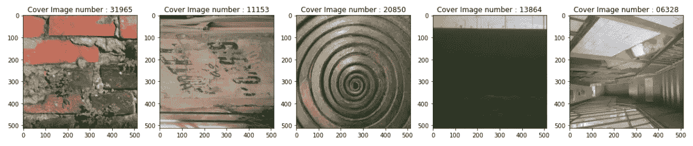
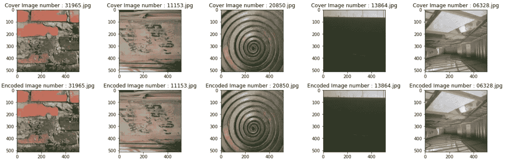
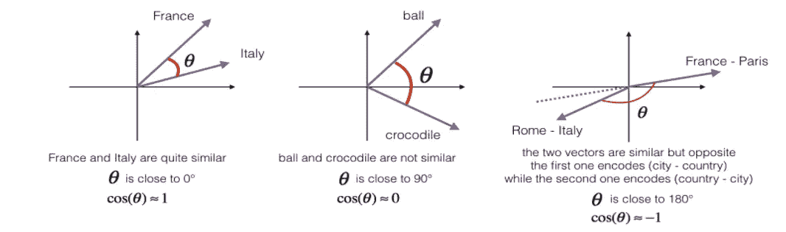
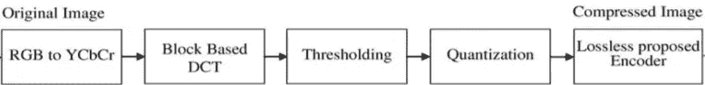
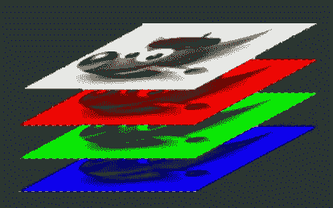
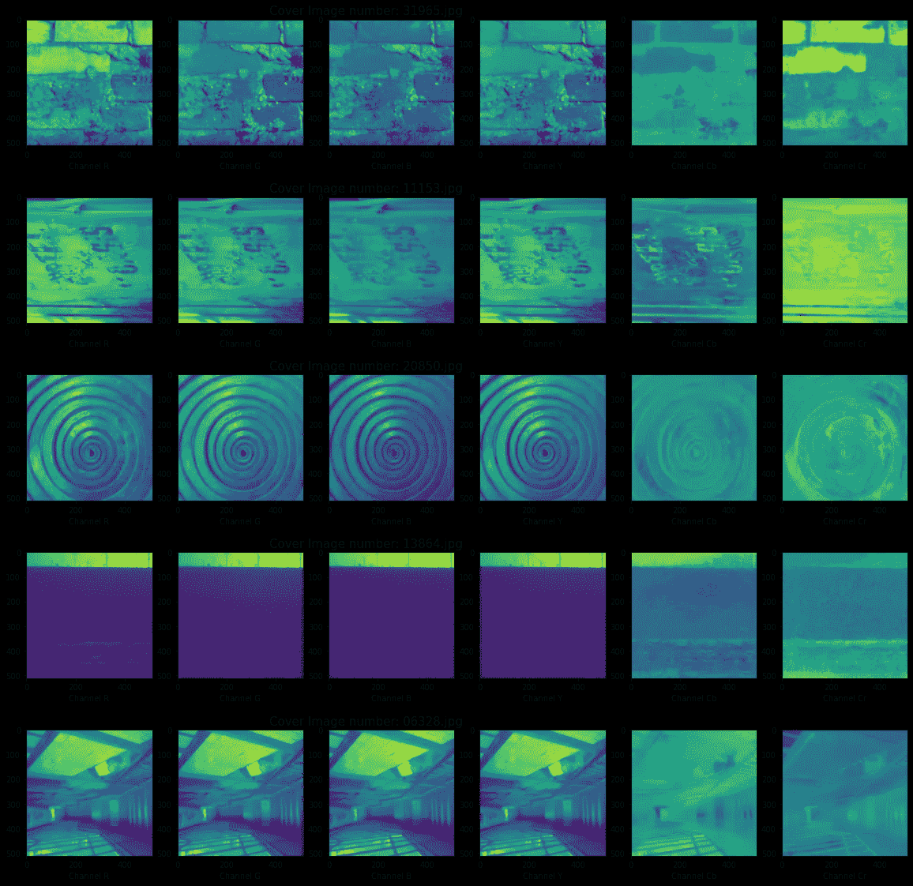

# CNN 隐写术和隐写分析

> 原文：<https://medium.com/geekculture/steganography-and-steganalaysis-with-cnn-9bd738dfed6f?source=collection_archive---------11----------------------->

Photo by [Markus Winkler](https://unsplash.com/@markuswinkler?utm_source=medium&utm_medium=referral) on [Unsplash](https://unsplash.com?utm_source=medium&utm_medium=referral)

你好。

欢迎来到本博客，在这里我们将学习隐写术和隐写分析，浏览相同内容中涉及的不同技术，并尝试深入研究各个方面。

目录

1.  介绍
2.  目标
3.  数据集概述
4.  探索性数据分析和特征选择
5.  JPEG 对隐写术的影响
6.  训练卷积神经网络
7.  结论
8.  参考
9.  未来的工作

# 1.介绍

> **什么是隐写术？**

隐写术是一种将秘密数据隐藏在普通的非秘密文件或消息中以避免被发现的技术；然后在目的地提取秘密数据。

像我一样，你们中的一些人可能想知道这听起来很像密码学，那么这两者之间到底有什么区别呢？

这里的关键区别是在密码术中使用“密钥”来将明文转换成密文，这将确保隐藏的消息不能被用户理解。而在隐写术中，信息以这样的方式隐藏，即覆盖粒子的结构不变，并且消息被隐藏的事实是未知的。

> **什么是隐写分析？**

隐写分析是使用隐写术检测隐藏数据的过程。隐写术和隐写分析类似于加密和解密。

# 2.目标

这个项目的最终目标是一个分类任务，在这个任务中，我们将建立一个可靠的系统，能够检测看似无害的数字图像中的秘密数据。

# 3.数据集概述

我们将使用一个来自 kaggle 竞赛的数据集，称为 ALASKA2 图像隐写分析。

该数据集由 75k 个封面图像组成，这意味着这些图像中没有嵌入隐藏信息。它还包括 75k 张图片，分别存放在 JMiPOD，JUNIWARD 和 UERD 文件夹中。这基本上是三种现代隐写术算法，这些文件夹中的图像看起来与封面图像完全一样，但凭借这些算法，其中嵌入了秘密信息。

我从竞赛组织者的简报中了解到，这些算法主要是将信息隐藏到图像的 DCT 系数中。我们将在后面的章节中讨论 DCT 系数的细节。

对于这个实验，我将只考虑 JUNIWARD 算法和分别来自 JUNIWARD 和封面图像文件夹的 7500 张图像。

# 4.探索性数据分析和特征选择

这将是本博客中最重要的部分，因为我们将学习隐写术和隐写分析的各个方面，并尝试检测稍后将用于训练我们的模型的特征。

首先，让我们导入此时所需的所有库(我们可能会继续添加一些库)

现在是时候想象封面图片了。这个代码片段定义并调用一个函数，该函数打开封面图像文件夹中的五个随机图像并显示它们。

在我们看一看 JUNIWARD(编码)数据之前，让我们使用一个有趣的模块，叫做 [**stegano**](https://pypi.org/project/stegano/) ，它是我在研究这个项目时发现的。

这里我们有一个使用 [**stegano**](https://pypi.org/project/stegano/) 的函数，它对文本和另一个名为 **essential_generators 的模块进行编码。**[**document generator**](https://pypi.org/project/essential-generators/)随机构造句子，我们将使用这些句子编码到我们的图像中。

在引擎盖下， [**stegano**](https://pypi.org/project/stegano/) 将我们的信息编码到图像的最低有效位(LSB)中。由于 LSB 的变化不会改变图像的外观，因此我们实现了隐写术的目标。

既然我们已经将句子编码到了这张图片中，我们现在可以阅读图片并提取句子。你可能会注意到，我还没有显示这些句子，以便我们可以在提取后第一次直接查看。

这很简单，对吧？原因是嵌入到 RGB 图像的 LSB 像素中是已经使用多年的传统方法。当然，像所有其他事情一样，隐写术领域已经发展了多年，像 JUNIWARD 这样的技术就是证明。

让我们现在显示这两组图像并检查它们。

正如你所看到的，用肉眼来看，这两组图像是完全一样的。让我们更深入地使用一个叫做余弦相似性的概念来检查这些图像的像素值。

> **余弦相似度是什么？**

余弦相似性是量化两个或多个向量之间的相似性的度量。它是矢量间夹角的余弦值。

This diagram shows us different vectors and explains the concept of cosine similarities between them.

余弦相似度为 1 表示两个向量完全相似。但是，在这种情况下，我们没有得到值 1，这告诉我们，编码的图像与原始封面图像略有不同，尽管在视觉上看起来是相同的。

现在我们已经结束了我们的 LSB 编码实验，让我们访问 JUNIWARD 文件夹，并尝试再次使用 [**stegano**](https://pypi.org/project/stegano/) 模块，看看我们是否可以直接解码它们。

我们的结果表明，在 JUNIWARD 图像中没有隐藏的文本编码，这显然是错误的。其原因是， [**stegano**](https://pypi.org/project/stegano/) 模块是为了检测图像 RGB 通道的 LSB 变化而构建的，在 JUNIWARD 的情况下，编码机制要复杂得多。

我在这里讨论的机制是在图像的 DCT 系数中隐藏秘密文本。这是我从比赛的讨论区学到的。

我们现在应该尝试转换图像的 RGB 像素，并将其转换为 DCT 系数，并使用这些系数作为训练模型的特征，对吗？这肯定是我们最初的直觉，但让我们用更多的 EDA 程序来证实这一点。

让我们对这些 JUNIWARD 图像调用余弦相似性函数并检查结果。

我们知道 JUNIWARD 算法使用 DCT 系数来隐藏文本，但在这种情况下，您可能会想知道为什么我们会在封面图像和 JUNIWARD 图像的 RGB 像素上获得余弦差异。

其主要原因是在 DCT 系数中隐藏文本对图像的 RGB 像素有不利影响。RGB 像素不会因为文本被隐藏而改变，而是受到 JUNIWARD 算法的影响。

基于这个有趣的证据，明智的做法是不要完全放弃使用 RGB 像素作为模型特征的想法。在研究了 DCT 系数之后，我们将再次讨论这个问题。

# 5.JPEG 对隐写术的影响

我在上一节提到了 DCT 系数，但没有明确定义它。本节将帮助我们解决这个问题。

我想每个阅读这篇文章的人都遇到过 JPEG 图像文件格式，但它不仅仅是一种文件格式，它是一种图像压缩算法。

这些是算法的组成部分。或者我们的用例，我们将考虑前两个模块。

> **什么是 RGB 通道？**

在屏幕上显示彩色图像时，每个像素都有一个特定的 RGB 值。在 24 位颜色中，该值介于 0 和 255 之间，其中 0 表示没有颜色，255 表示完全饱和)。

A constructed image with RGB channels

> **什么是 YCbCr 渠道？**

Y 通道表示图像中光线的强度。该通道对人眼更敏感，因此比 Cb 和 Cr 通道更突出。

Cb 通道显示相对于绿色分量的蓝色分量，Cr 通道显示相对于蓝色分量的红色分量。

这里的想法是以这样一种方式压缩我们的原始图像，使得差异对于观看者来说是微不足道的。

让我们并排绘制这些通道的封面图像，并观察其差异。

我们现在可以观察到，Y 通道完全不同于 Cb 和 Cr 通道，并且在这些通道中实现了压缩的目的。

现在让我们转到 JPEG 压缩算法块，其中 JUNIWARD 算法隐藏了秘密文本。

> **什么是离散余弦变换？**

这是一种允许将信号转换成基本频率分量的技术。这是一种有损算法，它试图丢弃高频分量，保留人眼更敏感的“重要”低频分量。

DCT 系数似乎是一个真正安全的图像版本，可以用来进行隐写术，因为我们必须通过 RGB 和 YCbCr 通道才能到达它。

现在我们知道了 **DCT 系数**，让我们将封面和 JUNIWARD 图像转换成它们的 **DCT 系数**，以检查我们是否可以将它用作我们模型的特征。

事实证明，尽管秘密信息隐藏在 DCT 系数中，但 JUNIWARD 算法确保编码后的系数尽可能与覆盖系数相似。

这些值为我们提供了比 RGB 像素中看到的余弦相似性更高的余弦相似性。使用 RGB 像素作为我们的特征将是一个好主意。

# 6.训练卷积神经网络

既然我们已经清楚了将要使用的特性，让我们来构建我们的训练数据。在这一节的最后，我们将预测一个给定的图像中是否嵌入了任何秘密文本。

在这里，我通过将 0 设置为封面图像，将 1 设置为 JUNIWARD 图像来创建标签。还调整图像大小，以避免我们可能遇到的内存耗尽错误。

最终的 dataframe 被转换成一个 numpy 数组，以便更容易输入到我们的模型中。

现在是时候定义我们的模型了，在此之前我们需要从 keras 导入一些函数。

我们的模型是由 Conv2D、MaxPooling2D 和 BatchNormalization 块组成的多层序列模型。我们将使用均方差来衡量我们的损失，并将使用 adam 作为我们的优化器。

我们的模型是在 80%的数据集上训练的，而 20%被留在一边用于验证。20 个时期后，训练损失下降到 0.2373，验证损失为 0.3924。

# 7.结论

> **从这篇博客中可以学到什么？**

更重要的是，这个博客显示了 EDA 和特性选择的重要性。此外，对我们的数据集进行详细研究并在此过程中探索新概念总是一个额外的优势。

# 8.参考

—[https://www . ka ggle . com/tanulsingh 077/steg analysis-complete-understanding-and-model](https://www.kaggle.com/tanulsingh077/steganalysis-complete-understanding-and-model)

—[https://www . ka ggle . com/rishabhdhiman/updated-AUC-DCT-离散余弦变换](https://www.kaggle.com/rishabhdhiman/updated-auc-dct-discrete-cosine-transform)

—[https://medium.com/breaktheloop/what-is-ycbcr-964fde85eeb3](/breaktheloop/what-is-ycbcr-964fde85eeb3)

# **9。未来工作**

在未来，我想建立一个端到端的模型，不仅可以检测是否有秘密消息，还可以尝试解码该消息。

此外，我想更多地研究现代隐写术技术，同时比较它们并衡量它们的效率。

希望你喜欢阅读这个博客。

谢谢大家！