# 使用 Azure DevOps 和 Azure Machine Lerning 为数据科学项目逐步配置 CI/CD

> 原文：<https://medium.com/geekculture/step-by-step-ci-cd-configuration-for-a-data-science-project-with-azure-9ee9a8f563d4?source=collection_archive---------11----------------------->

## 数据科学项目的不同部分有许多工具和服务，但是有效管理所有项目步骤的最好方法是在一个工作空间中工作。我将逐步展示如何在 Azure 中实现。

Photo by [Pietro Jeng](https://unsplash.com/@pietrozj?utm_source=medium&utm_medium=referral) on [Unsplash](https://unsplash.com?utm_source=medium&utm_medium=referral)

任何数据科学项目都有两部分工作:数据科学家构建 ML 模型，开发人员构建应用程序/web 服务并将其交付给最终用户使用。在本文中，我将描述如何为一个数据科学项目实现连续集成和连续交付(CI/CD)管道，该项目将 ML 模型嵌入到应用程序源代码中。

在 Azure DevOps 中创建新项目:

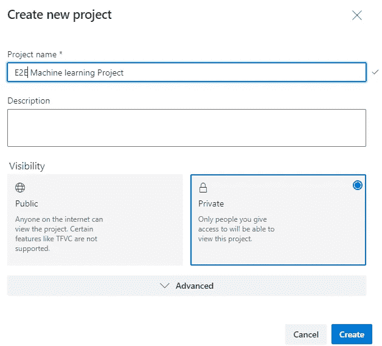

Step 1 New project (Image by Author)

我们也可以使用 [Azure DevOps 演示生成器](https://azuredevopsdemogenerator.azurewebsites.net/?name=machinelearning)在您的 Azure DevOps 组织上提供项目。该 URL 将在演示生成器中自动选择 Azure 机器学习模板。此模板包含机器学习项目的代码和管道定义，演示如何自动化端到端 ML/AI 项目。

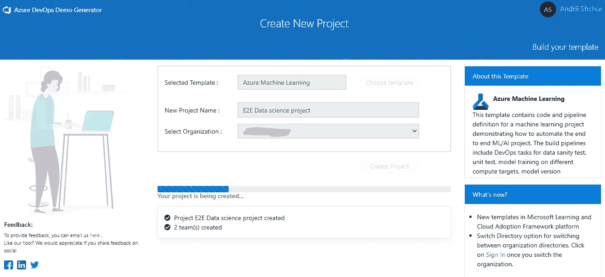

Step 1 New project from Azure demo (Image by Author)

然后，我们需要创建一个服务连接。点击进入**设置>服务连接>创建服务连接。**

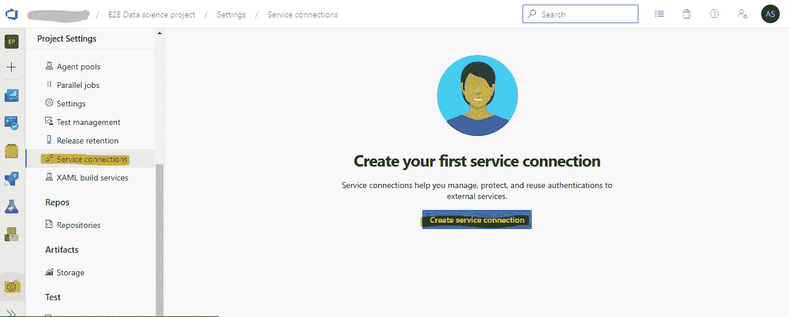

Service connection (Image by Author)

让我们选择 Azure 资源管理器，关于 Azure 服务连接的更多细节可以在[文档](https://docs.microsoft.com/en-us/azure/devops/pipelines/library/service-endpoints?view=azure-devops&tabs=yaml)中找到。

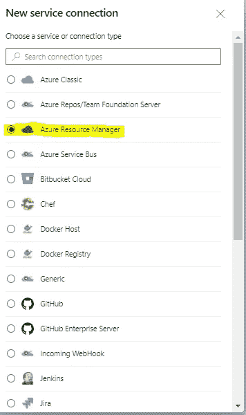

Service connection types (Image by Author)

然后选择身份验证方法:

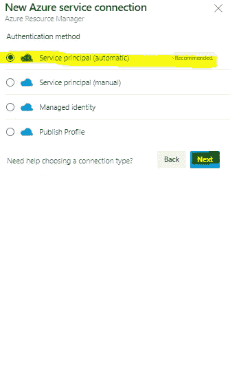

Authentication method (Image by Author)

最后填写所有信息，通过[在 Azure 门户生成](https://portal.azure.com/#blade/Microsoft_Azure_ClassicResources/PublishingProfileBlade)发布设置即可。

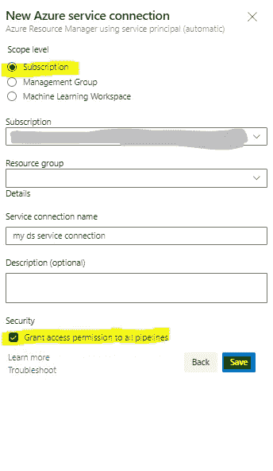

Azure service connection form (Image by Author)

因此，您会在服务连接列表中看到它。

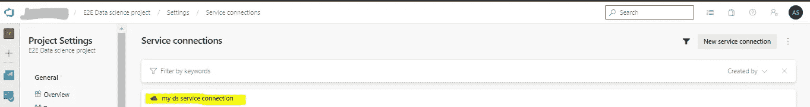

Service connections list (Image by Author)

现在，我们准备为我们的数据科学项目配置 CI/CD 管道。首先，我想稍微定义一下数据科学项目的 CI 和 CD 的定义。

大多数数据科学项目由以下步骤组成:

*   数据收集
*   特征抽出
*   数据清理和预处理
*   数据有效性
*   模型结构
*   模型检验
*   模型部署

所有这些步骤都由不同的团队成员执行—数据工程师、数据/业务分析、数据科学家、机器学习工程师、ML Ops 工程师、…工程师…

对这些步骤的任何更改都可能影响整个流程。这就是为什么我们需要使用 CI/CD 来避免给最终用户带来任何问题。

在数据科学项目**持续集成**中，这是我们想要重新训练模型的一个步骤。首先，我们创建一个分支，训练一个模型并提交对分支的更改，然后一个自动化的过程将在一个特定的环境中构建您的代码，并运行测试。成功的 CI 意味着定期构建和测试应用程序的新代码更改。

**连续交付**的目标是拥有一个随时准备在生产环境中部署的代码库。这意味着新的代码/模型已经准备好了，团队的其他成员可以访问它。

**持续部署**可以指将开发人员的变更从存储库自动发布到产品中，供客户使用。

先说**持续集成。**导航至管道。

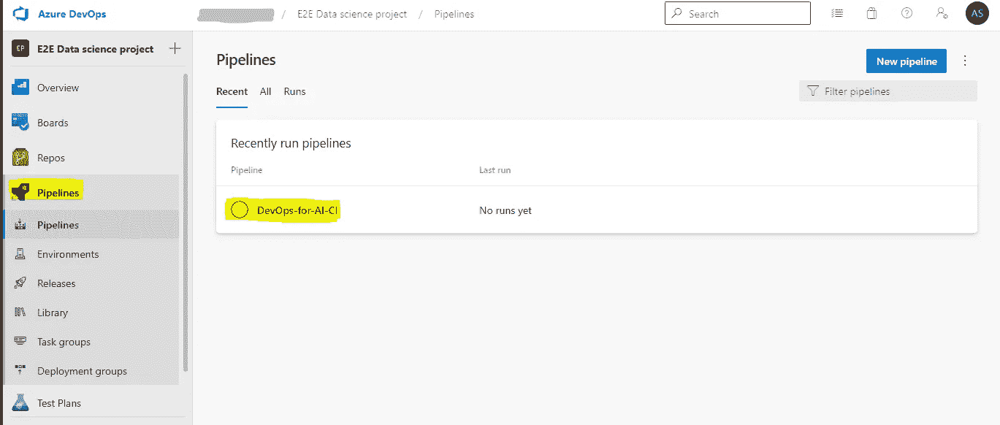

Step 2 Select Pipeline (Image by Author)

选择 **DevOps-for-AI-CI** 并点击**编辑**或创建**新管道**。

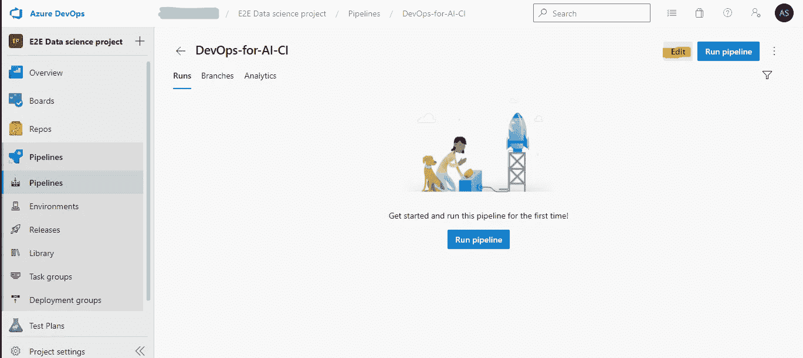

Step 2 Edit Pipeline (Image by Author)

管道将如下所示:

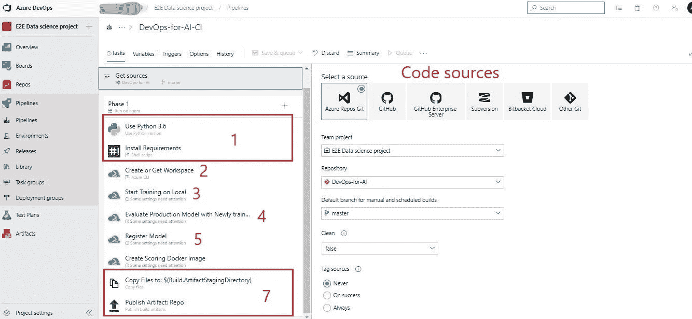

Pipeline steps (Image by Author)

首先，我们需要定义我们的代码库存储在哪里。我的情况是 Azure DevOps。

这个管道的第一步是准备运行所有后续脚本的环境。

第二步是在 Azure 中创建或使用现有的环境，或者我们可以使用 Local，但这是可选的。我们需要定义我们之前创建的 Azure 服务连接，并从我们负责 Azure 服务创建和配置的代码库中选择脚本。

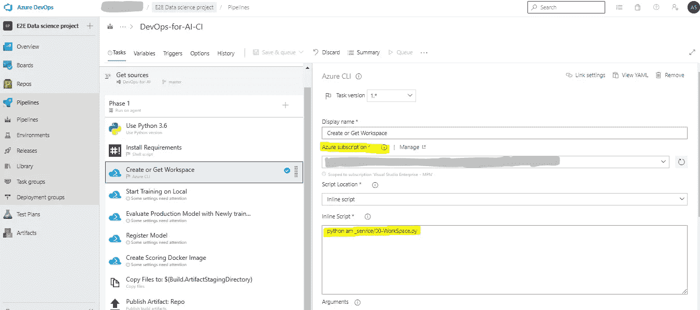

Create and config Workspace (Image by Author)

第三步是模型训练。我们还需要定义 Azure 服务连接和脚本，我们将在上一步创建的工作区中执行它们。

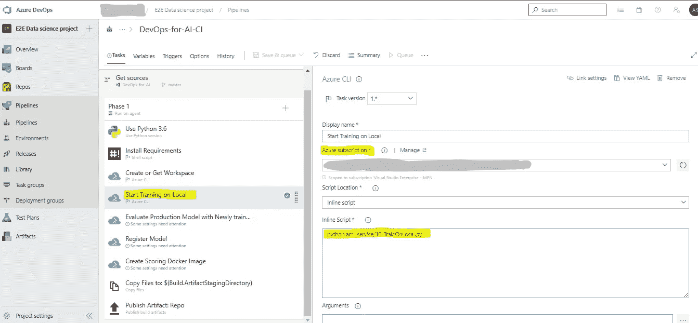

Model training step (Image by Author)

第四步是评估和选择最佳模型。我们还需要定义我们将执行的 Azure 服务连接和脚本。

Models evaluation step (Image by Author)

第四步，注册(保存我们预先训练好的模型)。我们还需要定义我们将执行的 Azure 服务连接和脚本。

Register Model (Image by Author)

我们需要编辑的最后一步是创建作用域 Docker 映像，以便在 CD 步骤中使用它。我们还需要定义我们将执行的 Azure 服务连接和脚本。

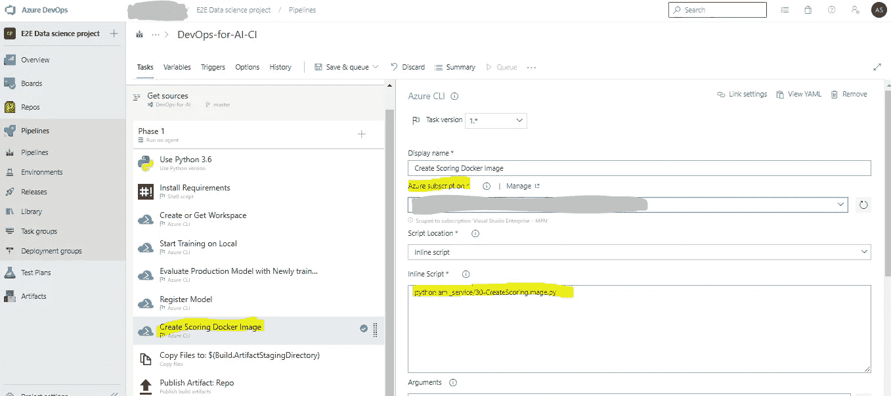

Create Scoring Docker Image (Image by Author)

因此，在 CI 中，我们将执行:

*   准备 python 环境
*   获取或创建反洗钱服务工作区
*   在远程 DSVM /本地 Python Env 上提交训练作业
*   比较不同型号的性能并选择最佳型号
*   将模型注册到工作区
*   为评分 Web 服务创建 Docker 图像
*   复制并发布工件以发布管道

是时候配置我们管道的 **CD** 部分了。在本练习中，我们将配置发布管道，该管道将把从构建管道创建的映像部署到 Azure 容器实例和 Azure Kubernetes 服务

点击**发布** > **部署 Webservice** > **编辑**

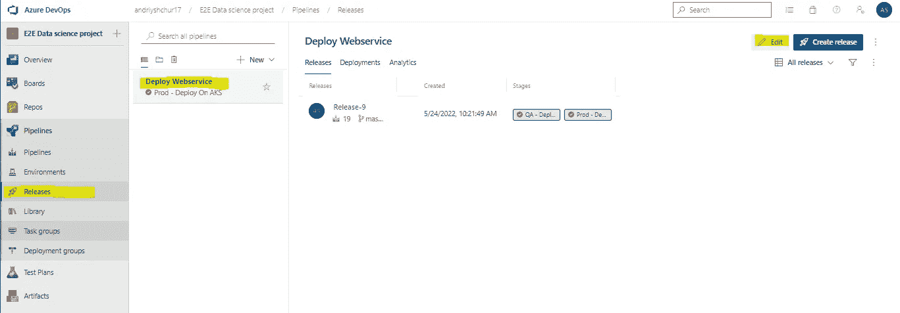

Config **CD** (Image by Author)

我们需要在 QA 和 Prod 阶段做一些改变。

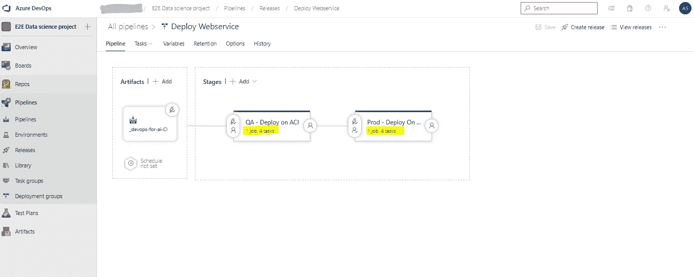

Pipeline editing (Image by Author)

我们需要做的是:

1.  选择适当的阶段
2.  在每个阶段，我们将配置:

2.1 Azure 订阅

2.2 我们想要运行的 Python 脚本

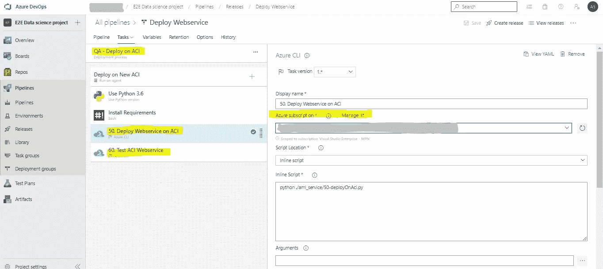

QA stage tasks example (Image by Author)

就这样，我们准备运行并检查整个 CI/CD 管道。在这个例子中，我们有一个触发器，在向主分支提交任何新的更改之后运行它。所以，我们可以改变两件事:

1.  更改 Azure CLI 版本

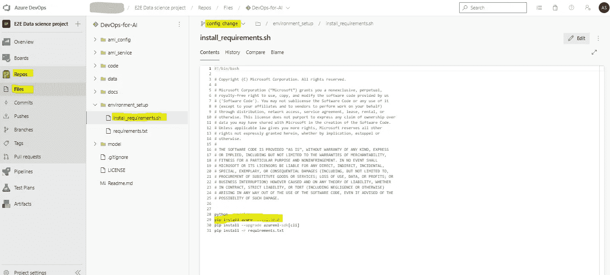

Azure CLI version change (Image by Author)

2.添加订阅 id

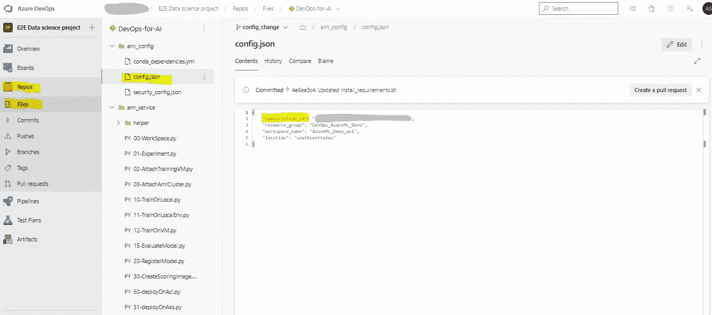

Add subscription_id (Image by Author)

然后我们需要保存当前分支中的所有更改，并对主分支进行 PR。配置项管道将在 PR 合并后自动运行。

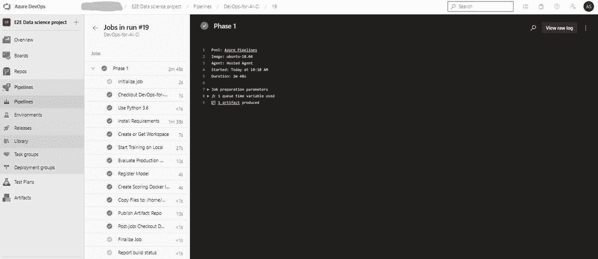

CI pipeline (Image by Author)

然后 CD 会自动运行 QA 阶段管道，Prod 阶段需要批准。所有这些我们都可以按照自己的意愿轻松配置。

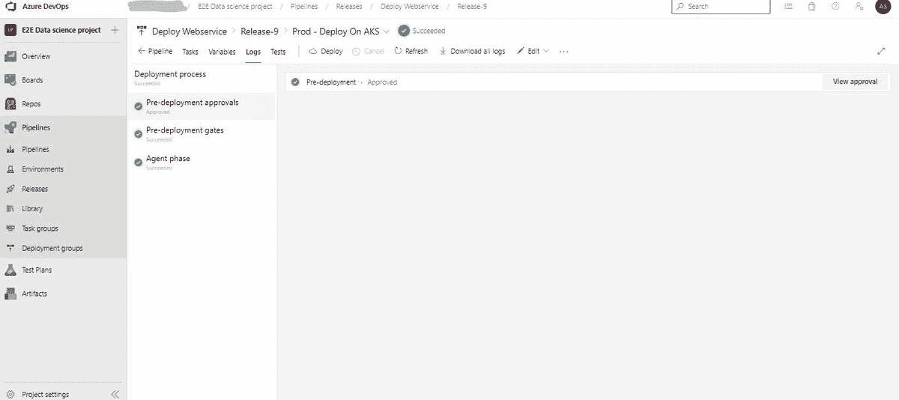

CD pipeline (Image by Author)

因此，我们将在 Azure 中提供所有服务。

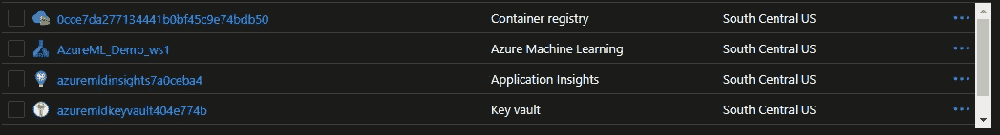

Azure services (Image by Author)

**结论**

Azure DevOps 和机器学习服务是管理所有数据科学步骤的整个周期的非常好的工具。有了这个工具，我们可以创建 CI/CD 流程并管理其中的每个细节。

## 参考

*   [蔚蓝 DevOps](https://docs.microsoft.com/en-us/azure/devops/user-guide/what-is-azure-devops?toc=%2Fazure%2Fdevops%2Fget-started%2Ftoc.json&bc=%2Fazure%2Fdevops%2Fget-started%2Fbreadcrumb%2Ftoc.json&view=azure-devops)
*   [蔚蓝机器学习](https://docs.microsoft.com/en-us/azure/machine-learning/overview-what-is-azure-machine-learning)

*你还可以在我之前的文章中再找到一个例子——*[*使用 Azure DevOps 的 CI/CD 管道进行数据科学项目*](https://towardsdatascience.com/ci-cd-pipeline-with-azure-devops-for-data-science-project-f263586c266e) *。*