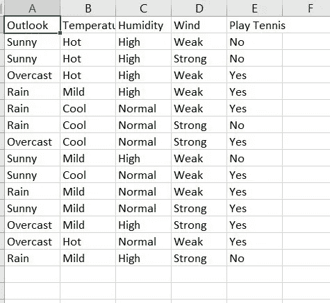
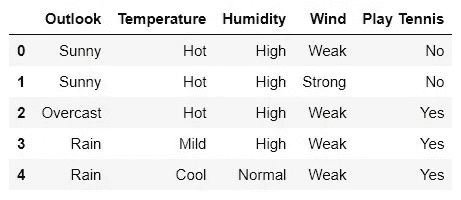
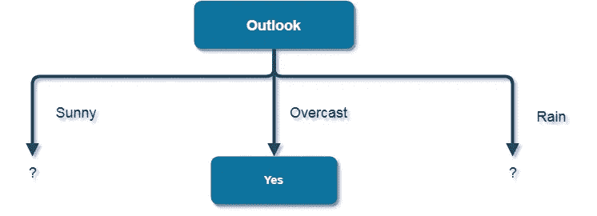
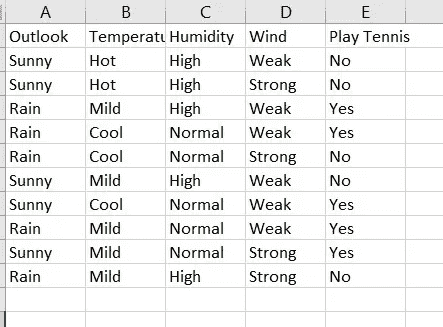
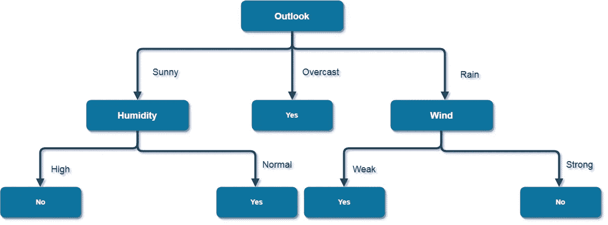
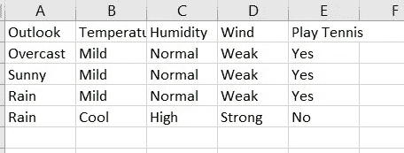

# 分步决策树:Python 中从头开始的 ID3 算法[没有花哨的库]

> 原文：<https://medium.com/geekculture/step-by-step-decision-tree-id3-algorithm-from-scratch-in-python-no-fancy-library-4822bbfdd88f?source=collection_archive---------0----------------------->

我们都知道决策树的算法:ID3。我们中的一些人可能已经出于学术目的用数学方法完成了算法。如果你还没有，没关系，在这里我们也将讨论基础知识。该算法非常简单明了。所以，我们开始吧！

# 目标:

1.  了解 **ID3 算法**的基础知识
2.  用 python 加载 *csv* 数据，(使用*熊猫*库)
3.  使用 **ID3 算法**从头开始训练和构建**决策树**
4.  从树上预测
5.  找出准确性

# 步骤 1:观察数据集

首先，我们应该查看我们的数据集，*‘打网球*’。这是一个非常著名的数学例子数据集。是啊！你猜对了！我们将使用这个简单的数据集，以便您可以更容易地理解 python 实现。
数据集的链接:[**https://www.kaggle.com/tareqjoy/trainplaytennis**](https://www.kaggle.com/tareqjoy/trainplaytennis)



Table 1: Play Tennis Dataset

> *观察数据集后我们可以说:*
> ***特征*** : *展望、温度、湿度、*
> ***标签*** : *打网球(我们要预测的输出特征)*
> ***类*** : *是，否(标签的唯一值)*

# 步骤 2:导入必要的基本 python 库

我们将使用 *pandas* 操作数据集，使用 *numpy* 库进行数学计算。

# 步骤 3:读取数据集

我们将读取数据集(csv 文件)并将其加载到 pandas dataframe 中。下面可以看到， *train_data_m 是*我们的数据帧。
用*data frame 的 *head()* 方法我们可以查看前 5 行。*

*输出将是:*

**

*The output of head() method*

# *步骤 4:计算整个数据集的熵*

*在数学中，我们必须首先计算整个数据集的熵，如下所示:*

```
*Total row = 14
Row with "Yes" class = 9
Row with "No" class = 5Complete entropy of dataset is -
H(S) = - p(Yes) * log2(p(Yes)) - p(No) * log2(p(No))
     = - (9/14) * log2(9/14) - (5/14) * log2(5/14)
     = - (-0.41) - (-0.53)
     = 0.94*
```

*所以，这里我们将和上面的等式做同样的事情。*

> **方法描述:
> 计算整个数据集的熵。* ***train _ data****:熊猫 dataframe* ***label****:string，data frame 的标签名称(=* 打网球*)* ***class _ list****:list，标签的唯一类别(=[* Yes *，* No
> ***返回*** *:浮点，计算整个数据帧的熵(=0.94)**

# *步骤 5:计算过滤数据集的熵*

*使用步骤 1 的表格，特征 ***前景*** 的数学计算如下:*

```
*Categorical values of Outlook - Sunny, Overcast and RainTotal count of row containing:
  Sunny = 5
  Sunny & Yes = 2
  Sunny & No = 3>> H(Outlook=Sunny) = -(2/5)*log(2/5)-(3/5)*log(3/5) = 0.971Total count of row containing:  
  Rain = 5
  Rain & Yes = 3
  Rain & No = 2>> H(Outlook=Rain) = -(3/5)*log(3/5)-(2/5)*log(2/5) = 0.971Total count of row containing:  
  Overcast = 4
  Overcast & Yes = 4
  Overcast & No = 0>> H(Outlook=Overcast) = -(4/4)*log(4/4)-0 = 0*
```

*注意:我们必须对所有的特征做同样的处理，比如****湿度*** 等等。
等效的 Python 实现如下所示:**

> ***方法描述:
> 计算特定特征的熵=值。* ***feature _ value _ data:****一个熊猫数据帧，它包含了一个特性的特定值的数据(例如。仅带有*Outlook**=**)* ***标签的数据:*** *字符串，dataframe 的标签名称(=* 打网球*)* ***class _ list:*
> ***返回:*** *浮点，计算特征值 dataframe 的熵(例如。对于*展望**=*晴天*，返回 0.971)*******

# ***步骤 6:计算特征的信息增益***

***在计算熵之后，我们必须计算该特征的信息增益。在数学上，首先我们要这样计算那个特征的信息:(对于特征 ***展望*** *)****

```
***I(Outlook) = p(Sunny) * H(Outlook=Sunny) + p(Rain) * H(Outlook=Rain) + p(Overcast) * H(Outlook=Overcast)
= (5/14)*0.971 + (5/14)*0.971 + (4/14)*0
= 0.693***
```

***然后，我们必须从数据集的总熵中减去它，总熵就是特征的信息增益。***

```
***Information Gain = H(S) - I(Outlook)
                 = 0.94 - 0.693
                 = 0.247***
```

***在 python 中，我们这样做了:***

> ****方法描述:
> 计算一个特征的信息增益。* ***feature _ name:****string，我们要查找信息增益的特征的名称(例如。*Outlook*)* ***train _ data:****a pandas dataframe* ***label:****string，data frame 的标签名称(=* 打网球*)* ***class _ list:****list* *****返回:*** *计算特征的信息增益(例如。对于*展望*，返回 0.247)******

# ***第 7 步:寻找信息最丰富的特征(信息增益最高的特征)***

***像 ***Outlook*** 特征一样，我们必须计算数据集中每个特征的信息增益。然后，我们必须选择具有最高信息增益的特征。经过数学计算后，我们将得到如下数值:***

```
***Information gain:
  Outlook = 0.247 (Highest value)
  Temperature = 0.0292
  Humidity = 0.153
  Wind = 0.048***
```

***由于特征 ***Outlook*** 的值最高，所以它将被选为我们的树节点。***

> ****方法描述:
> 从当前数据集中寻找最有信息的特征。* ***train _ data:****a pandas dataframe* ***label:****string，data frame 的标签名称(=* 打网球*)* ***class _ list:****list*
> ***返回:*** *字符串，特征名****

# ***步骤 8:向树中添加节点***

***因为我们已经找到了具有最高信息增益的特征名称，所以我们必须在树中生成一个节点，并将其值作为分支。比如我们选择了 ***Outlook*** ，那么我们就要在树中添加 ***Outlook*** 作为节点，其值*晴天*或*下雨*或*阴天*作为分支。***

*****如果任何特征值仅代表一个类别(例如只有 Play Tennis = 'Yes '或' No '的行，我们才能说特征值代表一个纯类。如果值不代表纯值，我们必须进一步扩展它，直到我们找到一个纯类。*****

```
***Outlook is selected as Node.
(Outlook = Sunny): Not pure class, contains both class Yes and No
(Outlook = Overcast): Pure class, contains only one class Yes
(Outlook = Rain): Not pure class, contains both class Yes and No***
```

******

***The generated tree after finding Outlook***

***在选择了**一个纯类*** 之后，我们必须从数据集中删除对应于特征值的行。例如:我们必须删除前景为*=*的行。生成的数据集如下所示:*****

********

****The updated dataset (Without Outlook = Overcast)****

> ****注意:我们必须在下一次迭代中使用更新的数据集。《出埃及记》为了获得信息，我们必须将它用作 train_data****

****等效的代码将是:****

> *****方法描述:
> 生成特征的子树，并从数据集中删除 feature = value。该树可能包含“？”如果树节点不是一个纯类，则作为一个值。* ***feature _ name:****string，我们要添加到树和收缩数据集的特征的名称(例如。*Outlook*)* ***train _ data:****a pandas dataframe* ***label:****string，data frame 的标签名称(=* 打网球*)* ***class _ list:****list******返回:*** *元组(dictionary，dataframe)，树节点及其分支和更新的数据集*******

# ***步骤 9:执行 ID3 算法并生成树***

***现在，我们应该集合应该递归执行**步骤 4** — **步骤 8** 的方法。所以，总的步骤是:***

*   ***寻找信息最丰富的特征***
*   ***制作一个以特征名和特征值作为分支的树节点
    -如果是纯类，添加叶节点(=类)到树节点
    -如果是不纯类，添加可扩展节点(= '？')到树节点***
*   ***根据纯类收缩/更新数据集***
*   ***将带有分支的节点添加到树中***
*   ***展开下一个不纯类的分支(= '？')和更新的数据集***

***递归端点:***

*   ***更新后，数据集变为空***
*   ***没有可扩展的分支***

> ****方法描述:
> 使用字典中的字典生成树。树的叶节点将是要素值=类名。结果树通过引用返回。* ***root:****字典，将包含通过递归子树得到的结果树，最初应该是一个空字典，递归调用后应该包含结果* ***prev _ feature _ value:****任意数据类型(Int 或 Float 或 String 等。)取决于先前特征的数据类型，所指向的节点/特征的先前值，最初应该是 None* ***train _ data:****a pandas dataframe* ***label:****string，data frame 的标签名称(=*Play Tennis【T31)
> ***class _ list:******

# ***步骤 10:找到标签的唯一类别并开始算法***

***首先，我们需要了解预期的树应该是什么:***

******

***The complete tree***

***找到类名后，我们可以开始调用 ID3 的递归树构建算法。***

> ****方法描述:
> 生成 id3 树。* ***train _ data _ m:****a pandas dataframe* ***label:****string，data frame 的标签名称(=* 【打网球】*)* ***returns:******

****我们可以这样开始 id3:****

****如果我们打印出*树*我们可以看到:****

```
****{
   'Outlook': 
   {
       'Rain': 
       {
           'Wind': 
           {
               'Strong': 'No', 
               'Weak': 'Yes'
           }
        },
       'Sunny': 
       {
           'Humidity': 
           {
               'High': 'No', 
               'Normal': 'Yes'
           }
       },
       'Overcast': 'Yes'
    }
}****
```

****树/字典的根是 ***Outlook*** *。*key 的值是另一个字典，其中 key 对应于特性的值(= ' *Rain* '，'*阴天*'，' *Sunny* ')等等。在每个嵌套字典的末尾是一个类名(= ' *Yes* '，' *No* ')。
我们可以看到生成的树与预期的输出完全相同。所以，我们的算法非常有效！****

# ****步骤 11:从树中预测****

****我们已经生成了树。现在，我们可以用树来预测。我们将递归遍历嵌套字典，直到找到任何叶节点(=类)。请记住，字典的关键字是特性名称，它是字符串的数据类型，值或者是字典，这意味着我们必须更多地遍历树，或者是任何基本的数据类型，如字符串、整型或浮点型，这取决于类数据类型，这意味着它是一个叶节点。****

****如果我们想预测**前景** = ' *雨*和**风** = ' *强*'，我们必须像这样遍历字典:****

```
****tree[‘Outlook’][‘Rain’][‘Wind’][‘Strong’]****
```

> *****方法描述:
> 从生成的树中预测使用特征集/实例* ***树:*** *字典(of dictionary)，决策树* ***实例:*** *一行或快照或数据集的特征集。该行不能包含标签* ***返回:*** *任何数据类型(Int、Float 或 String 等。)根据类的数据类型，预测的类*****

# ***步骤 12:评估测试数据集***

***为了评估模型，即树，我们需要一个带标签的测试数据集。然后，在预测之后，我们可以计算实际值和预测值之间的百分比差异。***

> ****方法描述:
> 通过对照预期结果进行测试来评估 id3 树的准确性* ***树:*** *字典(的字典)，决策树* ***test _ data _ m:****一个熊猫数据帧/测试数据集* ***返回:*** *float，树的准确性****

# ***步骤 13:检查测试数据集并评估它***

***测试数据集如下所示:***

******

***The test dataset***

***测试数据集的链接:[**https://www.kaggle.com/tareqjoy/testplaytennis**](https://www.kaggle.com/tareqjoy/testplaytennis)
在这里，*打网球*标签作为预期输出，它将用于找出与预测输出的差异。***

***如果我们打印准确度，我们将得到 1.00，这意味着我们的准确度是 100%正确的。但是，在大型数据集中，精确度可能不是这样。***

***感谢阅读。***

***你可以点击这个 **Kaggle** 链接查看例子的全部代码(包括数据集):***

***[](https://www.kaggle.com/tareqjoy/easy-id3) [## Easy_ID3

### 使用 Kaggle 笔记本探索和运行机器学习代码|使用来自多个数据源的数据

www.kaggle.com](https://www.kaggle.com/tareqjoy/easy-id3) 

整个数学解释:

[](https://iq.opengenus.org/id3-algorithm/) [## 利用 ID3 算法构建决策树预测天气

### ID3 算法，代表迭代二分法 3，是一种遵循贪婪方法的分类算法…

iq.opengenus.org](https://iq.opengenus.org/id3-algorithm/) 

在 Linkedin 上找到我:

[https://www.linkedin.com/in/tareqjoy/](https://www.linkedin.com/in/tareqjoy/)***