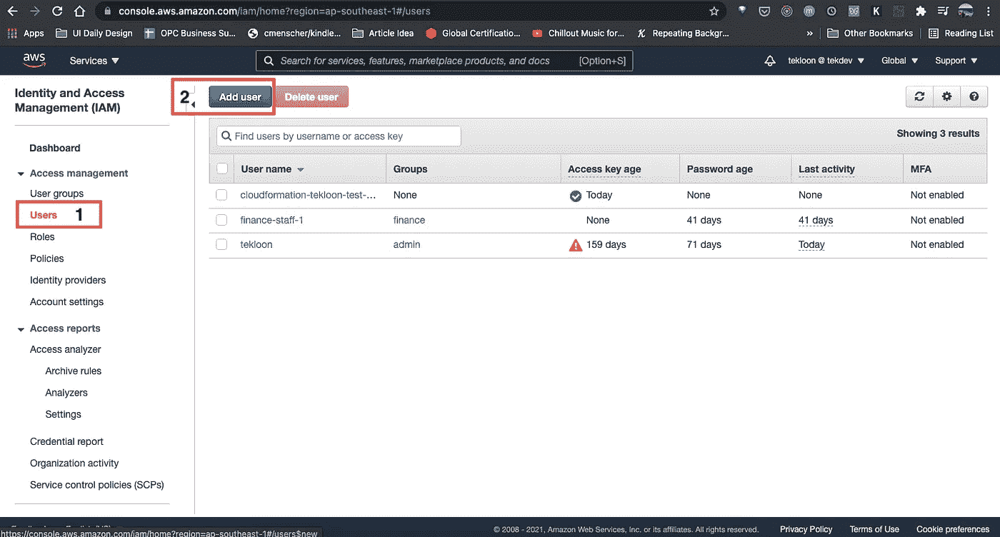
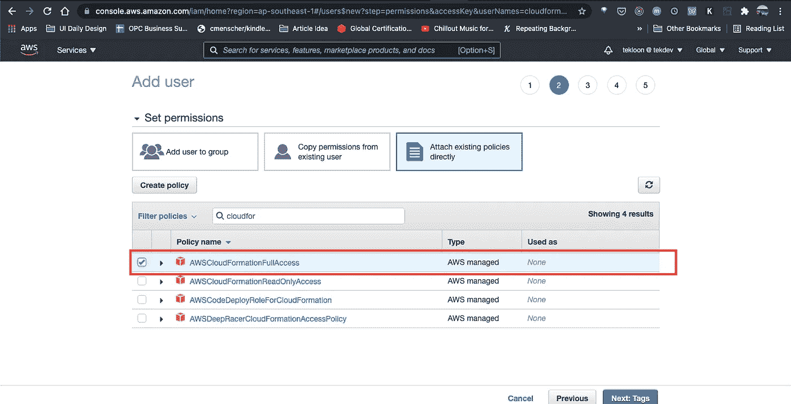
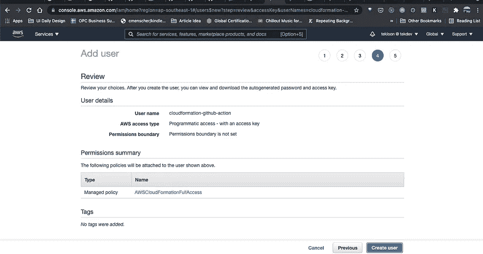
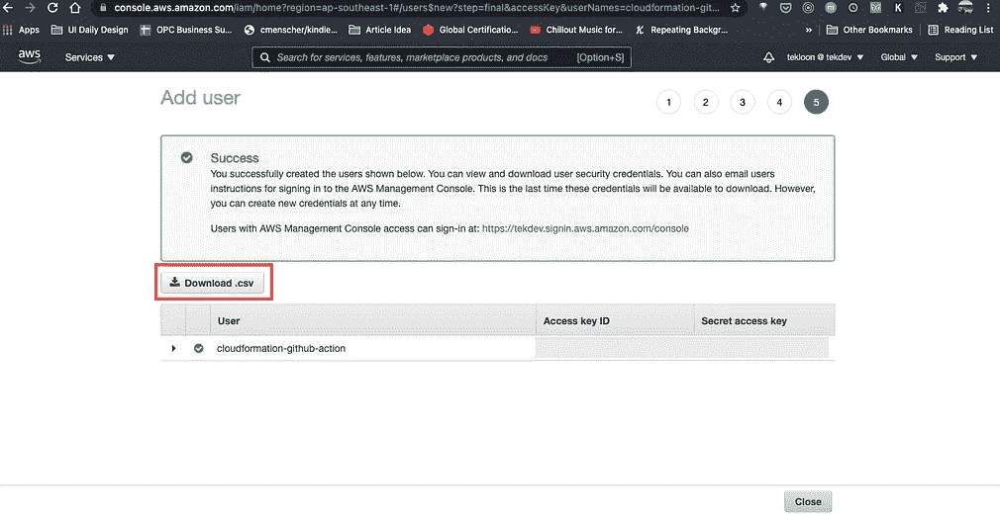

# 为 Github 操作设置 CloudFormation IAM 用户的分步指南

> 原文：<https://medium.com/geekculture/step-by-step-guide-on-setting-up-cloudformation-iam-role-for-github-actions-cb227234a58b?source=collection_archive---------21----------------------->

Photo by [Jakob Owens](https://unsplash.com/@jakobowens1?utm_source=medium&utm_medium=referral) on [Unsplash](https://unsplash.com?utm_source=medium&utm_medium=referral)

过去几周，我写了几篇关于 AWS CloudFormation 的文章。由于 AWS CloudFormation 也被称为代码基础设施，所以每当我更改 CloudFormation 模板时，我很想了解如何自动化部署。

所以在这篇文章中，我将分享**的分步指南**来创建一个 IAM 角色，Github Action 稍后将使用它来部署 CloudFormation 堆栈。

**事不宜迟，我们开始吧**。

# 步骤 1-转到 IAM 仪表板并添加用户

首先，让我们访问 AWS [IAM 仪表板](https://console.aws.amazon.com/iam/home)。然后，点击左侧导航栏中的“**用户**”，然后点击“**添加用户**”，如下图所示。

# 步骤 2 —设置用户的编程访问权限

在步骤 2 中，我将输入该用户的用户名，并将访问类型设置为**编程访问**。

该用户将仅使用 AWS API 和 SDK 工具来构建和部署云形成堆栈。因此，我们不需要授予该用户对 AWS 管理控制台的访问权限。

# 步骤 3 —将 CloudFormation 完全访问策略附加到用户

现在，我将把**AWSCloudFormationFullAccess**策略分配给 IAM 用户，因为它需要权限来创建/更新 CloudFormation 堆栈。

> 此外，如果您计划通过 CloudFormation 创建 EC2 实例，您还需要将 **AWSEC2FullAccess** 策略分配给 IAM 用户。
> 
> 这是因为 CloudFormation 权限仅用于 CloudFormation 操作，而 EC2 实例等底层资源需要 EC2 相关的权限。

# 第 4 步—审查用户并下载。凭据的 csv 文件

在此步骤中，我们将查看用户创建并下载包含已创建用户凭证的`.csv`文件。

`csv`文件包含**访问密钥 ID** 和**访问密钥秘密**，我们将在 Github 动作中使用它们，这有助于我们自动化 CloudFormation 部署。更多详情请参考下面的截图。

> 最关键的部分是下载 csv 文件。因为如果你没有在最后一步下载它，并且忘记了密钥。你不可能拿回**访问密钥秘密**。您需要重新创建一组新的**访问密钥 ID** 和**访问密钥秘密。**

# 结论

在这篇文章中，我分享了如何使用 AWS IAM Dashboard 为 CloudFormation 部署创建 IAM 角色。

在下一篇文章中，我将分享如何在 Github Action 中使用我们在这篇文章中创建的 IAM 角色。下面提供了链接。

 [## 如何使用 Github Action 部署 AWS CloudFormation 堆栈

### 使用 Github Action 部署 CloudFormation 堆栈既简单又有趣

aws .平原英语. io](https://aws.plainenglish.io/how-i-deploy-aws-cloudformation-stack-using-github-action-7f3e8a46fdfa) 

感谢您的阅读。