# 用 Python 构建逻辑回归模型的分步指南

> 原文：<https://medium.com/geekculture/step-by-step-guide-to-build-a-logistic-regression-model-in-python-ca42577733fb?source=collection_archive---------3----------------------->

## 在这篇文章中，我将演示如何从第一步开始，以简单明了的方式构建一个逻辑回归模型。

Photo credits — [Carlos Muza](https://unsplash.com/@kmuza) on Unsplash

高科技公司正变得日益流行。他们已经改变了曾经只能通过教室获得的教育理念。在世界受到当前疫情的打击后，这些公司不仅在投资方面获得了良好的数字，而且创造引人入胜和高度个性化的学习体验的压力也是巨大的。

在本文中，我们将关注一家销售在线课程的教育技术公司，该公司正面临销售线索转化率非常低的问题。那么机器学习如何解决这个问题呢！！让我们看看..

因此，这家公司销售在线课程，并通过各种渠道获得潜在客户，但很少(比如 30%)的潜在客户会转化为付费候选人。我们的目标是帮助该公司从他们获得的潜在销售线索池中识别潜在销售线索，以便提高销售线索转化率，并提高公司在销售线索转化过程中的效率。

为此，我们将使用逻辑回归建立一个机器学习模型，为所有销售线索分配 0 到 100 之间的分数(分数越高，销售线索转化的概率就越高)。

要了解逻辑回归是如何工作的，请参考这篇文章。

 [## 逻辑回归和最大似然估计函数

### 在这篇文章中，我试图用最简单的方式解释逻辑回归算法及其背后的数学原理

medium.com](/codex/logistic-regression-and-maximum-likelihood-estimation-function-5d8d998245f9) 

以下是我们构建模型的步骤。所有步骤都是用 python 详细执行的。请参考我的 GitHub 个人资料上的 Jupyter 笔记本。我的 GitHub 简介的链接在本文末尾给出。

**1。导入所需库**
**2。阅读并理解数据**
**3。探索性数据分析**
**4。数据准备**
**5。建立逻辑回归模型**
**6。对测试集**
**7 进行预测。根据预测的概率值分配分数**

1.  导入所需的库:我们从导入所需的库开始

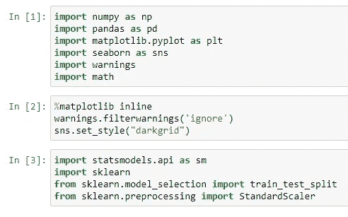

2.**读取并理解数据:**我们将数据集加载到 pandas 数据帧 lead_df，这个数据帧用于进一步的分析和建模。数据帧由 37 列和 9240 行组成。**转换后的**列构成了我们的目标变量。

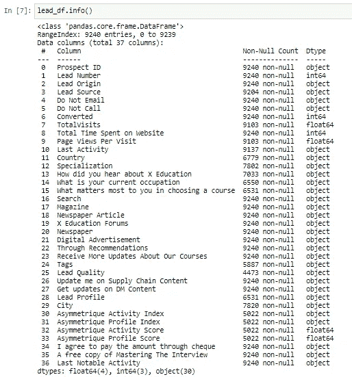

3.**探索性数据分析:**数据需要大量清理——17 列有空值。如果空值的百分比超过 30%,我们通过删除特定的列来删除空值，或者在适当的位置用中位数模式估算空值。不必要的列，似乎不重要的统计数据被删除。最后，我们清理了 14 列数据。

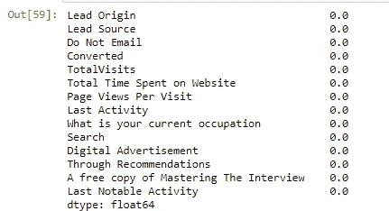

某些列有应被处理的异常值。我们进行异常值分析，从某些列和行中移除异常值。

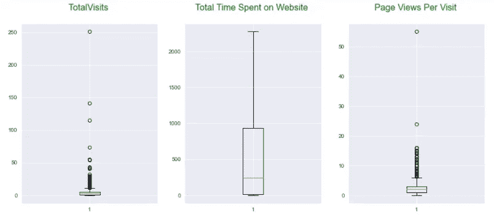

TotalVisits and Page Views Per Visit columns have outliers

接下来，我们进行如下单变量、双变量和多变量分析:

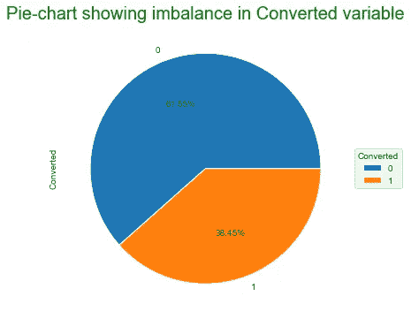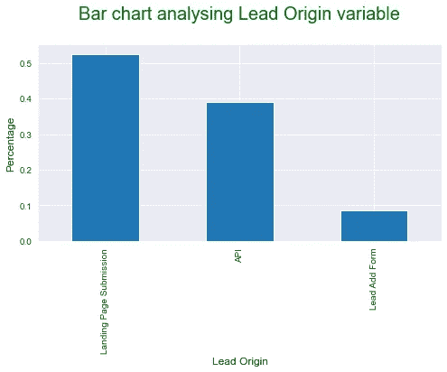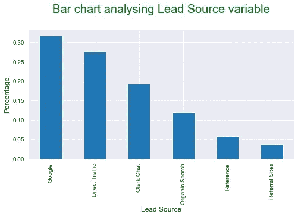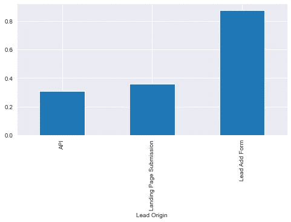

Converted variable w.r.t. Lead Origin

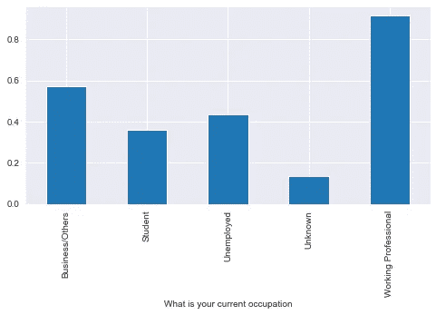

Converted variable w.r.t. Occupation

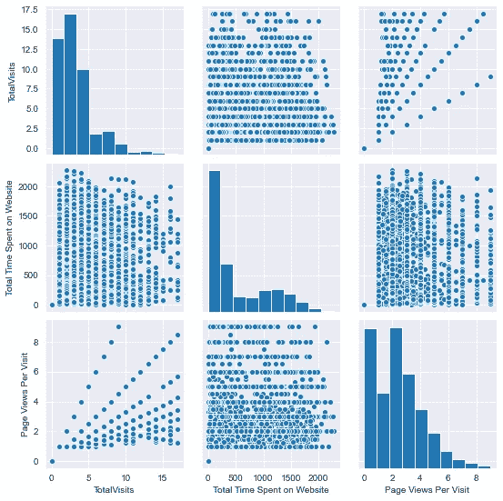

Multivariate Analysis

**以上分析的重要推论:**

*   **转换变量不平衡:38.45%的销售线索被转换，61.55%的销售线索未被转换。**
*   **登录页面提交构成了主要的销售线索来源渠道。**
*   **大多数线索来自谷歌广告。**
*   **通过销售线索添加表转换最大销售线索。**
*   **转化的大多数销售线索都是专业人士。**

4.**数据准备:**很多变量都是二元响应变量(是/否)。我们将是/否变量转换为 0/1，并为剩余的分类变量创建虚拟变量(一键编码)。

我们以 70:30 的比例将数据分为训练集和测试集，然后使用**标准缩放器**缩放训练集数据。

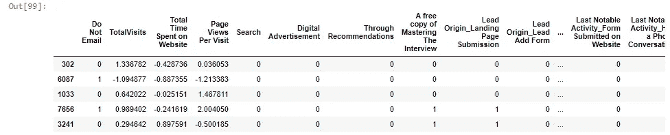

Data after encoding, scaling and splitting

5.**建立 Logistic 回归模型:**最初我们用所有变量建立模型，发现有许多变量不显著(p 值高)。我们需要减少变量的数量。

我们使用 RFE 方法，将自变量从 50 个粗调到 20 个。使用 statsmodels.api，我们构建逻辑回归模型并检查统计数据。通过考虑 p 值和 VIF 分数，不重要的变量被一个一个地去除。

最后，经过 6 次迭代，我们的模型最终确定了 15 个变量。

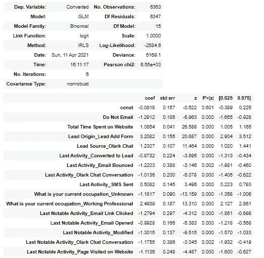

Final Model

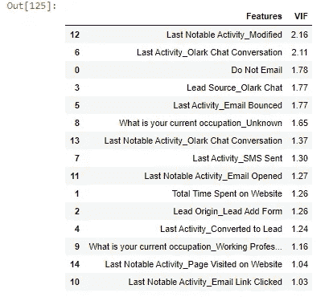

VIF values of all independent variables of final model

我们知道逻辑回归模型输出概率(0 到 1 之间的值)。为了对列车数据(y_train_pred)进行预测，我们需要将这些概率转换为 **1** s 和 **0** s。为此，我们需要确定一个阈值概率值，高于该值的所有概率值将被归类为 **1** ，低于该值的概率值将被归类为 **0** 。为此，我们需要绘制 ROC ( **接收器工作特性)**曲线。

一条 ROC 曲线无非就是不同分类阈值下**真阳性率** ( **TPR** ) v/s **假阳性率** ( **FPR** )的曲线图。请参考下面给出的混淆矩阵来理解这些术语。

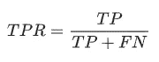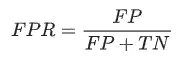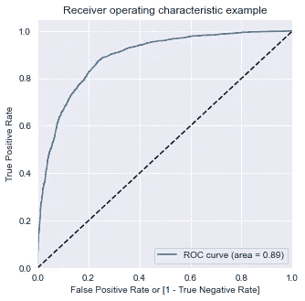

ROC curve for final model

**AUC** 代表曲线下的**面积。也就是说，AUC 测量整个 ROC 曲线下的整个二维面积。ROC 曲线表明:**

*   TPR 或敏感性和(1-FPR)或特异性之间的权衡(敏感性的任何增加都伴随着特异性的降低)。
*   曲线越靠近 ROC 空间的左侧边界和顶部边界，测试就越准确。
*   曲线越接近 ROC 空间的 45 度对角线，测试越不准确。

我们绘制了 0 到 1 之间所有概率值的灵敏度、特异性和准确性。

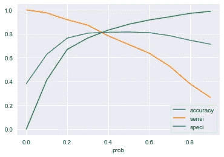

三条曲线相交的点被确定为截止点或阈值点。此时，我们获得了灵敏度、特异性和准确性的可比值。我们可以看到所有 3 条曲线在大约 0.38 处重合。**因此我们选择截止值 0.38。**因此，所有高于 0.38 的概率值将被归类为 **1** ，低于 0.38 的概率值将被归类为 **0** 。

我们在训练测试(y_train_pred)上进行预测，并将这些值与实际 y 值进行比较。我们首先需要了解一些评估指标。我们预测转换后的变量值为 0 或 1。但是这些值有多精确。此外，有多少真实的转换变量实际上被预测为转换变量，反之亦然。为了理解这一点，让我们看看下面的矩阵。

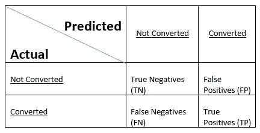

Typical Confusion Matrix

从上面的混淆矩阵中，我们为我们的模型导出了以下评估指标。

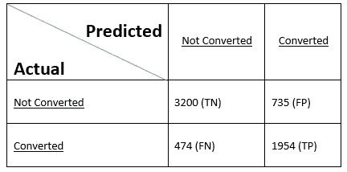

Confusion matrix for our model

1.  **精度:**是模型准确预测的数值个数(正或负)。准确度= TP+TN/ (TP+TN+FP+FN)。我们的模型的准确率为 0.8099 或 80.99%。
2.  **灵敏度:**是正确预测的真阳性数与总阳性数之比。也叫 **TPR** 。灵敏度= TP/ (TP+FN)。我们模型的灵敏度为 0.8047 或 80.47%。这实际上是一个很好的敏感度数字，因为在这里我们感兴趣的是预测极有可能转化的销售线索。
3.  **特异性:**是正确预测的真阴性数与阴性总数之比。也表示为 **(1-FPR)** 。TN / (TN+FP)。我们模型的特异性为 0.8132 或 81.32%。
4.  **精度:**预测的 1 实际上是 1 的概率。这就是实际转换值被归类为已转换值的方式。精度= TP / (TP + FP)。我们的模型的精度为 0.726 或 72.6%。
5.  **回忆:**和灵敏度一样。

根据手头的问题，我们有时使用 TPR 或灵敏度和(1-FPR)或特异性或精确回忆之间的权衡来检查阈值。

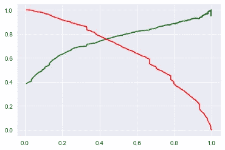

Precision-Recall Trade-off

**这里我们也可以看到，截止值非常接近 0.4。**

**6。对测试集进行预测:**我们通过删除必要的列，根据训练数据准备测试数据，并使用之前创建的**缩放器**转换测试数据。

我们对测试数据(y_test_pred)进行预测，得到预测的概率值。然后，我们使用截止值 0.38 将这些值转换为 0 和 1。公司可以根据需要改变临界值，以获得期望的结果。

测试数据的评估指标如下:

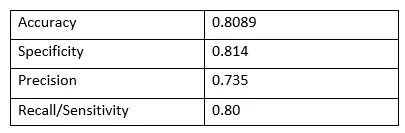

Evaluation metrics for test data

训练和测试数据评估指标的比较:

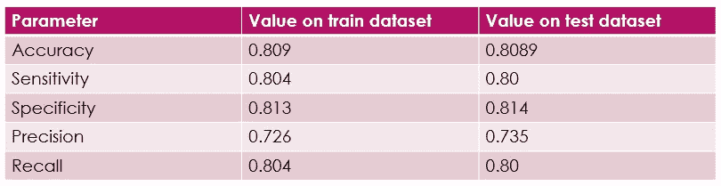

我们可以看到，训练和测试数据的所有参数都很接近。说明模型性能不错。

**7。根据预测的概率值分配分数:**要分配分数，我们只需将预测的概率值乘以 100，就可以得到 0 到 100 之间的分数。得分越高，越有希望成为潜在客户，转化的几率也越高。

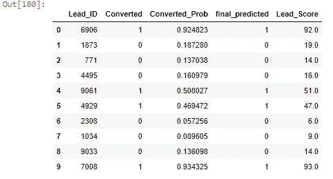

Scores assigned to various leads

***结论:*** *我们看到了机器学习如何帮助 ed-tech 公司识别有前途的线索。该公司可以只培养最有前途的潜在客户，从而使潜在客户转化过程更加高效。*

希望你喜欢阅读这篇文章。请随意评论并给出您的反馈。

**【https://www.linkedin.com/in/pathakpuja/】**可以在 LinkedIn 上联系我:

****请访问我的 GitHub 简介获取 python 代码:***[***https://github.com/pujappathak***](https://github.com/pujappathak)*