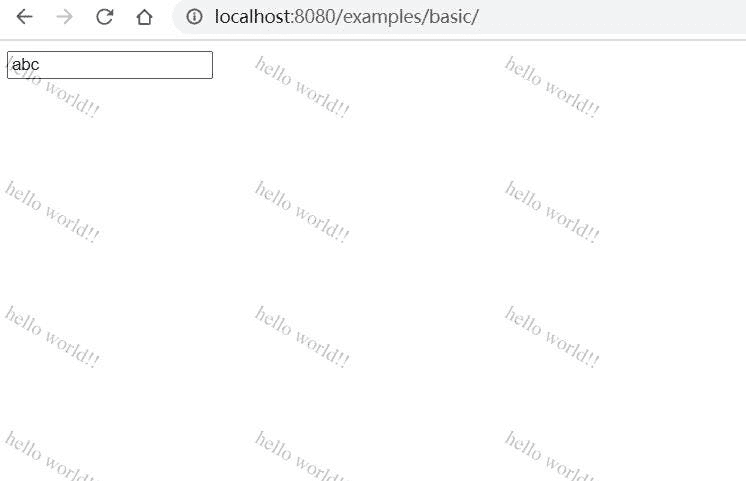
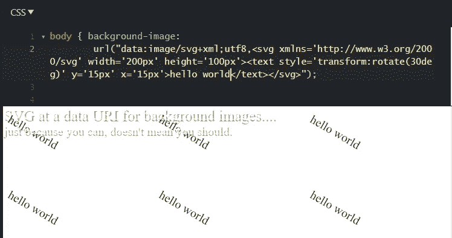
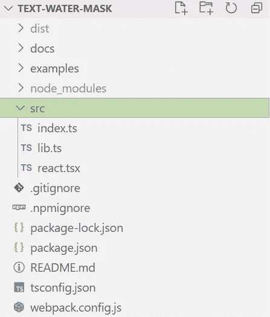
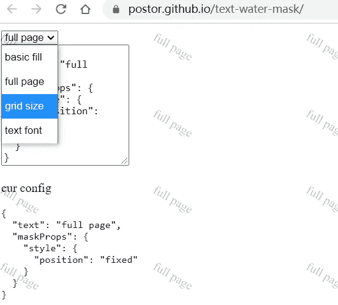

# 构建和发布真实世界 Npm 包的分步指南

> 原文：<https://medium.com/geekculture/step-by-step-guide-to-build-and-publish-a-real-world-npm-package-446037af582c?source=collection_archive---------22----------------------->

又一个如何构建 npm 包的指南？是也不是。我将涵盖一堆东西，但不是`npm`命令和`package.json`字段，也不是为了在 npm 上发布一些愚蠢的 helloworld。我相信 npm 是人们发布对他人有用的东西的地方，也许你也想发布有用的东西，我希望这篇文章能给你带来一些想法

我会报道的事情

*   定义问题并解决它
*   抽象并参数化它以供通用
*   选择语言、框架和构建工具
*   编码、测试和返回编码
*   记录并发布给国家预防机制

如果您没有看过 npm 命令和 package.json 字段，我真的建议您看一看

*   [https://docs.npmjs.com/cli/v7/commands](https://docs.npmjs.com/cli/v7/commands)
*   [https://docs.npmjs.com/cli/v7/configuring-npm/package-json](https://docs.npmjs.com/cli/v7/configuring-npm/package-json)

如果你需要我在本文中作为例子使用的水面膜库的代码/文档，你可以在这里找到。

[](https://github.com/postor/text-water-mask) [## post or/text-水面膜

### 单元素实现页面水印，支持 react | single element text water mask, that supports react — postor/text-water-mask

github.com](https://github.com/postor/text-water-mask) 

# 定义问题并解决它

假设问题是在页面上放置一些文本作为水印



为了解决这个问题，我选择在页面顶部使用一个`div`覆盖，它使用一个`svg`作为它的背景，它不会阻止用户与页面内容的交互，这需要浏览器的支持

*   [https://caniuse.com/svg](https://caniuse.com/svg)
*   [https://caniuse.com/pointer-events](https://caniuse.com/pointer-events)



# 抽象并参数化它以供通用

如果我们想让它对其他人有用，`div`和`css`可能帮不上忙，所以让我们把它变成一个函数。出于本能，它是这样来的，给一些`element`添加遮罩，用`maskOptions`你可以配置遮罩的样子

```
function addMaskTo(element,maskOptions){}
```

但是一旦它被添加了，你怎么能删除它呢？所以我把它改成只返回一个元素

```
function getMask(maskOptions){}
let el = getMask()
document.body.appendChild(el)
// el.remove() // when you nolonger need it
```

有几点你需要考虑

*   是纯函数吗？(不要修改输入参数)
*   全局名称空间污染(当这无法避免时，请确保键是唯一的)
*   内存泄漏(当您绑定侦听器并一起使用 closer 时，要小心)
*   违反直觉(人们看到名字就知道怎么用)

# 选择语言、框架和构建工具

当你写一个库的时候，我推荐 TypeScript，它更方便，IDEs 会填充代码或者让你选择，而不是强迫开发者全部输入，但是 TypeScript 有它的代价，你需要学习，有时你会发现它不够成熟。这里我选择 TypeScript。

你可以为 React 之类的框架编写一个库，但也可能是其他的或者根本不是。在这里，我在普通 JavaScript 中选择了 React 和 function

对于捆绑工具，TypeScript 已经可以编译 es5，我为 UMD 捆绑添加 webpack

在 github 上创建一个 repo，签出 repo，用 TypeScript、webpack 和 React 在这个项目中运行命令

```
npm init -y
npm i typescript webpack webpack-cli react -D
```

此处为考虑列表添加更多内容

*   开发者体验
*   项目复杂性
*   支撑框架工程

# 编码、测试和返回编码

我使用了这样一个结构



并且默认导出一个函数，增加了开发者只需要修改文本时的支持

```
export default function **getWaterMask**(config: **Config** | string): **HTMLElement** {
  ...
}
```

当测试时，我发现当`"`或`'`出现在 svg 样式中时，它会因为冲突而停止工作，所以我使用 base64 编码的 svg，而不是普通的 xml svg

```
export function **getBackgroundImageStr**(text: string, svgProps: **Props**, textProps: **Props**): string {  
  return `url("data:image/svg+xml;base64,${base64.**encode**(`<svg ${**props2str**(svgProps)}>${`<text ${**props2str**(textProps)}>${text}</text>`}</svg>`)}")`
}
```

用 base64 lib 还是用`window.btoa`？您需要考虑它是否在节点和浏览器中都工作，并且导入库很可能会增大最终的包大小，所以还需要更多的考虑。

*   同构(节点中未定义窗口)
*   包装尺寸(意味着最终用户体验)

我使用例子和测试

```
<script *src*="../../dist/text-water-mask.umd.js"></script>
<script>document.body.**appendChild**(TextWaterMask.**default**({ text: 'hello world!!' }))</script>
```

**记录并发布给国家预防机制**

写一个`README.md`告诉人们你的库，并使用 github 页面制作一个现场演示会很棒！我用`next export`和`html-inline`生成了 demo，看起来是这样的



然后只剩下两件事，发表和测试发表，希望你的包工作正常。