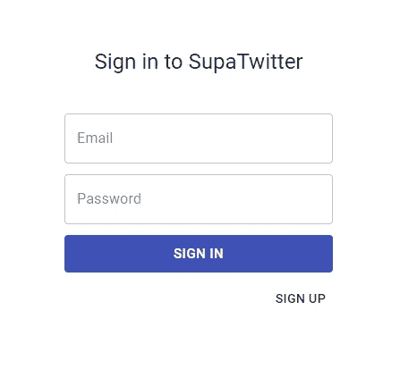
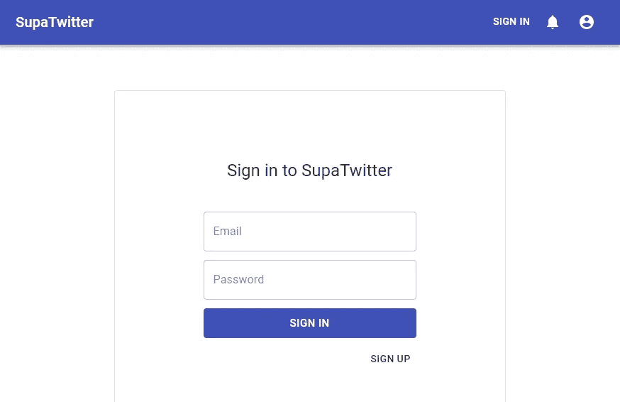
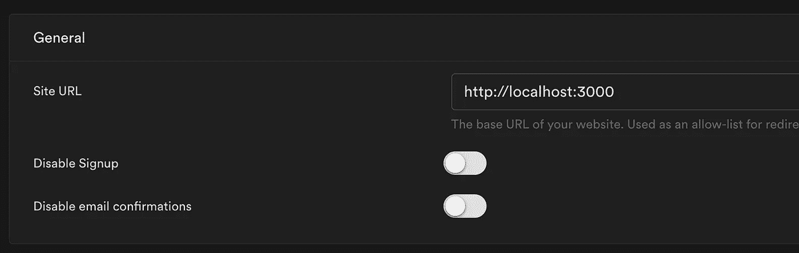
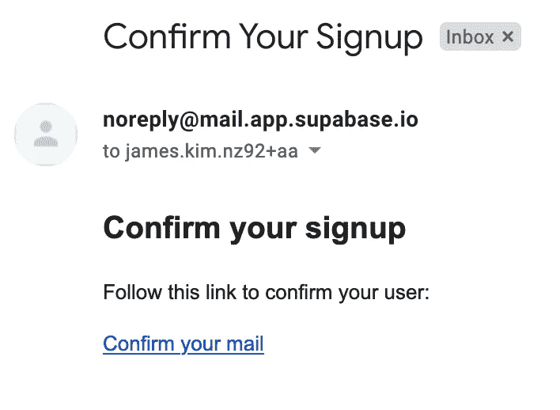
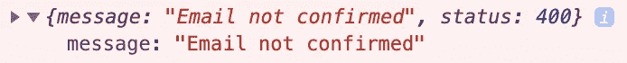

# 使用 React 和 Supabase 创建 Twitter 克隆的分步指南——第 3 部分

> 原文：<https://medium.com/geekculture/step-by-step-guide-to-creating-a-twitter-clone-with-react-and-supabase-part-3-1c7ece96b77b?source=collection_archive---------23----------------------->

大家好，欢迎来到用 React 和 [Supabase](https://supabase.io/) 创建 Twitter 克隆的第 3 部分！到本系列结束时，我们将部署一个全功能的应用程序，让用户:

*   在推特上发布他们的想法，
*   上传头像并更改其个人资料，
*   当有新的推文时被通知，并且；
*   当有人喜欢他们的推文时得到通知。

在[第 2 部分](/geekculture/a-step-by-step-guide-to-creating-a-twitter-clone-with-react-and-supabase-part-2-43fd11558fc1)中，我们已经有了一个非常基本的用户认证流程。在第 3 部分中，我们将:

1.  用材质 UI 让东西更漂亮。
2.  添加一个在用户登录或注销时刷新的导航栏。
3.  添加一个错误页面、一个“确认注册”页面和一个“编辑个人资料”页面。
4.  更新“编辑配置文件”页面以加载现有配置文件(如果存在)。

## 改变节奏

在我们开始之前，我想让你知道，我将*改变本指南的节奏，让它快一点*。我已经在之前的帖子中列出并解释了每一步。这种方法花了很多时间来编写(这也是第 3 部分延迟这么久的原因之一),并且使得帖子太长而没有太多价值。

我不会解释每一步，而是提供一个到每一步的 git 提交的链接(这样你就可以看到所有的细节了)，并写一些有趣的部分，重点放在 Supabase 的特性上。这将使个别部分更有用，涵盖更多有趣的主题。我也(希望)能够写得更快！

让我们开始吧！🏃‍♀️

# 让东西更漂亮

在[这个提交](https://github.com/horizon0708/react-twitter-clone-follow-along/commit/a0a684c23f5837aa2c8c214080bf61ac1089b049?branch=a0a684c23f5837aa2c8c214080bf61ac1089b049&diff=split)中，我已经使登录、注册和退出页面更加漂亮和一致。大部分是修饰性的改变，但也有一些有趣的部分。

## 在样式化组件中使用 CSSchild 组合子

使用 CSS，您可以选择所有带有[子组合符](https://developer.mozilla.org/en-US/docs/Web/CSS/Child_combinator)的`div`的直接子，如下所示:

你可以对 JSS 做同样的事情。你只需要使用`&`来引用父元素。我用它来让我的表单中所有的`div`都有边距。

## 使用 URLSearchParams 获取查询字符串

假设您有一个 URL，带有类似于`https://localhost:3000/signin?redirectUri=/profile`的查询参数，并且想要获取查询字符串。如果不必支持 IE11，可以使用 [URLSearchParams](https://developer.mozilla.org/en-US/docs/Web/API/URLSearchParams) 。在下面的代码片段中，我用它来获取“redirectUri”查询字符串。

## 使用 React 路由器链接和 MateriL UI 的链接

你需要使用 React Router 的 Link 组件在路由之间导航而不需要整页加载，但是 Material UI 也有 Link 组件！谢天谢地， [Material UI 的 Link 组件可以拿一个组件当道具](https://material-ui.com/guides/composition/#link)。

有了这些变化，我们的形式看起来更好一点 now✨.

目前，我们只能通过在地址栏中键入路线来在路线之间导航。接下来让我们添加一个导航条来解决这个问题。

# 添加导航栏

在[这个提交](https://github.com/horizon0708/react-twitter-clone-follow-along/commit/6fbd353cf24fca8654aa90ce6704b145bcd1a714)中，我做了两件事:

1.  创建一个新的 navbar 组件，并将其添加到 react-router-dom 的`<Switch />`组件之外，这样它将在每条路由中呈现。
2.  创建了一个 AuthContext 提供程序，该提供程序侦听用户身份验证状态的变化，并提供最新的会话(如果用户已登录，则为 null)。

这是新 navbar 的应用程序外观。

虽然新的导航条看起来不错，但在这个提交中有一个 bug。当用户登录或退出时，导航栏不会更新。这是因为导航栏正在获取当前会话，如下所示。

该代码将只在 navbar 呈现时运行一次，这意味着当用户登录和退出时它不会运行。为了修复这个 bug，我们需要一些东西来监听用户身份验证状态的变化，并为我们的组件提供一个最新的`session`对象(或`null`)。这是由`AuthProvider`完成的。

`AuthProvider`使用`onAuthStatechange`回调来监听状态变化。当您在`useEffect()`钩子中返回一个回调时，它会在组件卸载时运行。这是进行清理的完美地方，比如调用`unsubscribe()`停止监听状态变化。

完成后[我通过使用以下命令将导航条改为使用 AuthProvider 提供的会话。](https://github.com/horizon0708/react-twitter-clone-follow-along/commit/3fe4b5dcee236d43bcc25ddacfce8a5719c623b9) `[useAuth()](https://github.com/horizon0708/react-twitter-clone-follow-along/commit/3fe4b5dcee236d43bcc25ddacfce8a5719c623b9)` [钩。](https://github.com/horizon0708/react-twitter-clone-follow-along/commit/3fe4b5dcee236d43bcc25ddacfce8a5719c623b9)

# 添加错误页面、确认电子邮件页面和编辑个人资料页面

[该提交](https://github.com/horizon0708/react-twitter-clone-follow-along/commit/b6bd988a70c213cff38407402409fb9fc3f655f3)增加了:

1.  这是一个普通的错误页面，当事情发生并且不可恢复时，我们可以显示给用户。
2.  “确认注册”页面。
3.  “编辑个人资料”页面。

代码本身并不太有趣，但它是一个很好的地方来谈论我对 Supabase 注册流程的了解。

## 默认情况下，注册确认是打开的

默认情况下，当您用`auth.signUp()`注册一个用户时，一封确认电子邮件将被发送到用户注册的电子邮件地址。您可以通过转到“身份验证”部分的“设置”选项卡来更改此行为。

## 更改注册确认电子邮件的正文

默认的电子邮件非常简单，但是可以完成工作。

您可以通过转到“身份验证”部分的“模板”选项卡来更改消息。默认的“确认注册”消息是:

我已经将它链接到我的“编辑个人资料”页面(请看 href ),这样用户可以在确认他们的电子邮件后立即设置他们的个人资料。

## 如果用户试图在没有确认的情况下登录会发生什么？

如果不确认注册，用户将无法登录。如果他们尝试，Supabase 将给出 400 响应。

## Supabase 中的升级

在 Supabase 中升级非常简单。你只需要叫`upsert`而不是`insert`。

# 更新编辑配置文件页面以加载现有配置文件

[此提交](https://github.com/horizon0708/react-twitter-clone-follow-along/commit/08cd215f2c6381598d595a215980cc3f16a1792a)更新“编辑配置文件”页面，以加载用户的配置文件(如果存在)。通常，我们必须为 profiles 表手写一个`Profile`类型，但是 Supabase 通过让您从您的数据库模型中生成一个 OpenAPI 规范文件[使这变得非常方便。](https://supabase.io/docs/reference/javascript/generating-types)

生成类型文件的命令如下:

我已经将它添加到了我的`package.json`中的“脚本”部分，这样每当我对数据库进行更改时，我就可以运行`npm run generate-types`来更新文件。

您可以在`[types.ts](https://github.com/horizon0708/react-twitter-clone-follow-along/blob/master/src/api/types.ts)`中看到结果类型文件。当我使用 Id 查询配置文件时，我们可以使用它。

第 3 部分我们就讲到这里。在第 4 部分中，我们将学习如何让用户上传他们的头像到 Supabase 存储器，以及我们如何把它们展示给我们的用户！和往常一样，f [可以通过推特](https://twitter.com/James_HJ_Kim)或评论提出任何问题。第 4 部分再见！🙋‍♂️