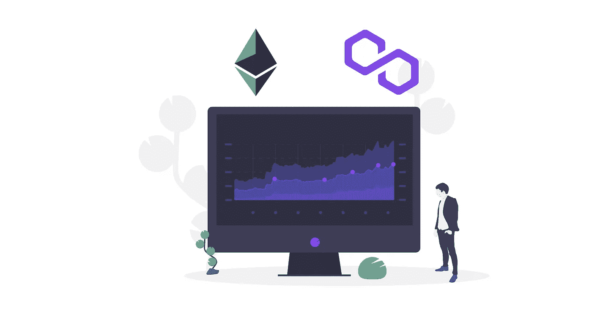
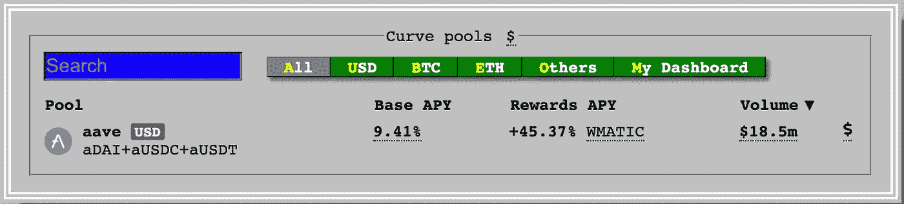
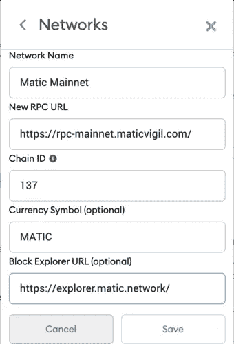
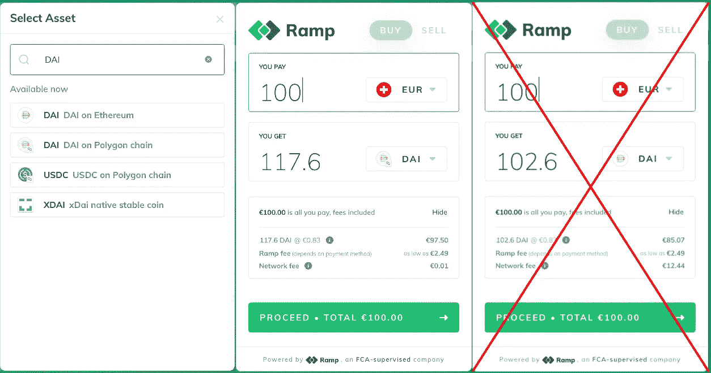
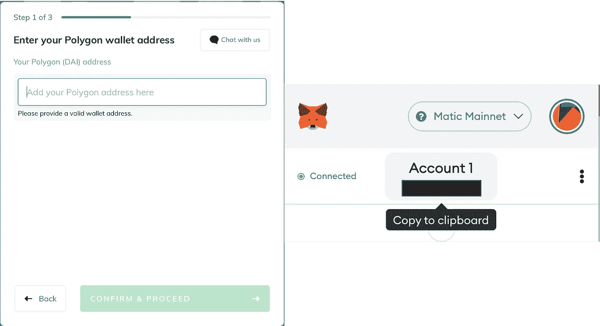
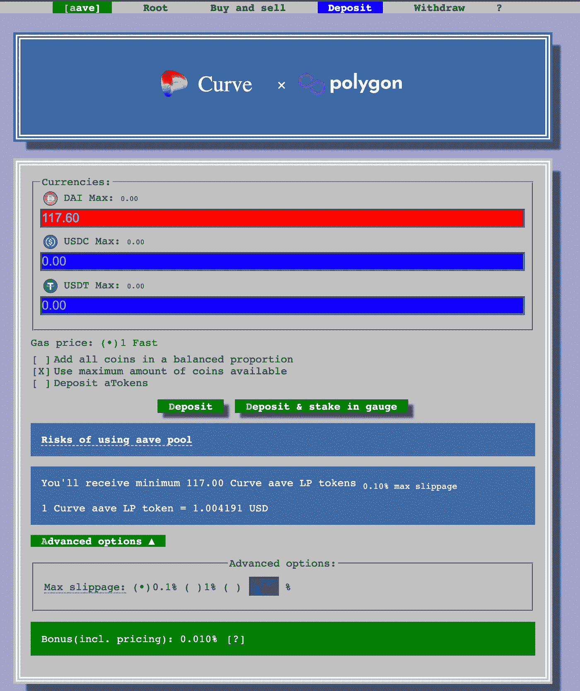

# 多边形以太坊无燃气费分散融资分步指南

> 原文：<https://medium.com/geekculture/step-by-step-guide-to-decentralized-finance-without-gas-fees-on-ethereum-with-polygon-43dcc7fc2021?source=collection_archive---------1----------------------->

Image from [undraw.co](https://undraw.co)

以太坊目前正在运行，粉碎了一个又一个的历史高点，并从比特币中赢得了大量的市场份额。原因之一可能是其丰富的生态系统，包括各个领域的分散应用程序，如分散金融(DeFi)或不可替代的令牌(NFT)。

特别是 DeFi 提供了巨大的回报潜力，甚至超过股市投资。然而，有一个大问题:由于前面提到的领域的流行，以太坊网络高度拥挤，交易费用超过了较小投资者的利润率。

但是不用担心，在这篇文章中，我将向您介绍一种通过使用 Polygon 的第 2 层扩展解决方案来规避以太坊主层的高额燃气费的方法。在接下来的段落中，您将找到一个逐步的指南来创建和资助您的帐户，开始使用 DeFi。

> 声明:我不是财务顾问。我不建议你投资分散化金融应用或加密货币。在投资之前，一定要做好调查和尽职调查。不要投资超过你能承受的损失。

# 定义和多边形简介

我不想谈论太多关于 DeFi 的细节，因为网上有很多很好的资源，如官方以太坊网站或 T2 Finematics Youtube 频道。但这里有几点，将 DeFi 与传统金融区分开来[1]:

*   DeFi 提供了新的和潜在的有利可图的投资机会(贷款、提供流动性、高产农业……)
*   在 DeFi 中，你的钱是由你自己持有，而不是由公司(银行)持有
*   DeFi 对任何人开放
*   DeFi 市场全天候开放
*   DeFi 建立在透明的基础上，每一笔交易都永久不变地写入公共分类账

虽然 DeFi 通常对任何人开放，但是已经提到的以太坊网络的拥塞导致了非常高的交易成本(在高峰时间+100 美元),这最终将财务资源较少的参与者排除在外。幸运的是，创新的扩展解决方案目前正被部署到以太坊，使交易更快、更便宜。

[Polygon(以前的 Matic Network)](https://medium.com/u/ea91a1cf958?source=post_page-----43dcc7fc2021--------------------------------) 目前通过其等离子和 PoS(Proof-of-stage)链提供扩展解决方案，并计划在未来提供汇总服务。以太坊上的两大 DeFi 应用，即 [Aave](https://aave.com/) (借贷协议)和 [Curve](https://polygon.curve.fi/) (自动做市商)，已经在 Polygon 上推出了成功的应用，能够吸引大量资本(截至 2021 年 4 月 29 日分别为 18.5 亿和 1.8 亿美元)。尤其是 Curve 提供了任何银行账户都无法与之抗衡的诱人回报。

Base APY and rewards APY on [Curve](https://polygon.curve.fi/) as of April 29th, 2021

# 为 DeFi 创建您的帐户

要使用 DeFi，您需要一个以太坊钱包来存储您的加密货币。虽然有几个选项，但我推荐 [Metamask](https://metamask.io/) ，它是一个浏览器扩展，使与分散应用的交互变得容易。当你第一次下载元掩码时，确保它是来自 https://metamask.io/的真正元掩码。

一旦你建立了你的账户，你可以用 ETH 或者其他以太币(ERC 20 代币)来支付。但是因为我们想在多边形上使用 DeFi，我们需要为多边形 Mainnet 准备好我们的钱包。为此，单击元掩码中的网络选择下拉菜单，然后选择自定义 RPC。在那里，您必须使用新的 RPC URL[https://rpc-mainnet.maticvigil.com/](https://rpc-mainnet.maticvigil.com/)和块浏览器 URL[https://Explorer . matic . network/](https://explorer.matic.network/)输入以下配置。

Network configuration for Polygon

你的 Metamask 钱包配置完成后，我推荐你访问[https://wallet . matic . network/](https://wallet.matic.network/)用你的钱包登录。这是官方的 Polygon 钱包，提供了以太坊主网和 Polygon 之间转移资金的桥梁。你也应该得到空投 0.001 MATIC，帮助你支付你的第一笔交易。

# 为您的 DeFi 帐户提供资金

我们几乎准备好在多边形上使用 DeFi 了，但是，我们需要先为我们的帐户提供资金。如果您已经在以太坊主网上的钱包中持有加密货币，那么您可以使用 Matic 钱包转移这些资金。请记住，您将支付以太坊为基础的费用，以发送您的硬币到多边形 Mainnet。

菲亚特入口匝道服务，如[匝道](https://ramp.network/)，提供了另一种非常方便的解决方案。从 DeFi 开始，我建议购买一些 1:1 与美元挂钩的稳定硬币(如戴或)来投资 DeFi 协议。你也可以购买一些 MATIC(支付交易)，但这也可以用你的稳定硬币在分散的交易所进行(更多信息见下文)。在下面，我会告诉你，如何购买戴为您的多边形帐户与坡道。

如果您打开 Ramp 并开始购买过程，您可以选择想要购买的加密货币。如果搜索 DAI，会发现三个选项(以太坊上的 DAI，多边形链上的 DAI，xDAI)。确保在多边形链上选择 DAI。如果你在以太坊上选择戴，你会发现网费差别很大(12.44 对 0.01)。选择您想要购买的数量后，单击继续。

提供您的电子邮件地址并进行验证后，您将被要求输入您的多边形地址。通过单击帐户按钮，您可以轻松地将您的地址从 Metamask wallet 复制到剪贴板。确保这两个地址匹配，然后你就可以购买了。

在接下来的步骤中，您必须选择您的付款方式，然后继续付款。Ramp 使得用 Revolut 支付变得很容易，但是费用比普通的银行转账要高。虽然信用卡购物是支付 DAI 最方便的方式，但费用也最高。根据您的付款方式，您将在建议的时间后收到您的 DAI。

# 使用 DeFi

恭喜你，你现在可以开始探索新的投资机会，而无需支付巨额交易费！不过，在你进入 DeFi 之前，我建议你先熟悉一下这个话题，了解更多关于这些应用和投资的风险。

作为第一步，我强烈建议你购买一些自动提款机，以便随时转移资金和支付交易费用，即使它们非常便宜。一种方法是使用如上所述的 Ramp 并直接购买 MATIC。但是既然你已经有了戴，我们可以用它在一个分散的交易平台上购买一些 MATIC，比如的 QuickSwap。

如果你决定为 Curve 提供流动性，去他们的应用程序，连接你的 Metamask 钱包。然后点击 aave 池(仅限截至 2021 年 4 月 29 日的池)并存款。现在你可以存你的戴了。要从您提供的流动性中赚取 MATIC 奖励，您必须将您的 curve liquidity provider tokens 投入 gauge。同样，这不是财务建议，如果你想投资，请确保你熟悉风险。

Curve x Polygon deposit user interface

# 结论

恭喜你，你已经做到了这一步，你已经建立了你的帐户，甚至可能已经开始探索 DeFi，与以太坊主网相比，它的花费只是一个零头。

我希望我的指南对你有帮助和价值！如果有不清楚的地方，请随时问我。如果你想让我写更多关于 DeFi 的东西，请告诉我你对哪个领域感兴趣。

非常感谢您的阅读，祝您一天顺利:)

# 参考

[1]以太坊基金会。*分散金融(DeFi)* 。从 https://ethereum.org/en/defi/[取回](https://ethereum.org/en/defi/)