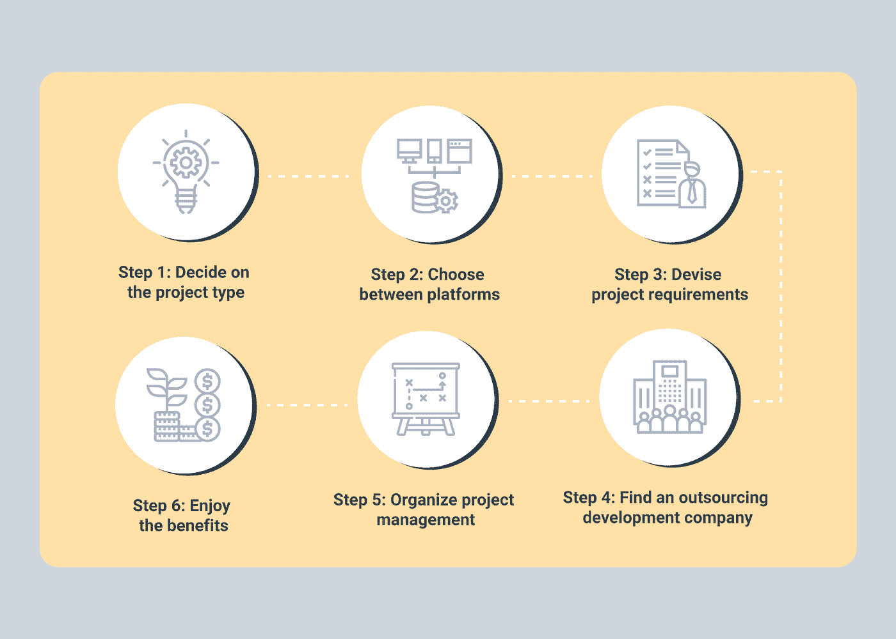

# 执行有效的移动应用程序开发外包的步骤

> 原文：<https://medium.com/geekculture/steps-to-perform-efficacious-mobile-app-development-outsourcing-e505e2b5e0c8?source=collection_archive---------19----------------------->

移动应用程序开发外包是指企业雇佣第三方开发人员为他们开发移动应用程序。这通常是在企业没有内部资源或专业知识来开发移动应用程序时进行的。

外包移动应用程序开发是企业节省时间和金钱的好方法。因此，选择合适的、有经验的外包合作伙伴非常重要。否则，就有可能出现不符合您期望的劣质产品。

随着越来越多的企业认识到与第三方开发者合作的好处，移动应用开发外包正变得越来越受欢迎。德勤最近的一项研究发现，42%的企业计划在未来 12 个月增加外包的使用。

虽然外包可能看起来是一种无需在内部资源上花钱就能构建移动应用程序的简单方法，但如果您未能正确规划和选择合适的团队，这种策略可能会充满潜在的问题。要成功外包您的移动应用开发，请遵循以下五个步骤:

企业选择外包移动应用开发的原因有很多。

*   首先，它可以是一个成本效益高的解决方案，因为你只需要支付开发服务。
*   其次，它可以帮助你节省时间，因为你不需要建立一个内部开发团队。
*   第三，它可以让你接触到更广泛的人才库，让你接触到最新的移动应用程序开发技术和趋势。

img src:[谷歌 ](https://www.google.com/search?q=Pros+and+cons+of+mobile+application+development+outsourcing&tbm=isch&ved=2ahUKEwjLvZHc_Yb4AhXXjtgFHZzfCFEQ2-cCegQIABAA&oq=Pros+and+cons+of+mobile+application+development+outsourcing&gs_lcp=CgNpbWcQA1C0CFi0CGCLDGgAcAB4AIABZ4gBzQGSAQMwLjKYAQCgAQGqAQtnd3Mtd2l6LWltZ8ABAQ&sclient=img&ei=8peUYsv8D9ed4t4PnL-jiAU&bih=948&biw=1848#imgrc=12HUy-qI-bcRlM)

现在，如果你正在考虑**离岸外包移动应用程序开发，**那么有一些事情你需要记住。

*   首先，你需要清楚地定义你的需求和目标。这将有助于您找到合适的外包合作伙伴来满足您的需求。
*   其次，你必须考虑外包的成本，并将其与建立内部团队进行比较。
*   第三，你需要确定你有一个好的沟通计划。这会让你了解项目的最新进展。

**以下是您必须知道的成功执行移动应用开发外包的步骤:**

**IMg src:**[谷歌 ](https://www.google.com/search?q=why+businesses+choose+to+outsource+mobile+app+development.&tbm=isch&ved=2ahUKEwj-suqt_Yb4AhXMi9gFHQPkCF4Q2-cCegQIABAA&oq=why+businesses+choose+to+outsource+mobile+app+development.&gs_lcp=CgNpbWcQAzoECAAQGFCWB1iWB2D-DmgAcAB4AIABxgGIAbACkgEDMC4ymAEAoAEBqgELZ3dzLXdpei1pbWfAAQE&sclient=img&ei=kZeUYr6mCcyX4t4Pg8ij8AU&bih=948&biw=1848#imgrc=QHDnqJy_uT6DWM)

**1)寻找可靠的合作伙伴**

如果你已经决定外包移动应用程序开发，从选择一家已经经营了几年并且看起来很专业的公司开始。你不想被一份又一份不专业、不可靠的公司的合同缠住。

此外，确保他们自己以前外包过工作，而不仅仅是内部开发。

这一点很重要，因为如果你要将你的项目托付给他们，你需要知道他们会将它视为自己的项目。在网上查看评论，向其他使用过外包公司的企业家寻求建议。

找到几个候选人后，在网上查看他们的作品集(如果可能的话)，看看他们以前做过什么样的项目。看看每个项目从开始到结束花了多长时间，是否有任何问题。

**2)雇用前的考虑事项**

雇佣一家离岸移动应用开发公司不仅仅是找人做你的工作。离岸外包的过程需要你进行大量的尽职调查。在发送任何项目信息之前，您需要确保选择一个可靠、高效、透明的合作伙伴。

因为开发项目可能会持续 6 周到 6 个月或更长时间，所以你必须选择一个在这段时间内始终支持你的合作伙伴，并坚持履行他们的承诺。

以下几点应该会给你一个很好的评估外包移动应用开发者的起点:

**- >做你的研究**

在外包手机 app 开发的时候，你需要做足功课，确切地知道你想从一个服务商那里得到什么，需要什么。有很多选择，所以花点时间为你的特定项目找到合适的。

**- >设定明确的目标和目的**

在你开始寻找服务提供商之前，你需要对你的项目目标有一个清晰的认识。这将有助于你更有效地与潜在供应商沟通，并确保他们理解你的愿景。

**- >对时间表和预算持现实态度**

外包是省钱的好方法，但对时间表和预算持现实态度也很重要。在与服务提供商合作之前，确保你清楚地了解你在成本和时间框架方面的实际预期。

**- >沟通清楚**

外包移动应用程序开发时，要记住的最重要的事情之一是清晰地沟通。坦率地说出你的期望，明确你需要从服务提供商那里得到什么。如果有任何误解，它们会很快成为代价高昂的错误。

**- >把一切都写下来**

在你开始与服务提供商合作之前，确保你把一切都写下来。这包括工作范围、时间表、预算以及您同意的任何其他事项。把所有的事情都写下来将有助于避免未来的任何误解或意外。

**3)雇佣你的移动应用开发团队**

现在你已经对你的项目有了一个很好的想法，开始寻找潜在的外包商。你可以通过两种方式招聘:直接通过公司或者通过个体自由职业者。

如果你选择直接雇佣，你将有机会与做过类似工作的人建立更好的工作关系，并能提供如何完成工作的建议。

然而，如果你只是寻找廉价劳动力，不需要太多监督，外包给个体自由职业者可能更合你的胃口。

**4)创建高效的工作流程**

你的工作流程越有效率，你成功的机会就越大。如果你一天中没有足够的时间，外包那些别人能更快或更好完成的任务。

将各种[定制移动应用开发](https://www.valuecoders.com/application-development)组件外包给不同的提供商是有益的，因为他们的工作和专业知识可能会有很高的需求，并且比你在国内可以找到的价格更高。

然而，在大多数情况下，从小处着手，然后继续前进。在担心可能会成倍扩大范围的附加功能之前，先安装并运行一个基本版本。

**5)建立信任**

建立信任可能是一个艰难的过程。当你和你的客户选择[外包开发服务](https://www.valuecoders.com/)时，他们之前没有任何与外包团队合作的经验，这意味着他们需要保证你会按时交付高质量的产品。毫不奇怪，新客户不愿意尝试新的供应商。

建立信任和赢得业务的最佳方式之一是通过推荐。确保你有所有以前客户的联系信息，并允许在你的销售材料中使用他们的报价。

**6)与不同文化合作**

当你外包移动应用程序开发时，你需要管理和协调不同的文化和时区。你可以通过使用一种常用的交流工具来克服语言障碍，例如使用 Dropbox 或 Google Drive 来存储文档，使用 Skype 进行语音聊天或使用 Basecamp 来建立合作项目。你可以进一步了解更多有助于你跨文化工作的工具。

**7)开发、测试和部署**

这是一种组织方法，旨在通过使员工更容易地协作和共享信息来最大限度地提高公司的效率。DevOps 中的三个主要步骤是开发、测试和部署。

要外包移动应用程序开发，首先要定义这些流程。但是，根据您的应用程序类型和行业标准，这些会略有不同。

**移动应用开发外包的利弊**

外包应用程序开发有许多好处，包括获得熟练劳动力、节约成本和提高效率。然而，在决定外包软件开发之前，也有一些潜在的不利因素需要考虑。

**应用开发外包的优点包括:**

-获得熟练劳动力:当您外包应用程序开发时，您可以利用全球范围内的高技能工人。这让你有机会接触到本地可能找不到的人才。

-节省成本:外包应用程序开发可以节省您的劳动力成本。此外，您还可以利用其他国家较低的运营成本。

-提高效率:当您外包应用程序开发时，您可以释放内部资源，专注于其他业务领域。这可以提高效率和生产率。

**应用开发外包的缺点包括:**

-失去控制:当您外包应用程序开发时，您放弃了对过程的一些控制。如果您希望对应用程序的开发有更多的控制，这可能是一个不利因素。

-质量问题:当您外包应用程序开发时，总是存在潜在的质量问题。这就是为什么在决定之前仔细审查任何潜在的供应商是很重要的。

-沟通问题:由于地理上的距离，在外包应用程序开发时，沟通可能是一个挑战。时区差异和语言障碍会使你很难与你的供应商保持一致。

总的来说，应用程序开发外包有利也有弊。在做决定之前权衡所有的因素是很重要的。如果您决定外包应用程序开发，请确保仔细审查您的供应商，并设定明确的沟通期望。

**结论:**

通过花时间寻找一个可靠和值得信赖的合作伙伴，建立明确的沟通和期望，并建立良好的工作关系，你将在推出一个成功的移动应用程序的道路上取得成功。

然而，通过精心的计划和沟通，你可以创造一个成功的工作关系，从而产生一个伟大的成品。

因此，如果你计划外包移动应用程序开发，在开始外包移动应用程序开发项目之前，请记住上面讨论的步骤。

此外，你可以去找一家可靠的定制移动应用开发公司，比如 ValueCoders，它有一个由 450 多名熟练专业人员组成的外包开发团队。