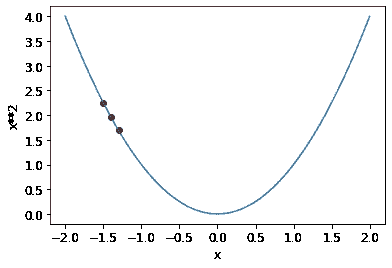

# PyTorch 随机梯度下降法

> 原文：<https://medium.com/geekculture/stochastic-gradient-descent-sgd-with-pytorch-1187651da108?source=collection_archive---------4----------------------->

深度学习网络学习和改进的方法之一是通过梯度下降(SGD)优化算法。该算法的工作原理是沿着曲线的每一步计算实际值和预测值之间的最低损失。

深度学习算法的典型 SGD 过程由以下步骤组成:

1.  首先，随机值沿着…