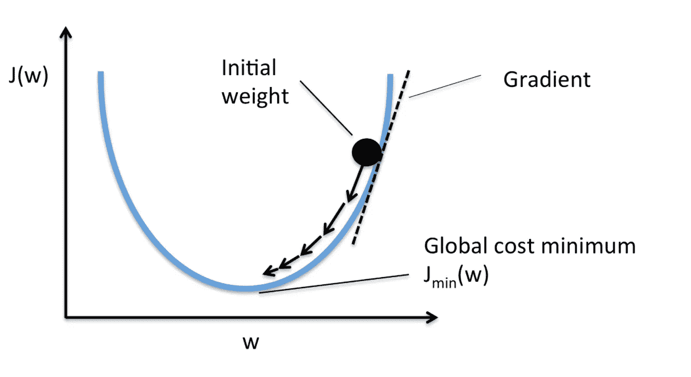
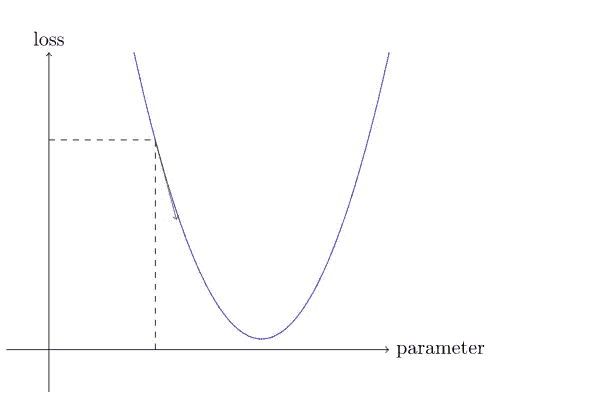
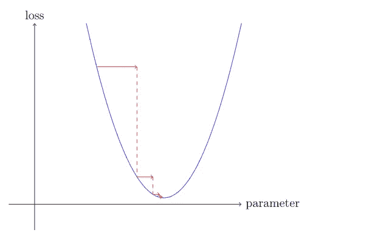
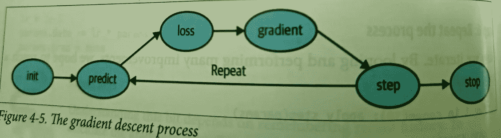
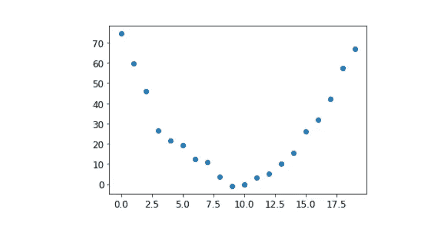
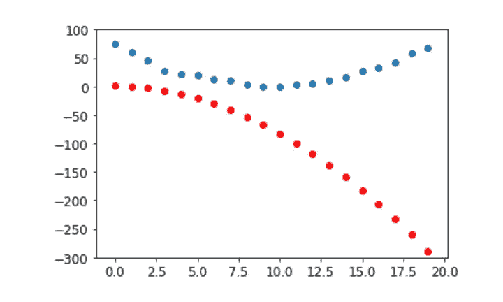
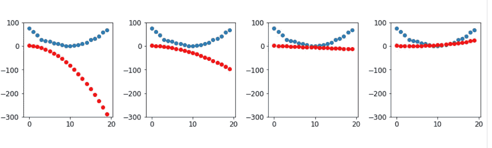
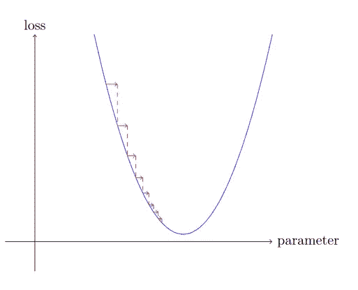
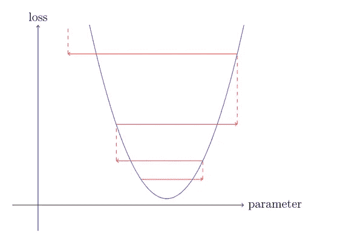

# 使用 PyTorch 的随机梯度下降

> 原文：<https://medium.com/geekculture/stochastic-gradient-descent-using-pytotch-bdd3ba5a3ae3?source=collection_archive---------17----------------------->

**神经网络如何自我学习？**



****Pytorch 让深度学习变得自动化和强大****

什么是**梯度下降**？

一种自动机制，它使我们的模型变得越来越好，这基本上意味着它可以自我学习。

简而言之，梯度(我们函数的斜率)衡量的是每个重量，改变重量会如何改变损失。



**what would happen if we increased or decreased our parameter by a little bit — the *adjustment*. This is simply the slope at a particular point.**



**In other words, the gradients will tell us how much we have to change each weight to make our model better.**

你可能还记得高中微积分课上讲的，一个函数的*导数*告诉你它的参数的变化会在多大程度上改变它的结果。



**好吧，但它是如何工作的呢？**

这里的问题是，我们如何使这个学习过程自动化，以便它最终给出最好的结果。让我们举一个例子，我们试图测量过山车越过驼峰顶部时的速度，因此基本上建立了速度随时间变化的模型。

手动测量，它看起来会像下面这样—



Speed measured manually for 20 secs

使用 **SGD，**我们可以尝试找到一个与我们的观察相匹配的函数。在这种情况下，我们假设它是一个形式为 **a*(t**2) + (b*t) + c** 的二次函数

其中 t 是以秒为单位的时间，a、b、c 是参数。

我们想要清楚地区分函数的输入(我们测量过山车速度的时间)和它的参数(定义我们正在尝试的*二次方的值)。因此，让我们将参数收集在一个参数中，从而将函数签名中的输入`t`和参数`params`分开:*

```
def f(t, params):
     a,b,c = params
     return a*(t**2) + (b*t) + c
```

换句话说，我们已经将寻找符合数据的最佳想象函数的问题限制为寻找最佳的二次函数。

**我们所说的“最好”是什么意思？."**

我们通过选择一个 ***损失函数*** 来定义它，它将返回一个基于预测和目标的值，其中该函数的较低值对应于“**更好的**”预测。对于连续数据，常用 ***均方误差* :**

```
def mse(preds, targets): 
     return ((preds-targets)**2).mean().sqrt()
```

好吧，那进展如何？

下面解释了七个步骤—

1.  **初始化参数—**

首先，我们将参数初始化为随机值，并使用`requires_grad_`告诉 PyTorch 我们想要跟踪它们的梯度

特殊方法`requires_grad`是我们用来告诉 PyTorch 我们想要计算那个变量在那个值上的梯度的神奇咒语。它本质上是标记变量，所以 PyTorch 会记住如何计算另一个变量的梯度，直接根据你的要求进行计算。

```
**params = torch.randn(3).requires_grad_()**
```

**2** 。**计算预测值** —

```
preds = f(time, params)
```

让我们创建一个小函数来看看我们的预测与我们的目标有多接近，看看:

```
def show_preds(preds, ax=None):
    if ax is None: ax=plt.subplots()[1]
    ax.scatter(time, speed)
    ax.scatter(time, to_np(preds), color='red')
    ax.set_ylim(-300,100)
    show_preds(preds)
```



这看起来不太接近——我们的随机参数表明过山车最终会向后倒，因为我们的速度是负的！

**3** 。**计算损失** —

```
loss = mse(preds, speed)
losstensor(25823.8086, grad_fn=<MeanBackward0>)
```

我们现在的目标是改善这种情况。为此，我们需要知道梯度。

## 4.计算梯度—

下一步是计算梯度。换句话说，计算参数需要如何改变的近似值:

```
loss.backward()
params.gradtensor([-53195.8594,  -3419.7146,   -253.8908])params.grad * 1e-5tensor([-0.5320, -0.0342, -0.0025])
```

我们可以使用这些梯度来改进我们的参数。我们需要选择一个**学习率**，现在我们只使用 1e-5，或 0.00001):

**参数**

```
tensor([-0.7658, -0.7506,  1.3525], requires_grad=True)
```

## 5.增加重量——

```
lr = 1e-5
params.data -= lr * params.grad.data
params.grad = None
```

理解这一点取决于记住最近的历史。为了计算梯度，我们在`loss`上称之为`backward`。但是这个`loss`本身是由`mse`计算的，它又将`preds`作为输入，这是使用`f`作为输入`params`计算的，T7 是我们最初调用`required_grads_`的对象——这是最初的调用，现在允许我们在`loss`上调用`backward`。这个函数调用链代表了函数的数学组成，这使得 PyTorch 可以使用微积分的链规则来计算这些梯度。

6。重复该过程

现在我们迭代。通过循环和执行许多改进，让我们希望我们得到一个好的结果—

```
for i in range(10): apply_step(params)5435.536621093751577.4495849609375847.3780517578125709.22265625683.0757446289062678.12451171875677.1839599609375677.0025024414062676.96435546875676.9537353515625
```

正如我们所希望的那样，损失正在减少。

现在我们可以通过可视化看到形状是如何接近我们数据的最佳可能二次函数的—

```
_,axs = plt.subplots(1,4,figsize=(12,3))for ax in axs: show_preds(apply_step(params, False), ax)plt.tight_layout()
```



**Equation getting better with each Epoch(Iteration)**

7。停止

我们只是武断地决定在 10 个纪元后停止。在实践中，我们会观察训练和验证的损失以及我们的度量来决定何时停止。

# **结论**

让我们总结一下，在开始时，我们的模型的权重可以是随机的(从零开始训练*)或者来自预训练的模型(*迁移学习*)。在第一种情况下，我们将从输入中获得的输出与我们想要的没有任何关系，即使在第二种情况下，预训练模型也很可能不太擅长我们所针对的特定任务。所以模特需要*学习*更好的权重。*

*我们首先使用*损失函数*将模型给出的输出与我们的目标(我们已经标记了数据，因此我们知道模型应该给出什么结果)进行比较，该函数返回一个数字，我们希望通过提高权重使该数字尽可能低。为此，我们从训练集中提取一些数据项(比如图像),并将它们提供给我们的模型。我们使用我们的损失函数来比较相应的目标，我们得到的分数告诉我们我们的预测有多错误。然后我们稍微改变一下权重，让它稍微好一点。*

*为了找到如何改变权重以使损失稍微好一点，我们使用微积分来计算*梯度*。(其实我们是让 PyTorch 替我们做的！).*

# *一个解释学习率的类比—*

*想象你在山里迷路了，你的车停在最低点。为了找到回去的路，你可能会朝一个随机的方向走，但那可能不会有多大帮助。因为你知道你的车在最低点，你最好下山。总是朝着最陡的下坡方向迈出一步，你最终会到达目的地。我们用梯度的大小(即斜率的陡度)来告诉我们该走多大的一步；具体来说，我们将梯度乘以一个我们选择的称为*学习率*的数来决定步长。然后我们*迭代*直到我们到达最低点，这将是我们的停车场，然后我们可以*停止*。*

# *以学习的速度前进*

*决定如何基于梯度值改变我们的参数是深度学习过程的重要部分。几乎所有的方法都是从将梯度乘以某个小数字开始的，这个小数字叫做*学习率* (LR)。学习率通常是 0.001 到 0.1 之间的一个数字，尽管它可以是任何值。通常，人们只是通过尝试一些来选择学习率，并在训练后找到最佳模型(我们将在本书的后面向您展示一种更好的方法，称为*学习率查找器*)。一旦你选择了一个学习率，你可以使用这个简单的函数来调整你的参数:*

```
*w -= gradient(w) * lr*
```

*这就是所谓的*步进*你的参数，使用*优化器步进*。*

*如果你选择了一个太低的学习率，这可能意味着你需要做很多步骤。*

**

***Very low Learning Rate***

*选择一个过高的学习率更糟糕——它实际上会导致损失变得更严重。*

**

***Very High LR***

***如果学习率过高，也可能“弹”向四周，而不是实际发散；展示了采取许多步骤来成功训练的结果。***

**

***Bouncy LR***

*好吧！！所以基本上，我试图让 SGD 神经网络中的一个非常重要的概念——在这个故事中变得更容易解释和理解。*

*请鼓掌或分享您的评论。*

*谢谢，*

***阿希什***