# 基于机器学习的股票价格预测

> 原文：<https://medium.com/geekculture/stock-price-forecasting-using-machine-learning-5d86867f325f?source=collection_archive---------13----------------------->

股票价格预测有助于确定股票在未来几天或几周内的走势，或者至少显示出趋势。股票价格取决于各种因素，仅举几个例子—

**基本因素**:收入、利润、市场份额、业务的潜在增长前景

**外部因素**:电晕、汇率、油价、金价、债券收益率、全球股市等流行病

**:价格动作、成交量、移动平均线、MACD(移动平均线收敛背离)、RSI(相对强度指数)、MFI(资金流动指数)、支点、衍生品到期日、期权未平仓合约、期货价格**

**不管有没有这些因素，**

1.  **股票价格不是随机的，它们确实遵循一些基于过去历史的趋势**
2.  **人类的决策是情感和理性的结合，倾向于参考过去的数据**
3.  **市场永远是对的。他们只会惩罚错误的决定**
4.  **贪婪、盲目跟注、高风险偏好、谨慎行事都可以根据时间来奖励或惩罚投资者。**

**在本文中，我们将尝试来自脸书的先知**

# **先知**

**我挑选了 CDSL ( [中央存管服务(印度)有限公司](https://www.cdslindia.com/#:~:text=CDSL%20%2D%20Central%20Depository%20Services%20(India)%20Limited))的股票进行分析。数据可以从[https://www.nseindia.com/get-quotes/equity?symbol=CDSL](https://www.nseindia.com/get-quotes/equity?symbol=CDSL)下载并点击历史数据。考虑到 2020 年 3 月的市场崩溃是一个黑天鹅事件，我选取了从 2020 年 4 月到 2021 年 4 月的一年数据。**

> **将熊猫导入为 PD
> cdsl = PD . read _ CSV('/Users/ravindraprasad/01-Elicherla/01-data science/cdslapril . CSV ')**

**上面的代码是导入熊猫和下载数据。请在代码中使用适当的文件夹。**

**CDSL 用标题显示了下面的数据。**

**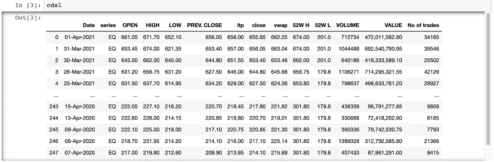**

**列名有一个小问题。以免列下各列**

> **列表(cdsl .列)**

**正如您在下面看到的，在列名的末尾有一个空格**

**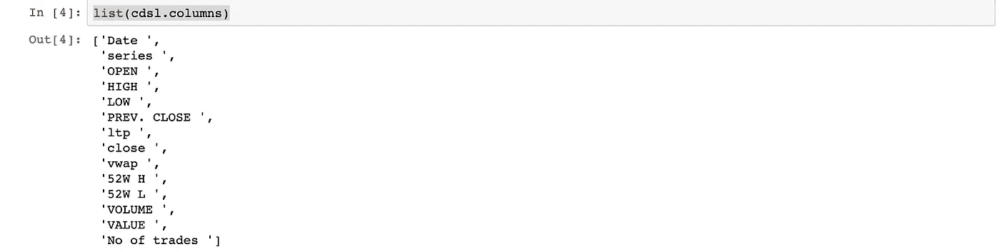**

**我正在更改列名**

> **df = cdsl . rename(columns = { ' Date ':' Date '，' series ': 'series '，' OPEN ': 'Open '，' HIGH ': 'High '，' LOW ': 'Low '，' PREV。关闭“:”上一页。CLOSE '，' ltp ': 'ltp '，' close ': 'close '，' vwap ': 'vwap '，' 52W H ': '52W H '，' 52W L ': '52W L '，' VOLUME ': 'VOLUME '，'笔数': '笔数' }，inplace = False)**

**现在，所有列的名称都改为相同的名称，但没有空格**

**要使用 prophet，日期是重要的变量。**

> **cdsl['日期']**

**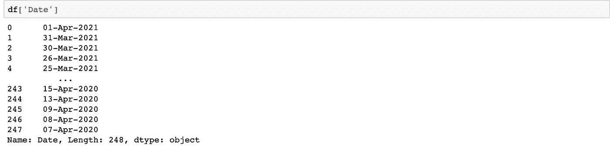**

**这看起来确实像一次正式的约会。但是当我们分类的时候，有一个挑战。如下图所示，排序不正确。这是因为不正确的日期格式。**

**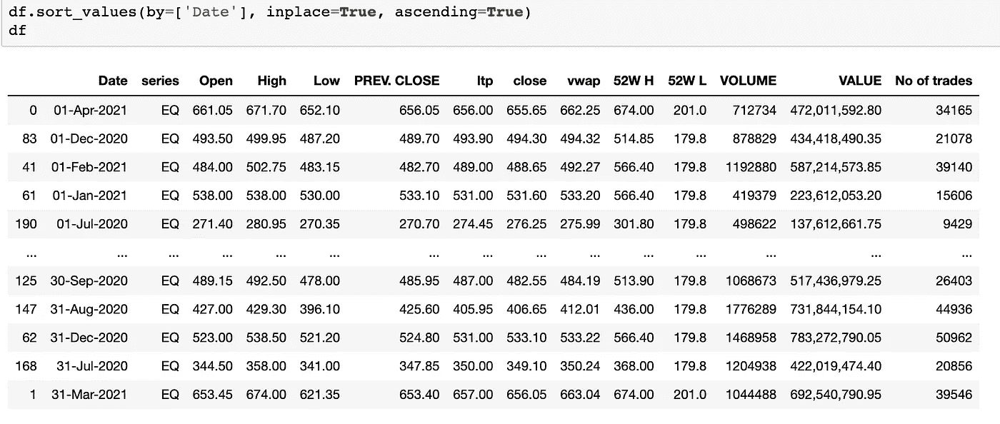**

**现在让我们改变日期格式。**

> **df['Date'] = pd.to_datetime(df。Date，format = ' % d-% b-% Y ')
> df . sort _ values(by =[' Date ']，inplace=True，ascending=True)
> df**

****

**现在日期整理出来了。让；使用 matplotlib 绘制数据**

> **从 matplotlib 导入 pyplot 作为 plt
> 导入 numpy 作为 NP
> x = df[' Date ']
> y = df[' LTP ']
> PLT . plot(x，y)**

**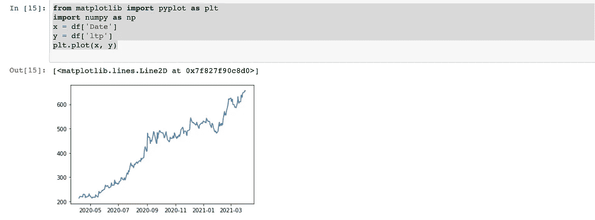**

**现在是时候为预言者准备数据了。先知只需要两个变量。我们将使用日期和 ltp(最后交易价格)**

> **dfdata = df[["Date "，" LTP "]]
> df data . rename(columns = { " Date ":" ds " }，inplace=True)
> df data . rename(columns = { " LTP ":" y " }，in place = True)**

**对于 Prophet，需要调用两个变量，分别为“ds”和“y”，我们在上面进行了重命名。在进行预测之前，让我们快速浏览一下数据**

**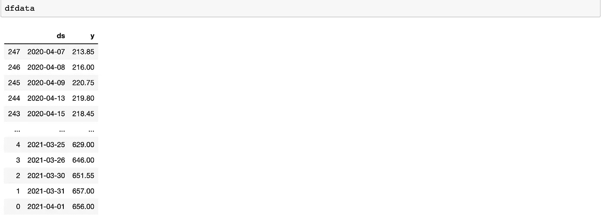**

**导入 prophet 并使用数据创建模型。**

> **从 fbprophet 导入 Prophet
> m = Prophet()
> m . fit(df data)**

**让我们预测未来 300 天。**

> **future = m . make _ future _ data frame(periods = 300)
> future . tail()**

**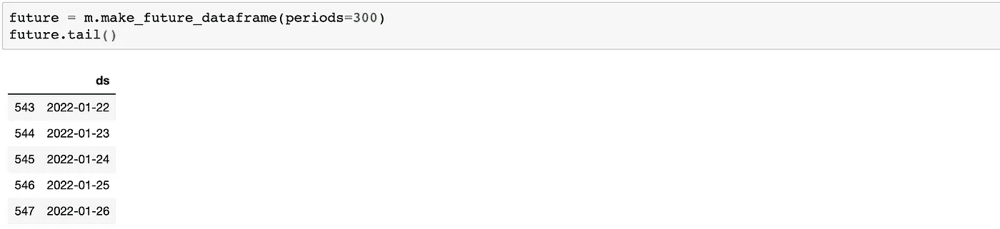**

> **forecast = m . predict(future)
> df forecast = forecast[[" ds "，" yhat "，" yhat_lower "，" yhat _ upper "]]
> PD . set _ option(' display . max _ rows '，df forecast . shape[0]+1)
> df forecast**

**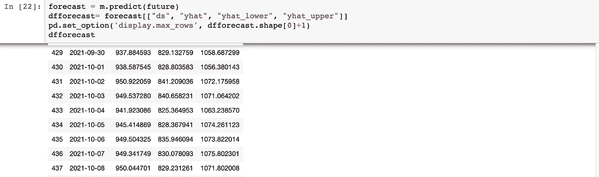**

> **图 1 = m.plot(预测)**

**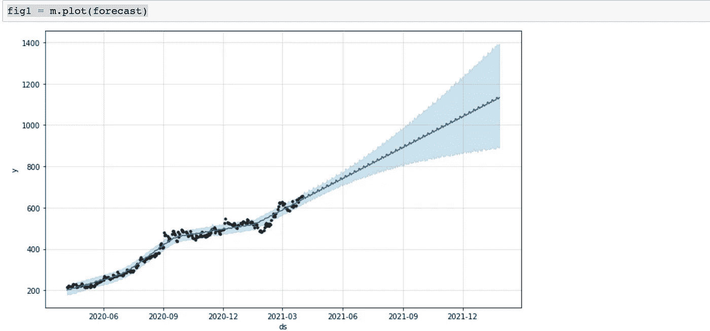**

> **图 2 = m.plot_components(预测)**

**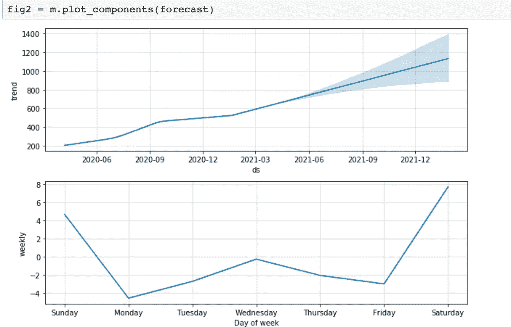**

**让我们构建交互式图形。**

> **from fbprophet . plot import plot _ plotly
> import plot ly . offline as py
> py . init _ notebook _ mode()
> fig = plot _ plot ly(m，forecast) #这将返回一个 plot ly 图形
> py.iplot(fig)**

**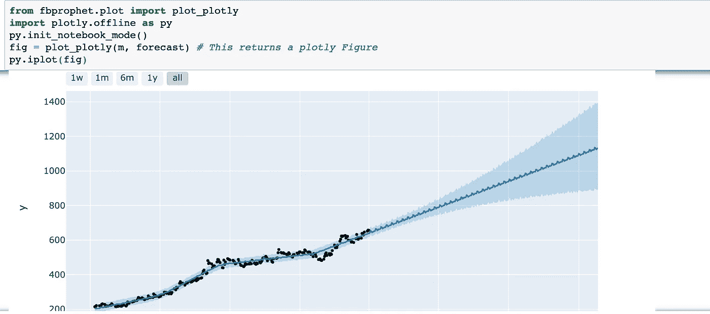**

**该模型预测 CDSL 达到 Rs。11 月第 1 周 1000，Rs 下侧。Rs 的 859 和更高侧。1164.让我们拭目以待吧！！！**

**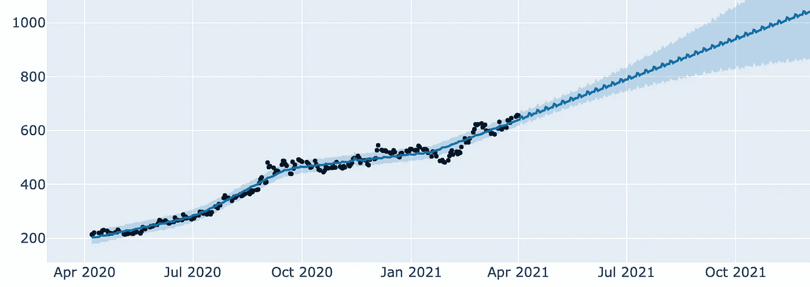**

***免责声明:股票价格的变化取决于许多因素，而不仅仅是过去的数据。这篇文章不是投资建议，纯粹是为了教育目的。请向您的财务顾问咨询任何具体的投资建议。***