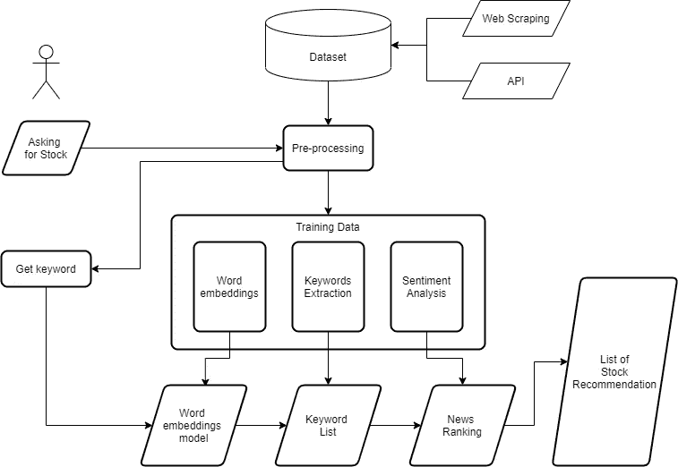
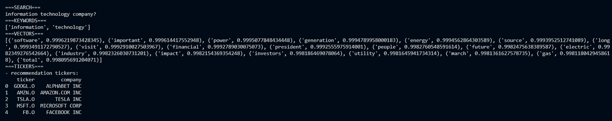
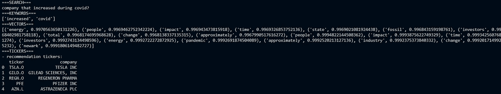
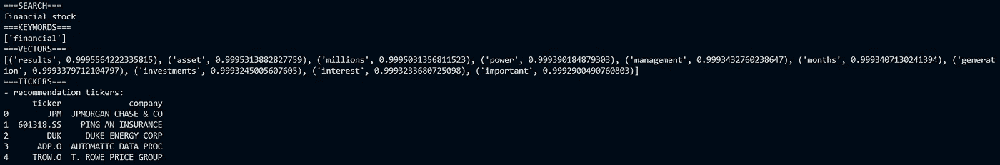

# 基于 NLP 集成技术的股票推荐系统

> 原文：<https://medium.com/geekculture/stock-recommendation-system-8e6cb386477e?source=collection_archive---------5----------------------->

# 介绍

股票市场投资是许多人长期感兴趣的领域。投资的目的是确保或增加他们的财务，即使它可能是盈利或亏损。股市中影响一只股票盈亏的因素有很多，包括 ***消息*** 。人们阅读新闻是为了了解正在发生的事情和未来可能发生的事情。新闻可以说明经济状况，触动人心。新闻、民众情绪和经济状况之间存在相关性(Damstra & Boukes，2018)。

在过去的几年中，许多研究集中在基于新闻的股票推荐系统(Hagenau et al，2013。，彭&蒋，2015)。新闻仍然与股票预测研究相关，因为它是互联网上广泛可用的数据文本，并且与**自然语言处理(NLP)** 研究的发展相关。然而，与用户需求和交互相关的研究数量仍然很少，可以进一步探索。

在这篇文章中，作者感兴趣的是使用 NLP 集成技术建立一个基于新闻和用户问题的股票推荐系统。**目标是展示系统的想法并讨论结果**。

> 这项研究不是真正的科学，因为它不是基于学术，它只是基于一个项目

# 系统设计

该系统基于三种自然语言处理技术构建，包括**单词嵌入**、**关键词提取**和**情感分析**。这些技术结合起来为询问股票相关问题的用户提供股票推荐。以下是描述系统设计的图表。

The system design

> **注:对系统设计的解释并不完整，每个阶段都有另外的参考文献**

## a.数据摄取

数据来源于几个出版商的新闻，如[雅虎财经](https://finance.yahoo.com/)、[华尔街日报](https://www.wsj.com/)、 [seeking alpha](https://seekingalpha.com/) 、 [benzinga](https://www.benzinga.com/) 等。大约五个月。在获取数据时，使用了两种方法，分别是 **web 抓取**和通过 **API** (例如 [Eikon 数据 API](https://developers.refinitiv.com/en/api-catalog/eikon/eikon-data-api) 和 [RapidAPI](https://rapidapi.com/) )。以下是进一步获取数据的文章，尤其是网页抓取技术:

*   [https://rahmantaufik 27 . medium . com/Google-scraping-using-beautiful soup-d 53746 ef5a 32](https://rahmantaufik27.medium.com/google-scraping-using-beautifulsoup-d53746ef5a32)
*   [https://rahmantaufik 27 . medium . com/web-scraping-using-selenium-79 a2 FCC 77215](https://rahmantaufik27.medium.com/web-scraping-using-selenium-79a2fcc77215)

## b.数据预处理

数据预处理是为训练准备数据，包括**清理**、**分词**、**去除停用词**。预处理的方法对于预处理来说是相当简单的，解释在数据训练文章之一中。

## c.数据训练

该系统的 NLP 训练模型是一个**集合**，其中三种技术在提供股票推荐方面相互联系、相互补充。以下是使用的技术:

*   **单词嵌入**:使用 **word2vec 将数据训练成一个有单词和向量的模型。**此外，它被用来建立一个金融新闻语料库，并获得相似词。下面是进一步的文章[https://rahmantaufik 27 . medium . com/word-embeddings-on-stock-market-news-7 C3 d 17 e 5 e 7 ef](https://rahmantaufik27.medium.com/word-embeddings-on-stock-market-news-7c3d17e5e7ef)
*   **关键词提取**:使用 **tf-idf** 从新闻中提取关键词。每只股票都会有一个关键词列表。下面是进一步的文章[https://rahmantaufik 27 . medium . com/keyword-extraction-on-stock-market-news-e 7 DC F3 af 987 a](https://rahmantaufik27.medium.com/keyword-extraction-on-stock-market-news-e7dcf3af987a)
*   **情感分析**:利用情感分析库获取股票新闻排名。除了关键词，每只股票都会有一些积极的消息。下面是进一步的文章[https://rahmantaufik 27 . medium . com/情操分析-股票新闻-2eb31c1f21c2](https://rahmantaufik27.medium.com/sentiment-analysis-on-stock-news-2eb31c1f21c2)

## d.数据处理

该系统有两种数据处理，一种是基于新闻的，另一种是基于用户提问的。数据集新闻需要首先被收集到数据库中，然后如上所述对其进行预处理和训练。流程如下:

1.  新闻被摄取、存储到数据库并进行预处理
2.  新闻数据集被训练成若干信息，包括金融新闻语料库、关键词提取列表和每只股票的新闻排名

而用户问题被直接捕获，并成为将与模型进行比较的关键词。流程如下:

1.  预处理用户问题以获得关键词
2.  将用户问题的关键词与词嵌入模型进行比较
3.  从单词嵌入模型生成的单词与每个股票中的关键字列表进行匹配
4.  收集具有该关键字的股票
5.  收集的股票按正数的数量排序
6.  股票排名前 5 名成为该问题的股票推荐

# 结果讨论

下面是基于这些问题的股票推荐示例。有三个例子有不同的问题，包括 ***信息技术，covid 和金融*** 。结果显示**相似词**和**基于财经新闻语料库的向量**和**基于股票关键词和新闻排名的股票推荐列表**。

**结果显示，相似词中的少数词与问题**的关键词无关，这可能是由于模型训练不良，如数据数量少于预期。例如，第一个问题包含与信息或技术关键字都无关的单词，如 *long、visit、president、march 和 gas* 。与问题二、三类似，还有与问题关键词无关的词，如*能源、化石、纽瓦克*为 covid 关键词(问题二)或*世代*为金融关键词(问题三)。此外，三个问题的相似词大多包含财务词汇，如财务、投资者、龙、资产、投资、总额等。这一结果可能是由于财经新闻中产生的相似词造成的。

但是，**股票推荐的结果仍然与问题**相关，因为这些关键词与股票关键词匹配，排名合适。它主要推荐与问题相关的股票，例如，*所有信息技术榜单的第二到第五名，covid 榜单的第一和第二名*。所以，**系统的结果表明，受相似度、关键词和股票排名的影响，可以推荐合适的股票**。

许多研究开发了基于新闻的股票推荐系统，使用复杂的技术或工具。然而，本文描述了使用三种简单的自然语言处理技术开发股票推荐系统的思想，这三种技术包括单词嵌入、关键词提取和情感分析。

虽然模型的结果(即*财经新闻语料库*)不是很有希望，但是在另一种信息(即*关键词和排名*)的帮助下，系统可以基于问题和新闻数据集提供合适的股票列表推荐。因此，**这种系统思想可以进一步发展为自然语言处理和金融研究**。

参考资料:

*   《经济、新闻和公众:经济新闻对经济评估和预期影响的纵向研究》。传播研究。2021;48(1):26–50.土井:10.1768678676867
*   哈格诺、迈克尔、迈克尔·李伯曼和德克·诺依曼。"自动新闻阅读:使用上下文捕捉特征基于金融新闻的股票价格预测."*决策支持系统*55.3(2013):685–697。
*   彭、杨拓、。"利用词汇嵌入和深度神经网络，利用金融新闻来预测股票价格的变动." *arXiv 预印本 arXiv:1506.07220* (2015)。

## 源代码

> 请喜欢并关注我的媒体或 github 欣赏 [**代码**](https://github.com/rahmantaufik27/nlp_stock_recommendation)

谢了。