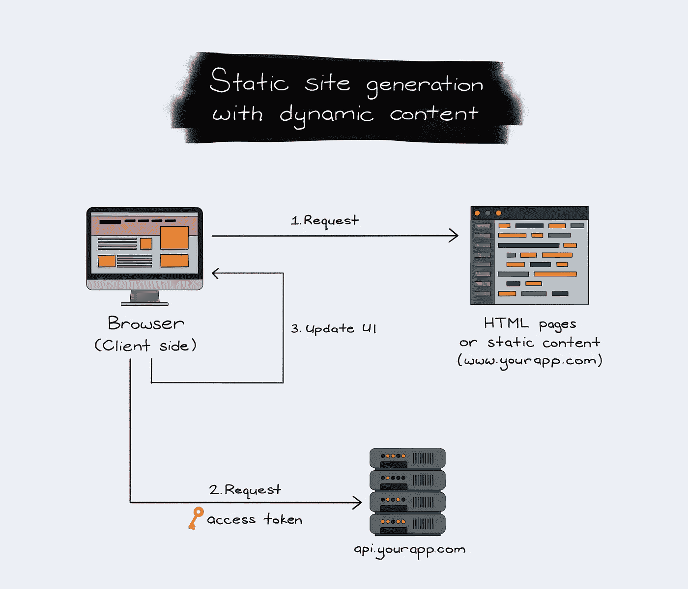

# 停止客户端和服务器端渲染。改为这样做。

> 原文：<https://medium.com/geekculture/stop-client-side-and-server-side-rendering-do-this-instead-a5a2715cf10d?source=collection_archive---------1----------------------->

## 最快、最优化的渲染模式——SSG 与 SWR 模式。

Static site generation with dynamic content rendering pattern diagram | Created by author

> 从 1 秒的加载时间增加到 5 秒的加载时间会使你的跳出率增加 90% ( [Google](https://www.thinkwithgoogle.com/marketing-strategies/app-and-mobile/mobile-page-speed-new-industry-benchmarks/) ，2017)。