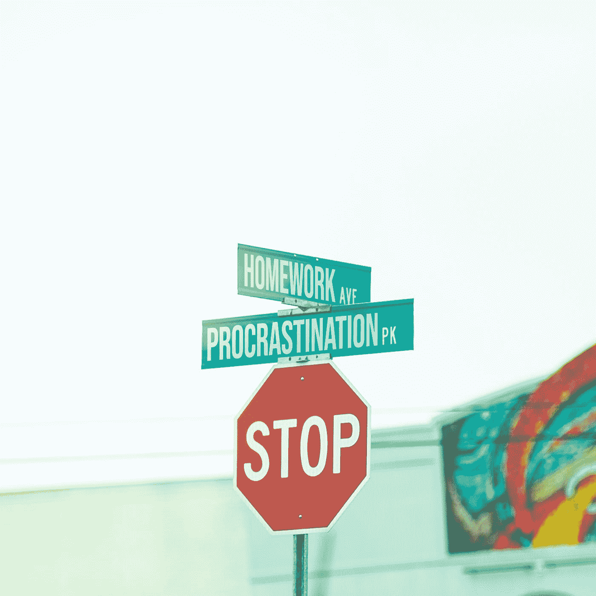

# 别再看编程了！

> 原文：<https://medium.com/geekculture/stop-reading-about-programming-2f20db02f082?source=collection_archive---------49----------------------->

做一些编程。

Photo by [Pedro da Silva](https://unsplash.com/@pedroplus?utm_source=medium&utm_medium=referral) on [Unsplash](https://unsplash.com?utm_source=medium&utm_medium=referral)

想象你想学习如何打保龄球。你可以读到很多关于保龄球的知识。有很多要知道的。什么是分裂？什么是备胎？你如何持球？你可以在电视上看保龄球。但是在某些时候，你可以通过阅读走得更远。你需要开车去巷子里，租双鞋(呃)，捡个球。