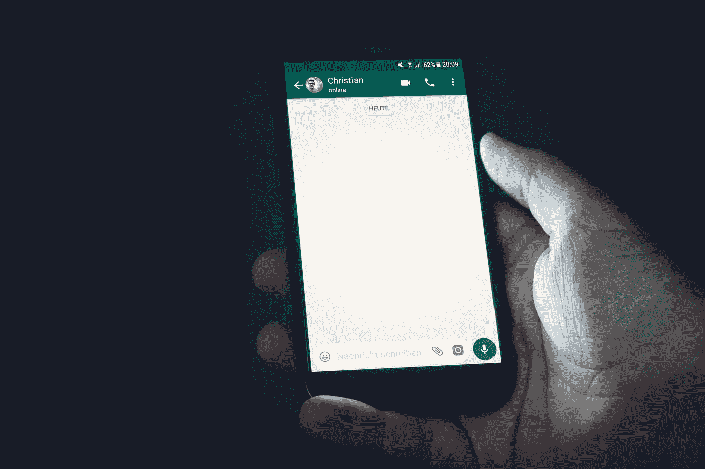

# 停止信任 WhatsApp

> 原文：<https://medium.com/geekculture/stop-trusting-whatsapp-9c7aadfb536d?source=collection_archive---------20----------------------->

Christian Wiediger

尽管有很多很多缺陷，WhatsApp 仍然是最受欢迎的通讯应用之一。围绕它的安全性和有用性的争论有增无减，一些人仍然鼓吹它是最好的。然而，这与事实相去甚远。虽然我可以谈一会儿 WhatsApp 的 UX 的许多缺陷及其大量的错误，但我想谈谈我从实际上对该应用不冷不热的人那里听到的一个常见论点。当被问及为什么他们仍然为 Meta 的产品辩护时，他们回答说:“至少它有端到端的加密功能。”Meta 的产品的创造者曾说过一句名言:“T0，我出卖了我用户的隐私”

但是真的吗？

# 已经很多年了

WhatsApp 的端到端加密(E2EE)主张最有力的论据来自借给他们加密的公司——Signal。早在 2016 年他们为 WhatsApp 实施 E2EE 时，这个过程受到监督，以确保没有篡改，因为即使在当时，也没有人信任 Meta，Signal 的前负责人莫邪·马林斯派克确认事情完好无损。他在 2017 年发表了一篇博文，称他[为 WhatsApp](https://signal.org/blog/there-is-no-whatsapp-backdoor/) 做担保。

从那以后，漫长的 5 年过去了。没有进一步的证实。在 WhatsApp 的 E2EE 声明没有受到质疑的 5 年里，用户面临着一连串的安全问题、[可疑的隐私政策变化](https://www.exchange4media.com/digital-news/whatsapps-new-privacy-policy-triggers-mass-exodus-of-users-to-rival-platforms-110155.html)以及与该公司普遍缺乏沟通。考虑到 WhatsApp 是完全闭源的，这意味着人们无法验证该应用程序及其服务器的代码和行为，相信这五年的动荡没有干扰 Meta 的 E2EE 是一个粗心的举动。

# 一张你不能信任的脸

Dima Solomin

这种审查的缺乏尤其令人担忧，因为在多起丑闻中，用户发现 Meta 很乐意让第三方跟踪用户。Meta 与执法部门、政府和其他机构共享用户元数据从来都不是什么秘密，但随着 FBI [证实](https://www.rollingstone.com/politics/politics-features/whatsapp-imessage-facebook-apple-fbi-privacy-1261816/)它定期从 WhatsApp 获取用户信息，这一方面已经被推到了风口浪尖。

然而，最近，我们看到更多迹象表明，WhatsApp 的 E2EE 可能并不像它所宣传的那样。首先，有消息称，著名的元投资者和右翼游说者彼得·泰尔资助了一家初创公司，该公司开发了攻击 WhatsApp 的工具，其中包括一些涉嫌篡改该应用加密的行为。然后，就在上个月，联邦调查局透露正在通过他的 WhatsApp 追踪一名恐怖嫌疑人[，暗指联邦特工获得的不仅仅是元数据。](https://www.theguardian.com/us-news/2022/may/24/george-w-bush-assassination-plot-islamic-state-fbi)

随着所有这些披露，我们为什么信任 WhatsApp 的问题变得越来越紧迫。Meta 要证明多少次它没有把用户的最佳利益放在心上？当越来越多的证据证明 WhatsApp 不安全时，该公司将保持 WhatsApp 的封闭源代码，这取决于用户何时意识到自己被利用了。