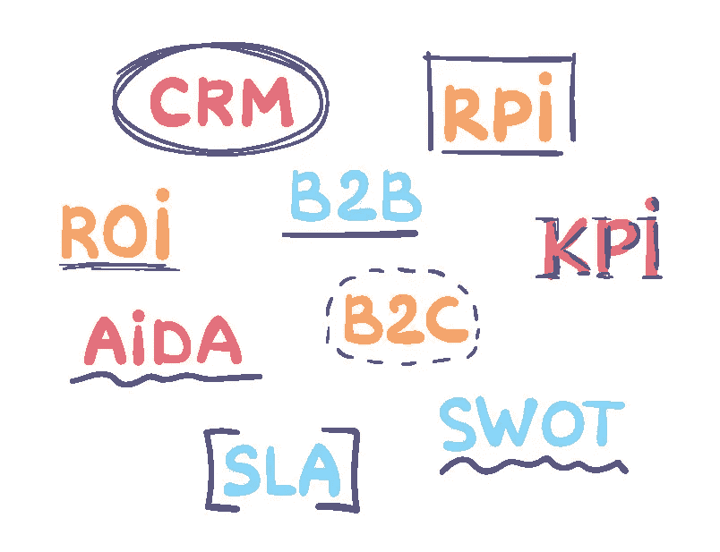

# 停止使用缩写——这是一种糟糕的交流方式

> 原文：<https://medium.com/geekculture/stop-using-acronyms-they-are-a-terrible-way-to-communicate-b93b48a09305?source=collection_archive---------10----------------------->

## 缩略语没有你想象的那么有用，原因如下。

首字母缩写词、tla、缩写词、首字母缩写词。爱他们或恨他们，我们的工作交流充满了他们，我们应该停止使用缩写。

人们和组织喜欢缩写。从简单的尽快回复的请求，到使用 J2EE、J2ME、J2SE、JAAS、JAR 等描述 JAVA 解决方案。甚至有网站致力于创造新的缩写词在工作中使用！(BTW —善待你的同事，不要使用那些网站)

问题是，缩写并不像我们想象的那么有用。

# 为什么我们使用缩写？

我们使用首字母缩写词，因为我们认为它们有助于我们清晰地交流。有时候确实如此。以下是 Acronym 帮助我们的三个理由:

*   首字母缩略词让事情变得更快——说 USA 比说美利坚合众国更快。
*   首字母缩略词有助于使复杂变得简单。大多数人知道雷达是什么，但很少有人知道(或关心)它意味着无线电探测和测距。
*   首字母缩略词将枯燥的项目标题变成古怪的、令人难忘的名字。说“我在做珠穆朗玛峰项目”肯定比说“我在做环境可变性根除恢复项目”容易

所以，是的，有时使用首字母缩写会有帮助。尽管如此，我们仍然需要停止使用它们。

# 为什么我们不应该使用缩写

然而，虽然我们认为首字母缩略词可以节省时间，但这只适用于编写它们的人。它们实际上增加了人们阅读和理解信息的时间。

简单性论证也是有缺陷的。首字母缩略词根据上下文可能有多种含义。现在，除了在心理上解开首字母缩略词，收件人需要考虑他们是否以正确的方式解释它。这导致了混乱和错误。

以下是一些有多种含义的常见缩写的例子。

*   OMG——对象管理小组，或我的天啊
*   RIP —路由信息协议，即安息协议
*   WAP —无线应用协议或无线接入点
*   DOS —磁盘操作系统，或拒绝服务

我个人最喜欢的是 LOL。当它在 20 世纪 90 年代后期在网上流行时，这引起了一些问题。老一辈的人不明白为什么他们的孩子会用“很多爱”来回复笑话短信。直到今天，有些人仍然不知道 LOL 的意思是大声笑出来。

Some people think LOL means Lots of Love

# 如果我们想使用首字母缩略词，应该怎么做？

在大多数情况下，答案是“不要使用它们”。

但是，如果你真的认为你需要使用它们，确保你明白为什么你要这样做。最后，缩写通常只在三种情况下有用:

*   为写作者节省时间。
*   如果观众已经熟悉这个术语。
*   减少技术文档中长技术短语的重复。

在这些情况之外，使用首字母缩写词、缩写词和首字母缩写词可能会使信息不太清楚，并且比使用完整的单词需要更长的时间来解释。

# 我们怎样才能使信息简短明了？

如果你的目标是节省时间，停止使用缩略词，集中精力让你的信息内容清晰。不要只减少字符数。使用一种能在少量的文字中最大化信息价值的结构。这些关于[清晰地开始对话的文章](https://chrisfenning.com/how-to-start-a-conversation-at-work-the-right-way/)，以及如何[创造惊人的摘要的文章](https://chrisfenning.com/3-steps-to-create-amazing-summaries/)为创造短信提供了简单的工具。

*你也可以通过阅读* [*第一分钟*](https://amzn.to/30w81Cm) *来学习如何在所有的工作交流中做到简洁明了。在你喜欢买书的地方都能买到。*