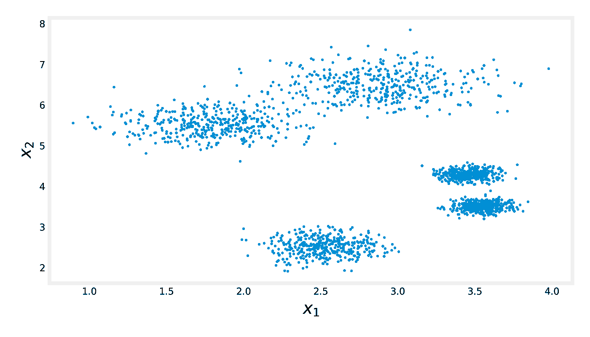
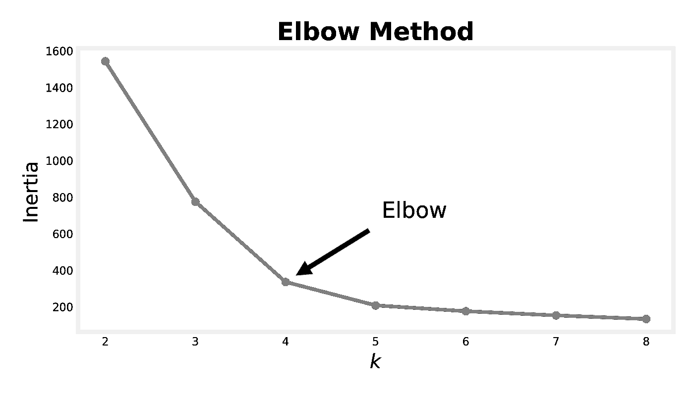
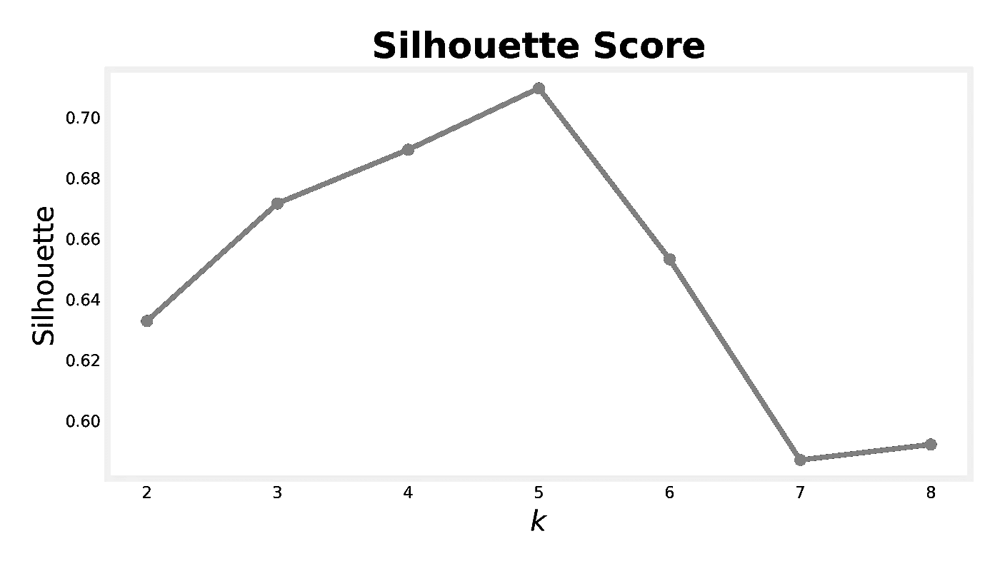
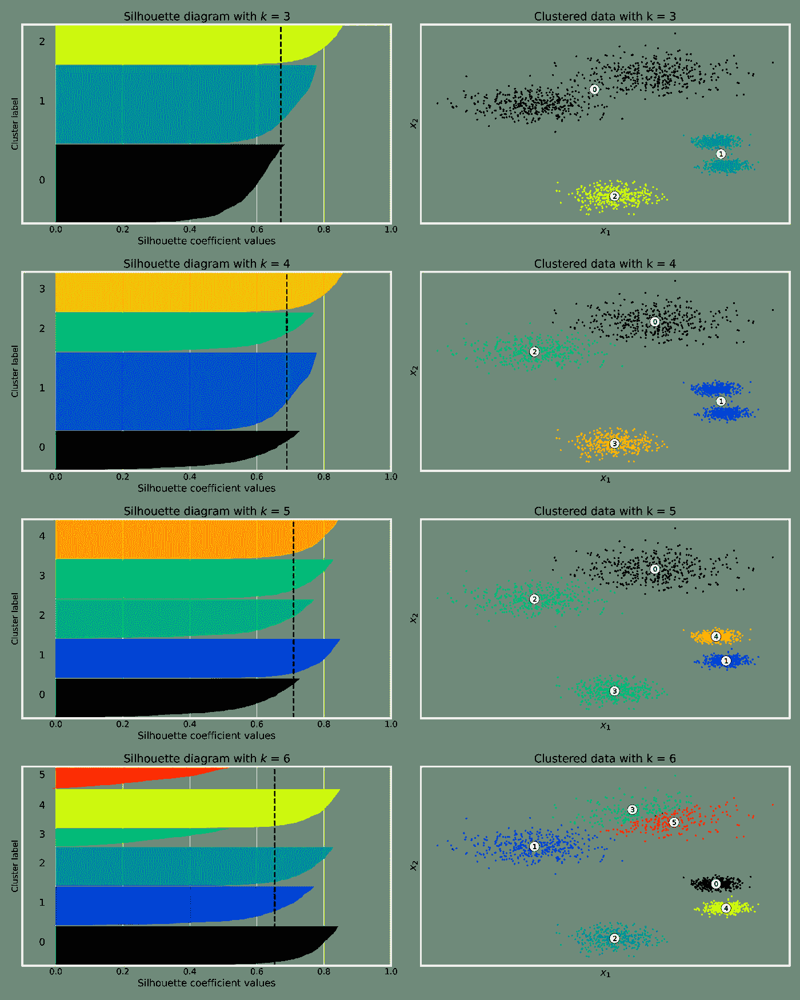
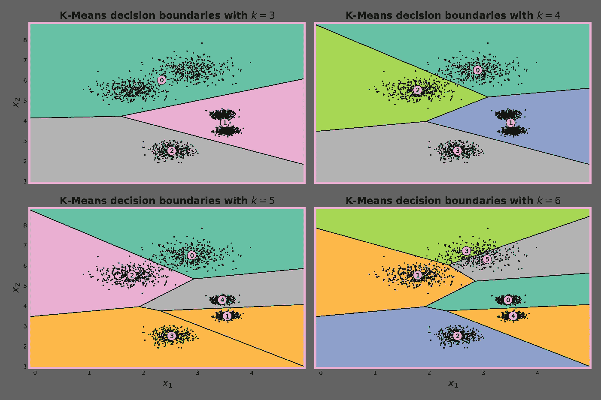

# 停止使用肘法

> 原文：<https://medium.com/geekculture/stop-using-the-elbow-method-96bcfbbbe9fd?source=collection_archive---------2----------------------->

## 剪影分析:使用 K-Means 寻找最佳聚类数的更精确方法

Photo by [David Pisnoy](https://unsplash.com/@davidpisnoy?utm_source=unsplash&utm_medium=referral&utm_content=creditCopyText) on [Unsplash](https://unsplash.com/s/photos/colorful?utm_source=unsplash&utm_medium=referral&utm_content=creditCopyText)

当使用 K-Means 执行聚类时，我们面临的一个常见挑战是找到最佳的聚类数。自然，著名和流行的**肘方法**是大多数数据科学家用来解决这个特殊问题的技术。

在这篇文章中，我们将学习一种更精确和更少主观的方法来帮助我们找到最佳的聚类数，即**剪影得分**分析。

# 肘法的缺陷

在[的另一篇文章](/@alexandre.hsd/everything-you-need-to-know-about-clustering-with-k-means-722f743ef1c4)中，我提供了 K-Means 算法的详细解释，它的微妙之处，(质心初始化，数据标准化，和聚类数)，以及一些优点和缺点。在那里，我也解释何时以及如何使用肘法。

K-Means 算法旨在最小化每个实例与其最近质心之间的均方距离，定义为**惯性**。然而，从这个定义中，出现了一个问题。

只要我们不断增加簇的数量，惯性就会一直减小，因为这些点会更靠近它们的质心。因此，在为 K-Means 选择正确的聚类数时，我们正在寻找给我们合理惯性的最小聚类数。这正是我们试图用肘法达到的目的。假设我们有以下数据:

Dataset

对于人类来说，可能很清楚数据来自 5 个不同的集群，但在处理高维数据时，我们无法轻松地将其可视化。

Elbow Method

使用肘方法，我们可能会选择 *k = 4* ，如左图所示。

*注意，由于两个聚类彼此相对靠近，肘形法使我们认为这些聚类只是一个，因为如果我们在两个聚类之间放置质心，从数据点到它的相对距离将会很短。*

因此，我们需要一种更加精确、严格和可靠的方法来为我们的聚类任务定义最佳的聚类数。剪影得分进入。

# 剪影分数

轮廓分数是数据集所有实例的平均轮廓系数。轮廓系数衡量一个聚类中的点与相邻聚类中的点的接近程度，其范围从-1 到 1。

数学上，轮廓系数由下式给出

Silhouette coefficient formula

其中 *a* 是到同一聚类中其他实例的平均距离(即，平均聚类内距离)，而 *b* 是平均最近聚类距离(即，到最近聚类中实例的平均距离，不包括实例自己的聚类)。

解释是当*b>a*时，剪影系数更接近+1，这意味着实例可能接近聚类的中心。同时，如果 *b = a* ，则剪影系数为 0，表示该实例在两个聚类之间的判定边界上。最后，如果*a>b*，那么，该实例非常接近另一个聚类中心，这意味着它可能被分配到错误的聚类。让我们绘制 K 均值聚类的轮廓分数，改变聚类数 *k* 。

Silhouette Scores for different number of clusters

该图比弯管法所用的图信息量大得多。很明显，即使 *k = 4* 不是一个坏的选择，分割数据的最佳聚类数是 *k = 5* 。可以使用 Scikit-Learn 计算轮廓分数:

Computing the Silhouette Score

# 剪影图

更丰富的可视化是**剪影图**。它是在绘制每个实例的轮廓系数时获得的，并按其聚类和轮廓系数排序。每个簇的厚度告诉我们簇的大小，每个簇的宽度代表簇中实例的排序剪影系数(越宽越好)。

一条额外的信息是黑色虚线，它告诉我们 t1756he 星团的平均轮廓系数(即轮廓分数)。我们可以看到下面的剪影图从 3 到 6 不等。

首先，仔细看看带有 ***k = 3*** 的图。在此设置中，群集 0 和 1 的大小是群集 2 的两倍。此外，几乎所有来自簇 0 的剪影系数都在*剪影分数虚线的左侧。*这意味着 *k = 3* 不是一个好的选择，因为它告诉我们一些集群可能被合并了，而集群 0 的实例离其他集群太近了。

另一方面，在 ***k = 4*** 和 ***k = 5*** 的情况下，一切似乎更好。对于 *k* 的两种选择，轮廓系数延伸到虚线之外，并且更接近于 1。然而，当 *k = 4* 时，集群 1 的大小是其他集群的两倍，在右边的图中，我们明白了为什么。两个分类合并形成分类 1，这意味着这是一个不平衡的分类，但我们事先知道数据集是平衡的。因此， *k = 5* ，确实是一个更好的选择，因为我们得到了相似大小的集群。

Silhouette diagram for various *k*

最后，当 ***k = 6*** 时，有几个实例的剪影系数较低。那是因为其中一个集群被切断了。

# 决策界限

另一个有见地的可视化是 K-Means 的决策边界图。尽管它仅限于二维数据，但理解 K-Means 如何分割数据是非常有用的。在下图中，您可以看到在 *k = 4* 的情况下，该算法无法区分集中在图的最右侧的两个聚类(所有实例都被分配给聚类 1)。同时，用 *k = 5* ，我们得到了想要的解。

K-Means decision boundaries

就这样，我希望你觉得这篇文章有用，我很想在评论区知道你的想法。本帖所有剧情源代码此处[此处](https://github.com/alexandrehsd/Cluster-Analysis/blob/master/Silhouette%20Analysis.ipynb)。

# 参考资料:

1.  [使用 Scikit-Learn、Keras 和 Tensorflow 进行机器实践学习:构建智能系统的概念、工具和技术](https://www.amazon.com.br/Hands-Machine-Learning-Scikit-Learn-TensorFlow/dp/1492032646)
2.  [利用 K-Means 聚类的剪影分析选择聚类数](https://scikit-learn.org/stable/auto_examples/cluster/plot_kmeans_silhouette_analysis.html#sphx-glr-auto-examples-cluster-plot-kmeans-silhouette-analysis-py)