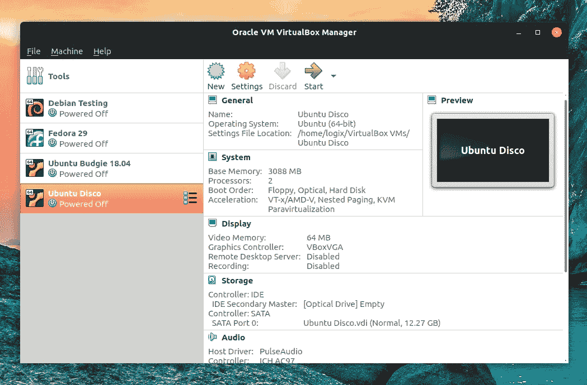
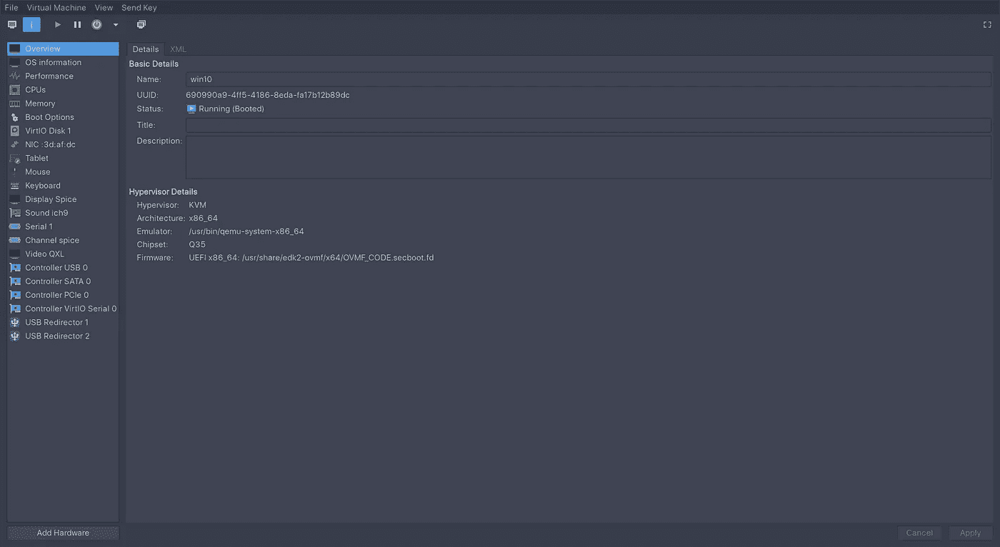
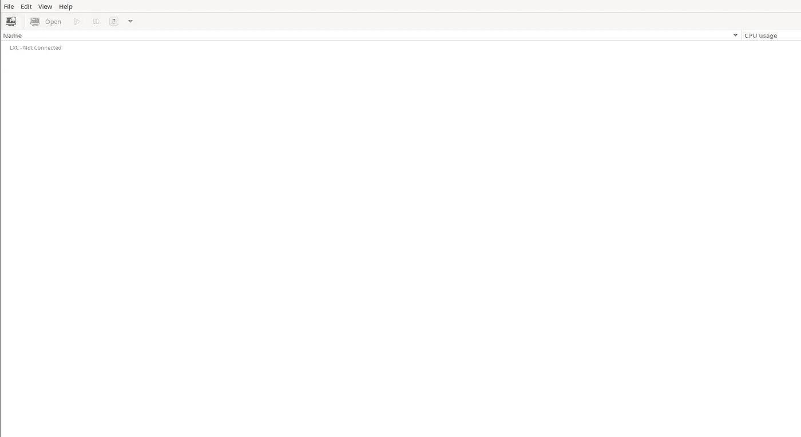
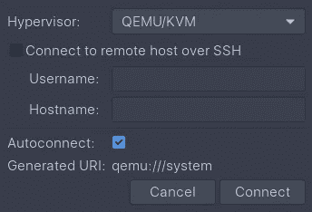
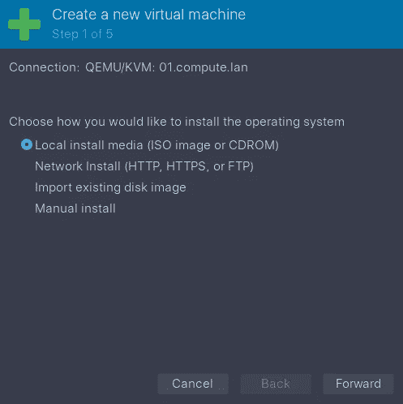
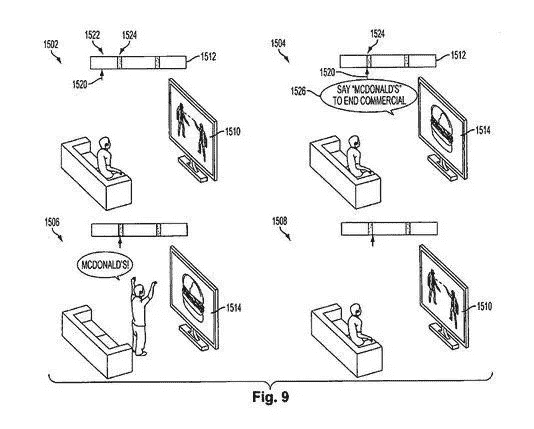

# 停止在 Linux 上使用虚拟盒子

> 原文：<https://medium.com/geekculture/stop-using-virtual-box-on-linux-51e02739f812?source=collection_archive---------0----------------------->

## 使用 Virtual Machine Manager 而不是 Virtual Box


Photo by Dre Tech Tips

作为一个 Linux 用户，你可能需要使用 Windows。您的工作可能需要 Windows。或者玩与质子可比性层不兼容的游戏。但是，您可能希望在隔离的环境中运行软件。因为操作系统正在运行一大堆令人毛骨悚然的东西。字母男孩有进入操作系统的后门。这些是唯一公开的安全缺陷。

要在一台机器上运行多个操作系统，用户需要虚拟化一个操作系统。作为虚拟化的新用户，您可能已经被推荐将 Virtual Box 作为 go 软件。然而，尽管软件很简单，你很快就会意识到，与你的主操作系统相比，软件的性能是很慢的。

这就是为什么您应该使用 Virtual Machine Manager 而不是 Virtual Box。

## 虚拟机管理器 vs VirtualBox？

虚拟机管理器是 GUI 应用程序。而 Virtual Box 是整个桌面 GUI 虚拟化套件。我们将只比较两个应用程序的 GUI。Virtual Box 的用户界面注重简单而非复杂。



Photo from linuxuprising.com

因此它更适合 Linux 的初学者。但是，Virtual Machine Manager 是为对虚拟机有更多经验的人量身定制的。因为您可以从所用的硬件、所用的显示服务器、仿真器等方面定制软件。它是虚拟机软件的 Linux。



Photo from Dre Tech Tips

因此 Virtual Machine Manager 更适合高级用户。但是我们需要更多的信息来说明为什么定制是重要的。这就把我们带到了下一点。

## QEMU 和 KVM 是什么？

Virtual Machine Manager 遵循软件模块化的 Unix 理念。当您听说 Virtual Machine Manager 时，您通常会听说该软件与 QEMU 和 KVM 等其他软件捆绑在一起。

QEMU 是虚拟机管理器用来管理虚拟机的 CLI 应用。 [KVM 是 Linux](https://www.redhat.com/en/topics/virtualization/what-is-KVM) 的开源管理程序。虚拟机管理程序是位于硬件和来宾操作系统之间的软件层。关于不同的虚拟机管理程序谁是最好的，有许多争论。但是，KVM 最适合非企业用户，它提供了最接近裸机的性能。由于模块化，您可以使用 KVM 上的[Xen](https://programmerah.com/install-xen-virtual-machine-using-virt-manager-4884/)作为您的管理程序。VirtualBox 在性能方面甚至无法与之匹敌。这就把我们带到了下一点。

## KVM 是第一类还是第二类虚拟机管理程序？

KVM 是第一类虚拟机管理程序，因为它在虚拟机上使用硬件加速。第一类或第二类虚拟机管理程序的术语已经过时，因为大多数现代虚拟机管理程序在某种程度上使用硬件加速。Virtual Box 是其中一个例外，因为它有第二类虚拟机管理程序。这就是为什么与其他虚拟机管理程序相比，Virtual Box 的性能较差。

## 如何安装和设置 Virtual Machine Manager？

既然你已经确信虚拟机管理器是更好的虚拟机软件。

1.  **安装所需的软件包**

您需要安装由 libvirt、KVM、QEMU 和 Virt Manager 组成的整套软件和软件包。

Ubuntu/Debian

```
sudo apt-get install virt-manager libvirt-bin qemu-kvm libvirt-daemon-system libvirt-clients bridge-utils
```

[Arch Linux](/geekculture/the-quick-and-easy-way-to-install-arch-linux-70b9bfc35863)

```
sudo pacman -S qemu virt-manager virt-viewer dnsmasq vde2 bridge-utils openbsd-netcat ebtables iptables
```

**2。启动 KVM libvirt 服务**

一旦您安装了它，您将必须在引导时启用 KVM libvirt 服务。

基于 Systemd 的机器

```
sudo systemctl enable libvirtd.service
sudo systemctl start libvirtd.service
```

运行所需的命令，以确保您的服务在后台运行。

```
sudo systemctl status libvirtd.service
```

成功输出:

```
● libvirtd.service - Virtualization daemonLoaded: loaded (/usr/lib/systemd/system/libvirtd.service; disabled; vendor preset: disabled)Active: active (running) since Sun 2022-04-03 20:55:10 CDT; 18s agoTriggeredBy: ● libvirtd-admin.socket● libvirtd.socket● libvirtd-ro.socketDocs: man:libvirtd(8)https://libvirt.orgMain PID: 3559245 (libvirtd)Tasks: 19 (limit: 32768)Memory: 20.6MCPU: 202msCGroup: /system.slice/libvirtd.service└─3559245 /usr/bin/libvirtd --timeout 120Apr 03 20:55:10 dre-latitudee6440 systemd[1]: Starting Virtualization daemon...Apr 03 20:55:10 dre-latitudee6440 systemd[1]: Started Virtualization daemon.
```

任何输出都意味着您的守护进程启动失败，这需要调试。这超出了本教程的范围。然而，一个有用的调试方法是将应用程序提供的错误消息复制到搜索引擎中。

**3。启用普通用户帐户使用 KVM**

现在您需要启用一个普通用户帐户来访问 KVM。使用以下命令打开配置文件进行编辑。

```
sudo [text-editor] /etc/libvirt/libvirtd.conf
```

将套接字组所有权更改为 libvirt。

```
unix_sock_group = "libvirt"
```

从[开始，使用以下命令为除自己之外的所有用户设置读、写和执行的权限。](/geekculture/what-is-the-linux-permissions-5338df2f3fdf)

```
unix_sock_rw_perms = "0770"
```

现在，使用以下命令将想要访问虚拟化软件的用户帐户添加到 libvirt 组。

```
sudo usermod  -a -G libvirt $(whoami)
newgrp libvirt
```

最后，重新启动 libvirt 守护进程，以启用您最近所做的修改。

```
sudo systemctl restart libvirtd.service
```

**4。启用嵌套虚拟化(可选)**

在本节中，假设您运行的是带有 Intel CPU 的 Linux 内核。您可以启用嵌套虚拟化来在虚拟机中运行虚拟机。首先启用内核模块。

```
sudo modprobe -r kvm_intel
sudo modprobe kvm_intel nested=1
```

然后用下面的命令启用持久性。

```
echo "options kvm-intel nested=1" | sudo tee /etc/modprobe.d/kvm-intel.conf 
```

在这里，您需要使用以下命令确认嵌套虚拟化已经启用

```
$ systool -m kvm_intel -v | grep nested
  nested = "Y"
  nested_early_check = "N"$ cat /sys/module/kvm_intel/parameters
```

在 amd 上用 AMD 代替每一个有 intel 的字。

**5。启动虚拟机管理器**

现在您已经安装并设置了软件套件，是时候启动应用程序了

```
virt-manager
```

这将显示如下截图，如下所示。



Photo from Dre Tech Tips

## 如何使用虚拟机管理器？

一旦安装了虚拟化软件套件，就该使用该应用程序了。

在本节中，我们假设您运行的是带有 Intel CPU 的 Linux 内核。您可以启用嵌套虚拟化来在虚拟机中运行虚拟机。首先启用内核模块。

```
File > Add Connection
```



建立连接后，您需要向该连接添加一个虚拟机。在以下菜单选项下，您将添加一个虚拟机。

```
File > New Virtual Machine
```

这将提示您创建一个新的虚拟机。



一旦您选择了调配虚拟机的所有选项，您将能够直接自定义这些选项。


Photo from Dre Tech Tips

但是，您可能不需要已经创建的虚拟机。您只需右键单击虚拟机，然后单击删除选项。出于备份目的，您可能需要制作存储的副本。大多数系统管理员将不得不自动执行备份，以实现时间相关的恢复。跟随[我的关于如何自动化任务的教程来学习如何自动化 Linux 任务](/geekculture/how-to-automate-tasks-in-linux-bsd-91d0b0560f5)。这有助于自动化虚拟机存储文件备份。这涵盖了应用程序必须提供的主要特性。

## 如何进行 PCI 直通？

为了获得最佳性能，您可能希望通过硬件直接进入机器。默认情况下，鼠标和键盘等硬件将通过 USB 服务器传输。这个中间件层会增加延迟。幸运的是，VM Manager 允许您直接向机器添加硬件。对于大多数硬件，您只需将硬件直接传递给客户操作系统。

[](https://access.redhat.com/documentation/en-us/red_hat_enterprise_linux/5/html/virtualization/sect-virtualization-adding_a_pci_device_to_a_host) [## 15.2.使用 virt-manager Red Hat Enterprise Linux 5 | Red Hat 客户门户添加 PCI 设备

### 可以使用图形化虚拟管理器工具将 PCI 设备添加到 guests 虚拟机中。以下步骤添加了一个 2 端口 USB…

access.redhat.com](https://access.redhat.com/documentation/en-us/red_hat_enterprise_linux/5/html/virtualization/sect-virtualization-adding_a_pci_device_to_a_host) 

穿越的缺点是硬件直接是主操作系统将不能访问硬件。所以你需要插上第二个键盘和鼠标来进入主操作系统，而不用关掉机器。

## 如何直通 GPU？

您希望通过 GPU 来提高需要 GPU 的应用程序的性能。这对于需要[并行算法的任务尤其重要，例如视频和游戏渲染或人工智能开发](/geekculture/distributed-computing-for-beginners-f4116adf609d)。已经有很好的教程教你如何通过 GPU。

[](https://wiki.archlinux.org/title/PCI_passthrough_via_OVMF) [## 通过 OVMF 的 PCI 直通

### 开放虚拟机固件(OVMF)是一个为虚拟机启用 UEFI 支持的项目。从 Linux 开始…

wiki.archlinux.org](https://wiki.archlinux.org/title/PCI_passthrough_via_OVMF) 

当你通过你的 GPU 时，你的主显示器会冻结。因为您为虚拟机提供了对 GPU 的完全访问权限。设置直通的最佳方式是让您的主显示器运行 GPU 集成显卡。并且还有针对 NVIDIA 消费级 GPU 的 [DRM，防止用户使用多个 GPU](https://www.storagereview.com/news/nvidia-enables-beta-support-for-virtualization-on-geforce-gpus)。然而，t [网上有很多教程教人们如何移除这个 DRM](https://www.tomshardware.com/news/nvidia-gpu-virtualization-unlocked-on-client-gpus) 。

在某些游戏中，KVM 的 GPU 性能将比裸机性能更快。


Figure 1 from fourm.level1techs.com

听起来很疯狂。除了避免可疑和间谍软件之外，这也是你应该在 KVM 虚拟机中运行 Windows 的另一个原因。

## 如何创建无头服务器？

既然已经在本地机器上创建了一个可视化的服务器，远程连接的问题可能会出现。在许多使用案例中，无头服务器是一种优势。这是假设你的设置有一个良好的互联网连接。您可以创建一个无头服务器，它可以连接到办公室或家中的任何地方，例如您的电视、笔记本电脑甚至手机。[默认情况下，虚拟机 libvirt 库允许远程机器通过经过验证和加密的连接来访问虚拟机管理程序。](https://libvirt.org/remote.html)

[您应该为服务器](/@dretechtips/how-to-dismantle-the-google-empire-e652bff6d2)添加一个静态 IP 地址或主机名，以便您可以在任何计算机上轻松访问虚拟机。首次尝试访问该服务时，会提示您输入密码。即使有了正确的密码，它仍会不断重复验证循环。我不确定这是一个 bug 还是什么，[但是，你需要使用一个私钥文件来认证。您只需要一个主机名和密钥文件就可以向服务器进行身份验证。](/geekculture/ssh-securely-connect-to-your-servers-8895faab7083)

```
qemu+ssh://**dre@01.compute.lan**/system?keyfile=**~/.ssh/vm.local**
```

现在，您可以访问虚拟专用服务器的显示，而不必再使用您的凭据登录。

## 如何设置没有幽灵的云游戏？

在过去的一年里，你可能已经看到了所有这些谷歌 Stadia 和 NVIDIA Ge-Force 现在推广云游戏的广告。这些平台将监控你所有的击键、鼠标移动、设备类型等等。这样他们就可以利用这些数据给你做有针对性的广告。你会在《黑镜》中看到的反乌托邦的东西。



Patent Figure from reddit.com

[](https://www.techpowerup.com/240655/leaked-ai-powered-game-revenue-model-paper-foretells-a-dystopian-nightmare) [## 泄露的人工智能驱动的游戏收入模型文件预言了一个反乌托邦的噩梦

### 当你争夺更多的游戏时，人工智能(AI)会故意篡改你的在线游戏…

www.techpowerup.com](https://www.techpowerup.com/240655/leaked-ai-powered-game-revenue-model-paper-foretells-a-dystopian-nightmare) 

不仅如此，有些人还担心缺乏软件所有权。您的帐户可能会被禁止或删除，导致您失去与该帐户相关的一切。当然，维护软件的公司可能会倒闭，这意味着你将失去你购买的所有游戏。因此，这就是不把所有东西都放在云中的原因。


Figure from psu.edu

然而，你不必放弃云游戏这个选项。因为有一些好处，例如不必升级硬件。为您花费的时间而不是购买的硬件付费。并且能够在任何有可靠互联网连接的地方玩游戏。这是假设你知道如何配置你的云游戏系统，这样它就不会有大众市场上提到的云游戏的缺点。

您可以使用 NVME 固态硬盘和最新的 NVIDIA GPU 创建 VPS。对于买不起最新硬件的人来说，数字农民似乎是唯一的选择。我推荐的提供商(如 Digital Ocean)没有针对 NVME 和 NVIDIA GPU 的选项。然而，这里有一些推荐的 VPS 提供商，他们确实提供了拥有最新 GPU 和最快 NVMe 存储的选项。

*   [特雷索里奥](https://tresorio.com/en/vps/)
*   [谷歌云](https://cloud.google.com/gpu)
*   [亚马逊网络服务](https://www.nvidia.com/en-us/data-center/gpu-cloud-computing/amazon-web-services/)
*   [微软 Azure](https://docs.microsoft.com/en-us/azure/virtual-machines/sizes-gpu)

即使有了快速服务器，云游戏也只能和服务器上运行的延迟一样好。遵循这些提示来减少延迟。在离您最近的服务器上运行您的虚拟机。看看 ping 时间。ping 时间长的封闭服务器通常意味着平台使用的服务质量算法很差，或者流量使可用带宽过载。在这种情况下，您应该考虑使用另一个平台提供商。还有，看服务的口碑。有些平台是由对网络安全没有多少专业知识的人运营的。或者他们直接被喂蜜罐设计来引诱人们，不管是恶意的还是不恶意的，让他们认为他们正在使用一个私有的 VPS。查看关于[如何创建基于内容交付网络的指南，了解更多关于优化内容交付的信息](/@dretechtips/how-to-build-a-based-content-delivery-network-e1aa8bb237b3)。如需更多服务器优化信息，请关注研究[边缘计算](https://www.ibm.com/cloud/what-is-edge-computing)。

考虑到所有这些优化和风险，如果您不知道自己在做什么，那么最好是自托管，而不是使用云。如今购买这种硬件会因为刮擦而花费很多。然而，[你可以在易贝](/geekculture/buy-enterprise-it-equipment-cheaply-in-2022-4356a4e20d46)买到便宜的旧硬件。正如大多数人应该知道的那样，云只不过是别人的服务器。使用云有很多省钱的方法。因为大多数服务器不是按机器运行的时间收费，而是按内容的存储量收费。你可以在网上找到一堆关于降低成本技巧的教程。

一旦你创建了 VPS。登录 VPS 设置无头服务器。确保您创建了一个非 root 用户。配置虚拟机管理器软件。现在你可以在任何地方玩你的游戏了，假设你有你的私人密钥连接到服务器。通过 SSH 端口使用 QEMU 连接到您的服务器，以防止任何人窥探您的连接。现在你已经创建了没有所有间谍软件的云游戏。还建议您对使用的每个服务运行延迟测试基准，以优化性能。

## 最后

IT 和工程领域是快速发展的领域。跟不上意味着你将被落在后面。跟上的最好方法是保持最新的新闻和教育内容。[订阅免费电子邮件列表，将您的职业生涯提升 10 倍。](/subscribe/@dretechtips)

加入我们吧，50 多位想要快速提升职业生涯和知识基础的人已经注册了。

达到这一点可能意味着你同意大部分已经写了。留下大量掌声，让算法向大众推广不受欢迎的技术，如 Linux。

**相关内容:**

*   [快速简单的安装 Arch Linux 的方法](/geekculture/the-quick-and-easy-way-to-install-arch-linux-70b9bfc35863)
*   [如何在 Linux 中安全删除文件？](/geekculture/how-to-securely-delete-files-in-linux-ce6ad1205922)
*   [Linux 内核初学者指南](/geekculture/the-beginners-guide-to-the-linux-kernel-29743b1a2daf)