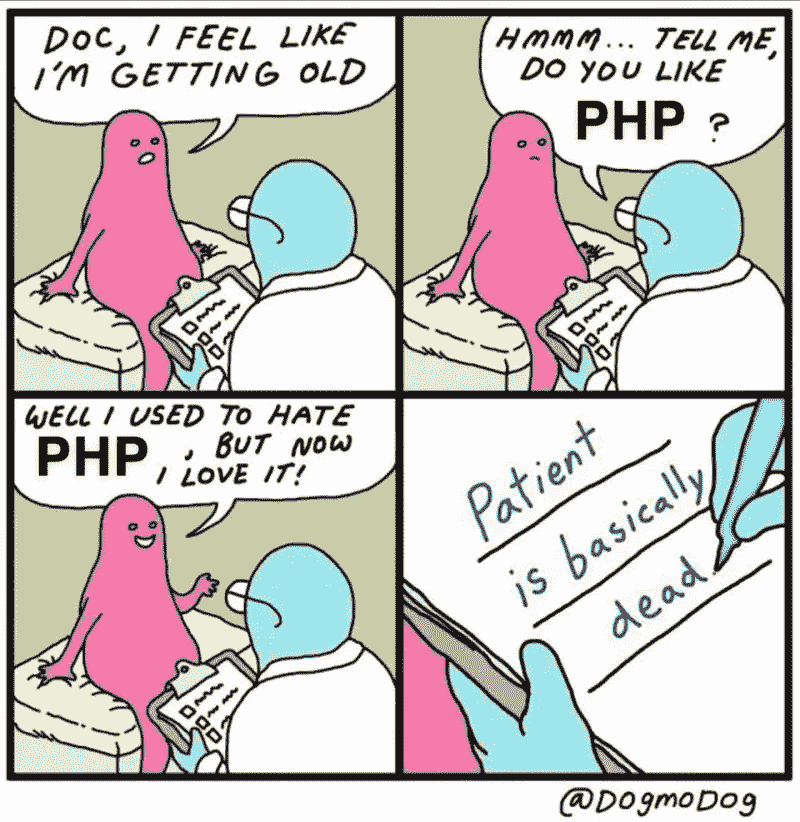

# 讣告死了。如何用同理心宣布科技的消亡

> 原文：<https://medium.com/geekculture/stop-whining-or-how-to-announce-that-tech-is-dead-with-empathy-396dc50b8a22?source=collection_archive---------18----------------------->

Image Credit: [@dogmodog](https://twitter.com/dogmodog)

宣言 a-la“PHP 已死”和“停止使用 Next.js”是垃圾媒体。我对其中一个的反应几乎总是一样的:它没有任何价值，作者只是一个业余爱好者，还没有足够长的时间被认真对待。

仅仅因为你在互联网上发现了更好的替代方案或一些可疑的统计数据来支持你的说法，你就不能假设某样东西已经死了。有人继续维护用“过时”技术构建的网络和企业软件。一种自 1972 年就存在的编程语言有时比一些没有足够时间展示其弱点的炒作的新语言更适合为火星探测器提供动力。

一个好的开发者知道软件的成功几乎完全依赖于工具的选择。仅仅因为有人认为 X 在他们工作的任何狭窄的上下文中比 Y 更好，并不意味着他们有权宣布每个人都应该立即停止使用 Y。最终，这都是关于理解需求，考虑影响和权衡取舍。

与其浪费你的时间，让你的读者对另一篇科技讣告感到厌烦，不如考虑对这些格式中的一种更加留意和有帮助。

# 文章格式

## 深度文章

你是否尝试过一些新技术，并发现它非常适合这项工作，请分享你的经验:

*   该工具基于哪些基本原则？作者追求的动机是什么？
*   该工具有什么依赖关系，它们对软件开发的各个方面(DevEx、CI/CD、可测试性、可观察性等)有什么影响
*   该工具非常适合哪些用例？
*   你如何展望这个工具的未来:关于如何改进它的任何建议，关于谁是这个工具的幕后支持者的任何背景，以及他们将如何确保他们的工具在半年后不被废弃？
*   这个工具生产准备好了吗？在集成中是否经过测试和可测试？你对仓库的卫生状况满意吗？
*   有哪些之前的和替代的工具，为什么你会推荐这个工具？

## 赞成和反对文章

不管你试图向他人推销的工具有多好，它是解决他们担忧的灵丹妙药，一切都要有所取舍。如果你对你推荐的方法或工具没有任何顾虑，也许你应该推迟写一篇文章，因为你对主题还不是很了解。没有足够的信息，你可能会让某人误入歧途。

*   通过列举旨在解决同一问题的各种工具的优缺点，帮助他人制定决策
*   让其他人做好选择时可能会遇到问题的准备
*   提供其他资源的链接，帮助您更好地理解这些工具并做出自己的明智决定
*   展示代码片段，展示实现的不同之处，以及为什么一个比另一个更有益或更容易采用

## 反思文章

如果你真的希望某个工具寿终正寝，因为它浪费了你的时间，而且不适合你的工作，不要诋毁那些从日程中抽出时间来构建和支持这个工具的人。相反，试着反思你自己的经历，理解你的决定错在哪里:

*   你在使用这个工具之前是如何评价它的？
*   该工具未能解决您的特定用例吗？你认为这是为什么？其他人应该注意什么？
*   文档是否有误导性，你将如何改进它以防止其他人重复你的错误？
*   缺乏作者的支持或沟通是您无法充分利用该工具的一个因素吗？如果社区有足够的资金和编码支持来提高作者的积极性，这个工具会更可靠吗？
*   如果您要创作一个类似的工具，您会做出哪些不同的决定，您认为如何重构/增强该工具以使其更加可用。

## 辅导的

如果你认为 A 比 B 更好，并且确信每个人都应该做出改变，不要告诉他们停止使用 B，而不了解这在实际中意味着什么。相反，如果你必须听从自己的建议，你会采取什么步骤:

*   从 B 切换到 A 最简单的方法是什么？有什么小技巧和捷径吗？
*   你能提供一步一步的说明和操作方法吗？
*   如何估计重构现有代码库的工作量？
*   怎么会有人估算转行的收益，计算投资回报呢？可以考虑哪些 KPI？
*   你会如何向你的管理层推销这种需求？有什么长期的好处？会提高可测试性还是可观测性？会提高 DevEx，让团队更有效率吗？
*   如果有人在迁移过程中遇到问题，有哪些资源(文档、论坛、文章等)？

# 醒目的标题

一切都从标题开始，所以下次你坐下来写作的时候，读一读你的标题，问问自己——这对任何人有帮助吗？

重写你的标题，让它对你有所帮助，其他的也会随之而来。

## x 死了

*   X 采用率下降的 10 个原因
*   x 正在死亡——你如何准备它的死亡
*   我们能做什么来让 X 活着
*   为什么我对 X 的离去感到悲伤
*   没有 X，世界会更安全
*   如何防止 X 灾难再次发生
*   徐:好的、坏的和丑的

## **停止使用 x，改用 Y**

*   X 与 Y 相比如何，你为什么要在意
*   评估从 X 转换到 Y 的好处
*   从 X 到 Y 的转换如何让我更快乐/更有效率
*   日落 X 的路线图
*   通过切换到 Y，提高可测试性/可观察性/开发可用性/可访问性
*   从 X 转到 Y 的 10 个理由

你也可以重新构建论点，而不是专注于特定的工具，利用你的糟糕经历来阐明理想的选择应该是什么，以及如何做出选择。

*   图像处理:你会喜欢的 5 个工具
*   微前端实用程序的比较
*   如何选择合适的内容管理系统
*   一个好的 ORM 需要注意什么
*   一个好的 UI 库的 5 个性能指标

选择接受这样一个事实，我们在这里是为了学习，而不是听咆哮和浪费时间在无用的修辞上，关于又一个不再受你青睐的工具。少即是多:有时不写比写一些没有根据、没有论据、研究不足和没有建设性的东西要好。冲动写作属于你的日记，而不是公共领域。