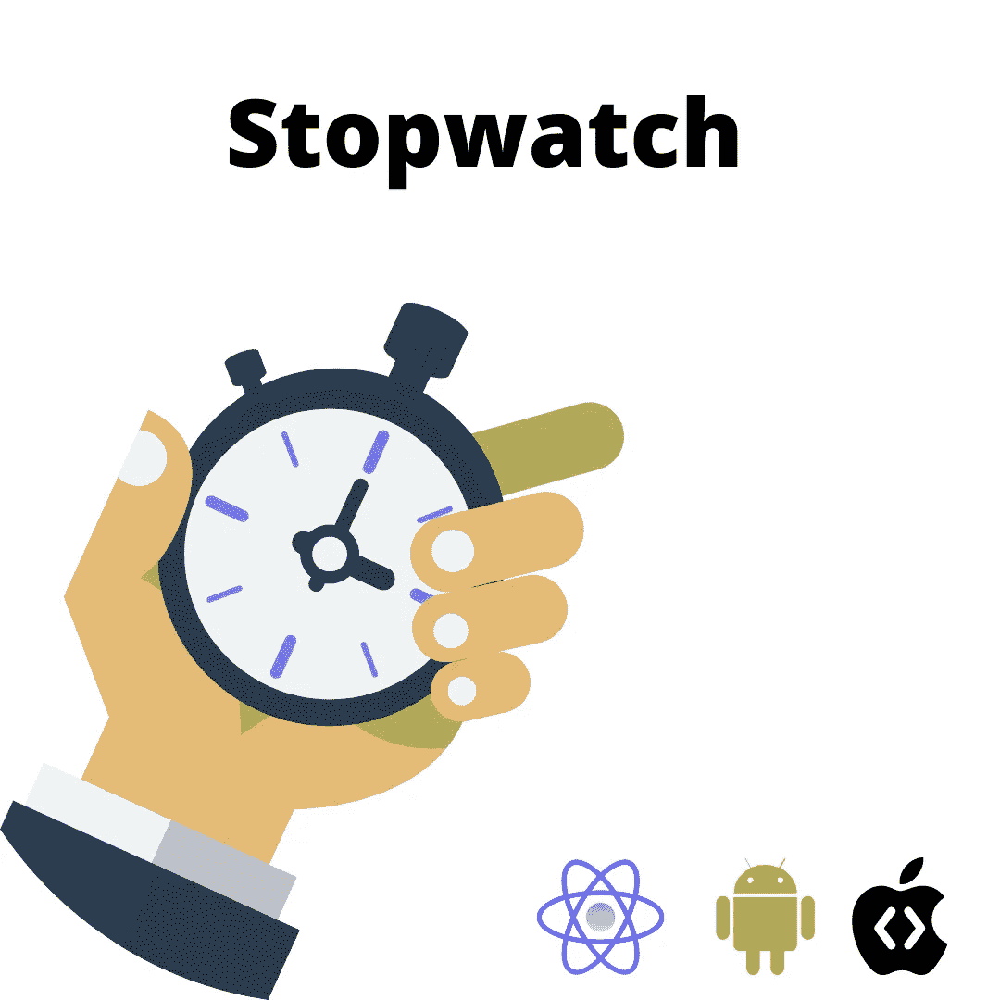
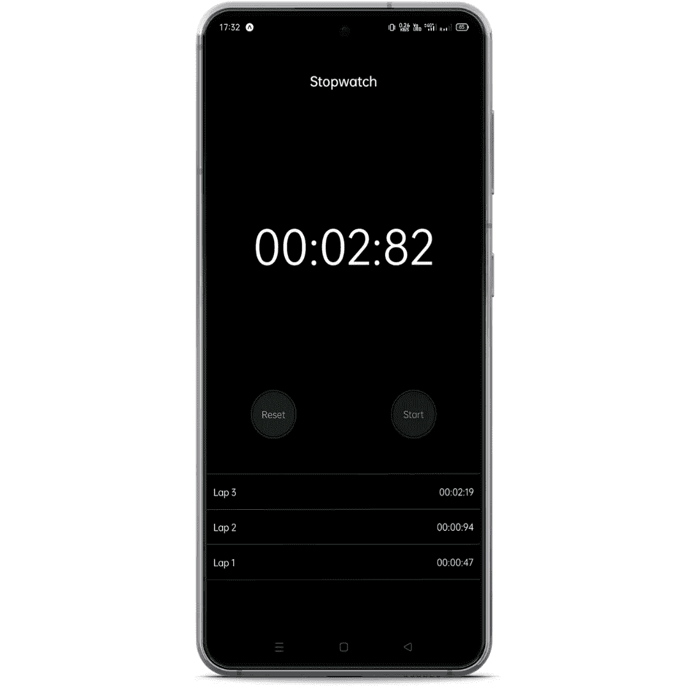

# 使用 React Native Expo 的秒表应用程序

> 原文：<https://medium.com/geekculture/stopwatch-application-using-react-native-expo-998c5d0f519?source=collection_archive---------4----------------------->

## 使用 react native expo 为 Android 和 iOS 制作秒表应用程序



Stopwatch app using react native expo

你好，react-原生开发者..！！

我叫 Rohit Kumar Thakur。我通常会谈到 react-native、Django、数据科学、机器学习和 Python。在这篇文章中，我将谈论一个 react native expo 项目。从标题中，您已经知道我们将使用一些 javascript 代码制作一个秒表。所以，喝杯咖啡，开始这个项目。

下面是本文的分步视频教程:

# 项目设置和安装

*   选择一个目录，并使用以下命令启动 expo 项目:

```
expo init stopwatch
```

*   选择空白模板并继续下载依赖项。我们选择空白模板，因为我们从基础开始构建一切
*   使用命令导航到新内置的目录:cd stopwatch
*   安装以下 javascript 库:

```
npm install react-native-paper
npm install expo-constants
```

我们已经完成了这里的项目设置和安装。现在，在您最喜欢的文本编辑器 VS Code 中打开这个项目。XD:)

最终的项目输出看起来会像这样:



Stopwatch using react native expo

# 密码

现在，如果你看上面的图像，你可以看到那里的组成部分。首先，我们有标题组件，然后我们有计时器组件，然后我们有两个控制按钮，最后我们有一个 lap 视图。这个圈视图是可滚动的，你可以滚动并看到你用秒表测量的圈时间。

我们将逐个编写每个组件的代码，并将它们连接在一起，形成一个完美的视图。在秒表项目目录下做一个单独的目录，命名为“ *components* ”。我们将首先从标题组件开始。在组件目录下，创建一个 javascript 文件，命名为“ *Header.js* ”。

**header . js**

```
import * as React from 'react';
import { Appbar } from 'react-native-paper';// Heading of the appconst MyHeader = () => {return (
    <Appbar.Header style={{backgroundColor:'black'}}>
      <Appbar.Content title="Stopwatch" style={{ alignItems: 'center'}}/>
    </Appbar.Header>
  );
};export default MyHeader;
```

这是一个简单的标题使用反应原生纸库。标题的背景色设置为黑色，标题居中对齐。

***util.js***

```
const padToTwo = (number) => (number <= 9 ? `0${number}` : number);export const displayTime = (centiseconds) => {
  let minutes = 0;
  let seconds = 0;if (centiseconds < 0) {
    centiseconds = 0;
  }if (centiseconds < 100) {
    return `00:00:${padToTwo(centiseconds)}`;
  }let remainCentiseconds = centiseconds % 100;
  seconds = (centiseconds - remainCentiseconds) / 100;if (seconds < 60) {
    return `00:${padToTwo(seconds)}:${padToTwo(remainCentiseconds)}`;
  }let remainSeconds = seconds % 60;
  minutes = (seconds - remainSeconds) / 60;return `${padToTwo(minutes)}:${padToTwo(remainSeconds)}:${padToTwo(remainCentiseconds)}`;
};
```

在组件目录中创建 util.js 文件。并将上面的代码添加到其中。

首先，我添加了一个箭头函数 padToTwo，并向它传递道具编号*和*。这个函数检查数字。如果数字小于 9，则返回左边为 0 的数字，否则返回数字本身。例如，7 作为 07 返回，17 作为 17 返回。

接下来，我们要处理好时间。我们都知道 1 秒有 100 厘秒。我们将从百分之一秒开始。首先，将值指定为秒，将分钟指定为 0。如果厘秒值小于 100，则根据 padToTwo 函数返回厘秒。

现在怎么处理秒？你不用担心这个。百分之一秒的值会解决这个问题。例如，如果厘秒的值是 105。

```
let remainCentiseconds = centiseconds % 100;  
// 105 % 100 = 5 
// remaiCentiseconds = 5seconds = (centiseconds - remainCentiseconds) / 100;  
//  (105-5)/100 = 1
// seconds = 1if (seconds < 60) {
    return `00:${padToTwo(seconds)}:${padToTwo(remainCentiseconds)}`;
  }// here the seconds is 1, which is less than 60\. So the output will be
 // 00:01:05 (stopwatch)
```

我希望现在你能明白显示时间函数是怎么回事。同样的逻辑也适用于显示分钟。几分钟内，我们必须播放秒钟。

接下来是按钮。因此，在组件目录中添加一个文件 *control.js*

**control . js**

```
import React from "react";
import { StyleSheet, Text, View, TouchableOpacity } from "react-native";// we will deal with buttons herefunction Control({ isRunning, handleLeftButtonPress, handleRightButtonPress }) {
  return (
    <>
      <TouchableOpacity
        style={[
          styles.controlButtonBorder,
          { backgroundColor: isRunning ? "#333333" : "#1c1c1e" },
        ]}
        onPress={handleLeftButtonPress}
      >
        <View style={styles.controlButton}>
          <Text style={{ color: isRunning ? "#fff" : "#9d9ca2" }}>
            {isRunning ? "Lap" : "Reset"}
          </Text>
        </View>
      </TouchableOpacity><TouchableOpacity
        style={[
          styles.controlButtonBorder,
          { backgroundColor: isRunning ? "#340e0d" : "#0a2a12" },
        ]}
        onPress={handleRightButtonPress}
      >
        <View style={styles.controlButton}>
          <Text style={{ color: isRunning ? "#ea4c49" : "#37d05c" }}>
            {isRunning ? "Stop" : "Start"}
          </Text>
        </View>
      </TouchableOpacity>
    </>
  );
}const CENTER = {
  justifyContent: "center",
  alignItems: "center",
};const styles = StyleSheet.create({
  controlButtonBorder: {
    ...CENTER,
    width: 70,
    height: 70,
    borderRadius: 70,
  },
  controlButton: {
    ...CENTER,
    width: 65,
    height: 65,
    borderRadius: 65,
    borderColor: "#000",
    borderWidth: 1,
  },
});export default React.memo(Control);
```

在这个文件中，我们负责两个控制按钮。道具正在运行，handleLeftButtonPress，handleRightButtonPress 将在后面处理。

**React.memo** 是高阶组件。如果您的组件使用相同的属性呈现相同的结果，您可以将它包装在一个对 React.memo 的调用中，在某些情况下通过记忆结果来提高性能。这意味着 React 将跳过组件的渲染，并重用最后一次渲染的结果。Means，React.memo 检查即将进行的渲染是否与之前的渲染不同。如果它们是相同的，那么它保持前一个。

***Result.js***

```
import React from "react";
import { StyleSheet, Text, ScrollView, View } from "react-native";
import { displayTime } from "./util";// print the lap timefunction Result({ results }) {

  return (
    <ScrollView>
      <View style={styles.resultItem} />{results.map((item, index) => (
        <View key={index} style={styles.resultItem}>
          <Text style={styles.resultItemText}>
            Lap {results.length - index}
          </Text><Text style={styles.resultItemText}>{displayTime(item)}</Text>
        </View>
      ))}
    </ScrollView>
  );
}const styles = StyleSheet.create({
  resultItem: {
    flexDirection: "row",
    justifyContent: "space-between",
    alignItems: "center",
    borderBottomWidth: 1,
    borderColor: "#313131",
    height: 50,
    paddingHorizontal: 15,
  },
  resultItemText: { color: "#fff" },
});export default React.memo(Result);
```

***Stopwatch.js***

在这个 javascript 文件中，我们将使用到目前为止创建的所有组件。

```
import  React, { useState, useRef, useCallback } from "react";
import { StyleSheet, SafeAreaView, Text, View, Platform } from "react-native";
import { StatusBar } from "expo-status-bar";
import Constants from "expo-constants";
import Result from "./Result";
import Control from "./Control";
import { displayTime } from "./util";
import MyHeader from "./Header";export default function StopWatch() {
  const [time, setTime] = useState(0);
  const [isRunning, setRunning] = useState(false);
  const [results, setResults] = useState([]);
  const timer = useRef(null); const handleLeftButtonPress = useCallback(() => {
    if (isRunning) {
      setResults((previousResults) => [time, ...previousResults]);
    } else {
      setResults([]);
      setTime(0);
    }
  }, [isRunning, time]);const handleRightButtonPress = useCallback(() => {
    if (!isRunning) {
      const interval = setInterval(() => {
        setTime((previousTime) => previousTime + 1);
      }, 10);timer.current = interval;
    } else {
      clearInterval(timer.current);
    }setRunning((previousState) => !previousState);
  }, [isRunning]);return (
    <SafeAreaView style={styles.container}>
        <MyHeader/>
      <StatusBar style="light" /><View style={styles.display}>
        <Text style={styles.displayText}>{displayTime(time)}</Text>
      </View><View style={styles.control}>
        <Control
          isRunning={isRunning}
          handleLeftButtonPress={handleLeftButtonPress}
          handleRightButtonPress={handleRightButtonPress}
        />
      </View><View style={styles.result}>
        <Result results={results} />
      </View>
    </SafeAreaView>
  );
}const styles = StyleSheet.create({
  container: {
    flex: 1,
    backgroundColor: "black",
    paddingTop: Constants.statusBarHeight,
  },
  display: {
    flex: 3 / 5,
    justifyContent: "center",
    alignItems: "center",
  },
  displayText: {
    color: "#fff",
    fontSize: 70,
    fontWeight: "200",
    fontFamily: Platform.OS === "ios" ? "Helvetica Neue" : null,
  },
  control: {
    height: 70,
    flexDirection: "row",
    justifyContent: "space-around",
  },
  result: { flex: 2 / 5 },
});
```

*   首先，我们导入了所需的库
*   然后我们为结果、时间和正在运行添加了 useState 挂钩。
*   左侧按钮的代码。在这个按钮的帮助下，我们设置了圈数并重置了秒表。
*   接下来，编写处理右侧按钮的代码。
*   在这两个控件按钮中，我们都使用了回调反应钩子。当**你有一个组件，子组件在不需要**的情况下一次又一次地被重新渲染时，使用 useCallback 钩子。传递内联回调和依赖项数组。useCallback 将返回回调的记忆化版本，该版本仅在其中一个依赖关系发生变化时才会发生变化。
*   最后，相应地渲染组件。

***App.js***

```
import { StyleSheet, View } from 'react-native';
import StopWatch from './components/StopWatch';export default function App() {
  return (
    <View style={styles.container}>
      <StopWatch/>
    </View>
  );
}const styles = StyleSheet.create({
  container: {
    flex: 1, 
  },
});
```

现在，使用以下命令运行 react native expo 应用程序:

```
npm start
```

使用您的移动设备扫描二维码，查看项目进展。

**这个项目的 Github 代码是** [**这里**](https://github.com/imrohit007/Stopwatch-React-Native-Expo)

现在，鼓掌..拍手声..请鼓掌，并关注更多关于 react native expo 的基于项目的文章。

感谢阅读。