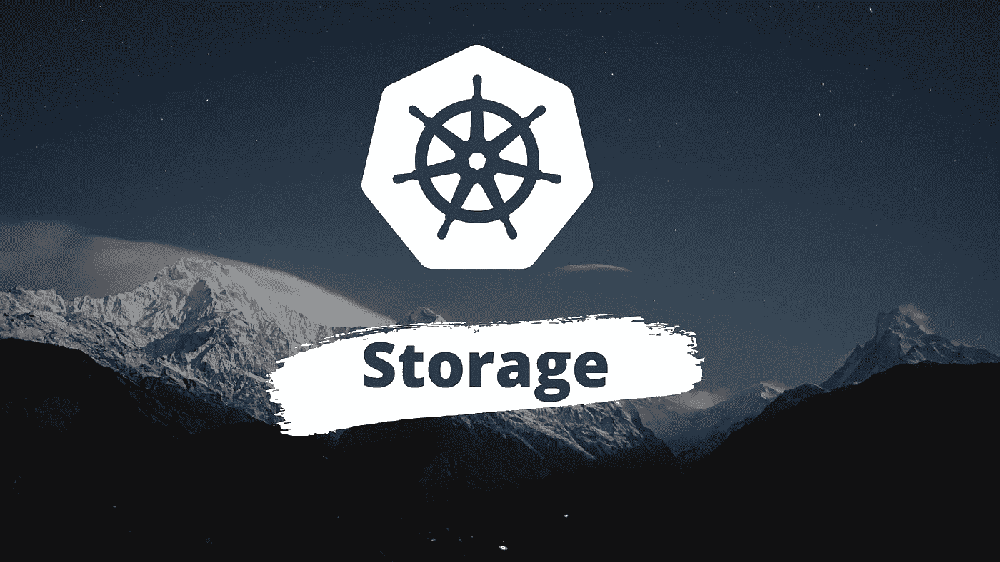
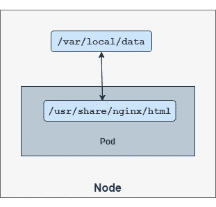
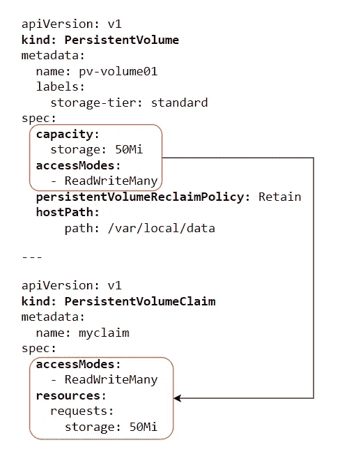
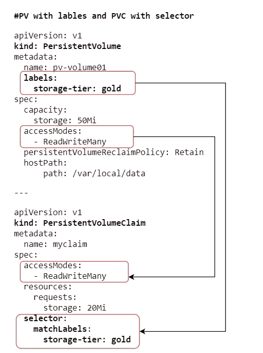
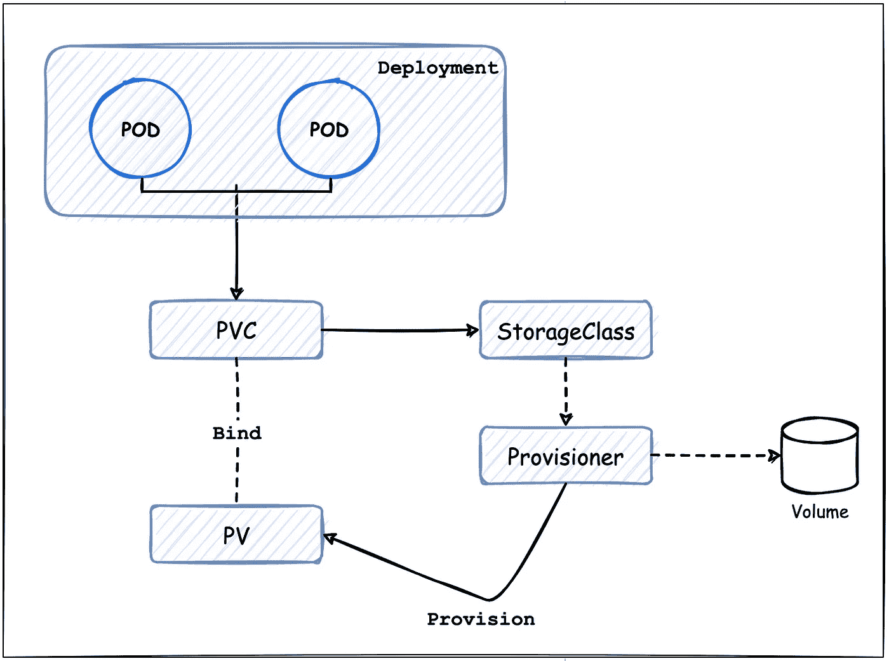

# 储物| Kubernetes

> 原文：<https://medium.com/geekculture/storage-kubernetes-92eb3d027282?source=collection_archive---------1----------------------->

深入了解 Kubernetes 储物件



## 卷

Kubernetes 卷是一个目录，其中包含可由 Pod 中的容器访问的数据。卷提供了一种插件机制，将临时容器与其他地方的持久数据存储连接起来。

在本文中，您将了解到:

> **●** [**卷类型**](#c842) **●**[**持久卷**](#7456) **●**[**持久卷索赔**](#d3b6) **●****卷的动态预配置**

## 卷的类型—

## **主机路径卷:**

挂载一个目录`**/var/local/data**`作为从*主机*到一个 pod 的 ***nginx*** 容器的`**/usr/share/nginx/html**`位置的卷。



hostPath Volume

```
**#pod definition file with a volume** apiVersion: v1
kind: Pod
metadata:
  name: webserver
spec:
  containers:
  - image: nginx:latest
    name: nginx-container
 **volumeMounts:
    - mountPath: /usr/share/nginx/html
      name: test-vol** **volumes:
  - name: test-vol
    hostPath:
      path: /var/local/data
      type: DirectoryOrCreate**
```

`**nginx-container**` 在`**/usr/share/nginx/html**` 位置写入的任何数据都将持久保存在*主机*的`**/var/local/data**`位置。如果 pod 终止，数据将在`**/var/local/data**`位置保持安全。

之前，来自*主机*的一个目录被用作卷。它被称为`**hostPath**`体积。但是有一个重要的事实需要记住，`**hostPath**`量产级应用不建议使用 volume。

`**hostPath**`卷仅在单节点集群中运行良好。但不在多节点群集中。因为*部署/复制集*下的单元将使用所有节点上的`**/var/local/data**`目录，并期望所有节点包含相同的数据。但这是不可能的，因为它们是不同的节点。

这个问题的解决方案是为 Kubernetes 集群使用一个共享存储系统。如 NFS 和 AWS EFS。

Kubernetes 还支持多种类型的标准存储解决方案，如 NFS、glusterFS 或公共云解决方案，如 AWS EBS、AWS EFS、Azure Disk 或 file、Google 的持久磁盘等等。

## **NFS 分享为一卷**

使用 **NFS 共享** 目录创建一个卷，并将其附加到一个 pod。使用 NFS，数据可以在 pod 之间共享，尽管它们在不同的工作节点或可用性区域中运行。

```
**#Pod definiton with nfs share directory**apiVersion: v1
kind: Pod
metadata:
  name: webserver
spec:
  containers:
  - image: nginx:latest
    name: nginx-container
    volumeMounts:
    - mountPath: /usr/share/nginx/html
      name: test-vol
 **volumes:
  - name: test-vol
    nfs:
      server: 10.3.97.250** # nfs server ip or dns **path: /var/local/nfs-share** # nfs share directory
```

## **AWS EBS 卷**

使用 AWS-CLI 创建一个卷，并记下“**VolumeId”**以将该卷连接到 pod。

```
aws ec2 create-volume \
 ** --availability-zone** ap-northeast-1d \
  **--size** 10 \
  **--volume-type** gp2 \
 ** --query "VolumeId"** --output text
```

> ***注意:*** 由于 EBS 卷只锁定到特定的 AZ。因此，EBS 卷和将运行 pod 的工作节点应该在同一个 AZ 中。

```
**#Pod definition with node affinity** apiVersion: v1
kind: Pod
metadata:
  name: webserver
spec:
 **affinity:
    nodeAffinity:**
      requiredDuringSchedulingIgnoredDuringExecution:
        nodeSelectorTerms:
        - matchExpressions:
          - key: topology.kubernetes.io/zone
            operator: In
            values:
            **- ap-northeast-1d**
  containers:
  - image: nginx:latest
    name: nginx-container
    volumeMounts:
    - mountPath: /usr/share/nginx/html
      name: test-volume
 **volumes:
  - name: test-volume
    awsElasticBlockStore:** # This AWS EBS Volume must already exist **volumeID: "vol-0b067ed35227a1bff"** # Volume-id **fsType: ext4**
```

由于 EBS 卷是在" **ap-northeast-1d"** AZ 中创建的，因此为了将该卷附加到一个 pod，该 pod 应该在同一个 AZ 上。这就是为什么使用节点关联性在与 EBS 卷位于同一 AZ 的节点上部署 pod。

## 配置映射为卷

现有的配置图可以作为卷注入到 pod 中。

```
***#Pod-definition with configmap mounted as a volume into the pod***apiVersion: v1
kind: Pod
metadata:
  name: web-server
spec:
  containers:
  - name: wordpress
    image: wordpress
 **volumeMounts:
    - name: config-volume
      mountPath: /etc/config** *#Directory where files will be mounted* **volumes:
    - name: config-volume
      configMap:
        name: user-config**
```

## ***秘作卷***

现有的秘密可以作为一个卷注入到吊舱中。

```
***#Pod-definition with secret mounted as a volume into the pod***apiVersion: v1
kind: Pod
metadata:
  name: frontend
spec:
  containers:
    - name: wordpress
      image: wordpress
      volumeMounts:
      - name: secret-vol01
        mountPath: /etc/secret    #files - mounted in this location
        readOnly: true
 ** volumes:
    - name: secret-vol01
      secret:
        secretName: app-secret**
```

更多关于 k8s [卷**卷**卷](https://kubernetes.io/docs/concepts/storage/volumes/)

## 永久卷

持久卷是管理员在集群中提供的一块存储区。它是集群中的资源，就像节点是集群一样。永久卷是一种卷插件，其生命周期独立于使用永久卷的任何单独 pod。

## 持续量声明(PVC)

PersistentVolumeClaim (PVC)是用户对存储的请求。它类似于一个豆荚。Pods 消耗节点资源，PV 消耗 PV 资源。简而言之，PV 是由 PVC 声明的，PV 和 PVC 之间是一对一的关系。通过指定永久卷所需的最小大小和访问模式来配置 PVC。

如果不存在匹配的卷，PVC 将无限期保持未绑定状态。只要有匹配的 PV 可用，就会绑定索赔。

**创建一个持久卷(PV)**

```
 **>** kubectl create -f <pv-manifest-file>.yaml---**#PV using host directory**apiVersion: v1
**kind: PersistentVolume**
metadata:
  name: pv-volume01
  labels: 
    storage-tier: standard
spec:
  **capacity**:
    storage: 50Mi
  **accessModes**:
    - ReadWriteMany
  **persistentVolumeReclaimPolicy:** Retain 
  **hostPath:**
      path: /var/local/data---**#PV using NFS-Share directory**apiVersion: v1
kind: PersistentVolume
metadata:
  name: pv-nfsspec:
  capacity:
    storage: 20Gi
  accessModes:
    - ReadWriteOnce
 **nfs:
    path: /var/nfs_server/kubernetes_data
    server: 10.25.96.6** #IP or DNS of nfs server
```

`**Capacity**` **—** PV 会有一个特定的存储容量。这是使用 PV 的*容量*属性设置的。

`**accessModes**`**——**

> **ReadWriteOnce** —卷可以通过单个节点以读写方式装载。**read write only**—**卷可以由许多节点以只读方式装载。
> **读写多** —卷可以由许多节点以读写方式装载。
> **ReadWriteOncePod**—**卷可以通过单个 Pod 以读写方式挂载。****

****`**persistentVolumeReclaimPolicy**`**——******

> ******保留** —关联 pod 终止后，卷将被保留。
> **删除** —关联 pod 终止后，卷将被删除。
> **回收** —卷将被回收以备将来使用。****

****目前，只有 NFS 和主机路径支持回收。AWS EBS、GCE PD、Azure Disk 和 Cinder 卷支持删除。****

****`**Volume Type**` —
对卷类型有巨大的支持，比如`**hostPath**`**`**nfs**`**`**aws ebs**`**`**azureDisk**`**等等。[关于卷类型的更多信息](https://kubernetes.io/docs/concepts/storage/persistent-volumes/#types-of-persistent-volumes)************

## *********创建一个持久的卷索赔(PVC)*********

```
****---***#PVC without selector***apiVersion: v1
**kind: PersistentVolumeClaim**
metadata:
  name: myclaim
spec:
  **accessModes**:
    - ReadWriteMany
  **resources**:
    requests:
      storage: 50Mi---***#PVC with selector***apiVersion: v1
kind: PersistentVolumeClaim
metadata:
  name: myclaim
spec:
 ** accessModes:**
    - ReadWriteMany
  **resources:**
    requests:
      storage: 70Mi
 ** selector:**
   ** matchLabels:**
      storage-tier: standard****
```

******`**accessModes**` **—** [同 PV。](#f08a)******

****`**resources**` **—** 在这个字段中，pod 可以请求特定数量的存储资源。****

****`**selector**` **—** 带有`**selector**`的索赔试图匹配现有的、无人认领的和可用的 PV。带`**selector**`的 PVC 总是声称有`**matchLabels**` 和`**accessModes**`精确匹配的 PV。****

## ****有约束力的****

****用户创建一个 PersistentVolumeClaim，其中包含请求的特定存储量和某些访问模式。主节点中的控制循环总是监视新的 PV，找到匹配的 PV(如果可能)，并将它们绑定在一起。****

******绑定标准:******

****●`**accessMode**`PV 和 PVC 之间必须匹配。****

****PVC 请求的`**storage**`必须等于或小于 PV 的`**storage**`容量。平等的匹配将总是获得优先权。但是如果没有完全匹配，那么 PVC 将要求 PV 具有比 PVC 所要求的更大的存储容量。****

> *****50Gi PV 将匹配请求 50Gi 的 PVC
> 50Gi PV 将匹配请求 40Gi 的 PVC(如果不存在精确匹配)
> 50Gi PV 将* ***而非*** *匹配请求 100Gi 的 PVC*****

****●带有`**selector**`的 PVC 总是声称与`**labels**`和`**accessModes**`匹配的 PV 和存储容量匹配标准保持不变。****

********

****PV binding with PVC- Image-1****

********

****PV binding with PVC- Image-2****

## ****用于 PV 和 PVC 的命令:****

```
****# For creating PV and PVC****host~$ ** kubectl create -f <file-name>.yaml
**host~$ ** kubectl create -f pv.yaml
**host~$ ** kubectl create -f pvc.yaml **# For listing PV and PVC****host~$ ** kubectl get pv
**host~$ ** kubectl get pvc **# For viewing details of PV and PVC****host~$ ** kubectl describe pv <pv-name>
**host~$ ** kubectl describe pvc <pvc-name> **# For deleting PV and PVC (PVC should be deleted first)****host~$ ** kubectl delete pvc <pvc-name>
**host~$ ** kubectl delete pv <pv-name>** 
```

## ****阶段****

****PV 将处于以下阶段之一:****

> ******可用** —尚未绑定到声明的自由资源。
> **装订** —该卷装订成册。
> **发布** —索赔已删除，但资源尚未回收。
> **失败** —卷的自动回收失败。****

## ******使用 PVC 作为卷******

****pod 可以通过将声明用作卷来访问存储。声明必须与使用声明的 Pod 位于同一命名空间中。集群在 Pod 的名称空间中找到声明，搜索合适的匹配项并绑定它们。****

```
*****#Usage of PVC as a Volumes***apiVersion: v1
kind: Pod
metadata:
  name: web-server
spec:
  containers:
    - name: nginx-webserver
      image: nginx
      volumeMounts:
       - name: webserver-vol01
         mountPath: "/usr/share/nginx/html"
  volumes:
    - name: webserver-vol01
      **persistentVolumeClaim:**
 **claimName: myclaim****
```

******概述— PV、PVC 和 PVC 作为一个卷******

```
**apiVersion: v1
kind: PersistentVolume
metadata:
  name: pv-volume01
spec:
 **capacity:
    storage: 50Mi
  accessModes:
    - ReadWriteMany**
  persistentVolumeReclaimPolicy: Retain
  hostPath:
      path: /var/local/data---

apiVersion: v1
kind: PersistentVolumeClaim
metadata:
 **name: myclaim**
spec:
 **accessModes:
    - ReadWriteMany
  resources:
    requests:
      storage: 50Mi**---apiVersion: v1
kind: Pod
metadata:
  name: web-server
spec:
  containers:
    - name: nginx-webserver
      image: nginx
      volumeMounts:
       - name: webserver-vol01
         mountPath: "/usr/share/nginx/html"
  volumes:
    - name: webserver-vol01
 **persistentVolumeClaim:
        claimName: myclaim****
```

## ******动态预配置******

****直到现在，PV 都是我们自己从现有的存储中创造出来的。这就是所谓的静态供应。但是想象一下我们使用 AWS-EBS 作为存储解决方案的生产环境。每当一个 pod 需要存储时，我们都需要在 AWS 上手动提供 EBS 卷，然后使用该 EBS 卷配置一个 PV。****

****如果在 pod 需要时自动配置卷会更方便，这就是**存储类**进入映像的原因。使用**存储类**，我们可以在 AWS 上动态配置 EBS 卷，并在提出索赔时将其附加到 pod。****

## ******存储类******

****Kubernetes 存储类是一种 Kubernetes 存储机制，它允许我们在 Kubernetes 集群中动态地提供持久性卷(PV)。使用存储类，pod 可以根据需求动态请求特定类型的存储。****

********

****Dynamic Provisioning****

****每个 StorageClass 都包含字段`provisioner`、`parameters`和`reclaimPolicy`，当属于该类的持久卷需要动态配置时会用到这些字段。****

******AWS EBS 卷的存储类别(使用内部资源调配器)——******

```
**apiVersion: storage.k8s.io/v1
**kind: StorageClass**
metadata:
  name: gp2-standard
**provisioner: kubernetes.io/aws-ebs **  # Internal-provisioner
**parameters**:
  type: gp2
**reclaimPolicy**: Retain
**volumeBindingMode**: Immediate**
```

****`**provisioner:**`storage class 对象包含一个`**provisioner**`，它决定哪个卷插件将用于提供 PV。Kubernetes 提供 ***内部*** 和 ***外部*** provisioners。*内部*置备程序也称为*“In-tree”*卷插件，这意味着它们的代码是核心 Kubernetes 代码的一部分，与核心 Kubernetes 二进制文件一起导入。我们还可以指定并运行一个*外部* provisioner，它也被定义为容器存储接口(CSI)。****

****`**parameters:**`表示底层存储系统的属性。****

****`**parameters:**`表示底层存储系统的属性。****

****`**reclaimPolicy:**` 可以是`Delete`也可以是`Retain`。默认为`Delete`****

****`**volumeBindingMode:**` 可以是`Immediate`也可以是`WaitForFirstConsumer`****

> ****`*Immediate*` *—创建 PVC 后立即配置 PV。* `*WaitForFirstConsumer*` *—将延迟 PV 的供应，直到创建了使用 PVC 的 Pod。*****

******AWS EBS 卷的存储类别(使用 CSI)——******

```
**apiVersion: storage.k8s.io/v1
kind: StorageClass
metadata:
  name: ebs-sc
**provisioner: ebs.csi.aws.com** #EBS CSI as provisioner
volumeBindingMode: WaitForFirstConsumer**
```

****关于[存储类](https://kubernetes.io/docs/concepts/storage/storage-classes/)的更多信息****

****存储类不仅可以动态调配 PV，还允许我们使用底层存储系统的不同参数创建不同类型的存储类。例如对于 AWS EBS，有各种类型的 EBS 卷(`gp2`、`gp3`、`io1`、`io2`等)。此外，还可以进行各种配置，例如，为 EBS 卷启用加密、指定最小 IOPS 和最小吞吐量。****

******具有不同参数的存储类示例—******

```
**---apiVersion: storage.k8s.io/v1
kind: StorageClass
metadata:
 **name: gp2-standard**
provisioner: ebs.csi.aws.com
parameters:
 **type: gp2**
volumeBindingMode: Immediate
reclaimPolicy: Retain---apiVersion: storage.k8s.io/v1
kind: StorageClass
metadata:
 **name: io2-encrypted**
provisioner: ebs.csi.aws.com   
parameters:
 **type: io2** **iopsPerGB**: **"3000"**
  **encrypted: "true"** volumeBindingMode: WaitForFirstConsumer
reclaimPolicy: Delete**
```

****现在，我们将测试 EBS 卷的动态资源调配。遵循以下步骤—****

****用下面的 [*清单文件*](https://raw.githubusercontent.com/shamimice03/AWS_EKS-EBS_CSI/main/Demo-storageClass.yaml) 创建一个*存储类*****

```
**k create -f [https://raw.githubusercontent.com/shamimice03/AWS_EKS-EBS_CSI/main/Demo-storageClass.yaml](https://raw.githubusercontent.com/shamimice03/AWS_EKS-EBS_CSI/main/Demo-storageClass.yaml)**
```

****随后，创建一个*持久卷声明* (PVC)并将 PVC 作为一个卷附加到 pod 中。使用下面的[清单](https://raw.githubusercontent.com/shamimice03/AWS_EKS-EBS_CSI/main/pvc-pod.yaml)文件—****

```
**kubectl create -f [https://raw.githubusercontent.com/shamimice03/AWS_EKS-EBS_CSI/main/pvc-pod.yaml](https://raw.githubusercontent.com/shamimice03/AWS_EKS-EBS_CSI/main/pvc-pod.yaml)**
```

> *******注意:*** 由于 EBS 卷只锁定到特定的 AZ。因此，EBS 卷和将运行 pod 的工作节点应该在同一个 AZ 中。****

******验证** 现在，验证我们之前部署的存储级、PVC 和 pod 是否按预期工作。****

```
****>** kubectl get storageclass
**>** kubectl get pvc
**>** kubectl get pods**
```

> *****Kubernetes 存储是一个有点棘手的话题。我试图尽可能简单地解释，希望这篇文章能帮助你更清楚地了解 Kubernetes 储物。如果你觉得这篇文章有帮助，请不要忘记点击* ***点击*** *和* ***点击*** *按钮，帮助我写更多这样的文章。
> 谢谢🖤*****

## ****参考****

****[](https://kubernetes.io/docs/concepts/storage/volumes/) [## 卷

### 容器中的磁盘上的文件是短暂的，这给运行在…

kubernetes.io](https://kubernetes.io/docs/concepts/storage/volumes/)****